# Linux-Networking

#### Kubernetes

```bash
Basic Commands:
  start            Starts a local Kubernetes cluster
  status           Gets the status of a local Kubernetes cluster
  stop             Stops a running local Kubernetes cluster
  delete           Deletes a local Kubernetes cluster
  dashboard        Access the Kubernetes dashboard running within the minikube
cluster
  pause            pause Kubernetes
  unpause          unpause Kubernetes

Images Commands:
  docker-env       Provides instructions to point your terminal's docker-cli to
the Docker Engine inside minikube. (Useful for building docker images directly
inside minikube)
  podman-env       Configure environment to use minikube's Podman service
  cache            Manage cache for images
  image            Manage images

Configuration and Management Commands:
  addons           Enable or disable a minikube addon
  config           Modify persistent configuration values
  profile          Get or list the current profiles (clusters)
  update-context   Update kubeconfig in case of an IP or port change

Networking and Connectivity Commands:
  service          Returns a URL to connect to a service
  tunnel           Connect to LoadBalancer services

Advanced Commands:
  mount            Mounts the specified directory into minikube
  ssh              Log into the minikube environment (for debugging)
  kubectl          Run a kubectl binary matching the cluster version
  node             Add, remove, or list additional nodes
  cp               Copy the specified file into minikube

Troubleshooting Commands:
  ssh-key          Retrieve the ssh identity key path of the specified node
  ssh-host         Retrieve the ssh host key of the specified node
  ip               Retrieves the IP address of the specified node
  logs             Returns logs to debug a local Kubernetes cluster
  update-check     Print current and latest version number
  version          Print the version of minikube
  options          Show a list of global command-line options (applies to all
commands).

```

kubectl-let's you interact with your cluster
minikube commands helps create a cluster from scatch

```sh
kubectl controls the Kubernetes cluster manager.

 Find more information at: https://kubernetes.io/docs/reference/kubectl/

Basic Commands (Beginner):
  create          Create a resource from a file or from stdin
  expose          Take a replication controller, service, deployment or pod and expose it as a new Kubernetes service
  run             Run a particular image on the cluster
  set             Set specific features on objects

Basic Commands (Intermediate):
  explain         Get documentation for a resource
  get             Display one or many resources
  edit            Edit a resource on the server
  delete          Delete resources by file names, stdin, resources and names, or by resources and label selector

Deploy Commands:
  rollout         Manage the rollout of a resource
  scale           Set a new size for a deployment, replica set, or replication controller
  autoscale       Auto-scale a deployment, replica set, stateful set, or replication controller

Cluster Management Commands:
  certificate     Modify certificate resources
  cluster-info    Display cluster information
  top             Display resource (CPU/memory) usage
  cordon          Mark node as unschedulable
  uncordon        Mark node as schedulable
  drain           Drain node in preparation for maintenance
  taint           Update the taints on one or more nodes

Troubleshooting and Debugging Commands:
  describe        Show details of a specific resource or group of resources
  logs            Print the logs for a container in a pod
  attach          Attach to a running container
  exec            Execute a command in a container
  port-forward    Forward one or more local ports to a pod
  proxy           Run a proxy to the Kubernetes API server
  cp              Copy files and directories to and from containers
  auth            Inspect authorization
  debug           Create debugging sessions for troubleshooting workloads and nodes
  events          List events

Advanced Commands:
  diff            Diff the live version against a would-be applied version
  apply           Apply a configuration to a resource by file name or stdin
  patch           Update fields of a resource
  replace         Replace a resource by file name or stdin
  wait            Experimental: Wait for a specific condition on one or many resources
  kustomize       Build a kustomization target from a directory or URL

Settings Commands:
  label           Update the labels on a resource
  annotate        Update the annotations on a resource
  completion      Output shell completion code for the specified shell (bash, zsh, fish, or powershell)

Subcommands provided by plugins:

Other Commands:
  api-resources   Print the supported API resources on the server
  api-versions    Print the supported API versions on the server, in the form of "group/version"
  config          Modify kubeconfig files
  plugin          Provides utilities for interacting with plugins
  version         Print the client and server version information

Usage:
  kubectl [flags] [options]

```sh
kubectl cluster-info
Kubernetes control plane is running at https://127.0.0.1:58077
CoreDNS is running at https://127.0.0.1:58077/api/v1/namespaces/kube-system/services/kube-dns:dns/proxy
``

```sh
kubectl get nodes
NAME       STATUS   ROLES           AGE   VERSION
minikube   Ready    control-plane   34m   v1.30.0

```

```sh
#kubectl get ns
kubectl get namespaces
NAME                   STATUS   AGE
default                Active   36m
kube-node-lease        Active   36m
kube-public            Active   36m
kube-system            Active   36m
kubernetes-dashboard   Active   8m44s
```
Namespaces are a way to isolate and manage applications and services you want to remain second


```sh
#-A means for all namespace
 kubectl get pods -A   
NAMESPACE              NAME                                        READY   STATUS    RESTARTS      AGE
kube-system            coredns-7db6d8ff4d-b6dsl                    1/1     Running   0             39m
kube-system            etcd-minikube                               1/1     Running   0             39m
kube-system            kube-apiserver-minikube                     1/1     Running   0             39m
kube-system            kube-controller-manager-minikube            1/1     Running   0             39m
kube-system            kube-proxy-8qgnc                            1/1     Running   0             39m
kube-system            kube-scheduler-minikube                     1/1     Running   0             39m
kube-system            storage-provisioner                         1/1     Running   1 (38m ago)   39m
kubernetes-dashboard   dashboard-metrics-scraper-b5fc48f67-nqmgb   1/1     Running   0             12m
kubernetes-dashboard   kubernetes-dashboard-779776cb65-7fnv7       1/1     Running   0             12m

```

```sh
kubectl get services -A
NAMESPACE              NAME                        TYPE        CLUSTER-IP      EXTERNAL-IP   PORT(S)                  AGE
default                kubernetes                  ClusterIP   10.96.0.1       <none>        443/TCP                  42m
kube-system            kube-dns                    ClusterIP   10.96.0.10      <none>        53/UDP,53/TCP,9153/TCP   42m
kubernetes-dashboard   dashboard-metrics-scraper   ClusterIP   10.100.204.49   <none>        8000/TCP                 14m
kubernetes-dashboard   kubernetes-dashboard        ClusterIP   10.110.35.108   <none>        80/TCP                   14m
```
Services act as loadbalances within the cluster and direct traffic to pods

```yml
---
apiVersion: v1
kind: Namespace
metadata:
 name: development
```

```sh
kubectl apply -f namespace.yml
namespace/development created
```

```sh
kubectl get namespaces        
NAME                   STATUS   AGE
default                Active   5h2m
development            Active   2m19s
kube-node-lease        Active   5h2m
kube-public            Active   5h2m
kube-system            Active   5h2m
kubernetes-dashboard   Active   4h34m
```
we can define multiple resources in one file by separating them with `---`

```yml

---
apiVersion: v1
kind: Namespace
metadata:
 name: development

---
apiVersion: v1
kind: Namespace
metadata:
 name: production
```


```sh
kubectl apply -f namespace.yml
namespace/development unchanged
namespace/production created
```

`kubectl delete -f namespace.yml`

### Deployment

`kubectl apply -f deployment.yml `

```bash
# get all deployments in the development namespace
kubectl get deployments -n development
NAME                  READY   UP-TO-DATE   AVAILABLE   AGE
pod-info-deployment   3/3     3            3

```

check pods created by the deployment
```sh
kubectl get pods -n development
NAME                                  READY   STATUS    RESTARTS   AGE
pod-info-deployment-5cdffc94c-8l5zf   1/1     Running   0          6m7s
pod-info-deployment-5cdffc94c-gsqkf   1/1     Running   0          6m7s
pod-info-deployment-5cdffc94c-k5wmf   1/1     Running   0          6m7s

```

`kubectl delete pod pod-info-deployment-5cdffc94c-8l5zf -n development`

```sh
kubectl describe pod pod-info-deployment-5cdffc94c-8l5zf -n development

```

```sh
kubectl get pods -n development -o wide
NAME                                  READY   STATUS    RESTARTS   AGE   IP           NODE       NOMINATED NODE   READINESS GATES
pod-info-deployment-5cdffc94c-8l5zf   1/1     Running   0          20m   10.244.0.6   minikube   <none>           <none>
pod-info-deployment-5cdffc94c-gsqkf   1/1     Running   0          20m   10.244.0.5   minikube   <none>           <none>
pod-info-deployment-5cdffc94c-k5wmf   1/1     Running   0          20m   10.244.0.7   minikube   <none>           <none>

```


`kubectl exec -it podname --shell to use`
`kubectl exec -it busybox-54f785c7d7-d5pl2 -- /bin/sh`
### Pods

`kubectl logs name-of-pod -namespace name-of-namespace`


### Stateful Sets

How do you handle data storage in kubernetes?
1. connect your application with a database that is running outside you cluster.. Azure sql, amazon rds
2. use kubernetes persistent volume. Persistent volumes are a type of data storage that exist in your cluster that remain after a pod is destroyed

You can use kubernetes object called stateful set to make sure your updated application can communicate with the same volume as the previous pod

### Repilca Sets


#### Replication Controllers

### Service

How do you expose your appplication to the internet? using kubernetes service.
It is  loadbalancer that directs traffic from the internet to kubernetes pods. A load balancer service has a public and static ip address

Three types of kubernetes services
- loadbalancer
- NodePort
ClusterIp


```sh
minikube tunnel  # on a different terminal
kubectl get services -n development
NAME           TYPE           CLUSTER-IP     EXTERNAL-IP   PORT(S)        AGE
demo-service   LoadBalancer   10.96.190.89   127.0.0.1     80:30331/TCP   4m
```


Kubernetes deployment is the most common way to deploy containerized applications.it allows you to control the number of replicas running
Another way to deploy pods is using daemon sets. A daemon set will put one copy of a container on every node running in the cluster
The final way is using jobs. A job will create one or more pods and run the container inside of them until it has successfully completed its task


An instance of kubernetes-cluster
A cluster has a control plane and at least one worker node

### Control Plane
Control plane has several components
- Kube Api Server; It exposes the kubernetes api. Each kubernetes object like pods, deployments and horizontal pod autoscaler have an API endpoint. The Kubernetes API has a REST interface and kubectl and kubeadm are the command line tools that let us communicate with the Kubernetes API via HTTP Requests

`kubectl api-resources`


```sh
kubectl get pods -n kube-system
NAME                               READY   STATUS    RESTARTS     AGE
coredns-7db6d8ff4d-b6dsl           1/1     Running   0            9h
etcd-minikube                      1/1     Running   0            9h
kube-apiserver-minikube            1/1     Running   0            9h
kube-controller-manager-minikube   1/1     Running   0            9h
kube-proxy-8qgnc                   1/1     Running   0            9h
kube-scheduler-minikube            1/1     Running   0            9h
storage-provisioner                1/1     Running   1 (9h ago)   9h

```
Like all things in kubernetes, the kube api server is a containerized application run as a pod

- etcd: it is an open source,highly available key value store and in a kubernetes cluster, it saves all data about the state of the cluster. Only the Kube API server can communicate directly with etcd.It  is also run as a pod and you can look at the logs to get a sense of how etcd works
`kubectl logs etcd-minikube  -n kube-system`

- Kube Scheduler: It identifies newly created pods that have not been assigned to worker node and then chooses a node for the pod to run on

- Kube Controller Manager: It is a loop that runs continually and checks the status of the cluster to make sure things are running properly. eg, it checks that all worker nodes are up and running

- Cloud Controller Manager: It let's you connect your cluster with a cloud provider's API so you can use cloud resources from AWS, GCP, Azure, or any public cloud

### Worker Node
The worker nodes are where pods are scheduled and run and each worker node has three components
- Kubelet: It is an agent that runs on every worker node and it makes sure that the containers in a pod have started running and are healthy. The kublet communicates directly  with the api server in the control plane and it is looking for newly assigned pods
- Container runtime: Once the kubelet has been asigned a new pod, it starts the container or containers using the conmtainer runtime interface opr CRI. The CRI enabled the Kubelet to create containers with the engines containerd,CRI-O,Kata containers and AWS firecracker
In Kubernetes V1.24, Dockershim was removed, which means the docker can no longer be used as a container runtime but docker images still work in Kubernetes because docker images and docker containers are two different things

- Kube-proxy: It makes sure that the pods and services can communicate with other pods and services on nodes and in the contro plane. Each kube-proxy communicates directly with the Kube-API server


Minikube uses docker as the container runtime. "ContainerRuntime": "docker"

Port forwarding directs your router to send any `incoming` data from the internet to a specified device on your network.It maps data that is bound to a designated port number to the device or app that you want it to go to

When traffic is sent to `192.168.4.3:80`, the iptables on the docker host intercept this traffic and forward it to the docker bridge network

Use the --publish or -p flag to make a port available  to services outside the bridge network. This creates a firewall rule in the host, mapping a container port to a port on the docker host to the outside

Kubernetes is an open source container orchestration platform that automates many of the manual processes involved in deploying,managing and scaling containerized applications

start kubernetes cluster, with profile `kafka`
```sh
minikube start --memory=8192 --cpus=3 --vm-driver=virtualbox -p kafka
minikube start --memory=8192 --cpus=3 --vm-driver=docker -p kafka
```

driver options
- Docker
- Kvm2- vm-based
- Virtualbox -VM
- Qemu -VM
- None - bare metal
- Podman- Container-based(experimental)
- SSh - remote ssh

`kubectl create namespace kafka-demo`

```sh
kubectl get nodes
kafka   Ready    control-plane   17m   v1.30.0
```

to clean up the whole namespace, run
`kubectl delete all --all`
`kubectl delete --all deployments`

We need a service to expose the  kafka cluster to clients in the kubernetes cluster and also to clients outside the cluster


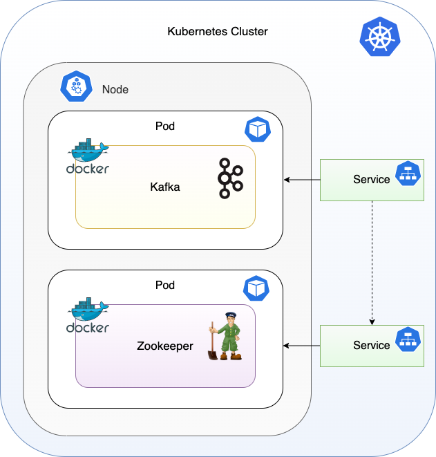


```sh
kubectl apply -f kafka.yml -n demo
deployment.apps/zookeeper-deployment created
service/zookeeper-service created
deployment.apps/kafka-deployment created
service/kafka-service created
```

```sh
kubectl get deployments -n demo
NAME                   READY   UP-TO-DATE   AVAILABLE   AGE
kafka-deployment       1/1     1            1           74s
zookeeper-deployment   1/1     1            1           74s
```
```sh
kubectl get pods -n demo
NAME                                    READY   STATUS    RESTARTS      AGE
kafka-deployment-679f4959b-74j22        1/1     Running   1 (78s ago)   2m5s
zookeeper-deployment-76f498858f-zj2th   1/1     Running   0             2m5s
```

```sh
kubectl get services -n demo
NAME                TYPE        CLUSTER-IP       EXTERNAL-IP   PORT(S)    AGE
kafka-service       ClusterIP   10.105.239.102   <none>        9092/TCP   2m59s
zookeeper-service   ClusterIP   10.98.96.159     <none>        2181/TCP   2m59s

```

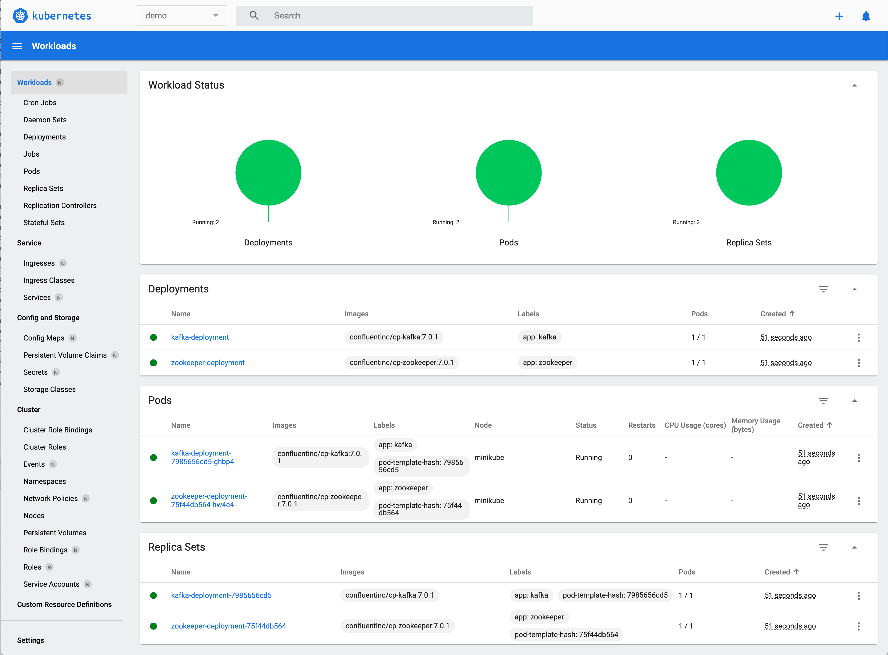

To create a Kafka topic that we can use to send and receive messages, first jump onto the Kafka pod:

```sh
kubectl -n demo exec -it kafka-deployment-679f4959b-74j22  -- /bin/bash 
```

Then execute the following command to create the topics:

```sh
kafka-topics --bootstrap-server localhost:9092 --create --topic test-topic --replication-factor 3 --partitions 3
```
```sh
[appuser@kafka-deployment-679f4959b-74j22 ~]$ kafka-topics --bootstrap-server localhost:9092 --create --topic test-topic --replication-factor 1 --partitions 3
Created topic test-topic.
```

If we get 3 replicas of the broker

```sh
kubectl get pods -n demo          
NAME                                    READY   STATUS    RESTARTS   AGE
kafka-deployment-597b44d598-225jm       1/1     Running   0          18s
kafka-deployment-597b44d598-hvld5       1/1     Running   0          18s
kafka-deployment-597b44d598-mgwn4       1/1     Running   0          18s
zookeeper-deployment-76f498858f-sdjjf   1/1     Running   0          18s
zookeeper-deployment-76f498858f-wczwq   1/1     Running   0          18s
```
Then I try to create a topic with replication factor 3, I get an error

```sh
[appuser@kafka-deployment-597b44d598-225jm ~]$ kafka-topics --bootstrap-server localhost:9092 --create --topic test-topic --replication-factor 3 --partitions 3
Error while executing topic command : Replication factor: 3 larger than available brokers: 1.
[2024-07-19 01:15:01,828] ERROR org.apache.kafka.common.errors.InvalidReplicationFactorException: Replication factor: 3 larger than available brokers: 1.
 (kafka.admin.TopicCommand$)
```

Enable port forwarding
```sh
kubectl port-forward kafka-deployment-597b44d598-225jm 9092 -n demo
Forwarding from 127.0.0.1:9092 -> 9092
Forwarding from [::1]:9092 -> 9092
```
#### Scale Cluster
You can scale the cluster by updating the number of `spec.replicas` field of the `StatefulSet`. You can accomplish this with the `kubectl scale` command

`kubectl scale sts kafka --replicas=5`

#### Updating the Cluster

You can update any of portion of the `spec.template` in the `StatefulSet` and the `StatefulSet` controller will perform a rolling update to apply the update to the pods in the `StatefulSet`. The pods will be destroyed and recreated , one at a time, in reverse ordinal order
You can use `kubectl patch` to update fields in the `spec.template` or you can update a manifest and use `kubectl apply` to apply changes


When you start minikube  it creates a bridge network with the profile name or called minikube if a profile name is not provided

```sh
docker network ls
NETWORK ID     NAME       DRIVER    SCOPE
f0b481809433   kafka      bridge    local # profile name kafka
cdc823b03805   minikube   bridge    local # no profile name,defaults to minikube

```

```sh
docker inspect f0b481809433 

"Config": [
                {
                    "Subnet": "192.168.58.0/24",
                    "Gateway": "192.168.58.1"
                }
            ]
```

In the docker VM, we have 

```sh
route -n
Kernel IP routing table
Destination     Gateway         Genmask         Flags Metric Ref    Use Iface
127.0.0.0       0.0.0.0         255.0.0.0       U     0      0        0 lo
172.17.0.0      0.0.0.0         255.255.0.0     U     0      0        0 docker0
192.168.49.0    0.0.0.0         255.255.255.0   U     0      0        0 br-cdc823b03805
192.168.58.0    0.0.0.0         255.255.255.0   U     0      0        0 br-f0b481809433
192.168.64.0    0.0.0.0         255.255.255.0   U     0      0        0 eth1
192.168.65.0    0.0.0.0         255.255.255.0   U     0      0        0 eth0
```

it forwards from 172.17.0.0  through docker0
,192.168.49.0   via br-cdc823b03805 via 192.168.58.0,192.168.64.0 via eth1 and 192.168.65.0  via eth0


```sh
Destination     Gateway         Genmask         Flags Metric Ref    Use Iface
192.168.1.10    0.0.0.0         255.255.255.255 UH    0      0        0 eth0

```
This entry means that any traffic destined for the IP address 192.168.1.10 should be sent through the interface `eth0`.

on mac, the docker host is the VM, in linux, it is the computer

`host.docker.internal`
Allows containers to access services running on the host.

`python3 -m http.server 8000`  to start an http server on mac. then within the vm, i was able to get a response for 

```sh
wget http://192.168.65.254:8000
Connecting to 192.168.65.254:8000 (192.168.65.254:8000)
```

`gateway.docker.internal`

### Traffic Between Containers:

#### Internal Communication: 
When a container sends traffic to another container on the same bridge network, the traffic is routed through the bridge interface.
Example: If Container A (IP 192.168.58.2) wants to communicate with Container B (IP 192.168.58.3), the traffic is routed through the br-<network_id> bridge interface. The bridge handles this traffic internally and forwards it to the destination container.

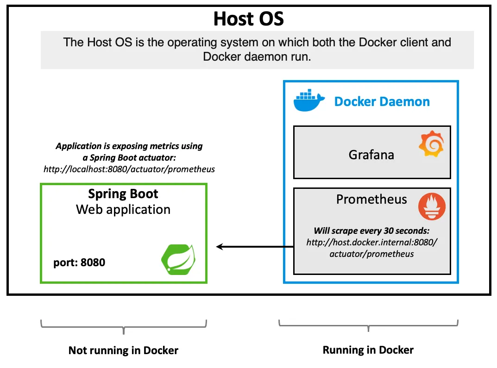

deployment is not the right way to go for kfaka, statefulset is
It maintains a sticky identity for each pod. offers persistence via persistent volume
A persistent volume is essentially a pointer to the memory(location)
Then a persistent volume can be defined for a pod, which binds the persistent volume claim to the persistent volume


### Health checks
- Liveness
is container running? if not restart
- Readiness
Ready to receive requests? if not remove from service list

Start a second local cluster
`minikube start -p cluster2`

```sh
docker network ls
NETWORK ID     NAME       DRIVER    SCOPE
62366a8e06f6   bridge     bridge    local
28db56cdc917   cluster2   bridge    local # new bridge for new cluster
a740ab058062   host       host      local
f0b481809433   kafka      bridge    local
cdc823b03805   minikube   bridge    local
```

Stop your local cluster:
`minikube stop`

Delete your local cluster:
`minikube delete`

Delete all local clusters and profiles
`minikube delete --all`

Creating a deployment inside kubernetes cluster

```sh
minikube kubectl -- create deployment hello-minikube --image=kicbase/echo-server:1.0
```

Exposing the deployment with a NodePort service

```sh
minikube kubectl -- expose deployment hello-minikube --type=NodePort --port=8080
```

#### NodePort access
A NodePort service is the most basic way to get external traffic directly to your service. NodePort, as the name implies, opens a specific port, and any traffic that is sent to this port is forwarded to the service


```sh
kubectl get svc
NAME              TYPE        CLUSTER-IP      EXTERNAL-IP   PORT(S)          AGE
hello-minikube1   NodePort    10.100.238.34   <none>        8080:31389/TCP   3s
```

```sh
minikube service hello-minikube1 --url

```
`minikube service hello-minikube1 --url` runs as a process, creating a tunnel to the cluster. The command exposes the service directly to any program running on the host operating system.

Check ssh tunnel in another terminal

```sh
ps -ef | grep docker@127.0.0.1
ssh -o UserKnownHostsFile=/dev/null -o StrictHostKeyChecking=no -N docker@127.0.0.1 -p 55972 -i /Users/FOO/.minikube/machines/minikube/id_rsa -L TUNNEL_PORT:CLUSTER_IP:TARGET_PORT
```

#### LoadBalancer access
A LoadBalancer service is the standard way to expose a service to the internet. With this method, each service gets its own IP address.

Create a Kubernetes deployment

`kubectl create deployment hello-minikube1 --image=kicbase/echo-server:1.0`
Create a Kubernetes service with type LoadBalancer

`kubectl expose deployment hello-minikube1 --type=LoadBalancer --port=8080`


minikube tunnel runs as a process, creating a network route on the host to the service CIDR of the cluster using the cluster’s IP address as a gateway. The tunnel command exposes the external IP directly to any program running on the host operating system.

```sh
kubectl get svc
NAME              TYPE           CLUSTER-IP       EXTERNAL-IP   PORT(S)          AGE
hello-minikube1   LoadBalancer   10.111.241.239   127.0.0.1     8080:31367/TCP   22s
kubernetes        ClusterIP      10.96.0.1        <none>        443/TCP          78s
```


### VETH
A veth virtual network device is connected to a protocol stack on one end and another veth device on the other end instead of a physical network. A packet sent out of a pair of veth devices goes directly to another veth device. Each veth device can be configured with an IP address and participate in the Layer 3 IP network routing process.

using tcpdump to see the request packets on the veth device pair.
A veth interface always comes in pairs, and a pair of veth interfaces is like a network cable, where data coming in from one end goes out the other.

Its main purpose is to connect different networks, for example, in the container network, used to connect the container namespace to the bridge br0 of the root namespace. In a container network, the veth on the container side is set with its own ip/mac address and renamed eth0, which is used as the container’s network interface, while the veth on the host side is directly connected to docker0/br0.

`tcpdump -n -i veth1`  can be any interface

[network-virtualization-veth-pair](https://www.sobyte.net/post/2022-04/network-virtualization-veth-pair/)

#### Bridge
bridge is connected to a protocol stack at one end and has multiple ports at the other end, and data is forwarded between the ports based on MAC addresses.

If you use tcpdump to capture packets on the Bridge interface, you can capture packets going in and out of all interfaces on the bridge, as they are all forwarded through the bridge

It is often used for forwarding data between different namepsaces on virtual machines, hosts.

[network-virtualization-bridge](https://www.sobyte.net/post/2022-04/network-virtualization-bridge/)

[network-virtualization-tun-tap](https://www.sobyte.net/post/2022-04/network-virtualization-tun-tap/)

[docker-copy](https://www.sobyte.net/post/2022-04/docker-copy/)

[container-fundamentals-learn-container-with-oci-spec](https://www.sobyte.net/post/2022-04/container-fundamentals-learn-container-with-oci-spec/)
[container-fundamentals-process-isolation-using-namespace](https://www.sobyte.net/post/2022-04/container-fundamentals-process-isolation-using-namespace/)
[container-fundamentals-resource-limitation-using-cgroups](https://www.sobyte.net/post/2022-04/container-fundamentals-resource-limitation-using-cgroups/)

[container-fundamentals-permission-control-using-capabilities](https://www.sobyte.net/post/2022-04/container-fundamentals-permission-control-using-capabilities/)

[container-fundamentals-filesystem-isolation-and-sharing](https://www.sobyte.net/post/2022-04/container-fundamentals-filesystem-isolation-and-sharing/)

[understanding-netfilter-and-iptables](https://www.sobyte.net/post/2022-04/understanding-netfilter-and-iptables/)

[tun-mode](https://www.sobyte.net/post/2022-04/tun-mode/)


### Docker Cleanup
Remove closed containers, useless storage volumes, useless networks, dangling images (no tag images)

`docker system prune -f`

Clear the cache
`docker builder prune`

Clean up data volumes that are no longer in use
`docker volume rm $(docker volume ls -q)`
or

`docker volume prune`

Clean up none mirrors
`docker images | grep none | awk '{print $3}' | xargs docker rmi`

View disk usage
`docker system df`

### Linux Cleanup

Clean up zombie processes

```sh
ps -A -ostat,ppid | grep -e '^[Zz]' | awk '{print }' | xargs kill -HUP > /dev/null 2>&1
```

Delete the folder with the specified prefix

```sh
cd /nfsdata
ls | grep archived- |xargs -L1 rm -r
```

[kubernetes-networking](https://www.sobyte.net/post/2022-03/kubernetes-networking/)

[how-the-kubernetes-network-plugin-works](https://www.sobyte.net/post/2022-03/how-the-kubernetes-network-plugin-works/)

[linux-virtual-network-interfaces](https://www.sobyte.net/post/2022-01/linux-virtual-network-interfaces/)


ClusterIp service only allows communication between services in the same cluster

On mac, we have 2 thunderbolt ports: thunderbolt 1(en1) and thunderbolt 2(en2). Both are now part(attached to) of the thunderbolt bridge bridge0 on mac
"Thunderbolt Bridge" network interface makes it  possible to network two Macs over Thunderbolt. 


It is worth mentioning that in the docker implementation, after putting one end of the `veth` into the container network namespae, the `veth` name will be changed to `eth...`
A bridge is a Layer 2 virtual network devic that 'connects' several network interfaces to enable messages to be forwarded between them, based on the MAC address of the network device. The bridge is self learning, it will learn the source MAC address. When forwarding messages, the bridge only needs to forward to a specific network interface to avoid unnecessay network interactions.If it encounters an address it has never learned, it cannot know which network interface the message should be forwarded to and broadcasts the message to all network interfaces(except the network interface from which the message originated)

A Linux bridge can be considered both a layer 2 and layer 3 device
For each container created by docker, a `veth` device pair is created, one end of which is associated to the bridge and the other end is mapped to the `eth0(veth)` device inside the container using linux's network namespace technology and then an IP address is assigned to the `eth0` interface from within the bridge's address segment and the corresponding MAC is also generated based on this IP address

After bridging, containers within the same host can communicate with each other, containers on different hosts cannot communicate with each other yet

Network namespaces allow for multiple, isolated network stacks on a single host. veth pairs are used to connect these isolated stacks, enabling communication between different namespaces.

Create a pair of virtual Ethernet (veth) interfaces
`sudo ip link add <veth-name> type veth peer name <veth-peer-name>.`

The Forwarding Database, or FDB, is a table maintained by the Linux bridge that maps MAC addresses to specific network ports (interfaces) on the bridge


`c6:9c:e9:44:e9:a4 dev veth1a master br0`

`c6:9c:e9:44:e9:a4` is the MAC of the device(container)

Any packets destined for device with MAC addresss `c6:9c:e9:44:e9:a4` will be forwarded to `veth1a`
```sh
+-----------------+          +-----------------+
|   Container 1   |          |   Container 2   |
|  veth1c (192.168.1.2)      |  veth2c (192.168.1.3) 
+-----------------+          +-----------------+
        |                            |
        |                            |
+-------------------------+  +-------------------------+
|         veth1           |  |         veth2           |
+-------------------------+  +-------------------------+
                  \                  /
                    \              /
                      \          /
                        \      /
                         +----+
                         | br0 |  (Linux Bridge)
                         +----+
```


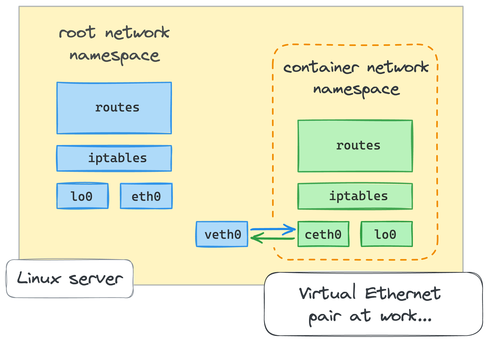

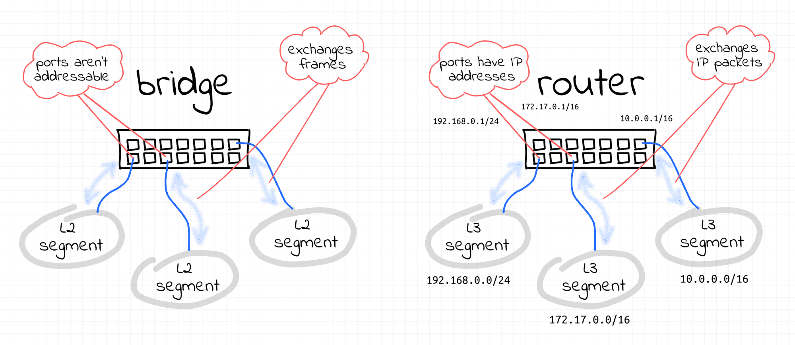


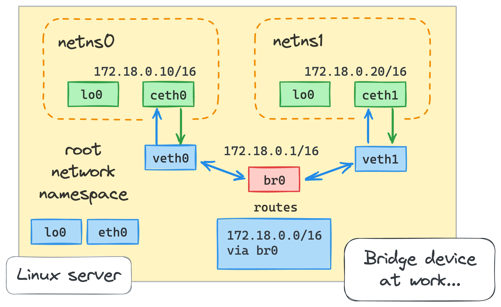

The route 172.18.0.0/16 via br0 ensures that any packets destined for this subnet are handled by the bridge.

```sh
# Create two network namespaces
ip netns add netns0
ip netns add netns1


# Create veth pairs
ip link add veth0 type veth peer name ceth0
ip link add veth1 type veth peer name ceth1

# Assign veth ends to network namespaces
ip link set ceth0 netns netns0
ip link set ceth1 netns netns1

# Set veth ends up in the root namespace
ip link set veth0 up
ip link set veth1 up

# Create and bring up the bridge
ip link add br0 type bridge
ip link set br0 up

# Attach veth ends to the bridge
ip link set veth0 master br0
ip link set veth1 master br0

# ip a
# 12: veth0@if11: <NO-CARRIER,BROADCAST,MULTICAST,UP> mtu 1500 qdisc noqueue master br0 state LOWERLAYERDOWN group default qlen 1000
#     link/ether 22:6f:fc:57:41:a9 brd ff:ff:ff:ff:ff:ff link-netns netns0
# 14: veth1@if13: <NO-CARRIER,BROADCAST,MULTICAST,UP> mtu 1500 qdisc noqueue master br0 state LOWERLAYERDOWN group default qlen 1000
#     link/ether f6:15:11:b6:94:ac brd ff:ff:ff:ff:ff:ff link-netns netns1
# 15: br0: <NO-CARRIER,BROADCAST,MULTICAST,UP> mtu 1500 qdisc noqueue state DOWN group default qlen 1000
#     link/ether 22:6f:fc:57:41:a9 brd ff:ff:ff:ff:ff:ff
#     inet6 fe80::4483:20ff:fefe:c182/64 scope link proto kernel_ll 
#        valid_lft forever preferred_lft forever

# Assign IP addresses to interfaces in netns0
ip netns exec netns0 ip addr add 172.18.0.10/16 dev ceth0
ip netns exec netns0 ip link set ceth0 up
ip netns exec netns0 ip link set lo up

# Assign IP addresses to interfaces in netns1
ip netns exec netns1 ip addr add 172.18.0.20/16 dev ceth1
ip netns exec netns1 ip link set ceth1 up
ip netns exec netns1 ip link set lo up

# Assign IP address to the bridge in root namespace
#To establish the connectivity between the root and container namespaces, we need to assign the IP address to the bridge network interface:
ip addr add 172.18.0.1/16 dev br0


# Ping from netns0 to netns1
ip netns exec netns0 ping -c 3 172.18.0.20

# / # ip netns exec netns0 ping -c 3 172.18.0.20
# PING 172.18.0.20 (172.18.0.20): 56 data bytes
# 64 bytes from 172.18.0.20: seq=0 ttl=64 time=2.992 ms
# 64 bytes from 172.18.0.20: seq=1 ttl=64 time=0.248 ms
# 64 bytes from 172.18.0.20: seq=2 ttl=64 time=0.175 ms

# --- 172.18.0.20 ping statistics ---
# 3 packets transmitted, 3 packets received, 0% packet loss
# round-trip min/avg/max = 0.175/1.138/2.992 ms

# Ping from netns1 to netns0
ip netns exec netns1 ping -c 3 172.18.0.10

```

```sh
brctl show br0
bridge name	bridge id		STP enabled	interfaces
br0		8000.566bed43389a	    no		        veth1
							                            veth0

```


```sh
bridge fdb show dev br0
33:33:00:00:00:01 self permanent
01:00:5e:00:00:6a self permanent
33:33:00:00:00:6a self permanent
01:00:5e:00:00:01 self permanent
33:33:ff:78:1e:62 self permanent

```
dev ens3: Interface associated with the MAC address.

permanent: Shows that this entry is static and not learned.

`00:1a:2b:3c:4d:5e dev ens3 vlan 1 master br0`
`master br0`: Indicates that the MAC address is learned by the bridge `br0`

Attach veth ends to the bridge
``` sh
bridge fdb show
33:33:00:00:00:01 dev gretap0 self permanent
33:33:00:00:00:01 dev erspan0 self permanent
33:33:00:00:00:01 dev br0 self permanent
01:00:5e:00:00:6a dev br0 self permanent
33:33:00:00:00:6a dev br0 self permanent
01:00:5e:00:00:01 dev br0 self permanent
33:33:ff:78:1e:62 dev br0 self permanent
e6:89:fa:cb:2b:a2 dev veth0 master br0 
56:6b:ed:43:38:9a dev veth0 vlan 1 master br0 permanent
56:6b:ed:43:38:9a dev veth0 master br0 permanent
33:33:00:00:00:01 dev veth0 self permanent
01:00:5e:00:00:01 dev veth0 self permanent
33:33:ff:43:38:9a dev veth0 self permanent
52:ff:6f:94:39:77 dev veth1 master br0 
a2:41:16:29:98:40 dev veth1 vlan 1 master br0 permanent
a2:41:16:29:98:40 dev veth1 master br0 permanent
33:33:00:00:00:01 dev veth1 self permanent
01:00:5e:00:00:01 dev veth1 self permanent
33:33:ff:29:98:40 dev veth1 self permanent
33:33:00:00:00:01 dev eth0 self permanent
01:00:5e:00:00:01 dev eth0 self permanent

brctl showmacs br0
port no	mac addr		is local?	ageing timer
  2	52:ff:6f:94:39:77	no		 209.55 # learned=no
  1	56:6b:ed:43:38:9a	yes		   0.00
  1	56:6b:ed:43:38:9a	yes		   0.00 # veth0
  2	a2:41:16:29:98:40	yes		   0.00 # veth1
  2	a2:41:16:29:98:40	yes		   0.00
  1	e6:89:fa:cb:2b:a2	no		 176.79 # learned

```

```sh
ip netns exec netns1 ip a
13: ceth1@if14: <BROADCAST,MULTICAST,UP,LOWER_UP> mtu 1500 qdisc noqueue state UP group default qlen 1000
    link/ether 6e:c8:4c:b3:aa:ed brd ff:ff:ff:ff:ff:ff link-netnsid 0
    inet 172.18.0.20/16 scope global ceth1
       valid_lft forever preferred_lft forever
    inet6 fe80::6cc8:4cff:feb3:aaed/64 scope link proto kernel_ll 
       valid_lft forever preferred_lft forever


ip netns exec netns0 ip a
11: ceth0@if12: <BROADCAST,MULTICAST,UP,LOWER_UP> mtu 1500 qdisc noqueue state UP group default qlen 1000
    link/ether ea:40:53:7a:8f:98 brd ff:ff:ff:ff:ff:ff link-netnsid 0
    inet 172.18.0.10/16 scope global ceth0
       valid_lft forever preferred_lft forever
    inet6 fe80::e840:53ff:fe7a:8f98/64 scope link proto kernel_ll 
       valid_lft forever preferred_lft forever
```

A port number corresponds to an interface connected to the bridge

the interfaces on a bridge are different from that on a NIC

```sh
ip link add br1 type bridge

# bridge down,does not change if brought up
bridge fdb show dev br1
33:33:00:00:00:01 self permanent
2a:a4:05:be:38:75 vlan 1 master br1 permanent

brctl showmacs br1 ## no interfaces
port no	mac addr		is local?	ageing timer

```

```sh
tcpdump -n -i br0                                                │e05958e6b114:/# ip netns exec netns1 ping -c 1 172.18.0.10
tcpdump: verbose output suppressed, use -v[v]... for full protoco│PING 172.18.0.10 (172.18.0.10): 56 data bytes
l decode                                                         │64 bytes from 172.18.0.10: seq=0 ttl=64 time=1.953 ms
listening on br0, link-type EN10MB (Ethernet), snapshot length 26│
2144 bytes                                                       │--- 172.18.0.10 ping statistics ---
15:15:07.985138 IP6 fe80::e840:53ff:fe7a:8f98 > ff02::2: ICMP6, r│1 packets transmitted, 1 packets received, 0% packet loss
outer solicitation, length 16                                    │round-trip min/avg/max = 1.953/1.953/1.953 ms
15:15:19.620766 IP 172.18.0.20 > 172.18.0.10: ICMP echo request, │e05958e6b114:/# 
id 59, seq 0, length 64                                          │
15:15:19.621706 IP 172.18.0.10 > 172.18.0.20: ICMP echo reply, id│
 59, seq 0, length 64                                            │
15:15:24.898332 ARP, Request who-has 172.18.0.20 tell 172.18.0.10│
, length 28                                                      │
15:15:24.902326 ARP, Request who-has 172.18.0.10 tell 172.18.0.20│
, length 28                                                      │
15:15:24.902355 ARP, Reply 172.18.0.20 is-at 6e:c8:4c:b3:aa:ed, l│
ength 28                                                         │
15:15:24.902357 ARP, Reply 172.18.0.10 is-at ea:40:53:7a:8f:98, l│
ength 28                                                         │
                                        
```

```sh
e05958e6b114:/# ip route list
default via 172.17.0.1 dev eth0 
172.17.0.0/16 dev eth0 proto kernel scope link src 172.17.0.2  # for docker0
172.18.0.0/16 dev br0 proto kernel scope link src 172.18.0.1 # for br0

e05958e6b114:/# route -n
Kernel IP routing table
Destination     Gateway         Genmask         Flags Metric Ref    Use Iface
0.0.0.0         172.17.0.1      0.0.0.0         UG    0      0        0 eth0
172.17.0.0      0.0.0.0         255.255.0.0     U     0      0        0 eth0
172.18.0.0      0.0.0.0         255.255.0.0     U     0      0        0 br0

e05958e6b114:/# iptables --list-rules
-P INPUT ACCEPT
-P FORWARD ACCEPT
-P OUTPUT ACCEPT
```


use `nsenter --net=/run/netns/netns0 bash` or `nsenter --net=/run/netns/netns0 sh` 
`nsenter` enters one or more of the specified namespaces and then executes the given program in it

br0 172.18.0.1
netns0 172.18.0.10 

netns1 172.18.0.20

```sh
e05958e6b114:/# ip netns exec netns0 ip route list
172.18.0.0/16 dev ceth0 proto kernel scope link src 172.18.0.10 

e05958e6b114:/# ip netns exec netns0 route -n
Kernel IP routing table
Destination     Gateway         Genmask         Flags Metric Ref    Use Iface
172.18.0.0      0.0.0.0         255.255.0.0     U     0      0        0 ceth0
```

`echo 1 > /proc/sys/net/ipv4/ip_forward`

This change basically turned the host machine into a router, and the bridge interface became the default gateway for the containers.

`iptables -t nat -A POSTROUTING -s 172.18.0.0/16 ! -o br0 -j MASQUERADE`

we added a new rule to the `nat` table of the `POSTROUTING` chain asking to masquerade all the packets originated in `172.18.0.0/16` network, except those that are going to the `bridge` interface.

Sending a non-zero value to `/proc/sys/net/ipv4/ip_forward` file activates packet forwarding between different network interfaces, effectively turning a Linux machine into a virtual router.

NAT is applied on the host or VM that acts as a router
Your router will only let traffic in if you initiated the connection. With port forwarding, devices from outside can make connections to devices inside your network

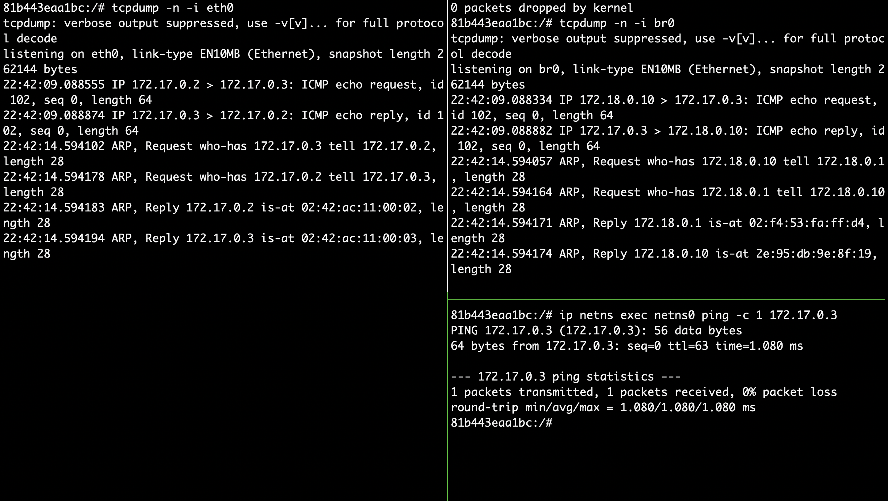

we can see that the request goes through `br0` from `netns0` then to `eth0` on container(host in this case). The container has forwarding enabled and also has the following rule, which helps translates the source ip from `172.18.0.10` to `172.17.0.2`


port forwarding is a way of accessing private network from outside that network..Implying external devices can communicate with your devices

`/proc/sys/net/ipv4/ip_forward` by default is 0. hence it drops the packets not meant for its interface.
It does not forward packets out


```sh
81b443eaa1bc:/#  iptables -t nat -L -n -v
Chain PREROUTING (policy ACCEPT 0 packets, 0 bytes)
 pkts bytes target     prot opt in     out     source               destination         

Chain INPUT (policy ACCEPT 0 packets, 0 bytes)
 pkts bytes target     prot opt in     out     source               destination         

Chain OUTPUT (policy ACCEPT 0 packets, 0 bytes)
 pkts bytes target     prot opt in     out     source               destination         

Chain POSTROUTING (policy ACCEPT 13 packets, 1078 bytes)
 pkts bytes target     prot opt in     out     source               destination         
    7   588 MASQUERADE  0    --  *      !br0    172.18.0.0/16        0.0.0.0/0 

```


```sh
ip netns exec netns0 route -n
Kernel IP routing table
Destination     Gateway         Genmask         Flags Metric Ref    Use Iface
0.0.0.0         172.18.0.1      0.0.0.0         UG    0      0        0 ceth0
172.18.0.0      0.0.0.0         255.255.0.0     U     0      0        0 ceth0

```

For destinations outside this network, this container uses 172.18.0.1. It first sends a unicast ARP to the bridge(172.18.0.1) to get its mac. It then uses the mac of the bridge to  send the frame to it


For destinations within the network,it can send a unicast if it already knows the mac of the destination or a multicast


[cloud-native-virtual-networking](https://www.sobyte.net/post/2022-07/cloud-native-virtual-networking/)


```sh
ip tuntap add dev tun0 mode tun
ip addr add 10.0.0.1/24 dev tun0
ip link set tun0 up
```

This sets up a TUN device tun0 with an IP address of `10.0.0.1`.

`ip route add 192.168.1.0/24 dev tun0`

This routes packets destined for the `192.168.1.0/24` network through tun0.

on my windows laptop with vpn, 
the route table 

```sh
Network Destination       Netmask          Gateway         Interface
0.0.0.0                   0.0.0.0          192.168.8.1     192.168.8.144
192.168.8.144             255.255.255.255   on-link        192.168.8.144
192.168.8.255             255.255.255.255   on-link        192.168.8.144
192.168.8.1               255.255.255.255   on-link        192.168.8.144
192.168.8.0               255.255.255.0     some-ip        some-other-ip

```
Any packet destined for a network not listed in the routing table should be forwarded to the gateway at `192.168.8.1` via the interface `192.168.8.144`.

A netmask of 255.255.255.255 means it targets a single IP address.
The term on-link indicates that the destination is directly reachable without needing to pass through a gateway. The packet is directly sent to the 192.168.8.144 interface.

A host route (255.255.255.255) is used to ensure precise and direct communication with the gateway without any ambiguity.

VM network adapters are connected to TAP devices, enabling Ethernet frame-level communication.

The host can bridge TAP devices with physical interfaces, allowing VMs to access the external network

```sh
# Create TAP devices for VMs
ip tuntap add dev tap0 mode tap
ip tuntap add dev tap1 mode tap

# Create a bridge and add interfaces
brctl addbr br0
brctl addif br0 tap0
brctl addif br0 tap1
brctl addif br0 eth0
ip link set br0 up

# Set TAP devices up
ip link set tap0 up
ip link set tap1 up

```

TAP interfaces can be used to create a virtual network bridge, where packets received by the TAP interface can be processed by network software or forwarded to other interfaces.

TAP interfaces are often configured to operate in bridge mode, meaning they operate at Layer 2 and can be used to simulate Ethernet connections


A VETH pair consists of two virtual Ethernet devices that are directly connected to each other,providing a point-to-point connection between two virtual interfaces.

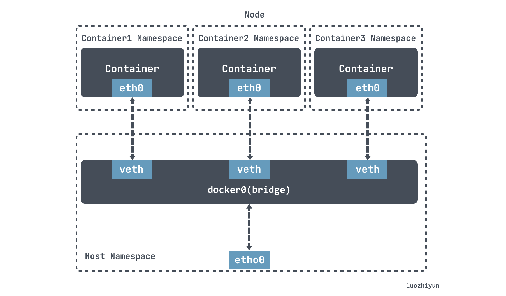
tun/tap is responsible for transferring data between the kernel network stack and user space.
- tun device is a layer 3 network layer device, reads IP packets from /dev/net/tun character device and writes only IP packets, so it is often used for some point-to-point IP tunnels, such as OpenVPN, IPSec, etc.
- tap device is a layer 2 link layer device, equivalent to an Ethernet device, reading MAC layer data frames from /dev/tap0 character device and writing only MAC layer data frames, so it is often used as a virtual machine emulation NIC.

direct container-to-container communication does not use tun/tap as the preferred solution, but is generally based on veth


A veth-pair is a pair of virtual device interfaces that come in pairs, with one end connected to a protocol stack and one end connected to each other, so that data entered at one end of the veth device will flow out of the other end of the device unchanged.
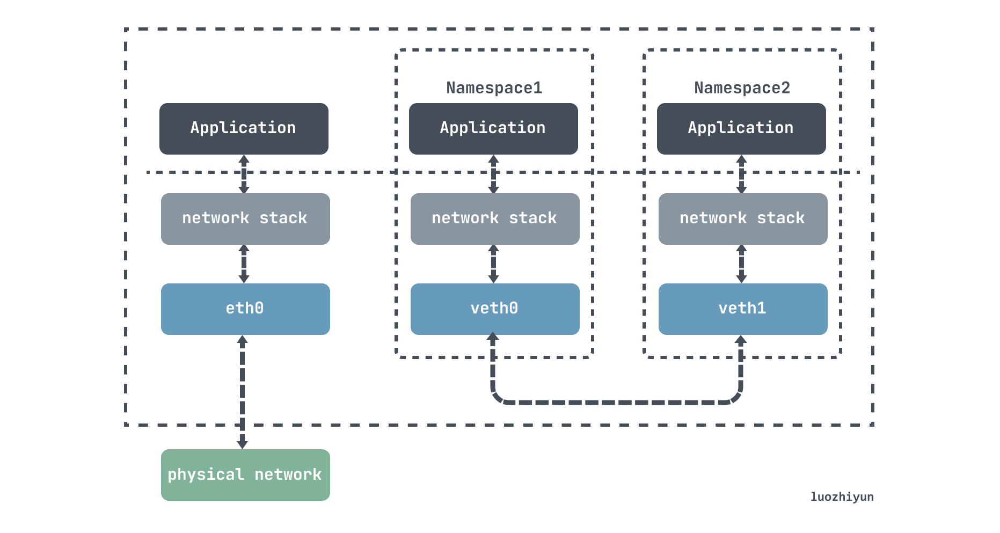

`docker run --privileged -it alpine /bin/sh` to  run the following commands in the container
`apk add iproute2` for `ip netns`

```sh
# Create two namespace
ip netns add ns1
ip netns add ns2

# Add vethDemo0 and vethDemo1 via ip link command
ip link add vethDemo0 type veth peer name vethDemo1

ip a
#11: vethDemo1@vethDemo0: <BROADCAST,MULTICAST,M-DOWN> mtu 1500 qdisc noop state DOWN group default qlen 1000
#  link/ether 8e:91:97:e2:ec:94 brd ff:ff:ff:ff:ff:ff
#12: vethDemo0@vethDemo1: <BROADCAST,MULTICAST,M-DOWN> mtu 1500 qdisc noop state DOWN group default qlen 1000
 #   link/ether 2a:69:b2:89:ea:b6 brd ff:ff:ff:ff:ff:ff


# Add vethDemo0 vethDemo1 to each of the two ns
ip link set vethDemo0 netns ns1
ip link set vethDemo1 netns ns2

# Assign IPs to both vethDemo0 vethDemo1 and enable
ip netns exec ns1 ip addr add 10.1.1.2/24 dev vethDemo0
ip netns exec ns1 ip link set vethDemo0 up

ip netns exec ns2 ip addr add 10.1.1.3/24 dev vethDemo1
ip netns exec ns2 ip link set vethDemo1 up

```

[cloud-native-virtual-networking](https://www.sobyte.net/post/2022-07/cloud-native-virtual-networking/)

`ip route get 8.8.8.8`

```sh
docker run -it alpine sh
/ # ip route get 8.8.8.8
8.8.8.8 via 172.17.0.1 dev eth0  src 172.17.0.3 
```

`nsenter` is a Linux utility that allows you to enter namespaces of other processes. In a Kubernetes cluster, each pod has its own network namespace, which means that you can use `nsenter` to enter the network namespace of a pod and troubleshoot networking issues from the host node of the pod.

`This is extremely useful in scenarios where pods do not have a shell to exec into or in environments where you might not have access to a network utility pod to troubleshoot.`

- Use the ps aux command to find the PID of the container running the pod.

Once you've identified the PID, use the `nsenter` command to enter the container's network namespace. The network namespace is located at /proc/{PID}/ns/net. For example, `nsenter -t {PID} -n`.

Once you're inside the container's network namespace, you can use standard networking tools (such as ping, curl, or telnet) to test connectivity to the service.

The nsenter command executes program in the namespace(s) that are
specified in the command-line options (described below). If
program is not given, then "${SHELL}" is run (default: /bin/sh).

Enterable namespaces are:
- mount namespace
Mounting and unmounting filesystems will not affect the rest
of the system, except for filesystems which are explicitly
marked as shared (with mount --make-shared; see /proc/self/mountinfo for the shared flag)

- UTS namespace
Setting hostname or domainname will not affect the rest of
the system.
- IPC namespace
The process will have an independent namespace for POSIX
message queues as well as System V message queues, semaphore
sets and shared memory segments. 
- network namespace
The process will have independent IPv4 and IPv6 stacks, IP
routing tables, firewall rules, the /proc/net and
/sys/class/net directory trees, sockets, etc. 
- PID namespace
Children will have a set of PID to process mappings separate
from the nsenter process. nsenter will fork by default if
changing the PID namespace, so that the new program and its
children share the same PID namespace and are visible to each
other. If --no-fork is used, the new program will be exec’ed
without forking. 
- user namespace
The process will have a distinct set of UIDs, GIDs and
capabilities.
- cgroup namespace
The process will have a virtualized view of
/proc/self/cgroup, and new cgroup mounts will be rooted at
the namespace cgroup root.
- time namespace
The process can have a distinct view of CLOCK_MONOTONIC
and/or CLOCK_BOOTTIME which can be changed using
/proc/self/timens_offsets.

`nsenter -a` or `nsenter -all` to enter all namespaces of the target process


use `ip link` to view the list of network  devices

```sh
# view routing table
/ # route -n
Kernel IP routing table
Destination   Gateway         Genmask      Flags Metric Ref    Use Iface
0.0.0.0       172.17.0.1      0.0.0.0       UG    0      0      0  eth0
172.17.0.0    0.0.0.0         255.255.0.0   U     0      0      0  eth0

```
```sh
# View iptable rules
iptables -L
```

`ip route list table local` 
`ip route list table main`

`route -n` command is actually looking at the main routing table

```sh
/ # route -n
Kernel IP routing table
Destination     Gateway         Genmask         Flags Metric Ref    Use Iface
0.0.0.0         172.17.0.1      0.0.0.0         UG    0      0        0 eth0
172.17.0.0      0.0.0.0         255.255.0.0     U     0      0        0 eth0
/ # ip route list table main
default via 172.17.0.1 dev eth0 
172.17.0.0/16 dev eth0 scope link  src 172.17.0.3 
```

```sh
ip tunnel add|change|del|show [NAME]
        [mode ipip|gre|sit] [remote ADDR] [local ADDR] [ttl TTL]
```
The mode represents the different IPIP tunnel types.

- `ipip`: A normal IPIP tunnel, which is an encapsulation of an IPv4 message on top of a message
- `gre`: Generic Routing Encapsulation, which defines a mechanism to encapsulate other network layer protocols on top of any network layer protocol, so it works for both IPv4 and IPv6
- `sit`: sit mode is mainly used for IPv4 messages encapsulating IPv6 messages, i.e. IPv6 over IPv4
- `isatap`: Intra-Site Automatic Tunnel Addressing Protocol, similar to sit, is also used for IPv6 tunnel encapsulation
- `vti`: Virtual Tunnel Interface, an IPsec tunneling technology

[ipip](https://www.sobyte.net/post/2022-10/ipip/)

unneling refers to the process of encapsulating one type of data packet within another packet to transmit it securely over a network.

in networking, tunnels are a method for transporting data across a network using protocols that are not supported by that network.unneling works by encapsulating packets: wrapping packets inside of other packets.


Data traveling over a network is divided into packets. A typical packet has two parts: the header, which indicates the packet's destination and which protocol it uses, and the payload, which is the packet's actual contents.

An encapsulated packet is essentially a packet inside another packet. In an encapsulated packet, the header and payload of the first packet goes inside the payload section of the surrounding packet. The original packet itself becomes the payload.

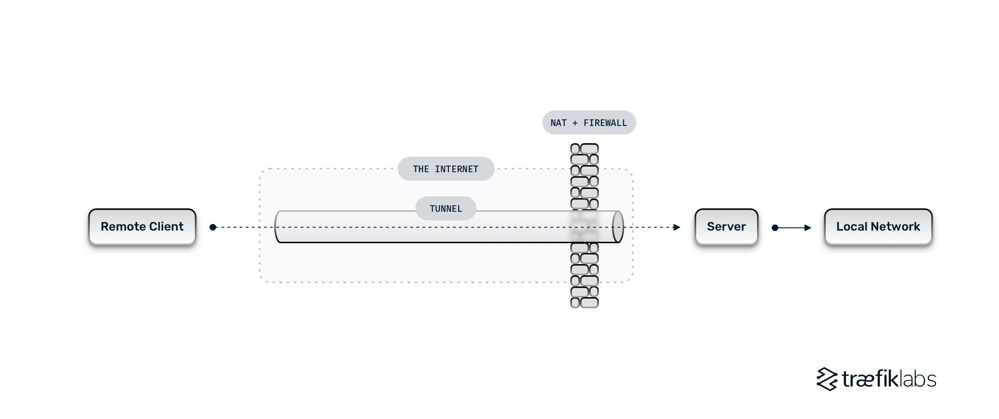
The most common use cases for network tunneling are virtual private networks (VPNs), which set up efficient and secure connections between networks, providing a way to overcome limitations when using unsupported network protocols, and allowing users to bypass firewalls.


In order to move requests through the tunnel from the remote client to the local network, requests need to be encapsulated. Network tunnels work using encapsulated packets of private network data and protocol information within the public network transmission. Those packets are then de-capsulated and decrypted at the final destination.

Packets usually consist of two parts: the `header`, which indicates the packet's destination and the protocol it uses, and the `payload`, which includes the packet's contents. An encapsulated packet is a packet wrapped inside another packet as the payload.


A VPN tunnel is a connection between your machine and a VPN server. A VPN tunnel connects your device to a server from a different network and allows them to communicate as if they were part of the same network. VPNs tunnels can also be used to protect users from attacks and hide their online activity.


### What is a Secure Shell (SSH) tunnel?
Secure Shell (SSH) tunneling is a method for transmitting network data using the Secure Socket Shell (SSH) communication protocol. It can be used to add encryption to legacy applications. It can also be used to implement VPNs (Virtual Private Networks) and access intranet services across firewalls.

SSH tunneling is the standard for securing remote logins and file transfers when using untrusted networks. The most common use cases for SSH tunnels are encrypting legacy applications, creating VPNs, and accessing intranet services by bypassing firewalls.

[what-is-tunneling](https://gcore.com/learning/what-is-tunneling/)

SSH data is encapsulated inside Tcp segment at layer 4
then the tcp segment is encapsulated at layer 3 in an IP packet
then the IP packet is encapsulated in at ethernet frame at layer 2

```sh
Host Port: 8080
Container Port: 80
#DNAT Rule 
iptables -t nat -A PREROUTING -p tcp --dport 8080 -j DNAT --to-destination 172.17.0.2:80

```

When Docker sets up the bridge network, it adds entries like this to the host's routing table:

```sh
Destination     Gateway         Genmask         Flags Metric Ref    Use Iface
172.17.0.0      0.0.0.0         255.255.0.0     U     0      0        0 docker0

```

Internal network to external network: NAT(who internally is talking to who externally)
External network to internal network: Port forwarding


The file `/dev/net/tun` serves as an interface for userspace programs to interact with the kernel's TUN/TAP driver. When a userspace application opens this file, it can create a new TUN or TAP interface and use it to send and receive network packets.


QEMU sets up a TAP device (tap0) for a VM, bridging it to the host’s network, allowing the VM to communicate with other machines on the network.

```c
// Set the interface flags
    ifr.ifr_flags = IFF_TAP | IFF_NO_PI; // TAP device without packet info

     ifr.ifr_flags = IFF_TUN; // IFF_TAP for TAP device
```

    Packet Capture: TAPs are designed to capture and mirror network traffic without altering or affecting the data.


VM to VM Communication:
Each VM is connected to a TAP interface.
TAP interfaces are connected to a bridge, forming a virtual switch.
Packets sent by a VM are received by its TAP interface.
The TAP interface forwards the packet to the bridge.
The bridge decides the destination based on MAC addresses and forwards the packet to the appropriate TAP interface of another VM.

TUN/TAP provides packet reception and transmission for user space programs. It can be seen as a simple Point-to-Point or Ethernet device, which, instead of receiving packets from physical media, receives them from user space program and instead of sending packets via physical media writes them to the user space program.

Depending on the type of device chosen the userspace program has to read/write IP packets (with tun) or ethernet frames (with tap).


Let’s say that you configured IPv6 on the tap0, then whenever the kernel sends an IPv6 packet to tap0, it is passed to the application (VTun for example). The application encrypts, compresses and sends it to the other side over TCP or UDP. The application on the other side decompresses and decrypts the data received and writes the packet to the TAP device, the kernel handles the packet like it came from real physical device.

Network traffice data is handled by the physical ethernet ports on physical machines.Similarly for virtual machines, this traffic needs to be handled by the virtual ethernet ports.Eventually, this traffic from virtual ports needs to ne sent to the physical network for external connectivity.
virtual switch requires ports or interfaces to carry data traffic in and out of the switch. Other softwares use the virtual ports on the switch to send ethernet frames to the switch.For ethernet traffic, these linux virtual ports are called tap interfaces. Tap interfaces can be added to a linux bridge just like physical interfaces, enabling a linux bridge to forward traffic from the virtual world to the physical and vice versa


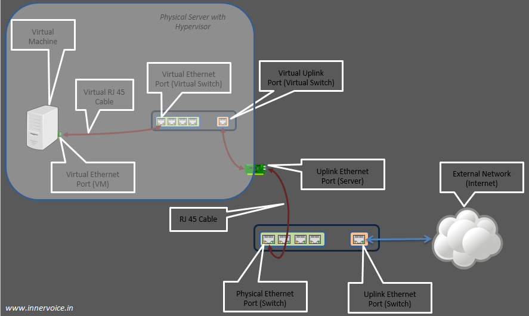

[tap-interfaces-linux-bridge](https://cloudbuilder.in/blogs/2013/12/08/tap-interfaces-linux-bridge/)

Is there a virtual RJ45 cable as well?
The short answer is no. But there is a need for connecting a virtual Ethernet port of a VM to the tap interface on a Linux bridge. This connection is achieved programmatically. Applications such as libvirt create a “file descriptor” using the tap interface. When Linux bridge sends Ethernet frames to a tap interface, it actually is sending the bytes to a file descriptor. Emulators like QEMU, read the bytes from this file descriptor and pass it onto the “guest operating system” inside the VM, via the virtual network port on the VM. **Note: **Tap interfaces are listed as part of the ifconfig Linux command.

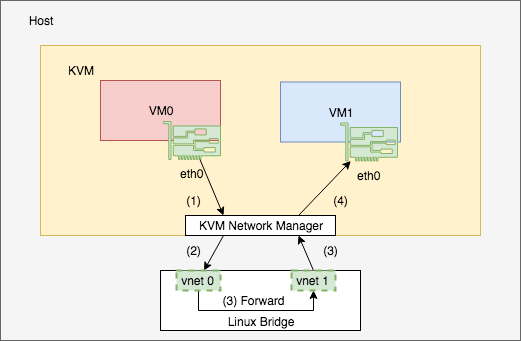

The typical use case of a TAP interface is virtual networking.When we create a VM in the KVM with bridged network, it creates a TAP interface like`vnet0` and adds it to the Linux bridge. In this case, `KVM` is the userspace program which reads from and writes to the TAP interfaces. When `VM0` sends a packet to its `eth0`, `KVM` sends it to TAP interface `vnet0` so that the bridge will forward it to `vnet1`. Then KVM receives it and sends it to `VM1’s eth0`.

[Tun-Tap-Interface](https://hechao.li/2018/05/21/Tun-Tap-Interface/)

Layer 3 switches can have SVIs (Switched Virtual Interfaces) or routed ports with IP addresses.


You can talk to the API server in kubernetes using a client, which could be a UI, kubectl(cli) , another api etc

`etho` in modern linux often has another name eg `enp0s25`

```sh
        |
        | physical link
        |
        o br0
       / \
      /   \
eth0 o     o tap0
           |
- - - - - - - - - - - - - - - Host / VM boundary
           |
           o ens0 (inside VM)

```

To allow VMs to have their own IP addresses while using the same physical link, we need to introduce a bridge into this setup. Both the VM’s network interface as well as the host’s interface will be connected to the bridge (commonly named `br0`).

```sh
ip link add br0 type bridge
ip link set br0 up

```
Next, we want to connect the `eth0` interface to the bridge and re-assign the IP address from `eth0` to `br0`.
`192.168.0.10` is just an example IP address, you need to use your own of course.


```sh
ip link set eth0 up
ip link set eth0 master br0

# Drop existing IP from eth0
ip addr flush dev eth0

# Assign IP to br0
ip addr add 192.168.0.10/24 brd + dev br0
ip route add default via 192.168.0.1 dev br0
```
we can create the TAP interface to be used by the VMs. `$YOUR_USER` is used to allow an unprivileged user to connect to the TAP device. This is important for QEMU, since QEMU VMs should be started as non-root users.

```sh
ip tuntap add dev tap0 mode tap user $YOUR_USER
ip link set dev tap0 up
ip link set tap0 master br0

```


Creating a bridge on the hypervisor system:
> sudo ip link add br0 type bridge

Clear the IP address on the network interface that you'll be bridging (e.g. eth0).
Note: This will disable network traffic on eth0!

> sudo ip addr flush dev eth0

Add the interface to the bridge:
> sudo ip link set eth0 master br0

Next up, create a TAP interface:
> sudo ip tuntap add dev tap0 mode tap user $(whoami)

The user parameter ensures that the current user will be able to connect to the TAP interface.

Add the TAP interface to the bridge:
> sudo ip link set tap0 master br0

Make sure everything is up:
> sudo ip link set dev br0 up
> sudo ip link set dev tap0 up

The TAP interface is now ready for use. Assuming that a DHCP server is available on the bridged network, the VM can now obtain an IP address during boot via:

```sh
 qemu-kvm -kernel arch/x86/boot/bzImage \
           -initrd initramfs \
           -device e1000,netdev=network0,mac=52:55:00:d1:55:01 \
           -netdev tap,id=network0,ifname=tap0,script=no,downscript=no \
           -append "ip=dhcp rd.shell=1 console=ttyS0" -nographic

```
lima(Linux virtual machines)

`ps aux | grep lima` on mac to see the running process of the vm

Tap devices work at the ethernet level or layer 2 of the network stack so it behaves like a real network adaptor.It can transport any layer 3 protocol and aren't limited to point-to-point connections because they are run in layer 2
tap devices can be part of a bridge

Qemu adds a virtual network device on your host(called tapN), and you can then configure it as if it was a real ethernet card

Ethernet switches have multiple interfaces and this depends on the model of the device.Some siwtches have about 24 interfaces, others may have as many as 48 interfaces. Each interface on a switch has its own unique MAC address which is burned into its network adapter

A bridge assigns a link layer address to each of its interfaces, and forwards anything that passes through it but is not addressed to it

a bridge does consume some ingress frames, under two conditions:

- To pass it to the upper (i.e., L3) layer
This is possible only when the bridge implements L3 functionalities, too (i.e., it is a router or host in addition to a bridge) and the ingress frame is addressed to the L2 address configured on the receiving interface.

- To pass it to a protocol handler

Namespaces is a form of lightweight process virtualization, and it provides resource isolation
The main idea of Linux namespaces is to partition resources among groups of processes to enable a process (or several processes) to have a different view of the system than processes in other groups of processes

Ethernet works in both the physical and data link layer

Layer x, it means the device contains functionality for that layer and below. Layer 1 device just understand layer 1 while a lyaer 3 device understands layer 3,2 and 1

a bridge has virtual ports

[tuntap](https://www.gabriel.urdhr.fr/2021/05/08/tuntap/)

[ssh-tunnels](https://www.gabriel.urdhr.fr/2024/04/13/ssh-tunnels/)
[VPN Tun/Tap and sockets, routing, tunnels and TLS](https://www.youtube.com/watch?v=XKV0fSxrCmg&t=182s)
[Create a Cisco IPsec protected tunnel interface!](https://www.youtube.com/watch?v=NBUa-HA-1TE)

[Can you explain what a "Network Tunnel" does|](https://www.youtube.com/watch?v=Dw-SQ48jbGY)
[How IPsec Site to Site VPN Tunnels Work](https://www.youtube.com/watch?v=ll-DNG1-zjU)

Any packet that enters the network stack goes to the router

tun0 sends packets to the network stack when it gets them

the source ip address for a packet is decided based on which network interface is used to send  out the packet


[linux-virtual-network-interfaces](https://www.sobyte.net/post/2022-01/linux-virtual-network-interfaces/)
```sh            
+----------------------------------------------------------------------+
|                                                                      |
|  +--------------------+      +--------------------+                  |
|  | User Application A |      | User Application B +<-----+           |
|  +------------+-------+      +-------+------------+      |           |
|               | 1                    | 5                 |           |
|...............+......................+...................|...........|
|               ↓                      ↓                   |           |
|         +----------+           +----------+              |           |
|         | socket A |           | socket B |              |           |
|         +-------+--+           +--+-------+              |           |
|                 | 2               | 6                    |           |
|.................+.................+......................|...........|
|                 ↓                 ↓                      |           |
|             +------------------------+          +--------+-------+   |
|             | Network Protocol Stack |          |  /dev/net/tun  |   |
|             +--+-------------------+-+          +--------+-------+   |
|                | 7                 | 3                   ^           |
|................+...................+.....................|...........|
|                ↓                   ↓                     |           |
|        +----------------+    +----------------+        4 |           |
|        |      eth0      |    |      tun0      |          |           |
|        +-------+--------+    +-----+----------+          |           |
|    10.32.0.11  |                   |   192.168.3.11      |           |
|                | 8                 +---------------------+           |
|                |                                                     |
+----------------+-----------------------------------------------------+
                 ↓
         Physical Network


```

tun/tap are virtual network devices in the OS kernel, they provide data reception and transmission for user layer programs.

A normal physical network interface, such as eth0, has a kernel stack and an external physical network on each side

For a TUN/TAP virtual interface such as tun0, one end must be connected to the user layer program, while the other end varies depending on how it is configured, either directly to the kernel stack or to a bridge (described later). Linux provides tun/tap functionality through the kernel module TUN, which provides a device interface `/dev/net/tun` for user-level programs to read and write data from the host kernel stack through `/dev/net/tun`

After the routing match is successful and the packet is sent to tun0, tun0 discovers that the other end is connected to application B via `/dev/net/tun` and drops the data to application B


The user layer program can be thought of as another host on the network that is connected via the tun/tap virtual NIC.

1. Create and Configure the tap0 Interface on the Host
you'll need to create the `tap0` interface on the host and ensure it is up and part of a bridge that includes the host's physical network interface.

```sh
# Create a tap interface named tap0
sudo ip tuntap add dev tap0 mode tap user $(whoami)

# Bring the tap0 interface up
sudo ip link set dev tap0 up

```

2. Create a Bridge Interface on the Host
A bridge interface is needed to connect the `tap0` interface with the host's physical network interface, allowing traffic to flow between the VM and the external network

```sh
# Create a bridge named br0
sudo ip link add name br0 type bridge

# Add tap0 to the bridge
sudo ip link set dev tap0 master br0

# Add the host's physical network interface to the bridge
# Replace eth0 with your actual network interface name
sudo ip link set dev eth0 master br0

# Bring the bridge interface up
sudo ip link set dev br0 up

```

3. Start a VM Using tap0 as Its Network Interface
Configure the VM to use the `tap0` interface. The method varies depending on the virtualization software you use, such as `QEMU, KVM, VirtualBox`, or `VMware`. Here, I'll provide an example using QEMU/KVM:

```sh
# Start a QEMU VM using tap0
qemu-system-x86_64 \
    -netdev tap,id=mynet0,ifname=tap0,script=no,downscript=no \
    -device e1000,netdev=mynet0 \
    -m 2048 \
    -hda your_vm_image.img

```

`-netdev tap,id=mynet0,ifname=tap0`: Specifies the network device using `tap0`

`-device e1000,netdev=mynet0`: Connects the tap device to the VM using the e1000 network adapter

`-m 2048`: Allocates 2048 MB of RAM to the VM.

`-hda your_vm_image.img`: Specifies the disk image for the VM.

he VM uses the `tap0` interface on the host by being part of the bridge `br0`
The VM behaves like a separate host on the network with its own MAC and IP addresses, allowing it to communicate with other network devices through the `tap0` interface.

the `arp` table has ip addresses and their mac
then the 

Therefore the Bridge can only send packets to the upper stack if `br0` sets the `IP` address.
However, the NICs that are added to the Bridge cannot be configured with IP addresses, they work at the data link layer and are not visible to the routing system.

The IP address assigned to br0 allows the bridge to send and receive IP packets. This IP address is visible to the routing system and can be used for network communication.

a bridge records the source mac and the interface(port) on which it was received 

```


```
```sh
Routing tables

Internet:
Destination        Gateway            Flags         Netif Expire
default            192.168.1.1        UGSc            en0
10.0.0.0/24        link#12            UCS             en1
10.0.0.5           0:14:22:3e:56:76   UHLWIi          en1   1167
127.0.0.1          127.0.0.1          UH             lo0
192.168.1.0/24     link#4             UCSI            en0
192.168.1.123      0:1e:c9:7a:35:6f   UHLWIi          en0   1180
     

```
`link#12` is a placeholder that signifies a direct connection to a specific network interface, which doesn't use an external gateway (like a router or another network hop) for packet forwarding. Instead, the packets are routed directly to the corresponding interface.

`10.0.0.0/24` link#12 UCS en1: This entry means that the 10.0.0.0/24 network is directly connected to the network interface identified by link#12, which maps to en1.


```sh
Destination     Gateway                Flags   Refs  Use  Netif Expire
10.0.0.5        0:14:22:3e:56:76       UHLWIi    0    11   en1   1167

```

 `10.0.0.5` is reachable directly via the MAC address 0:14:22:3e:56:76 without a Layer 3 IP gateway.

 The Address Resolution Protocol (ARP) is used to map IP addresses to MAC addresses within the same network segment.
 `? (10.0.0.5) at 0:14:22:3e:56:76 on en1 ifscope [ethernet]`

 n this ARP entry, the IP address `10.0.0.5` is mapped to the MAC address `0:14:22:3e:56:76`.

 ```sh
 Destination     Gateway                Flags   Refs  Use  Netif Expire
192.168.50.10   0:16:3e:1a:2b:3c       UHLWIi    1   438   vmnet1
```

The gateway `0:16:3e:1a:2b:3c` is the MAC address of a VM bridged to the `vmnet1` interface.

With only `tap0` in `bridge100`, the VM will not have direct access to the external network unless additional configurations are made. This is because `tap0` doesn't connect to any physical network interface on the host.

```sh
# Define your interfaces
ext_if = "en0"      # External interface (e.g., your primary Ethernet or Wi-Fi interface)
int_if = "bridge100"  # Internal interface (the bridge interface connecting the tap0 interface)

# NAT Configuration
nat on $ext_if from $int_if:network to any -> ($ext_if)

# Forwarding Configuration
pass on $int_if
pass on $ext_if

```

I ran `ip addr add 172.21.22.23/24 dev tunl0` and then `ip link set tunl0 up`
and this was added to the route
```sh
ip route list
172.21.22.0/24 dev tunl0 scope link  src 172.21.22.23 
```

For a TUN interface, data is routed based on the system’s routing table. The routing table contains rules that dictate how packets should be forwarded based on their destination IP addresses.
Example: If an IP packet’s destination matches a route configured to use the TUN interface, the kernel sends the packet to the TUN interface.

```sh
docker network create kafka-network  
docker run -it --network kafka-network alpine /bin/sh 
```

using `traceroute`
```sh
traceroute 8.8.8.8
traceroute to 8.8.8.8 (8.8.8.8), 30 hops max, 46 byte packets
 1  172.18.0.1 (172.18.0.1)  0.009 ms  0.009 ms  0.008 ms
 2  192.168.64.1 (192.168.64.1)  0.854 ms  0.542 ms  0.521 ms
 3  homerouter (192.168.8.1)  3.593 ms  3.597 ms  3.508 ms
 4  ...
 5  ...
 ```
- The container is connected to `kafka-network` via `veth` pair
- The packet leaves the container through its `eth0` interface and is received by the bridge. 
- Then bridge `kafka-network` with 172.18.0.1 does NAT.
- The docker bridge network(`kafka-network`) modifies the packet's source IP address from the container's internal IP (172.18.0.x) to the IP address of the docker host VM 192.168.64.23. 
- The docker bridge forwards the packet to the VM's network interface.
- The VM receives the packet from the docker bridge network interface(`kafka-network`).
then it goes to the tap interface
- The VM uses its routing table to determine where to send the packet next. If the packet is destined for the external network or internet, it will be forwarded to the VM’s external network interface.

```sh
docker network ls
NETWORK ID     NAME            DRIVER    SCOPE
62366a8e06f6   bridge          bridge    local
a740ab058062   host            host      local
78f4b8f0b6c3   kafka-network   bridge    local
83fb5c678f27   none            null      local

```
```sh
 route -n
Kernel IP routing table
Destination     Gateway    Genmask         Flags Metric Ref    Use Iface
127.0.0.0       0.0.0.0    255.0.0.0       U     0      0        0 lo
172.17.0.0      0.0.0.0    255.255.0.0     U     0      0        0 docker0
172.18.0.0      0.0.0.0    255.255.0.0     U     0      0        0 br-78f4b8f0b6c3
172.21.22.0     0.0.0.0    255.255.255.0   U     0      0        0 tunl0
192.168.64.0    0.0.0.0    255.255.255.0   U     0      0        0 eth1

## eth1 has ip 192.168.64.23 hence in network 192.168.64.0
## eth1 then forwards to the gateway,192.168.64.1
```
on linux, it will be container to bridge to host router
on mac or windows, it is container-> bridge -> vm -> host

```sh
Destination     Gateway         Genmask         Flags Metric Ref    Use Iface
0.0.0.0         172.18.0.1      0.0.0.0         UG    0      0        0 eth0
172.18.0.0      0.0.0.0         255.255.0.0     U     0      0        0 eth0
```

`Default Route (0.0.0.0 → 172.18.0.1)`: This is used for routing traffic to destinations outside the local `172.18.0.0/16` network. All outbound traffic from the container that is not intended for the local docker network will go through the gateway `172.18.0.1`, which is the docker bridge network.

`Local Network Route (172.18.0.0 → 0.0.0.0)`: This allows the container to communicate with other containers or devices within the same `172.18.0.0/16` subnet directly, without going through a gateway.

The second line specifies that the `172.18.0.0/16` network is directly connected (0.0.0.0 as the gateway), meaning no gateway is required for local network communication.

`PREROUTING chain`: Handles incoming packets before routing.
`POSTROUTING chain`: Handles outgoing packets after routing. The MASQUERADE rule is used to replace the source IP address with the IP of the Docker host.

Translation Types:
Static NAT: Maps a specific internal IP address to a specific external IP address.
Dynamic NAT: Maps internal IP addresses to a pool of external IP addresses.
PAT (Port Address Translation) or NAT Overload: Maps multiple internal IP addresses to a single public IP address using different ports.

The `MASQUERADE` rule ensures packets leaving the Docker network appear to originate from the host's external IP

The TUN interface is assigned an IP address and a network mask, similar to a physical interface.
This IP address typically represents one end of the tunnel, with the remote endpoint having its own IP address within the same virtual network.

```sh
docker run -d -p 8080:80 nginx
+------------------+            +--------------------+
| Docker Container |            |    Host Machine    |
| 172.18.0.2:80    |<--Port---->| Host IP:8080       |
|                  |  Forward   |                    |
+------------------+            +--------------------+

```

containers can access the internet thanks to NAT but no application on the host or external can access the container..we need port forwarding for this

[nat](https://www.openbsdhandbook.com/pf/nat/)

`docker run -it --privileged --pid=host debian nsenter -t 1 -m -u -n -i sh`
> it’s running a container (using the debian image. nothing special about it other than it apparently has nsenter installed), with pid=host (so you are in the process space of the mini VM running Docker4Mac), and then nsenter says “whatever is pid 1, use that as context, and enter all the namespaces of that, and run a shell there"

`docker run -it --privileged --pid=host alpine nsenter -t 1 -m -u -n -i sh`

With TAP networking, QEMU will connect the VM-internal network to a TAP device on the host. Together with Layer-2 bridging, this will allow our VM to act as if it was on the same network as the host.


ARP table- mapping IP addresses to MAC addresses

MAC address table-mapping of switch ports to MAC addresses

Routing Table- mapping of IP networks to interfaces

The purpose of layer 3 is to get the data from end to end

The purpose of layer 2 is to get the data from hop to hop

The router strips the layer 2 header

Layer 3 functions
- logical addressing
- Routing and Path determination

Layer 1 describes how to send a sequence of bits using changes to a physical medium- electricity in a wire,light in fibre optic cable or electromagnetic waves in the case of wifi


In layer2, the destination is a particular network interface on a particular machine on a network
ARP sends a broadcast frame to ask all devices on a network if they are assigned a particular IP addresss


use `ED25519` in SSH


### Physical Layer
It can be brokrn down into 3 sub layers
- PCS(Physical encoding sub layer)-> Encoding and unecodding data streams from layer 2(ecodes binary data)
- PMA( Physical medium attachment) converts data from parallel to serial and vice versa
- PMD(Physical medium dependence) Responsible for signal transmission

The radio waves are phyiscal layer for wifi

`echo -n "mypassword" | sha256sum`

Traditional switching operates at layer 2 of the Open Systems Interconnection (OSI) model, where packets are sent to a specific switch port based on destination MAC addresses. Routing operates at layer 3, where packets are sent to a specific next-hop IP address based on the destination IP address. Devices in the same layer 2 segment do not need routing to reach local peers. However, the destination MAC address is needed. It can be resolved through the Address Resolution Protocol (ARP) 

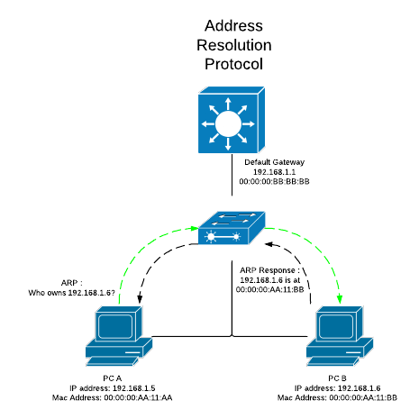

In the diagram above, PC A wants to send traffic to PC B at IP address 192.168.1.6.  It does not know the unique MAC address until it discovers it through an ARP, which is broadcasted throughout the layer 2 segment.


Running an ubuntu vm on mac creates a bridge `brige101` on mac with ip 192.168.66.1 and the adds the created `vmenet1` to the bridge

The VM,s `enp0s1 interface(one of two interfaces) has an ip address of 192.168.66.2

Since the frame is addressed to the bridge’s MAC address, the frame is handed off to the host machine’s network stack for processing.

Default Gateway: The bridge may act as the default gateway for containers to access external networks.

Routing Role: The bridge's IP address (e.g., 192.168.1.1) is used as a default gateway, while the MAC address ensures frames are routed correctly
