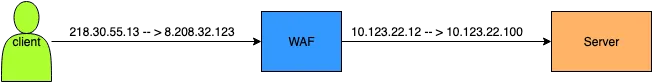

# AZURE

An Azure Subscription is where all resources are deployed and billed.

An AWS Account plays the same role — resources live in it, and it defines billing and access boundaries.

a virtual network can only exist within a region and spun resources within that region

 [vxlan](https://documentation.suse.com/smart/virtualization-cloud/html/vxlan/index.html)

 [azure-dns-private-resolver-without-vnet-peerings](https://blog.cloudtrooper.net/2022/11/13/azure-dns-private-resolver-without-vnet-peerings/)

 [overlapping-ip-addresses-in-a-hub-and-spoke-network-feat-avnm-ars](https://blog.cloudtrooper.net/2022/11/14/overlapping-ip-addresses-in-a-hub-and-spoke-network-feat-avnm-ars/)

 [virtual-network-gateways-routing-in-azure](https://blog.cloudtrooper.net/2023/02/06/virtual-network-gateways-routing-in-azure/)

 [azure-networking-is-not-like-your-on-onprem-network](https://blog.cloudtrooper.net/2023/01/21/azure-networking-is-not-like-your-on-onprem-network/)

 [filtering-aks-egress-traffic-with-virtual-wan](https://blog.cloudtrooper.net/2023/01/10/filtering-aks-egress-traffic-with-virtual-wan/)

 [vrfs-and-virtual-wan](https://blog.cloudtrooper.net/2022/12/19/vrfs-and-virtual-wan/)

 [designing-your-sdwan-and-firewall-into-azure-hub-and-spoke](https://blog.cloudtrooper.net/2023/11/24/designing-your-sdwan-and-firewall-into-azure-hub-and-spoke/)

 [get-certificates-with-azure-key-vault-extension-to-your-linux-vms](https://blog.cloudtrooper.net/2023/09/18/get-certificates-with-azure-key-vault-extension-to-your-linux-vms/)

 [cilium-network-policy-in-aks](https://blog.cloudtrooper.net/2023/06/16/cilium-network-policy-in-aks/)

 [expressroute-multi-region-triangles-or-squares](https://blog.cloudtrooper.net/2024/11/29/expressroute-multi-region-triangles-or-squares/)

 [azure-subnet-peering](https://blog.cloudtrooper.net/2024/10/01/azure-subnet-peering/)

 [multi-region-design-with-azure-route-server-without-an-overlay](https://blog.cloudtrooper.net/2021/08/19/multi-region-design-with-azure-route-server-without-an-overlay/)

 [application-gateway-for-containers-a-not-so-gentle-intro-2](https://blog.cloudtrooper.net/2025/03/10/application-gateway-for-containers-a-not-so-gentle-intro-2/)

 [a-day-in-the-life-of-a-packet-in-azure-kubernetes-service-with-the-azure-cni](https://blog.cloudtrooper.net/2019/01/21/a-day-in-the-life-of-a-packet-in-azure-kubernetes-service-with-the-azure-cni/)

 [connecting-your-nvas-to-expressroute-with-azure-route-server](https://blog.cloudtrooper.net/2021/03/08/connecting-your-nvas-to-expressroute-with-azure-route-server/)

 [route-server-multi-region-design](https://blog.cloudtrooper.net/2021/03/06/route-server-multi-region-design/)

 

 [aad-application-proxy-where-is-my-waf](https://blog.cloudtrooper.net/2022/04/22/aad-application-proxy-where-is-my-waf/)

 [where-does-aad-app-proxy-fit-with-other-azure-reverse-proxies](https://blog.cloudtrooper.net/2022/03/18/where-does-aad-app-proxy-fit-with-other-azure-reverse-proxies/)

 [tunnels-between-clouds](https://blog.cloudtrooper.net/2022/04/11/tunnels-between-clouds/)

 [what-language-does-the-azure-gateway-load-balancer-speak](https://blog.cloudtrooper.net/2021/11/11/what-language-does-the-azure-gateway-load-balancer-speak/)

 [multi-region-design-with-azure-route-server-without-an-overlay](https://blog.cloudtrooper.net/2021/08/19/multi-region-design-with-azure-route-server-without-an-overlay/)

 [using-route-server-to-firewall-onprem-traffic-with-an-nva](https://blog.cloudtrooper.net/2021/03/29/using-route-server-to-firewall-onprem-traffic-with-an-nva/)
 

 [azure-virtual-wan-hub-routing-preference](https://blog.cloudtrooper.net/2022/07/14/azure-virtual-wan-hub-routing-preference/)

 [azure-firewalls-sidekick-to-join-the-bgp-superheroes](https://blog.cloudtrooper.net/2022/05/02/azure-firewalls-sidekick-to-join-the-bgp-superheroes/)

 [vxlan](https://e.huawei.com/eu/videolist/networking/dcswitch/9c26f9929118451f91900a2bc9bb6af6)

 Azure Web Application Firewall

 a WAF is a type of reverse-proxy, protecting the server from exposure by having clients pass through the WAF before reaching the server.

A Reverse Proxy is a gateway technology that establishes a proxy relationship between the server and the client, allowing the client to communicate indirectly with the real server. In this setup, the WAF forwards the client’s requests to the server and returns the server’s responses to the client. The WAF has its own IP address, and the client actually establishes a TCP connection with the WAF rather than the real server. Here’s a typical deployment architecture:

The main feature of this model is that the real server is hidden behind the WAF, and the client’s access to the server is highly dependent on the WAF. This architecture makes it easy for the WAF to protect both HTTP and HTTPS traffic.

