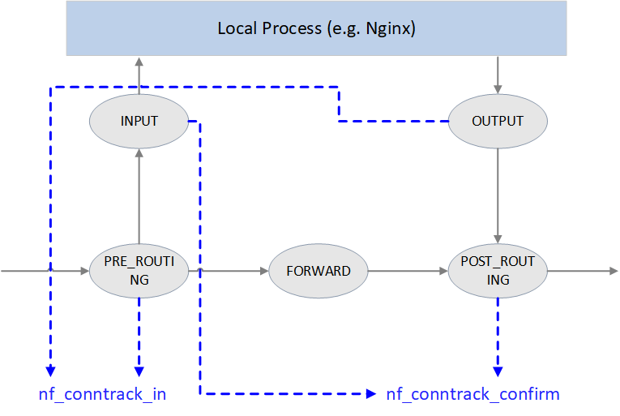

```sh
#Incoming Packet to host
1. NF_INET_PRE_ROUTING -> NF_INET_LOCAL_IN
# Incoming Packets for Another Host:
2. NF_INET_PRE_ROUTING -> NF_INET_FORWARD -> NF_INET_POST_ROUTING
# outgoing packets
3. NF_INET_LOCAL_OUT   -> NF_INET_POST_ROUTING
```

[netfilter-and-iptables](https://medium.com/@dipakkrdas/netfilter-and-iptables-f8a946bb83af)

```c
//enum indicates all netfilter prorities in kernel
enum nf_ip_hook_priorities {
 NF_IP_PRI_FIRST = INT_MIN,
 NF_IP_PRI_CONNTRACK_DEFRAG = -400,
 NF_IP_PRI_RAW = -300,
 NF_IP_PRI_SELINUX_FIRST = -225,
 NF_IP_PRI_CONNTRACK = -200,
 NF_IP_PRI_MANGLE = -150,
 NF_IP_PRI_NAT_DST = -100,
 NF_IP_PRI_FILTER = 0,
 NF_IP_PRI_SECURITY = 50,
 NF_IP_PRI_NAT_SRC = 100,
 NF_IP_PRI_SELINUX_LAST = 225,
 NF_IP_PRI_CONNTRACK_HELPER = 300,
 NF_IP_PRI_CONNTRACK_CONFIRM = INT_MAX,
 NF_IP_PRI_LAST = INT_MAX,
};
```

[linux:connection_tracking_2_core_implementation](https://thermalcircle.de/doku.php?id=blog:linux:connection_tracking_2_core_implementation)


```c

/* A `tuple' is a structure containing the information to uniquely
  identify a connection.  ie. if two packets have the same tuple, they
  are in the same connection; if not, they are not.

  We divide the structure along "manipulatable" and
  "non-manipulatable" lines, for the benefit of the NAT code.
*/

/* The manipulable part of the tuple. */
struct nf_conntrack_man {
	union nf_inet_addr u3;
	union nf_conntrack_man_proto u;
	/* Layer 3 protocol */
	u_int16_t l3num;
};
/* This contains the information to distinguish a connection. */
struct nf_conntrack_tuple {
	struct nf_conntrack_man src;

	/* These are the parts of the tuple which are fixed. */
	struct {
		union nf_inet_addr u3;
		union {
			/* Add other protocols here. */
			__be16 all;

			struct {
				__be16 port;
			} tcp;
			struct {
				__be16 port;
			} udp;
			struct {
				u_int8_t type, code;
			} icmp;
			struct {
				__be16 port;
			} dccp;
			struct {
				__be16 port;
			} sctp;
			struct {
				__be16 key;
			} gre;
		} u;

		/* The protocol. */
		u_int8_t protonum;

		/* The direction (for tuplehash) */
		u_int8_t dir;
	} dst;
};


/* Connections have two entries in the hash table: one for each way */
struct nf_conntrack_tuple_hash {
	struct hlist_nulls_node hnnode;
	struct nf_conntrack_tuple tuple;
};
```


The conntrack module calls the NAT module to evaluate NAT rules for every new connection (i.e. first packet on a connection) it creates. NAT module evaluates the rule based upon the connection tuple and direction of the connection. To apply NAT to the future packets on the matching connection, the NAT module saves the state of the match in the conntrack’s connection entry

There are two primary reasons why only the first packet is evaluated.

First, evaluating all iptables rules could be highly resource intensive (especially, if you are doing it on a per-packet basis). By creating a hash table of connections, conntrack makes this process more performant. Second, keeping track of existing connections allows NAT to have stateful functionality. 

[understanding-iptables-nat-conntrack-](https://aembit.io/blog/understanding-iptables-nat-conntrack-and-similar-tools-with-resources-to-help/)


```sh
A Packet Traversing the Netfilter System:

   --->[1]--->[ROUTE]--->[3]--->[4]--->
                 |            ^
                 |            |
                 |         [ROUTE]
                 v            |
                [2]          [5]
                 |            ^
                 |            |
                 v            |

```

On the left is where packets come in: having passed the simple sanity checks (i.e., not truncated, IP checksum OK, not a promiscuous receive), they are passed to the netfilter framework's NF_IP_PRE_ROUTING [1] hook.

Next they enter the routing code, which decides whether the packet is destined for another interface, or a local process. The routing code may drop packets that are unroutable.

If it's destined for the box itself, the netfilter framework is called again for the NF_IP_LOCAL_IN [2] hook, before being passed to the process (if any).

If it's destined to pass to another interface instead, the netfilter framework is called for the NF_IP_FORWARD [3] hook.

The packet then passes a final netfilter hook, the NF_IP_POST_ROUTING [4] hook, before being put on the wire again.

The NF_IP_LOCAL_OUT [5] hook is called for packets that are created locally. Here you can see that routing occurs after this hook is called: in fact, the routing code is called first (to figure out the source IP address and some IP options): if you want to alter the routing, you must alter the `skb->dst' field yourself, as is done in the NAT code.


[netfilter-hacking-HOWTO-3](https://www.netfilter.org/documentation/HOWTO/netfilter-hacking-HOWTO-3.html#ss3.2)

```sh
#The hooks that are registered with netfilter are as follows (with the functions in each hook in the order that they are actually called):

   --->PRE------>[ROUTE]--->FWD---------->POST------>
       Conntrack    |       Mangle   ^    Mangle
       Mangle       |       Filter   |    NAT (Src)
       NAT (Dst)    |                |    Conntrack
       (QDisc)      |             [ROUTE]
                    v                |
                    IN Filter       OUT Conntrack
                    |  Conntrack     ^  Mangle
                    |  Mangle        |  NAT (Dst)
                    v                |  Filter

```
## Packet Filtering
This table, `filter', should never alter packets: only filter them.

One of the advantages of iptables filter over ipchains is that it is small and fast, and it hooks into netfilter at the `NF_IP_LOCAL_IN`, `NF_IP_FORWARD` and `NF_IP_LOCAL_OUT` points. This means that for any given packet, there is one (and only one) possible place to filter it. Also, the fact that the netfilter framework provides both the input and output interfaces for the NF_IP_FORWARD hook means that many kinds of filtering are far simpler.

## NAT

This is the realm of the `nat`' table, which is fed packets from two netfilter hooks: for non-local packets, the `NF_IP_PRE_ROUTING` and `NF_IP_POST_ROUTING` hooks are perfect for destination and source alterations respectively. If `CONFIG_IP_NF_NAT_LOCAL` is defined, the hooks `NF_IP_LOCAL_OUT` and `NF_IP_LOCAL_IN` are used for altering the destination of local packets.

This table is slightly different from the `filter`' table, in that only the first packet of a new connection will traverse the table: the result of this traversal is then applied to all future packets in the same connection.

## Masquerading, Port Forwarding, Transparent Proxying

I divide NAT into Source NAT (where the first packet has its source altered), and Destination NAT (the first packet has its destination altered).

Masquerading is a special form of Source NAT: port forwarding and transparent proxying are special forms of Destination NAT. These are now all done using the NAT framework, rather than being independent entities.


## Connection Tracking
Connection tracking is fundamental to NAT, but it is implemented as a separate module; this allows an extension to the packet filtering code to simply and cleanly use connection tracking (the `state`' module).

##  What is netfilter?
netfilter is a framework for packet mangling, outside the normal Berkeley socket interface. It has four parts. Firstly, each protocol defines "hooks" (IPv4 defines 5) which are well-defined points in a packet's traversal of that protocol stack. At each of these points, the protocol will call the netfilter framework with the packet and the hook number.

Secondly, parts of the kernel can register to listen to the different hooks for each protocol. So when a packet is passed to the netfilter framework, it checks to see if anyone has registered for that protocol and hook; if so, they each get a chance to examine (and possibly alter) the packet in order, then discard the packet (`NF_DROP`), allow it to pass (`NF_ACCEPT`), tell netfilter to forget about the packet (`NF_STOLEN`), or ask netfilter to queue the packet for userspace (`NF_QUEUE`).

The third part is that packets that have been queued are collected (by the ip_queue driver) for sending to userspace; these packets are handled asynchronously.

NAT is separated into connection tracking (which doesn't manipulate packets at all), and the NAT code itself. Connection tracking is also designed to be used by an iptables modules, so it makes subtle distinctions in states which NAT doesn't care about.


### Connection Tracking
Connection tracking hooks into high-priority `NF_IP_LOCAL_OUT` and `NF_IP_PRE_ROUTING` hooks, in order to see packets before they enter the system.

The nfct field in the skb is a pointer to inside the struct `ip_conntrack`, at one of the `infos[]` array. Hence we can tell the state of the skb by which element in this array it is pointing to: this pointer encodes both the state structure and the relationship of this skb to that state.

The best way to extract the `nfct`' field is to call `ip_conntrack_get()`', which returns NULL if it's not set, or the connection pointer, and fills in ctinfo which describes the relationship of the packet to that connection. This enumerated type has several values:

`IP_CT_ESTABLISHED`
The packet is part of an established connection, in the original direction.

`IP_CT_RELATED`
The packet is related to the connection, and is passing in the original direction.

`IP_CT_NEW`
The packet is trying to create a new connection (obviously, it is in the original direction).

`IP_CT_ESTABLISHED + IP_CT_IS_REPLY`
The packet is part of an established connection, in the reply direction.

`IP_CT_RELATED + IP_CT_IS_REPLY`
The packet is related to the connection, and is passing in the reply direction.

Hence a reply packet can be identified by testing for >= IP_CT_IS_REPLY.

A common use case in firewall rules is to allow packets that are part of established connections to pass through the firewall, as these connections have already been approved.


##  Extending Connection Tracking/NAT
These frameworks are designed to accommodate any number of protocols and different mapping types. Some of these mapping types might be quite specific, such as a load-balancing/fail-over mapping type.

Internally, connection tracking converts a packet to a "tuple", representing the interesting parts of the packet, before searching for bindings or rules which match it. This tuple has a `manipulatable part`, and a `non-manipulatable part`; called "src" and "dst", as this is the view for the first packet in the Source NAT world (it'd be a reply packet in the Destination NAT world). The tuple for every packet in the same packet stream in that direction is the same.

For example, a TCP packet's tuple contains the `manipulatable part: source IP and source port, the non-manipulatable part: destination IP and the destination port`. The manipulatable and non-manipulatable parts do not need to be the same type though; for example, an ICMP packet's tuple contains the manipulatable part: source IP and the ICMP id, and the non-manipulatable part: the destination IP and the ICMP type and code.

`Every tuple has an inverse`, which is the tuple of the reply packets in the stream. For example, the inverse of an ICMP ping packet, icmp id 12345, from 192.168.1.1 to 1.2.3.4, is a ping-reply packet, icmp id 12345, from 1.2.3.4 to 192.168.1.1.

These tuples, represented by the `struct ip_conntrack_tuple`', are used widely. In fact, together with the hook the packet came in on (which has an effect on the type of manipulation expected), and the device involved, this is the complete information on the packet.

Most tuples are contained within a `struct ip_conntrack_tuple_hash`, which adds a doubly linked list entry, and a pointer to the connection that the tuple belongs to.

A connection is represented by the `struct ip_conntrack': it has two `struct ip_conntrack_tuple_hash' fields: one referring to the direction of the original packet (tuplehash[IP_CT_DIR_ORIGINAL]), and one referring to packets in the reply direction (tuplehash[IP_CT_DIR_REPLY]).

Anyway, the first thing the NAT code does is to see if the connection tracking code managed to extract a tuple and find an existing connection, by looking at the skbuff's nfct field; this tells us if it's an attempt on a new connection, or if not, which direction it is in; in the latter case, then the manipulations determined previously for that connection are done.

If it was the start of a new connection, we look for a rule for that tuple, using the standard iptables traversal mechanism, on the `nat' table. If a rule matches, it is used to initialize the manipulations for both that direction and the reply; the connection-tracking code is told that the reply it should expect has changed. Then, it's manipulated as above.

If there is no rule, a `null` binding is created: this usually does not map the packet, but exists to ensure we don't map another stream over an existing one. Sometimes, the null binding cannot be created, because we have already mapped an existing stream over it, in which case the per-protocol manipulation may try to remap it, even though it's nominally a `null' binding.

```sh
iptables -A INPUT -m conntrack --ctstate ESTABLISHED,RELATED -j ACCEPT
iptables -A OUTPUT -m conntrack --ctstate ESTABLISHED,RELATED -j ACCEPT
```
`-m conntrack`: This option uses the connection tracking module.

`--ctstate ESTABLISHED,RELATED`: This matches packets that are part of an established connection or are related to an existing connection.

`-j ACCEPT`: This action tells the firewall to accept the packet.


##  Standard NAT Targets
NAT targets are like any other iptables target extensions, except they insist on being used only in the `nat' table. Both the SNAT and DNAT targets take a `struct ip_nat_multi_range' as their extra data; this is used to specify the range of addresses a mapping is allowed to bind into. A range element, `struct ip_nat_range' consists of an inclusive minimum and maximum IP address, and an inclusive maximum and minimum protocol-specific value (eg. TCP ports). There is also room for flags, which say whether the IP address can be mapped (sometimes we only want to map the protocol-specific part of a tuple, not the IP), and another to say that the protocol-specific part of the range is valid.

A multi-range is an array of these `struct ip_nat_range' elements; this means that a range could be "1.1.1.1-1.1.1.2 ports 50-55 AND 1.1.1.3 port 80". Each range element adds to the range (a union, for those who like set theory).

the manipulatable and non-manipulatable parts of the tuple should be. Everything in the tuple has the property that it identifies the stream uniquely. The manipulatable part of the tuple is the part you can do NAT with: for TCP this is the source port, for ICMP it's the icmp ID; something to use as a "stream identifier". The non-manipulatable part is the rest of the packet that uniquely identifies the stream, but we can't play with (eg. TCP destination port, ICMP type).

[netfilter-hacking-HOWTO-4](https://www.netfilter.org/documentation/HOWTO/netfilter-hacking-HOWTO-4.html#ss4.1)


Connection Tracking (conntrack) is a core function of the Linux kernel network stack, provided by the `nf_conntrack` module. Once the `nf_conntrack` module is loaded, the connection tracking function starts working. It determines whether each passing packet belongs to an existing connection. If it does not belong to any existing connection, the `nf_conntrack` module will create a new conntrack entry. If the connection already exists, it updates the status, expiration time, and other information of the corresponding conntrack entry.


```sh
# List conntrack
conntrack -L

# a typical conntrack entry, which records the source IP, destination IP, and other information of a TCP connection in the ESTABLISHED state with bidirectional data transmission.

tcp 6 295 ESTABLISHED src=192.168.0.175 dst=100.125.61.10 sport=51484 dport=10180 \ src=100.125.61.10 dst=192.168.0.175 sport=10180 dport=51484 mark=0 zone=0 use=2

```

## Common Applications of Connection Tracking
Connection tracking is the basis for many network applications, the most common use case is NAT (Network Address Translation).

For machines in an internal network to access external services, we usually need to create an SNAT rule, replacing the source IP of the outgoing packet from the original internal IP to the public IP of the NAT gateway.

When the external service returns a response packet, the destination IP in the response packet will be the IP of the NAT gateway. To correctly return the response packet to the machine in the internal network, the NAT gateway needs to modify the destination IP in the packet to the corresponding internal IP.

```sh
But we don't need to explicitly create a DNAT rule corresponding to the SNAT rule, because the nf_conntrack module will record the NAT’s connection status, and the reverse transformation of the NAT address will be automatically completed according to the corresponding conntrack entry
```

Another common application of connection tracking is stateful firewalls. Before this, stateless firewalls only independently review incoming and outgoing packets without considering whether the packets are part of a session or connection. Therefore, they can only set simple rules, such as dropping or allowing SYN packets on port 80
In contrast, stateful firewalls can review packets based on the status information of connection tracking. They consider not only the content of the packets but also the context of the packets in the entire connection.

`sudo iptables -t nat -A POSTROUTING -s 172.17.0.0/16 -o <public_interface> -j SNAT --to-source <public_ip>`

sudo iptables -t nat -A POSTROUTING -s 172.18.0.0/16 -o eth0 -j SNAT --to-source 172.17.0.1


[emqx-performance-tuning-linux-conntrack-and-mqtt-connections](https://www.emqx.com/en/blog/emqx-performance-tuning-linux-conntrack-and-mqtt-connections)


A connection is the packet-based mechanism that two software elements use to communicate information
This differs from a flow by one important property: packets belonging to a connection have state

Why is a connection important?
Connections represent distinct bidirectional communications channel. They are your synchronized TCP sessions for example


`conntrack -E   ` listen for events

Each entry is hashed two(original+ reply), to deal with `nat`


```sh
81b443eaa1bc:/# ip netns exec netns0 traceroute 8.8.8.8
traceroute to 8.8.8.8 (8.8.8.8), 30 hops max, 46 byte packets
 1  172.18.0.1 (172.18.0.1)  0.018 ms  0.017 ms  0.010 ms
 2  172.17.0.1 (172.17.0.1)  0.006 ms  0.015 ms  0.009 ms
 3  192.168.65.1 (192.168.65.1)  1.690 ms  0.963 ms  0.873 ms
 4  myhomerouter(192.168.8.1)  4.611 ms  4.028 ms  3.529 ms


81b443eaa1bc:/# ip netns exec netns0 route -n
Kernel IP routing table
Destination     Gateway         Genmask         Flags Metric Ref    Use Iface
0.0.0.0         172.18.0.1      0.0.0.0         UG    0      0        0 ceth0
172.18.0.0      0.0.0.0         255.255.0.0     U     0      0        0 ceth0
81b443eaa1bc:/# ip netns exec netns0 route -n
Kernel IP routing table
Destination     Gateway         Genmask         Flags Metric Ref    Use Iface
0.0.0.0         172.18.0.1      0.0.0.0         UG    0      0        0 ceth0
172.18.0.0      0.0.0.0         255.255.0.0     U     0      0        0 ceth0

## driects traffic destined for 172.18.0.0/16 to be forwarded via gateway 172.18.0.1(bridge ip) `ip route add 172.18.0.0/16 via 172.18.0.1`
81b443eaa1bc:/# route -n
Kernel IP routing table
Destination     Gateway         Genmask         Flags Metric Ref    Use Iface
0.0.0.0         172.17.0.1      0.0.0.0         UG    0      0        0 eth0
172.17.0.0      0.0.0.0         255.255.0.0     U     0      0        0 eth0
172.18.0.0      172.18.0.1      255.255.0.0     UG    0      0        0 br0


81b443eaa1bc:/# iptables -t nat -L -n -v
Chain PREROUTING (policy ACCEPT 0 packets, 0 bytes)
 pkts bytes target     prot opt in     out     source               destination         

Chain INPUT (policy ACCEPT 0 packets, 0 bytes)
 pkts bytes target     prot opt in     out     source               destination         

Chain OUTPUT (policy ACCEPT 0 packets, 0 bytes)
 pkts bytes target     prot opt in     out     source               destination         

Chain POSTROUTING (policy ACCEPT 56 packets, 4248 bytes)
 pkts bytes target     prot opt in     out     source               destination         
   52  2839 MASQUERADE  0    --  *      eth0    172.18.0.0/16        0.0.0.0/0     

```

it does to the default gateway of the namespace(172.18.0.1,ip adddress of bridge). Then to default gateway of the container, 72.17.0.1 and to 192.168.65.1 and then to the home router(192.168.8.1)


### Allowing Established and Related Incoming Connections
As network traffic generally needs to be two-way – incoming and outgoing – to work properly, it is typical to create a firewall rule that allows established and related incoming traffic, so that the server will allow return traffic for outgoing connections initiated by the server itself. This command will allow that:

`sudo iptables -A INPUT -m conntrack --ctstate ESTABLISHED,RELATED -j ACCEPT`

### Allowing All Incoming SSH
To allow all incoming SSH connections run these commands:

```sh
sudo iptables -A INPUT -p tcp --dport 22 -m conntrack --ctstate NEW,ESTABLISHED -j ACCEPT
sudo iptables -A OUTPUT -p tcp --sport 22 -m conntrack --ctstate ESTABLISHED -j ACCEPT

```

### Allowing Outgoing SSH
If your firewall OUTPUT policy is not set to ACCEPT, and you want to allow outgoing SSH connections—your server initiating an SSH connection to another server—you can run these commands:

```sh
sudo iptables -A OUTPUT -p tcp --dport 22 -m conntrack --ctstate NEW,ESTABLISHED -j ACCEPT
sudo iptables -A INPUT -p tcp --sport 22 -m conntrack --ctstate ESTABLISHED -j ACCEPT

```

```sh
  ebtables -t nat -A PREROUTING -p IPv4 -i wlan0 --ip-dst $IP -j dnat --to-dst $MAC --dnat-target ACCEPT
 ebtables -t nat -A PREROUTING -p ARP -i wlan0 --arp-ip-dst $IP -j dnat --to-dst $MAC --dnat-target ACCEPT
```

Connection tracking is the basis of many network services and applications. For example, Kubernetes Service, ServiceMesh sidecar, software layer 4 load balancer (L4LB) LVS/IPVS, Docker network, OpenvSwitch (OVS) etc, all rely on it.

connection tracking tracks (and maintains) connections and their states.

Netfilter inserts five hooks (Fig. 1) into the Linux networking stack to perform packet handling at different stages; these are the following:
- PREROUTING: All the packets, with no
exceptions, hit this hook, which is reached
before the routing decision and after all the IP header sanity checks are fulfilled. Port Address Translation (NAPT) and Redirec-
tions, that is, Destination Network Translation (DNAT), are implemented in this hook

- LOCAL INPUT: All the packets going to the local machine reach this
hook. This is the last hook in the incoming path for the local machine
traffic.
- FORWARD: Packets not going to the local machine (e.g., packets
going through the firewall) reach this hook.
- LOCAL OUTPUT: This is the first hook in the outgoing packet path.
Packets leaving the local machine always hit this hook.
- POSTROUTING: This hook is implemented after the routing decision.
Source Network Address Translation (SNAT) is registered to this hook.
All the packets that leave the local machine reach this hook.


Therefore we can model three kind of traffic flows, depending on the
destination:
1. Traffic going through the firewall, in other words, traffic not going to
the local machine. Such traffic follows the path: PREROUTING FORWARD POSTROUTING.
2. Incoming traffic to the firewall, for example, traffic for the local
machine. Such traffic follows the path: PREROUTING INPUT.
3. Outgoing traffic from the firewall: OUTPUT POSTROUTING.

The connection tracking system does not filter the packets themselves;
 So keep in mind that the connection tracking system just tracks packets; it does
not filter

It is implemented with a hash table to perform efficient lookups. Each bucket has a doublelinked list of hash tuples. There are two hash tuples for every connection:
one for the original direction (i.e., packets coming from the point that
started the connection) and one for the reply direction (i.e., reply packets
going to the point that started the connection). 

A tuple represents the relevant information of a connection, IP source and IP
destination, as well as layer-4 protocol information. Such tuples are embedded in a hash tuple. Both structures are defined in `nf_conntrack_tuple.h`.

The two hash tuples are embedded in the structure `nf_conn`, from this
point onward referred to as `conntrack`, which is the structure that stores the
state of a given connection. Therefore, a conntrack is the container of two
hash tuples, and every hash tuple is the container of a tuple. This results in
three layers of embedded structures. 

Key data structures:

`struct nf_conntrack_tuple {}`: defines a tuple.
`struct nf_conntrack_man {}`: the manipulatable part of a tuple
`struct nf_conntrack_man_proto {}`: the protocol specific part in tuple’s manipulatable part
`struct nf_conntrack_l4proto {}`: a collection of methods a trackable protocol needs to implement (and other fields).
`struct nf_conntrack_tuple_hash {}`: defines a conntrack entry (value) stored in hash table (conntrack table), hash key is a uint32 integer computed from tuple info.
`struct nf_conn {}`: defines a flow.

Tuple elements are ordered

`struct nf_conntrack_tuple {}: Tuple`
A tuple uniquely defines a unidirectional flow
A tuple is a structure containing the information to uniquely identify a connection. ie. if two packets have the same tuple, they are in the same connection; if not, they are not.

## Data structure definitions
To facilite NAT module’s implementation, kernel splits the tuple structure into “manipulatable” and “non-manipulatable” parts

```c
/* manipulatable part of the tuple */       
struct nf_conntrack_man {                  
    union nf_inet_addr           u3; 
    union nf_conntrack_man_proto u;  
                                             
    u_int16_t l3num; // L3 proto             
};

union nf_inet_addr {
__u32            all[4];
__be32           ip;
__be32           ip6[4];
struct in_addr   in;
struct in6_addr  in6;

}

 // include/uapi/linux/netfilter/nf_conntrack_tuple_common.h
union nf_conntrack_man_proto {
__be16 all;/* Add other protocols here. */

struct { __be16 port; } tcp;
struct { __be16 port; } udp;
struct { __be16 id;   } icmp;
struct { __be16 port; } dccp;
struct { __be16 port; } sctp;
struct { __be16 key;  } gre;
};

struct nf_conntrack_tuple { /* This contains the information to distinguish a connection. */
    struct nf_conntrack_man src;  // source address info, manipulatable part
    struct {
        union nf_inet_addr u3;
        union {
            __be16 all;     // Add other protocols here

            struct { __be16 port;         } tcp;
            struct { __be16 port;         } udp;
            struct { u_int8_t type, code; } icmp;
            struct { __be16 port;         } dccp;
            struct { __be16 port;         } sctp;
            struct { __be16 key;          } gre;
        } u;
        u_int8_t protonum;  // The protocol
        u_int8_t dir;       // The direction (for tuplehash)
    } dst;                       // destination address info
};

//be stands for big-endian
```

`There are only 2 fields (src and dst) inside struct nf_conntrack_tuple {}, each stores source and destination address information`.

But `src` and `dst` are themselves also structs, storing protocol specific data. Take IPv4 UDP as example, information of the 5-tuple stores in the following fields:

`dst.protonum`: protocol type (IPPROTO_UDP)
`src.u3.ip`: source IP address
`dst.u3.ip`: destination IP address
`src.u.udp.port`: source UDP port number
`dst.u.udp.port`: destination UDP port number


## Connection-trackable protocols
From the above code, we could see that only 6 protocols support connection tracking currently: `TCP`, `UDP`, `ICMP`, `DCCP`, `SCTP`, `GRE`.

### struct nf_conntrack_l4proto {}: methods trackable protocols need to implement

Protocols that support connection tracking need to implement the methods defined in `struct nf_conntrack_l4proto {}`, for example `pkt_to_tuple()`, which extracts tuple information from given packet’s L3/L4 header.

```c
// include/net/netfilter/nf_conntrack_l4proto.h

struct nf_conntrack_l4proto {
    u_int16_t l3proto; /* L3 Protocol number. */
    u_int8_t  l4proto; /* L4 Protocol number. */

    // extract tuple info from given packet (skb)
    bool (*pkt_to_tuple)(struct sk_buff *skb, ... struct nf_conntrack_tuple *tuple);

    // returns verdict for packet
    int (*packet)(struct nf_conn *ct, const struct sk_buff *skb ...);

    // create a new conntrack, return TRUE if succeeds.
    // if returns TRUE, packet() method will be called against this skb later
    bool (*new)(struct nf_conn *ct, const struct sk_buff *skb, unsigned int dataoff);

    // determin if this packet could be conntrack-ed.
    // if could, packet() method will be called against this skb later
    int (*error)(struct net *net, struct nf_conn *tmpl, struct sk_buff *skb, ...);

    ...
};

```


### struct nf_conntrack_tuple_hash {}: conntrack entry

conntrack modules stores active connections in a hash table:

- key: 32bit value calculated from tuple info
- value: conntrack entry (`struct nf_conntrack_tuple_hash {}`)
Method `hash_conntrack_raw()` calculates a 32bit hash key from tuple info:

```c

// net/netfilter/nf_conntrack_core.c

static u32 hash_conntrack_raw(struct nf_conntrack_tuple *tuple, struct net *net)
{
    get_random_once(&nf_conntrack_hash_rnd, sizeof(nf_conntrack_hash_rnd));

    /* The direction must be ignored, so we hash everything up to the
     * destination ports (which is a multiple of 4) and treat the last three bytes manually.  */
    u32 seed = nf_conntrack_hash_rnd ^ net_hash_mix(net);
    unsigned int n = (sizeof(tuple->src) + sizeof(tuple->dst.u3)) / sizeof(u32);

    return jhash2((u32 *)tuple, n, seed ^ ((tuple->dst.u.all << 16) | tuple->dst.protonum));
}

```

Conntrack entry is defined as struct `nf_conntrack_tuple_hash {}`:

```c
// include/net/netfilter/nf_conntrack_tuple.h

// Connections have two entries in the hash table: one for each way
struct nf_conntrack_tuple_hash {
    struct hlist_nulls_node   hnnode;   // point to the related connection `struct nf_conn`,
                                        // list for fixing hash collisions
    struct nf_conntrack_tuple tuple;
};

```

### struct nf_conn {}: connection

Each flow in Netfilter is called a connection, even for those connectionless protocols (e.g. UDP). A connection is defined as `struct nf_conn {}`, with important fields as follows:

```c
        // include/linux/skbuff.h
                                         struct nf_conntrack {
                                                     atomic_t use;  // refcount?
                                                };


												struct nf_conn {                        
    struct nf_conntrack            ct_general;

    struct nf_conntrack_tuple_hash tuplehash[IP_CT_DIR_MAX]; // conntrack entry, array for ingress/egress flows

    unsigned long status; // connection status, see below for detailed status list
    u32 timeout;          // timer for connection status

    possible_net_t ct_net;

    struct hlist_node    nat_bysource;

    struct nf_conn *master;   
	u_int32_t mark;    
	u_int32_t secmark;                           
    union nf_conntrack_proto proto; 
	
};                                           

// per conntrack: protocol private data
union nf_conntrack_proto {
	/* insert conntrack proto private data here */
struct nf_ct_dccp dccp;
struct ip_ct_sctp sctp;
	struct ip_ct_tcp tcp;
struct nf_ct_gre gre;
	unsigned int tmpl_padto;
};


```
The collection of all possible connection states in conntrack module, `enum ip_conntrack_status`:

```c
// include/uapi/linux/netfilter/nf_conntrack_common.h

enum ip_conntrack_status {
    IPS_EXPECTED      = (1 << IPS_EXPECTED_BIT),
    IPS_SEEN_REPLY    = (1 << IPS_SEEN_REPLY_BIT),
    IPS_ASSURED       = (1 << IPS_ASSURED_BIT),
    IPS_CONFIRMED     = (1 << IPS_CONFIRMED_BIT),
    IPS_SRC_NAT       = (1 << IPS_SRC_NAT_BIT),
    IPS_DST_NAT       = (1 << IPS_DST_NAT_BIT),
    IPS_NAT_MASK      = (IPS_DST_NAT | IPS_SRC_NAT),
    IPS_SEQ_ADJUST    = (1 << IPS_SEQ_ADJUST_BIT),
    IPS_SRC_NAT_DONE  = (1 << IPS_SRC_NAT_DONE_BIT),
    IPS_DST_NAT_DONE  = (1 << IPS_DST_NAT_DONE_BIT),
    IPS_NAT_DONE_MASK = (IPS_DST_NAT_DONE | IPS_SRC_NAT_DONE),
    IPS_DYING         = (1 << IPS_DYING_BIT),
    IPS_FIXED_TIMEOUT = (1 << IPS_FIXED_TIMEOUT_BIT),
    IPS_TEMPLATE      = (1 << IPS_TEMPLATE_BIT),
    IPS_UNTRACKED     = (1 << IPS_UNTRACKED_BIT),
    IPS_HELPER        = (1 << IPS_HELPER_BIT),
    IPS_OFFLOAD       = (1 << IPS_OFFLOAD_BIT),

    IPS_UNCHANGEABLE_MASK = (IPS_NAT_DONE_MASK | IPS_NAT_MASK |
                 IPS_EXPECTED | IPS_CONFIRMED | IPS_DYING |
                 IPS_SEQ_ADJUST | IPS_TEMPLATE | IPS_OFFLOAD),
};


```


### nf_conntrack_in(): enter conntrack


Conntrack points in Netfilter framework

Protocols that support NAT needs to implement the methods defined in:

- struct nf_nat_l3proto {}
- struct nf_nat_l4proto {}

`nf_nat_inet_fn(): core of NAT module, will be called at all hooking points except NF_INET_FORWARD.`


```sh
conntrack -L -o id,extended
...
ipv4     2 tcp      6 421957 ESTABLISHED src=192.168.0.2 dst=192.168.0.8 sport=34621 dport=22 src=192.168.0.8 dst=192.168.0.2 sport=22 dport=34621 [ASSURED] mark=6 use=1 id=2014938051

```

[](https://gist.github.com/nerdalert/a1687ae4da1cc44a437d)

[](https://wiki.nftables.org/wiki-nftables/index.php/Netfilter_hooks)