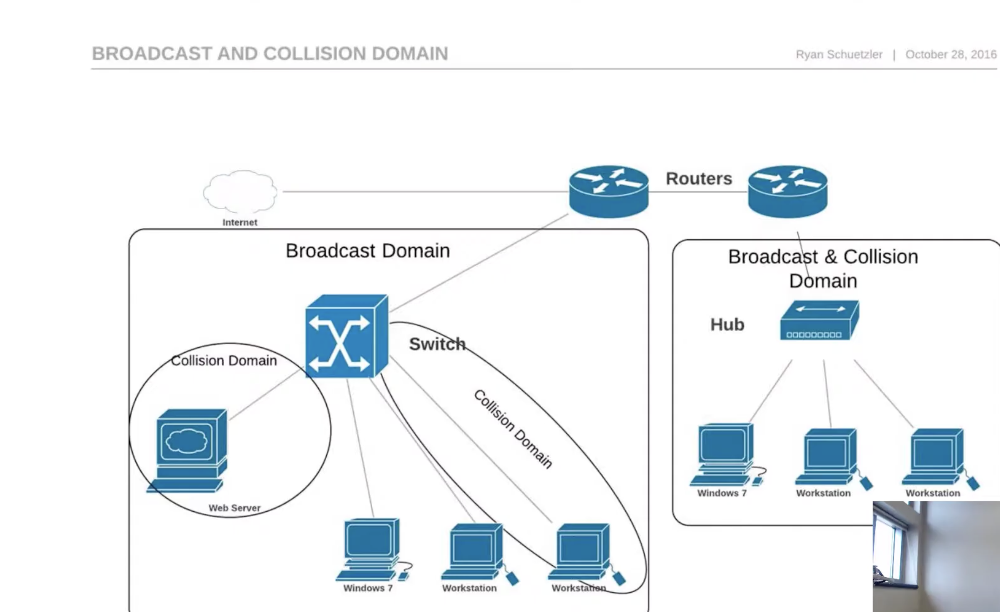

[Encoding and Framing](https://intronetworks.cs.luc.edu/1/html/links.html)

[manchester-encoded-signals-serial-protocol-decoding](https://www.picotech.com/library/oscilloscopes/manchester-encoded-signals-serial-protocol-decoding)

[802-11-frame-types-and-formats](https://howiwifi.com/2020/07/13/802-11-frame-types-and-formats/)

[WLAN_PHY_Frames](https://www.sharetechnote.com/html/WLAN_PHY_Frames.html)

[wi-fi-overview-80211-physical-layer-and-transmitter-measurements](https://www.tek.com/en/documents/primer/wi-fi-overview-80211-physical-layer-and-transmitter-measurements)

[mac-addresses-in-wireless-](https://medium.com/@hnasr/mac-addresses-in-wireless-5ed9b83714d0)

[xiaomin_thesis](https://www.hamilton.ie/publications/xiaomin_thesis.pdf)

[WirelessAndMobileNetwork](https://cs.nyu.edu/~jcf/classes/CSCI-GA.2262-001_fa13/slides/session5/WirelessAndMobileNetworks.pdf)

[DataLinkControl](https://cs.nyu.edu/~jcf/classes/CSCI-GA.2262-001_fa13/slides/session4/DataLinkControl.pdf)

[Wi-Fi: Overview of the 802.11 Physical Layer](https://download.tek.com/document/37W-29447-2_LR.pdf)

[wireless-fundamentals-](https://medium.com/@dipakkrdas/wireless-fundamentals-8696671e6f24)

[wireless-guest-network-client-isolation-under-the-hood](https://medium.com/@dipakkrdas/wireless-guest-network-client-isolation-under-the-hood-d0698333cbcc)

[eth-to-spi](https://qdiv.dev/posts/eth-to-spi/)

[routers-forwarding-mac-address](https://www.baeldung.com/cs/routers-forwarding-mac-address)




Broadcast get sent out to everybody in a local network
Routers separate broadcast domains

Each port on a switch creates a collision domain, but all ports as seen above are all in the same broadcast domain

[Switching](https://www.youtube.com/watch?v=Fb_0ICvUUfo)


A nameserver is a physical server that stores the individual dns records for one or more domain names

Every nameserver has its own domain name that is usually a subdomain starting with `ns`( eg ns1.example.com)

an NS record associates a domain name with its name server
`dig google.com NS` to get all the nameservers

NS Record vs Nameserver](https://www.youtube.com/watch?v=WyDQhlRDad8)

render built on gcp


[lets-code-tcp-ip-stack-1-ethernet-arp](https://www.saminiir.com/lets-code-tcp-ip-stack-1-ethernet-arp/?s=03)

a TUN/TAP device is often used by networking userspace applications to manipulate L3/L2 traffic, respectively. A popular example is tunneling, where a packet is wrapped inside the payload of another packet.

By default, every process starts with 3 open file descriptors:
```sh
FD	Meaning	Symbolic Name
0	Standard input	stdin
1	Standard output	stdout
2	Standard error	stderr
```

Key syscalls involving file descriptors
Function	Purpose
`open()`	Opens a file and returns a FD
`read()`	Reads data from a file descriptor
`write()`	Writes data to a file descriptor
`close()`	Closes the file descriptor

- File descriptors are per-process.

- They’re managed by the kernel’s file descriptor table.

- File descriptors are reused after close().

Because everything uses file descriptors:

You can use the same read()/write() calls for files, pipes, and sockets.

```c
/*
 * The number of bytes in an ethernet (MAC) address.
 */
#define ETHER_ADDR_LEN          6
//Each MAC address is 6 bytes (48 bits) long.

/*
 * The number of bytes in the type field.
 */
#define ETHER_TYPE_LEN          2
//The Ethertype (or length) field is 2 bytes.

/*
 * The number of bytes in the trailing CRC field.
 */
#define ETHER_CRC_LEN           4
//The CRC (Cyclic Redundancy Check) field at the end of the frame is 4 bytes. It ensures data integrity.

/*
 * The length of the combined header.
 */
#define ETHER_HDR_LEN           (ETHER_ADDR_LEN*2+ETHER_TYPE_LEN)

/*
 * The minimum packet length.
 */
#define ETHER_MIN_LEN           64

/*
 * The maximum packet length.
 */
#define ETHER_MAX_LEN           1518

/*
 * Mbuf adjust factor to force 32-bit alignment of IP header.
 * Drivers should do m_adj(m, ETHER_ALIGN) when setting up a
 * receive so the upper layers get the IP header properly aligned
 * past the 14-byte Ethernet header.
 */
#define ETHER_ALIGN             2       /* driver adjust for IP hdr alignment */

/*
 * A macro to validate a length with
 */
#define ETHER_IS_VALID_LEN(foo) \
	((foo) >= ETHER_MIN_LEN && (foo) <= ETHER_MAX_LEN)

/*
 * Structure of a 10Mb/s Ethernet header.
 */
typedef struct  ether_header {
	u_char  ether_dhost[ETHER_ADDR_LEN];
	u_char  ether_shost[ETHER_ADDR_LEN];
	u_short ether_type;
} ether_header_t;

/*
 * Structure of a 48-bit Ethernet address.
 */
typedef struct  ether_addr {
	u_char octet[ETHER_ADDR_LEN];
} ether_addr_t;

#define ether_addr_octet octet

#define ETHERTYPE_PUP           0x0200  /* PUP protocol */
#define ETHERTYPE_IP            0x0800  /* IP protocol */
#define ETHERTYPE_ARP           0x0806  /* Addr. resolution protocol */
#define ETHERTYPE_REVARP        0x8035  /* reverse Addr. resolution protocol */
#define ETHERTYPE_VLAN          0x8100  /* IEEE 802.1Q VLAN tagging */
#define ETHERTYPE_IPV6          0x86dd  /* IPv6 */
#define ETHERTYPE_PAE           0x888e  /* EAPOL PAE/802.1x */
#define ETHERTYPE_RSN_PREAUTH   0x88c7  /* 802.11i / RSN Pre-Authentication */
#define ETHERTYPE_PTP           0x88f7  /* IEEE 1588 Precision Time Protocol */
#define ETHERTYPE_LOOPBACK      0x9000  /* used to test interfaces */
/* XXX - add more useful types here */

/*
 * The ETHERTYPE_NTRAILER packet types starting at ETHERTYPE_TRAIL have
 * (type-ETHERTYPE_TRAIL)*512 bytes of data followed
 * by an ETHER type (as given above) and then the (variable-length) header.
 */
#define ETHERTYPE_TRAIL         0x1000          /* Trailer packet */
#define ETHERTYPE_NTRAILER      16

#define ETHERMTU        (ETHER_MAX_LEN-ETHER_HDR_LEN-ETHER_CRC_LEN)
#define ETHERMIN        (ETHER_MIN_LEN-ETHER_HDR_LEN-ETHER_CRC_LEN)


#include <sys/cdefs.h>

/*
 * Ethernet address conversion/parsing routines.
 */
__BEGIN_DECLS

int     ether_hostton(const char *, struct ether_addr *);
int     ether_line(const char *, struct ether_addr *, char *);
char    *ether_ntoa(const struct ether_addr *);
struct  ether_addr *ether_aton(const char *);
int     ether_ntohost(char *, const struct ether_addr *);
__END_DECLS

#endif /* !_NET_ETHERNET_H_ */
```

The Ethertype field is a 2-octet (16-bit) field in the Ethernet frame header.


The overloaded field, ethertype, is a 2-octet field, that depending on its value, either indicates the length or the type of the payload. Specifically, if the field’s value is greater or equal to 1536, the field contains the type of the payload (e.g. IPv4, ARP). If the value is less than that, it contains the length of the payload.

The maximum IEEE 802.3 payload size is 1500 bytes.

So, 1536 (0x0600) is chosen as a safe threshold to avoid ambiguity — all valid payload lengths are below 1536.

```c
/*
 * The length of the combined header.
 */
#define ETHER_HDR_LEN           (ETHER_ADDR_LEN*2+ETHER_TYPE_LEN)
```

```c
//The first 6 bytes (dmac[]) are for the destination MAC address
typedef struct ether_header {
    u_char  ether_dhost[ETHER_ADDR_LEN]; // destination MAC address
    u_char  ether_shost[ETHER_ADDR_LEN]; // source MAC address
    u_short ether_type;                  // protocol type (e.g., 0x0800 = IP)
} ether_header_t;
```
The Ethernet header consists of:

- Destination MAC (6 bytes)
- Source MAC (6 bytes)
- Ethertype/Length (2 bytes)

Total: 6 + 6 + 2 = 14 bytes
```c
/*
 * The maximum packet length.
 */
#define ETHER_MAX_LEN           1518
```
Maximum frame length including header and CRC (14 bytes header + 1500 bytes payload + 4 bytes CRC).

```c
/*
 * The minimum packet length.
 */
#define ETHER_MIN_LEN           64
```
Header: 14 bytes (6 + 6 + 2)

CRC: 4 bytes
So payload must be at least 46 bytes to reach the 64-byte minimum.
If the actual payload is smaller than 46 bytes, padding is added automatically.


```c
struct eth_hdr {
    unsigned char dmac[6];
    unsigned char smac[6];
    uint16_t ethertype;
    unsigned char payload[]; // Not actually in the "header" part
} __attribute__((packed));

struct eth_hdr* hdr = (struct eth_hdr*)frame_buffer;

memcpy(hdr->dmac, target_mac, 6);
memcpy(hdr->smac, source_mac, 6);
hdr->ethertype = htons(0x0800); // IPv4

// Now you can write the payload directly:
memcpy(hdr->payload, data, data_len);

```

Even though payload[] is declared in the struct, it's not part of the fixed-size Ethernet header (which is 14 bytes). The compiler knows the `payload[]` array doesn't contribute to `sizeof(struct eth_hdr)` — it's just a convenient way to access the memory right after the header.

`__attribute__((packed))`; “Do not insert any padding between the members of this struct.”


By default, the C compiler aligns struct members in memory to improve performance on most CPUs. This often results in padding bytes being added between fields to ensure proper alignment.

Example without packed:
```c
struct foo {
    char a;     // 1 byte
    int b;      // 4 bytes, but will be aligned on 4-byte boundary
};
```
In memory, it looks like:

Byte Offset	    Value
0	              a
1–3	          (padding)
4–7	             b

→ `sizeof(struct foo)` is `8` bytes, not 5!


The field payload contains a pointer to the Ethernet frame’s payload. If the payload length is smaller than the minimum required 48 bytes (without tags), pad bytes are appended to the end of the payload to meet the requirement.

the Ethernet Frame Format also includes the Frame Check Sequence field in the end, which is used with Cyclic Redundancy Check (CRC) to check the integrity of the frame.

The attribute packed in a struct’s declaration is an implementation detail - It is used to instruct the GNU C compiler not to optimize the struct memory layout for data alignment with padding bytes4. The use of this attribute stems purely out of the way we are “parsing” the protocol buffer, which is just a type cast over the data buffer with the proper protocol struct:

`struct eth_hdr *hdr = (struct eth_hdr *) buf;`

Address Resolution Protocol
The Address Resolution Protocol (ARP) is used for dynamically mapping a 48-bit Ethernet address (MAC address) to a protocol address (e.g. IPv4 address). The key here is that with ARP, multitude of different L3 protocols can be used


The usual case is that you know the IP address of some service in your LAN, but to establish actual communications, also the hardware address (MAC) needs to be known. Hence, ARP is used to broadcast and query the network, asking the owner of the IP address to report its hardware address.


The ARP packet format is relatively straightforward:

```c
struct arp_hdr
{
    uint16_t hwtype;
    uint16_t protype;
    unsigned char hwsize;
    unsigned char prosize;
    uint16_t opcode;
    unsigned char data[];
} __attribute__((packed));


struct arp_ipv4
{
    unsigned char smac[6];
    uint32_t sip;
    unsigned char dmac[6];
    uint32_t dip;
} __attribute__((packed));
```


```c
/*
 * Address Resolution Protocol.
 *
 * See RFC 826 for protocol description.  ARP packets are variable
 * in size; the arphdr structure defines the fixed-length portion.
 * Protocol type values are the same as those for 10 Mb/s Ethernet.
 * It is followed by the variable-sized fields ar_sha, arp_spa,
 * arp_tha and arp_tpa in that order, according to the lengths
 * specified.  Field names used correspond to RFC 826.
 */
struct  arphdr {
	u_short ar_hrd;         /* format of hardware address */
#define ARPHRD_ETHER    1       /* ethernet hardware format */
#define ARPHRD_IEEE802  6       /* token-ring hardware format */
#define ARPHRD_FRELAY   15      /* frame relay hardware format */
#define ARPHRD_IEEE1394 24      /* IEEE1394 hardware address */
#define ARPHRD_IEEE1394_EUI64 27 /* IEEE1394 EUI-64 */
	u_short ar_pro;         /* format of protocol address */
	u_char  ar_hln;         /* length of hardware address */
	u_char  ar_pln;         /* length of protocol address */
	u_short ar_op;          /* one of: */
#define ARPOP_REQUEST   1       /* request to resolve address */
#define ARPOP_REPLY     2       /* response to previous request */
#define ARPOP_REVREQUEST 3      /* request protocol address given hardware */
#define ARPOP_REVREPLY  4       /* response giving protocol address */
#define ARPOP_INVREQUEST 8      /* request to identify peer */
#define ARPOP_INVREPLY  9       /* response identifying peer */
/*
 * The remaining fields are variable in size,
 * according to the sizes above.
 */
#ifdef COMMENT_ONLY
	u_char  ar_sha[];       /* sender hardware address */
	u_char  ar_spa[];       /* sender protocol address */
	u_char  ar_tha[];       /* target hardware address */
	u_char  ar_tpa[];       /* target protocol address */
#endif
};

/*
 * ARP ioctl request
 */
struct arpreq {
	struct  sockaddr arp_pa;                /* protocol address */
	struct  sockaddr arp_ha;                /* hardware address */
	int     arp_flags;                      /* flags */
};
/*  arp_flags and at_flags field values */
#define ATF_INUSE       0x01    /* entry in use */
#define ATF_COM         0x02    /* completed entry (enaddr valid) */
#define ATF_PERM        0x04    /* permanent entry */
#define ATF_PUBL        0x08    /* publish entry (respond for other host) */
#define ATF_USETRAILERS 0x10    /* has requested trailers */

struct arpstat {
	/* Normal things that happen: */
	uint32_t txrequests;    /* # of ARP requests sent by this host. */
	uint32_t txreplies;     /* # of ARP replies sent by this host. */
	uint32_t txannounces;   /* # of ARP announcements sent by this host. */
	uint32_t rxrequests;    /* # of ARP requests received by this host. */
	uint32_t rxreplies;     /* # of ARP replies received by this host. */
	uint32_t received;      /* # of ARP packets received by this host. */

	/* Abnormal event and error counting: */
	uint32_t txconflicts;   /* # of ARP conflict probes sent */
	uint32_t invalidreqs;   /* # of invalid ARP resolve requests */
	uint32_t reqnobufs;     /* # of failed requests due to no memory */
	uint32_t dropped;       /* # of packets dropped waiting for a reply. */
	uint32_t purged;        /* # of packets purged while removing entries */
	uint32_t timeouts;      /* # of times with entries removed */
	                        /* due to timeout. */
	uint32_t dupips;        /* # of duplicate IPs detected. */

	/* General statistics */
	uint32_t inuse;         /* # of ARP entries in routing table */
	uint32_t txurequests;   /* # of ARP requests sent (unicast) */
	uint32_t held;          /* # of packets held waiting for a reply */
};

```

tunneling is achieved by injecting packets into the payload of other packets


The basic steps for secure communication are implemented in OpenVPN as follows4:

1. The X509 PKI (public key infrastructure) for session authentication
2. The TLS protocol for key exchange
3. The OpenSSL cipher-independent EVP interface for encrypting tunnel data
4. The HMAC-SHA1 algorithm for authenticating tunnel data

### TUN/TAP devices
The tunneling of data in OpenVPN is achieved through TUN/TAP devices9. Simply put, TUN/TAP devices expose the operating system’s network traffic as virtual interfaces. This traffic can then be operated upon by the userspace application that is bound to the TUN/TAP virtual interface.

A TUN device operates on IP packets (layer 3), and a TAP device operates on Ethernet frames (layer 2). The distinction is important, since operating on different networking layers enable different use cases. For example, if one wants Ethernet bridging, OpenVPN has to utilize TAP devices. For simple routing of traffic, TUN devices are a cheaper choice.

With OpenVPN and TUN/TAP devices, the Linux Kernel networking stack is involved and does the heavy-lifting of the traffic. The only purpose of the TUN/TAP device is to allow the user-space application, OpenVPN, to operate on the raw Ethernet frames or IP packets. This is where tunneling and encryption is applied. The Ethernet frame or IP packet is encrypted and wrapped inside another IP packet with appropriate headers for delivery, and vice versa.


[structure-packing](http://www.catb.org/esr/structure-packing/)

[lets-code-tcp-ip-stack-2-ipv4-icmpv4/](https://www.saminiir.com/lets-code-tcp-ip-stack-2-ipv4-icmpv4/)

[lets-code-tcp-ip-stack-3-tcp-handshake/](https://www.saminiir.com/lets-code-tcp-ip-stack-3-tcp-handshake/)

[lets-code-tcp-ip-stack-4-tcp-data-flow-socket-api](https://www.saminiir.com/lets-code-tcp-ip-stack-4-tcp-data-flow-socket-api/)

[lets-code-tcp-ip-stack-5-tcp-retransmission/](https://www.saminiir.com/lets-code-tcp-ip-stack-5-tcp-retransmission/)


```sh
iptables -A INPUT -i tap0 -j ACCEPT
iptables -A INPUT -i br0 -j ACCEPT
iptables -A FORWARD -i br0 -j ACCEPT
```

Allow forwarded packets (i.e., traffic passing through the host, not destined for it) that come in on br0.

Needed if you're bridging VMs or containers to the outside world.

Accept traffic between interfaces (bidirectional forwarding):
```sh
iptables -A FORWARD -i tap0 -o br0 -j ACCEPT
iptables -A FORWARD -i br0 -o tap0 -j ACCEPT
```

```sh
[ VPN Client ] ←→ [ tap0 ] ←→ [ br0 ] ←→ [ eth0 (LAN) ]
                                  ↑
                            (Bridge on host)
```

`tap0`: The interface where the VPN traffic enters.

`br0`: A software bridge combining tap0 and your LAN interface (eth0).

`eth0`: The physical NIC connected to your LAN.

### iptables Rules for Bridged VPN Setup
1. Allow traffic from VPN (tap0)

`iptables -A INPUT -i tap0 -j ACCEPT`
2. Allow traffic from the bridge interface

`iptables -A INPUT -i br0 -j ACCEPT`
3. Allow bridging of packets
```sh
iptables -A FORWARD -i br0 -j ACCEPT
iptables -A FORWARD -o br0 -j ACCEPT
iptables -A FORWARD -i tap0 -o br0 -j ACCEPT
iptables -A FORWARD -i br0 -o tap0 -j ACCEPT
```
These rules ensure two-way packet flow between:

- TAP and bridge

- Bridge and the LAN

Make sure Linux is forwarding IP packets:
`echo 1 > /proc/sys/net/ipv4/ip_forward`


### (Optional) Restrict to just the VPN subnet
To be safer, you can replace broad -j ACCEPT rules with specific subnets:

```sh
iptables -A INPUT -i tap0 -s 10.8.0.0/24 -j ACCEPT
iptables -A FORWARD -i tap0 -s 10.8.0.0/24 -j ACCEPT

```

Replace 10.8.0.0/24 with your actual VPN subnet.

[309-what-is-the-difference-between-bridging-and-routing](https://community.openvpn.net/FAQ/309-what-is-the-difference-between-bridging-and-routing)


[EthernetSpec.](https://ethernethistory.typepad.com/papers/EthernetSpec.pdf)


```sh
 Address families determine the type of packets which are processed. For each address family, the kernel contains so called hooks at specific stages of the packet processing paths, which invoke nftables if rules for these hooks exist.

ip
	
IPv4 address family.

ip6
	
IPv6 address family.

inet
	
Internet (IPv4/IPv6) address family.

arp
	
ARP address family, handling IPv4 ARP packets.

bridge
	
Bridge address family, handling packets which traverse a bridge device.

netdev
	
Netdev address family, handling packets on ingress and egress.

All nftables objects exist in address family specific namespaces, therefore all identifiers include an address family. If an identifier is specified without an address family, the ip family is used by default.  
IPV4/IPV6/INET ADDRESS FAMILIES

The IPv4/IPv6/Inet address families handle IPv4, IPv6 or both types of packets. They contain five hooks at different packet processing stages in the network stack.


Table 1. IPv4/IPv6/Inet address family hooks
Hook 	Description

prerouting
	
All packets entering the system are processed by the prerouting hook. It is invoked before the routing process and is used for early filtering or changing packet attributes that affect routing.

input
	

Packets delivered to the local system are processed by the input hook.

forward
	

Packets forwarded to a different host are processed by the forward hook.

output
	

Packets sent by local processes are processed by the output hook.

postrouting
	

All packets leaving the system are processed by the postrouting hook.

ingress
	

All packets entering the system are processed by this hook. It is invoked before layer 3 protocol handlers, hence before the prerouting hook, and it can be used for filtering and policing. Ingress is only available for Inet family (since Linux kernel 5.10). 

```


Iptables is used to set up, maintain, and inspect the tables of IP packet filter rules in the Linux kernel. Several different tables may be defined. Each table contains a number of built-in chains and may also contain user-defined chains.

Each chain is a list of rules which can match a set of packets. Each rule specifies what to do with a packet that matches. This is called a 'target', which may be a jump to a user-defined chain in the same table.
### Targets

A firewall rule specifies criteria for a packet, and a target. If the packet does not match, the next rule in the chain is the examined; if it does match, then the next rule is specified by the value of the target, which can be the name of a user-defined chain or one of the special values ACCEPT, DROP, QUEUE, or RETURN. 

`a target refers to the action that is taken when a packet matches a rule in a given chain.`


```sh
Once a packet has matched a particular rule, the rule can direct the packet to a number of different targets that decide its fate and, possibly, take additional actions. Each chain has a default target, which is used if none of the rules on that chain match a packet or if none of the rules which match the packet specify a target. 
```


 The following are the standard targets:

    <user-defined-chain> — Replace <user-defined-chain> with the name of a user-defined chain within the table. This target passes the packet to the target chain.
    ACCEPT — Allows the packet to successfully move on to its destination or another chain.
    DROP — Drops the packet without responding to the requester. The system that sent the packet is not notified of the failure.
    QUEUE — The packet is queued for handling by a user-space application.
    RETURN — Stops checking the packet against rules in the current chain. If the packet with a RETURN target matches a rule in a chain called from another chain, the packet is returned to the first chain to resume rule checking where it left off. If the RETURN rule is used on a built-in chain and the packet cannot move up to its previous chain, the default target for the current chain decides what action to take. 


	    The tables are as follows: 
    - filter: 
    This is the default table (if no -t option is passed). It contains the built-in chains INPUT (for packets destined to local sockets), FORWARD (for packets being routed through the box), and OUTPUT (for locally-generated packets). 
    - nat: 
    This table is consulted when a packet that creates a new connection is encountered. It consists of three built-ins: PREROUTING (for altering packets as soon as they come in), OUTPUT (for altering locally-generated packets before routing), and POSTROUTING (for altering packets as they are about to go out). 
    - mangle: 
    This table is used for specialized packet alteration. Until kernel 2.4.17 it had two built-in chains: PREROUTING (for altering incoming packets before routing) and OUTPUT (for altering locally-generated packets before routing). Since kernel 2.4.18, three other built-in chains are also supported: INPUT (for packets coming into the box itself), FORWARD (for altering packets being routed through the box), and POSTROUTING (for altering packets as they are about to go out). 
    - raw: 
    This table is used mainly for configuring exemptions from connection tracking in combination with the NOTRACK target. It registers at the netfilter hooks with higher priority and is thus called before ip_conntrack, or any other IP tables. It provides the following built-in chains: PREROUTING (for packets arriving via any network interface) OUTPUT (for packets generated by local processes) 

```sh
iptables -L -v
 
Chain INPUT (policy ACCEPT 0 packets, 0 bytes)
pkts bytes target     prot opt in out   source destination
 
Chain FORWARD (policy ACCEPT 0 packets, 0 bytes)
pkts bytes target     prot opt in out   source destination
 
Chain OUTPUT (policy ACCEPT 0 packets, 0 bytes)
pkts bytes target     prot opt in out   source destination
```


So by default, iptables allows all input and output packets to go through. We can, however, change this behavior and add a new policy for any of these chains:

`iptables --policy FORWARD DROP`

As a result, iptables will drop all packets which are not locally consumed by the kernel:

```sh
iptables -A INPUT -s 10.1.2.3 -j DROP
# This will discard all packets from the machine with IP 10.1.2.3

iptables -A INPUT -p tcp --dport 8080 -s 10.1.2.3 -j DROP
# This command will block any packet to port 8080 from the machine with IP 10.1.2.3:

iptables -A INPUT -p tcp --dport 22 -j DROP

This command will block all packets from any machine on port 22 over TCP. Hence, not allowing SSH connections.

```