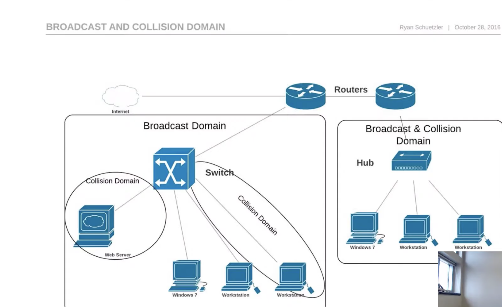

[Encoding and Framing](https://intronetworks.cs.luc.edu/1/html/links.html)

[manchester-encoded-signals-serial-protocol-decoding](https://www.picotech.com/library/oscilloscopes/manchester-encoded-signals-serial-protocol-decoding)

[802-11-frame-types-and-formats](https://howiwifi.com/2020/07/13/802-11-frame-types-and-formats/)

[WLAN_PHY_Frames](https://www.sharetechnote.com/html/WLAN_PHY_Frames.html)

[wi-fi-overview-80211-physical-layer-and-transmitter-measurements](https://www.tek.com/en/documents/primer/wi-fi-overview-80211-physical-layer-and-transmitter-measurements)

[mac-addresses-in-wireless-](https://medium.com/@hnasr/mac-addresses-in-wireless-5ed9b83714d0)

[xiaomin_thesis](https://www.hamilton.ie/publications/xiaomin_thesis.pdf)

[WirelessAndMobileNetwork](https://cs.nyu.edu/~jcf/classes/CSCI-GA.2262-001_fa13/slides/session5/WirelessAndMobileNetworks.pdf)

[DataLinkControl](https://cs.nyu.edu/~jcf/classes/CSCI-GA.2262-001_fa13/slides/session4/DataLinkControl.pdf)

[Wi-Fi: Overview of the 802.11 Physical Layer](https://download.tek.com/document/37W-29447-2_LR.pdf)

[wireless-fundamentals-](https://medium.com/@dipakkrdas/wireless-fundamentals-8696671e6f24)

[wireless-guest-network-client-isolation-under-the-hood](https://medium.com/@dipakkrdas/wireless-guest-network-client-isolation-under-the-hood-d0698333cbcc)

[eth-to-spi](https://qdiv.dev/posts/eth-to-spi/)

[routers-forwarding-mac-address](https://www.baeldung.com/cs/routers-forwarding-mac-address)

Broadcast get sent out to everybody in a local network
Routers separate broadcast domains

Each port on a switch creates a collision domain, but all ports as seen above are all in the same broadcast domain

[Switching](https://www.youtube.com/watch?v=Fb_0ICvUUfo)

A nameserver is a physical server that stores the individual dns records for one or more domain names

Every nameserver has its own domain name that is usually a subdomain starting with `ns`( eg ns1.example.com)

an NS record associates a domain name with its name server
`dig google.com NS` to get all the nameservers

[

2:21 / 2:38

NS Record vs Nameserver](https://www.youtube.com/watch?v=WyDQhlRDad8)

render built on gcp

