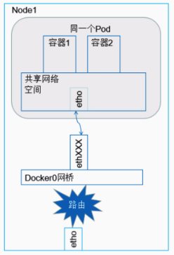
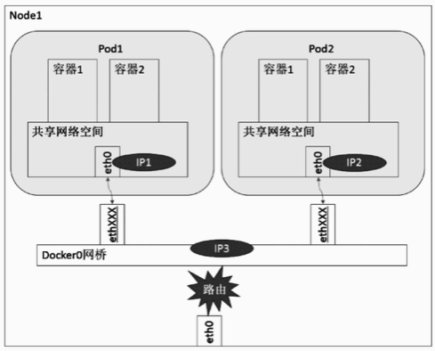
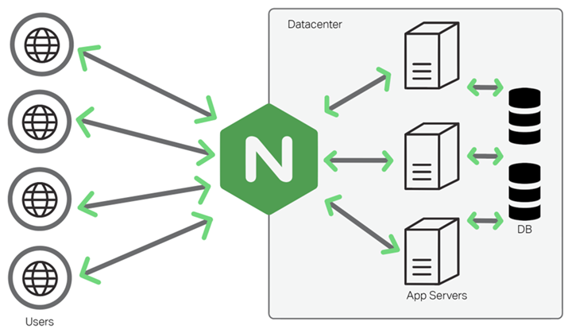

# Networking and Kubernetes(book)

IP addresses are assigned to network interfaces. A typical interface may have one IPv4 address and one IPv6 address, but multiple addresses can be assigned to the same interface.


 Bridges allow pods, with their individual network interfaces, to interact with the broader network via the node’s network interface.

 

 The veth device is a local Ethernet tunnel. Veth devices are created in pairs

  Packets transmitted on one device in the pair are immediately received on the other device. When either device is down, the link state of the pair is down

```sh
NF_IP_PRE_ROUTING(Netfilter hook)

PREROUTING(Iptables chain)

Triggers when a packet arrives from an external system.
```
```sh
NF_IP_LOCAL_IN(Netfilter hook)

INPUT(Iptables chain)

Triggers when a packet’s destination IP address matches this machine.
```

```sh
NF_IP_FORWARD(Netfilter hook)

NAT(Iptables chain)

Triggers for packets where neither source nor destination matches the machine’s IP addresses (in other words, packets that this machine is routing on behalf of other machines).

```
```sh
NF_IP_LOCAL_OUT(Netfilter hook)

OUTPUT(Iptables chain)

Triggers when a packet, originating from the machine, is leaving the machine.
```

```sh
NF_IP_POST_ROUTING(Netfilter hook)

POSTROUTING(Iptables chain)

Triggers when any packet (regardless of origin) is leaving the machine.

```


We can infer from our flow diagram that only certain permutations of Netfilter hook calls are possible for any given packet. For example, a packet originating from a local process will always trigger `NF_IP_LOCAL_OUT` hooks and then `NF_IP_POST_ROUTING` hooks. In particular, the flow of Netfilter hooks for a packet depends on two things: if the packet source is the host and if the packet destination is the host. Note that if a process sends a packet destined for the same host, it triggers the `NF_IP_LOCAL_OUT` and then the `NF_IP_POST_ROUTING` hooks before “reentering” the system and triggering the `NF_IP_PRE_ROUTING` and `NF_IP_LOCAL_IN` hooks.


```sh
Packet source	  Packet destination	Hooks (in order)
Local machine     Local machine         NF_IP_LOCAL_OUT, NF_IP_LOCAL_IN

Local machine     External machine      NF_IP_LOCAL_OUT, NF_IP_POST_ROUTING

External machine  Local machine         NF_IP_PRE_ROUTING, NF_IP_LOCAL_IN

External machine   External machine     NF_IP_PRE_ROUTING, NF_IP_FORWARD, NF_IP_POST_ROUTING


#Note that packets from the machine to itself will trigger NF_IP_LOCAL_OUT and NF_IP_POST_ROUTING and then “leave” the network interface. They will “reenter” and be treated like packets from any other source
```

Network address translation (NAT) only impacts local routing decisions in the `NF_IP_PRE_ROUTING` and `NF_IP_LOCAL_OUT `hooks (e.g., the kernel makes no routing decisions after a packet reaches the `NF_IP_LOCAL_IN` hook). We see this reflected in the design of iptables, where source and destination NAT can be performed only in specific hooks/chains.

NAT relies on Conntrack to function. iptables exposes NAT as two types: SNAT (source NAT, where iptables rewrites the source address) and DNAT (destination NAT, where iptables rewrites the destination address).

Conntrack identifies connections by a tuple, composed of source address, source port, destination address, destination port, and L4 protocol. These five pieces of information are the minimal identifiers needed to identify any given L4 connection. All L4 connections have an address and port on each side of the connection; after all, the internet uses addresses for routing, and computers use port numbers for application mapping. The final piece, the L4 protocol, is present because a program will bind to a port in TCP or UDP mode (and binding to one does not preclude binding to the other). Conntrack refers to these connections as flows. A flow contains metadata about the connection and its state.

Conntrack stores flows in a hash table,using the connection tuple as a key


```sh
#Conntrack’s max size
cat /proc/sys/net/nf_conntrack_max
65536

#hash table size 
cat /sys/module/nf_conntrack/parameters/hashsize
65536
```

Conntrack entries contain a connection state, which is one of four states.

When Conntrack is active, `conntrack -L` shows all current flows.

```sh
# anatomy of a Conntrack flow,
tcp      6 431999 ESTABLISHED src=10.0.0.2 dst=10.0.0.1
sport=22 dport=49431 src=10.0.0.1 dst=10.0.0.2 sport=49431 dport=22 [ASSURED]
mark=0 use=1

#<protocol> <protocol number> <flow TTL> [flow state>] <source ip> <dest ip> <source port> <dest port> [] <expected return packet>

```
`The expected return packet is of the form <source ip> <dest ip> <source port> <dest port>`

Subnets are specified by the destination and genmask values.

```sh
# route
Kernel IP routing table
Destination    Gateway         Genmask         Flags Metric Ref    Use Iface
0.0.0.0        10.0.0.1        0.0.0.0         UG    303    0        0 eth0
10.0.0.0       0.0.0.0         255.255.255.0   U     303    0        0 eth0

```
Linux prefers to route packets by specificity (how “small” a matching subnet is) and then by weight (“metric” in route output). Given our example, a packet addressed to `10.0.0.1` will always be sent to gateway `0.0.0.0` because that route matches a smaller set of addresses. If we had two routes with the same specificity, then the route with a lower metric wiould be preferred.

10.0.0.0/24 smaller than 0.0.0.0 with only host bits


Cilium (a kube-proxy alternative)

a table contains chains, and a chain contains rules.

Chains contain a list of rules. When a packet executes a chain, the rules in the chain are evaluated in order. Chains exist within a table and organize rules according to Netfilter hooks. There are five built-in, top-level chains, each of which corresponds to a Netfilter hook

iptables executes tables in a particular order: `Raw, Mangle, NAT, Filter`

The order of execution is chains, then tables. So, for example, a packet will trigger `Raw PREROUTING`, `Mangle PREROUTING`, `NAT PREROUTING`, and then trigger the Mangle table in either the `INPUT` or `FORWARD` chain (depending on the packet).

iptables chains are a list of rules. When a packet triggers or passes through a chain, each rule is sequentially evaluated, until the packet matches a “terminating target” (such as DROP), or the packet reaches the end of the chain.


 DNAT can be performed in `PREROUTING` or `OUTPUT`, and SNAT can be performed in only `INPUT` or `POSTROUTING`.


1. PREROUTING
   1. Raw
   2. Mangle
   3. NAT

2. INPUT
   1. Mangle
   2. NAT
   3. Filter

 when a packet triggers a chain, iptables executes tables within that chain

 `iptables -t nat -A POSTROUTING -o eth0 -j MASQUERADE`

 To display a particular type of DNS record, run `dig <domain> <type>` (or `dig -t <type> <domain>`)

 `dig kubernetes.io TXT`


 From a networking perspective, with one operating system, there is one TCP/IP stack. That single stack creates issues with port conflicts on the host machine

 Each container also has its own network stack

 Image layers in a repository are connected in a parent-child relationship. Each image layer represents changes between itself and the parent layer.

 Repositories can be equivalent to a container image. The important distinction is that repositories are made up of layers and metadata about the image; this is the manifest.

 Docker provides application portability between running on-premise, in the cloud, or in any other data center. Its motto is to build, ship, and run anywhere. 


 In Linux everything is considered a file. This includes hardware devices, processes, directories, regular files, sockets, links, and so on

 IP forwarding is an operating system’s ability to accept incoming network packets on one interface, recognize them for another, and pass them on to that network accordingly. When enabled, IP forwarding allows a Linux machine to receive incoming packets and forward them. A Linux machine acting as an ordinary host would not need to have IP forwarding enabled because it generates and receives IP traffic for its purposes

 Docker uses iptables for network isolation. The container publishes a port to be accessed externally. Containers do not receive a public IPv4 address; they receive a private RFC 1918 address. Services running on a container must be exposed port by port,


 [cni](https://www.sobyte.net/post/2022-10/go-cni/)

 [knet](https://www.sobyte.net/post/2022-10/k8s-net/)

 [container-net-1](https://www.sobyte.net/post/2022-10/container-net-1/)

 [container-net-2](https://www.sobyte.net/post/2022-10/container-net-2/)

 [ipip](https://www.sobyte.net/post/2022-10/ipip/)


[wifi-ethernet-wifi/](https://dx13.co.uk/articles/2022/11/30/wifi-ethernet-wifi/)

the frame payload is transparent to the layer two devices.

Each network interface device must have a unique MAC address within the network, otherwise the network won’t route frames reliably.

 Our devices use ARP to translate IP addresses into MAC addresses. This uses a broadcast frame to ask all devices on a network if they are assigned a particular IP address. Typically a machine on a home network has just one IP address

 `192.168.86.1`


 wifi uses the amplitude and phase of an electromagnetic (radio) wave to transmit bits in the air. 

 n general, to stop each devices waves getting muddled with other devices, at a given moment in time only a single device can transmit or receive data to an access point. This means that devices take turns speaking to their access point


 Unicast: used when a single recipient of a frame is the intended destination

 Group Addresses
 - Broadcast: Used when the Ethernet frame is intended for all the devices that are on the LAN and have a value of `FFFF.FFFF.FFFF`

 - Multicast: Used to allow many but not all of the devices on a LAN to communicate


 in kubernetes, pods are the smallest unit of deployment

any service can only have one port


each computer of the communication, stores the other's ip address and port. this combination is called a session or endpoint. The client stores the ip address and port number of the server while the server stores the client's ip address and port. Both are called a socket pair or endpoints


AM- travels further..longer wavelength


FM carries more infomation due to high frequencies

/8 is a single subnet within the entire IPv4 space (/0)

/16 is a single subnet within a /8

/24 is a single subnet within a /16


IPv4 is a 32-bit address space.

CIDR notation /N means the first N bits are fixed for network identification, and the rest are for hosts.

Each /8 is one subnet within the larger /0 space.

Each one has `16,777,216` IPs

```sh
# of subnets = 2^(new prefix - old prefix)
```
**How many /8 subnets fit in /0?**
2^(8 - 0) = 2^8 = 256 subnets

Each one has 16,777,216 IPs
**How many /16 subnets fit into a /8?**
2^(16 - 8) = 2^8 = 256 subnets

Each has 65,536 IPs

There are three types of networks in kubernetes
- node
- cluster
-pod


When a node is created, the kubelet delegates
- Creating the container to the container runtime
- Attaching the container to the  network  to the CNI
- Mounting volumes to the CSI

On the CNI part
- Each pode has its own isolated linux network namespace and is attached to a bridge

- The CNI is responsible for creating the bridge,assigning the IP and connecting `veth0` to the `cni0`


There is a thunderbolt bridge on mac with 2 2 thunderbolt interfaces

There are 4 in built interfaces on my mac
- 2 thunderbolt interfaces(type ethernet)
- one wifi( type wifi)
- bride0 of type bridge

## What is Thunderbolt Bridge?
Thunderbolt Bridge is a networking protocol that uses Thunderbolt ports on your Mac to connect to another Mac using a peer-to-peer connection. It’s often used as a way to transfer large amounts of data between two Macs quickly — Thunderbolt’s speedy transfer rates are perfect for that. It’s faster than Wi-Fi and Gigabit Ethernet. It can also be used to share the internet connection on one Mac with another Mac and, with the addition of extra software, to use the display on one Mac as a second display on another Mac.

macOS provides networking API for VMs called 'vmnet.framework':
https://developer.apple.com/documentation/vmnet

We can provide its support as the new QEMU network backends which
represent three different vmnet.framework interface usage modes:

  * `vmnet-shared`:
    allows the guest to communicate with other guests in shared mode and also with external network (Internet) via NAT. Has (macOS-provided)DHCP server; subnet mask and IP range can be configured;

  * `vmnet-host`:
    allows the guest to communicate with other guests in host mode.
    By default has enabled DHCP as `vmnet-shared`, but providing
    network unique id (uuid) can make `vmnet-host` interfaces isolated from each other and also disables DHCP.

  * `vmnet-bridged`:
    bridges the guest with a physical network interface.


[add-dns-record-for-pod](https://www.sobyte.net/post/2021-10/add-dns-record-for-pod/)

```sh

$ ip -n ns1 route
10.0.1.0/24 dev veth0 proto kernel scope link src 10.0.1.0
$ ip -n ns2 route
10.0.2.0/24 dev veth1 proto kernel scope link src 10.0.2.0
```


The routing table of two network namespaces are only the routing entries of their respective IP ranges, and there is no route to other subnets, so of course can not interoperate, to solve is also very simple, you can use the ip route add command to insert a new route entry in the routing table is not it can be.

```sh
# 更新 veth0 路由表，添加一条通往 10.0.2.0/24 的路由
$ ip -n ns1 route add 10.0.2.0/24 dev veth0

# 确认发往 10.0.2.0/24 的数据包被路由到 veth0
$ ip -n ns1 route get 10.0.2.0
10.0.2.0 dev veth0 src 10.0.1.0
    cache

# 同样更新 veth1 路由表，添加一条通往 10.0.1.0/24 的路由
$ ip -n ns2 route add 10.0.1.0/24 dev veth1

# 确认发往 10.0.1.0/24 的数据包被路由到 veth1
$ ip -n ns2 route get 10.0.1.0
10.0.1.0 dev veth1 src 10.0.2.0

```

[docker-k8s-network-2](https://www.sobyte.net/post/2022-07/docker-k8s-network-2/)

- inter-container communication.
- Pod-to-Pod communication.
- Pod-to-Service communication.
- Intra-cluster and inter-cluster communication.


### Inter-container communication
Pod is the most basic scheduling unit in Kubernetes, not a Docker container. Pod means pod, and containers can be understood as beans in a pod, and a Pod can contain multiple containers with related relationships. The communication between Pod and Service is also from the Pod level.


Containers within the same Pod do not communicate across hosts, they share the same Network Namesapce space and the same Linux protocol stack. So for all kinds of network operations, a Pod can be treated as a separate “host” and the containers inside can access each other’s ports with localhost addresses.



 there is a Pod instance running on the Node, and the containers inside the Pod share the same Network Namespace, so communication between Container 1 and Container 2 is very simple


 ### Pod-to-Pod Communication

- Pod-to-Pod communication under the same Node
- Pod-to-Pod communication under different Nodes


#### Inter-Pod communication under the same Node
Each Pod has a real global IP address, different Pods within the same Node can communicate directly with each other using the other Pod’s IP address, and no other discovery mechanisms such as DNS, Consul or Etcd are required.



Under the same Node, different Pods are connected to the docker0 bridge through the Veth device pair. Pod1, Pod2 and docker0 bridge belong to the same network segment, that is, they can communicate directly with each other

#### Pod-to-Pod communication under different Nodes

Inter-Pod communication under the same Node is easy to understand because it can be achieved directly through the docker0 bridge But how to implement inter-Pod communication under different Nodes is a problem that needs to be studied.


[grpc](https://www.sobyte.net/post/2022-03/understanding-the-gprc-protocol/)

RPC does two things: 
- one is data encoding, 
- and the other is request mapping.

`Data encoding, as the name suggests, is the process of converting the requested memory image into a transportable byte stream and sending it to the server, and then converting the received byte stream into a memory image. There are many methods, the common ones are XML, JSON, Protobuf.`


```proto
package demo.hello;

service Greeter {
  rpc SayHello (HelloRequest) returns (HelloReply) {}
}

message HelloRequest {
  string name = 1;
}

message HelloReply {
  string message = 1;
}
```


The .proto file above defines a Greeter service with a SayHello method that accepts a HelloRequest message and returns a HelloReply message. How this Greeter is implemented is language-independent, hence the name IDL. gRPC uses Protobuf’s service to describe the RPC interface.


```sh
So the question is, how does gRPC map requests? To answer this question, we must first answer what transport protocol gRPC uses at the bottom. The answer is the HTTP protocol, or to be precise, gRPC uses the HTTP/2 protocol
```


This HTTP request uses the POST method, and the corresponding resource path is determined by the .proto definition. The path for the Greeter service we mentioned earlier is `/demo.hello.Greeter/SayHello`.

A gRPC definition contains three parts, the package name, the service name and the interface name, with the following connection rules.

1. `/{packageName}.{serviceName}/{methodName}`

The package name of SayHello is demo.hello, the service name is Greeter, and the interface name is SayHello, so the corresponding path is `/demo.hello.Greeter/SayHello`.


```proto

service Greeter {
  rpc SayHello (HelloRequest) returns (HelloReply) {}
  rpc SayHello (stream HelloRequest) returns (HelloReply) {}
  rpc SayHello (HelloRequest) returns (stream HelloReply) {}
  rpc SayHello (stream HelloRequest) returns (stream HelloReply) {}
}
```

gRPC holds three streaming interfaces, defined by prefixing the parameters with the stream keyword: request stream, response stream, and bidirectional stream.

[pb-encoding](https://www.sobyte.net/post/2022-03/pb-encoding/)


## HTTP proxy server
HTTP proxy, there are two types: 
- one of forward proxy 
- and one of reverse proxy.


Nginx currently supports three load balancing policies (polling, weighted polling, IP hashing) and two common third-party policies (fair, url hashing).

[nginx-ssl-test](https://www.sobyte.net/post/2022-04/nginx-ssl-test/)

[prevent-https-from-exposing-the-domain-name-bound-on-the-server](https://www.sobyte.net/post/2022-01/prevent-https-from-exposing-the-domain-name-bound-on-the-server/)


When a packet arrives at a Linux server, it passes through the following steps:

- **PREROUTING Chain**: Determines whether to modify the packet before routing.
Routing Decision: Decides whether the packet is for the local system or needs to be forwarded.
- **INPUT Chain** (if destined for the local system): Examines the packet and decides whether to accept or drop it.
- **OUTPUT Chain** (if generated by the local system): Examines outgoing packets.
- **FORWARD Chain** (if the packet needs to be routed): Decides whether to forward or drop the packet.
- **POSTROUTING Chain**: Modifies the packet after routing.


```iptables
# Flush existing rules
iptables -F

# Set default policies
iptables -P INPUT DROP
iptables -P FORWARD DROP
iptables -P OUTPUT ACCEPT

# Allow incoming SSH and HTTP traffic
iptables -A INPUT -p tcp --dport 22 -j ACCEPT
iptables -A INPUT -p tcp --dport 80 -j ACCEPT

# Allow loopback traffic
iptables -A INPUT -i lo -j ACCEPT

# Allow established and related traffic
iptables -A INPUT -m state --state ESTABLISHED,RELATED -j ACCEPT
```

- Order of Rules: Rules are processed from top to bottom. The first match determines the action.
- Default Policies: It's a good practice to set default policies to DROP and explicitly allow traffic.

when you start docker on mac, you see two new interfaces `vmenet0` and `bridge100` with `vmenet0` being a member of the bridge


[k8s-net](https://www.sobyte.net/post/2022-10/k8s-net/)


[k8s-service](https://www.sobyte.net/post/2022-09/k8s-service/)

[master-kubernetes-services-a-complete-guide-with-examples](https://medium.tuanh.net/master-kubernetes-services-a-complete-guide-with-examples-9a6fdcfd97a7)

[kubernetes-quickstart](https://jasoneckert.github.io/myblog/kubernetes-quickstart/)