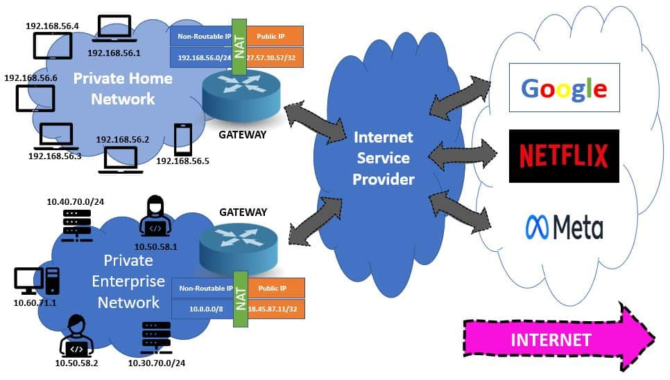

```sh
# Create two network namespaces
ip netns add netns0
ip netns add netns1


# Create veth pairs
ip link add veth0 type veth peer name ceth0
ip link add veth1 type veth peer name ceth1

# Assign veth ends to network namespaces
ip link set ceth0 netns netns0
ip link set ceth1 netns netns1

# Set veth ends up in the root namespace
ip link set veth0 up
ip link set veth1 up

# Create and bring up the bridge
ip link add br0 type bridge
ip link set br0 up

# Attach veth ends to the bridge
ip link set veth0 master br0
ip link set veth1 master br0

# ip a
# 12: veth0@if11: <NO-CARRIER,BROADCAST,MULTICAST,UP> mtu 1500 qdisc noqueue master br0 state LOWERLAYERDOWN group default qlen 1000
#     link/ether 22:6f:fc:57:41:a9 brd ff:ff:ff:ff:ff:ff link-netns netns0
# 14: veth1@if13: <NO-CARRIER,BROADCAST,MULTICAST,UP> mtu 1500 qdisc noqueue master br0 state LOWERLAYERDOWN group default qlen 1000
#     link/ether f6:15:11:b6:94:ac brd ff:ff:ff:ff:ff:ff link-netns netns1
# 15: br0: <NO-CARRIER,BROADCAST,MULTICAST,UP> mtu 1500 qdisc noqueue state DOWN group default qlen 1000
#     link/ether 22:6f:fc:57:41:a9 brd ff:ff:ff:ff:ff:ff
#     inet6 fe80::4483:20ff:fefe:c182/64 scope link proto kernel_ll 
#        valid_lft forever preferred_lft forever

# Assign IP addresses to interfaces in netns0
ip netns exec netns0 ip addr add 172.18.0.10/16 dev ceth0
ip netns exec netns0 ip link set ceth0 up
ip netns exec netns0 ip link set lo up

# Assign IP addresses to interfaces in netns1
ip netns exec netns1 ip addr add 172.18.0.20/16 dev ceth1
ip netns exec netns1 ip link set ceth1 up
ip netns exec netns1 ip link set lo up

# Assign IP address to the bridge in root namespace
#To establish the connectivity between the root and container namespaces, we need to assign the IP address to the bridge network interface:
ip addr add 172.18.0.1/16 dev br0


# Ping from netns0 to netns1
ip netns exec netns0 ping -c 3 172.18.0.20

# / # ip netns exec netns0 ping -c 3 172.18.0.20
# PING 172.18.0.20 (172.18.0.20): 56 data bytes
# 64 bytes from 172.18.0.20: seq=0 ttl=64 time=2.992 ms
# 64 bytes from 172.18.0.20: seq=1 ttl=64 time=0.248 ms
# 64 bytes from 172.18.0.20: seq=2 ttl=64 time=0.175 ms

# --- 172.18.0.20 ping statistics ---
# 3 packets transmitted, 3 packets received, 0% packet loss
# round-trip min/avg/max = 0.175/1.138/2.992 ms

# Ping from netns1 to netns0
ip netns exec netns1 ping -c 3 172.18.0.10

```

Docker is only compatible with iptables-nft and iptables-legacy.

--table	-t table	table to manipulate (default: `filter')


Iptables is used to set up, maintain, and inspect the tables of IP packet filter rules in the Linux kernel. Several different tables may be defined. Each table contains a number of built-in chains and may also contain user-defined chains.

Each chain is a list of rules which can match a set of packets. Each rule specifies what to do with a packet that matches. This is called a 'target', which may be a jump to a user-defined chain in the same table.


On Linux, Docker creates `iptables` and `ip6tables` rules to implement network isolation, port publishing and filtering.

In the filter table, Docker sets the default policy to `DROP`, and creates the following custom `iptables` chains:

`DOCKER-USER`
A placeholder for user-defined rules that will be processed before rules in the DOCKER chain.

`DOCKER`
Rules that determine whether a packet that is not part of an established connection should be accepted, based on the port forwarding configuration of running containers.

`DOCKER-ISOLATION-STAGE-1 and DOCKER-ISOLATION-STAGE-2`
Rules to isolate Docker networks from each other.

In the `FORWARD` chain, Docker adds rules that pass packets that are not related to established connections to these custom chains, as well as rules to accept packets that are part of established connections.

In the `nat` table, Docker creates chain `DOCKER` and adds rules to implement masquerading and port-mapping.


### Add iptables policies before Docker's rules
Packets that get accepted or rejected by rules in these custom chains will not be seen by user-defined rules appended to the `FORWARD` chain. So, to add additional rules to filter these packets, use the `DOCKER-USER` chain.


### Docker on a router
Docker sets the policy for the `FORWARD` chain to `DROP`. This will prevent your Docker host from acting as a router.

If you want your system to function as a router, you must add explicit `ACCEPT` rules to the DOCKER-USER chain. For example:

`iptables -I DOCKER-USER -i src_if -o dst_if -j ACCEPT`


Nat table

When packets arrive to the `DOCKER-USER` chain, they have already passed through a Destination Network Address Translation (DNAT) filter. That means that the iptables flags you use can only match internal IP addresses and ports of containers.

For example, `docker run -p 8080:80 [...] ` creates a mapping between port `8080` on any address on the Docker host, and the container's port `80`. Outgoing connections from the container will masquerade, using the Docker host's IP address


network adapater /interface connects a device to a network
- It can be assigned an ip
- it has a mac assigned by the manufacturer
- it is a layer 2 device
- it is the "bridge" between layer 1 and layer 2..It connects layer 1 to layer 2


A switch or bridge is a multiport network bridge that uses mac addresses to forward data at the data link layer
All communications within the same subnet goes through the switch


The device extracts the network portion of its own IP address using its subnet mask.
It also extracts the network portion of the destination IP address using the same subnet mask.
- If the network portions are identical, the destination is on the same local network.
- If the network portions are different, the destination is on a different network.

Default Gateway: Acts as the next hop for packets destined for different networks when no specific route is available.


### Link layer:

- ARP: Address Resolution Protocol: Map IP to hardware (e.g. Ethernet) addresses

- RARP: Reverse ARP: Map hardware (e.g. Ethernet) to IP addresses

### Network layer:

- IP: Internet Protocol (version 4): transfer IP packets from one host to another. One of the most common protocols today. This is what the Internet is built around.

- IPv6: Internet Protocol (version 6): transfer IP packets from one host to another

- ICMP: Internet Control Message Protocol (version 4): This is a protocol to report common errors and events in the IP, TCP and UDP protocols.

- ICMPv6: Internet Control Message Protocol (version 6): This is a protocol to report common errors and events in the IPv6, TCP and UDP protocols.

- IGMP: IP multicasting

### Network layer (routing):

- BGP: Border Gateway Protocol

- EGP: Exterior Gateway Protocol

- GP: Gateway to Gateway Protocol

- IGRP: Interior Gateway Routing Protocol

- ND: Neighbor Discovery

- OSPF: Open Shortest Path First

- RIP: Routing Information Protocol

- RIPng: Routing Information Protocol next generation

- DSR: Dynamic Source Routing (Ad-hoc protocol)

### Network Layer (IPsec Internet Protocol Security):

- AH: Authentication Header

- ESP: Encapsulating Security Payload

### Transport layer:

These protocols run atop `IP`:

- DCCP: Datagram Congestion Control Protocol: stream based, reliable, connection oriented transfer of data

- SCTP: datagram (packet) based, reliable, connection oriented transfer of data

- UDP: User Datagram Protocol: datagram (packet) based, unreliable, connectionless transfer of data

- UDP-Lite: Lightweight User Datagram Protocol: datagram (packet) based, unreliable, connectionless transfer of data

- TCP: Transmission Control Protocol: stream based, reliable, connection oriented transfer of data

- PortReference: TCP/UDP port numbers


Presentation layer does two things
- Data Format
- Encryption(SSL)


TCP threeway handshake for http
 https does the TCP 3 way handshake and then TLS handshakes occur after a TCP connection has been established via a TCP handshake
[Understanding Kubernetes Networking. Part 1: Container Networking](https://www.youtube.com/watch?v=B6FsWNUnRo0&t=23s)


When you create a network bridge and assign it an IP address, the bridge effectively becomes a network interface on the host system. This IP address can be used by the host to route traffic to and from the bridge network and to communicate with any connected devices, such as containers.


`sudo ip link add br1 type bridge`

added a new bridge but it does not have an ip, hence no ip rules for it

If you have multiple bridge networks and want containers on different bridges to communicate, the bridge's IP address can facilitate routing between networks. The host can act as a router, forwarding traffic between different bridge networks.

`sudo sysctl -w net.ipv4.ip_forward=1`


```sh
sudo ip route add 192.168.2.0/24 via 192.168.1.1 dev br0
sudo ip route add 192.168.1.0/24 via 192.168.2.1 dev br1
```
Firewall Rules:
You can apply firewall rules using iptables to filter or control traffic between containers and the host.
```sh
sudo iptables -A INPUT -i br0 -j DROP

```


Linux kernel is the core of linux and it is layer 4,3 and 2
The userspace is layer 5,6 and 7 

`ip -br a` gets brief information in tabular format

```sh
# -c for color
ip -br -c a
```


The ip of my `en0` interface  is 192.168.4.34, and its default gateway is 192.168.4.1,as the default gateway needs to be on the same network

Without a default gateway, you can't connect to anything
`ip route delete default`


to fix it `ip route add default via 10.0.2.1`
or  `ip route add default via 10.0.2.1 dev enpls0` to specify the interface( device)  if we have multiple interfaces

`ip r add 10.42.0.0/16 dev devicname` `devicename` of device we want to connect to the network
it also depends if the 10.42.0.0/16 network exists and if the device is able to connect to it, then we have a connection to that network

you can use `nmcli` on ubuntu
Network Manager is a powerful tool that lets us configure and manage various network interfaces including wired and wireless connections

[setup-wifi-hotspot](https://www.baeldung.com/linux/setup-wifi-hotspot)
## Iptables

Filter Table
- INPUT CHAIN
- OUTPUT CHAIN
- FORWARD CHAIN

NAT Table
- OUTPUT CHAIN
- PREROUTING CHAIN
- POSTROUTING CHAIN

MANGLE Table
- INPUT CHAIN
- OUTPUT CHAIN
- FORWARD CHAIN
- PREROUTING CHAIN
- POSTROUTING CHAIN

iptables maintains a table where each row specifies a rule for filtering input packets

- filter – The Linux kernel will search for rules in this table for every input packet. Based on the rule, the packet is either accepted or dropped
- nat – The kernel uses this table for NATing rules. Network Address Translation (NAT) allows us to change the source or destination IP address in a packet. iptables can do this for both incoming and outgoing packets
- mangle – This table allows us to alter IP headers. For example, we can change the TTL value in the input packet

Generally speaking, the filter table is the most widely used, and hence it’s also the default table. `If we want to select other tables, for instance, to change or add a NAT rule, we can use the -t option in the iptables command`

`iptables -t nat -L -v`

each row in a table is a set of rules that the kernel must apply on an input packet. All these rules are chained together into groups known as a chain
There are three types of chains in the filter table:

- INPUT – This chain contains rules to apply on incoming connections
- FORWARD – This contains rules for data packets that must only be forwarded and not consumed locally. For example, a router that only forwards the data to other machines
- OUTPUT – This chain contains rules for outgoing connections
In each of these chains, we can create a number of rules. Each rule consists of:

- Matching Expression – A criteria that the kernel applies to filter data packets
- Target – The action that the kernel performs on the data packet


`For every connection, the kernel traverses the chain and applies the matching expression on the data packet. If it finds a match, it applies the given target on the data packet.`

[iptables-intro](https://www.baeldung.com/linux/iptables-intro)

Examples of targets: 
- ACCEPT – Allow the packet to reach the destination socket
- DROP – Drop the packet but don’t send any error back to the client
- REJECT – Drop the packet and send an error back to the client


We can use the `iptables` command to add or delete rules in the chains. We can add rules for default chains that affect all connections as well as create new rules based on matching expressions. The iptables command provides us with an extensive list of packet or connection characteristics to apply filters.

```sh
81b443eaa1bc:/# iptables -L -v
Chain INPUT (policy ACCEPT 0 packets, 0 bytes)
 pkts bytes target     prot opt in     out     source               destination         

Chain FORWARD (policy ACCEPT 0 packets, 0 bytes)
 pkts bytes target     prot opt in     out     source               destination         

Chain OUTPUT (policy ACCEPT 0 packets, 0 bytes)
 pkts bytes target     prot opt in     out     source               destination         

```

`So by default, iptables allows all input and output packets to go through. We can, however, change this behavior and add a new policy for any of these chains:`

`iptables --policy FORWARD DROP`

```sh
81b443eaa1bc:/# iptables --policy FORWARD DROP
81b443eaa1bc:/# 
81b443eaa1bc:/# iptables -L -v
Chain INPUT (policy ACCEPT 0 packets, 0 bytes)
 pkts bytes target     prot opt in     out     source               destination         

Chain FORWARD (policy DROP 0 packets, 0 bytes)
 pkts bytes target     prot opt in     out     source               destination         

Chain OUTPUT (policy ACCEPT 0 packets, 0 bytes)
 pkts bytes target     prot opt in     out     source               destination         

```

As a result, iptables will drop all packets which are not locally consumed by the kernel:

`iptables allows us to filter connections based on a lot of characteristics like source IP address, source port, and protocol:`

To drop all packets from a particular IP:
`iptables -A INPUT -s 10.1.2.3 -j DROP`

This will discard all packets from the machine with IP 10.1.2.3

To drop all packets to a specific port:
`iptables -A INPUT -p tcp --dport 8080 -s 10.1.2.3 -j DROP`

This command will block any packet to port 8080 from the machine with IP 10.1.2.3:

```sh
iptables -L -v
Chain INPUT (policy ACCEPT 2 packets, 134 bytes)
 pkts bytes target     prot opt in     out   source    destination         
    0     0 DROP       tcp  --  any    any   10.1.2.3     anywhere             tcp dpt:http-alt

Chain FORWARD (policy DROP 0 packets, 0 bytes)
 pkts bytes target     prot opt in     out     source               destination         

Chain OUTPUT (policy ACCEPT 0 packets, 0 bytes)
 pkts bytes target     prot opt in     out     source               destination
```

To drop all packets on a particular protocol:
`iptables -A INPUT -p tcp --dport 22 -j DROP`

This command will block all packets from any machine on port 22 over TCP. Hence, not allowing SSH connections

So, by providing `-A` as the parameter, we appended a new rule into the chain. When a data packet comes, the kernel will lookup this rule ahead of the default rule that accepts all connections.

Similarly, we can delete a rule from a chain:

`iptables -D INPUT -p tcp --dport 22 -j DROP`


Understanding the relationship between the netfilter framework and the iptables command is vital for knowing how a packet gets processed by the firewall rules we’ve set on the system

`the netfilter provides five different hooks that are triggered on different parts of the journey of a packet`. For example, any incoming traffic when it first enters the network stack will trigger the `NF_IP_PRE_ROUTING hook`.

`always mangle first, nat then filter`
Mange-> nat-> Filter


## Rules and Chains

At the lowest level of the firewall, a rule serves as the basic building block. `We can define a rule to perform various actions on a packet, such as rejecting, dropping, logging, or mangling the packet`. For example, with the iptables command, we can define a rule to deny all incoming packets targeting port 22 using the DROP syntax.

We can then combine these rules to form a chain. `When a packet goes through a chain, the various rules on the chain will sequentially process the packet`. If any of the rules reject or deny the packet, the journey of the packet terminates at that point in the system.

For example, the `filter table contains chains that define rules for filtering packets by their attributes`. We commonly work on the filter table to define rules for blocking or allowing traffic.

On the other hand, the `nat table defines chains that perform network address translation (NAT) on the packet`.

The `mangle table consists of rules that modify the packet at various points of the journey`.

### Incoming Packet to Local Process
```sh
PREROUTING-> INPUT->
mangle(1)     mangle(3)
|               |
nat(2)        filter(4)
```
When a packet comes into the network interface, `the packet first hits the PREROUTING chain of the mangle table`. This chain is typically used for changing the header value of the packet before it’s sent down to the rest of the chains.

Subsequently, `the PREROUTING chain of the nat table will work on the packet to perform destination network address translation (DNAT) on the packet`. The DNAT converts the destination IP address of the packet to the private IP address for further routing.

After the executions of the PREROUTING chains from the mangle and nat tables, the kernel will perform a routing decision for this packet. `At this point, the packet could either be forwarded to another host using the forward packet path or the packet is destined for a local process. In the latter case, the packet is passed to the INPUT chain of the mangle table`.

The INPUT chain of the mangle table defines a list of mangling operations on packets that are deemed for the local process.

Next, `the packet hit the INPUT chain of the filter table`. This is the chain where all the rules about dropping or rejecting a packet will reside. When a packet survives the entire traversal, it’ll finally reach the local process for further processing


### Outgoing Packet from Local Process
```sh
OUTPUT->  POSTROUTING
mangle(1)  mangle(4)
|              |
nat(2)     nat(5)
|routing
filter(3)
```
`For an outgoing packet leaving the host, it first hits the OUTPUT chain of the mangle table`. Then, the packet moves onto the OUTPUT chain of the `nat` table.

`After both of the OUTPUT chains have processed the packets, the kernel makes a routing decision on the packet`. This is because the chains might’ve altered the destination of the packet.

`For packets that are leaving the system after the routing decision, they go through the OUTPUT chain of the filter table`. Through the OUTPUT chain of the filter table, we can maintain rules to ensure that all the outgoing packets are only targeting trustable hosts.

`If a packet survives the OUTPUT chain of the filter table, the kernel then passes the packet through the POSTROUTING chains of the mangle and nat table in that order`. The main thing the OUTPUT chain of the `nat table does here is source network address translation (SNAT)`. The SNAT ensures that the source IP address of the packet is updated to the public address of the network interface instead of a private network address.

### Forwarded Packets
```sh
PREROUTING-> FORWARD ->  POSTROUTING
mangle(1)     mangle(3)    mangle(5)
|             |                |
nat(2)        filter(4)     nat(6)
```

`For packets that are to be forwarded, the first leg of the journey is the same as incoming packets`. Concretely, the packet hits the PREROUTING chains of the mangle and nat table before the kernel performs the routing decision.

`After the routing decision, all the packets to be forwarded will be evaluated by the FORWARD chain of the mangle table`. We can define mangling operations on this chain to target forwarding packets specifically.

Then, the packet reaches the FORWARD chain of the filter table. Similar to the other chains on the filter table, we can define rules to drop or reject unwanted packets on the forward path.

`Any surviving packets will be processed by the POSTROUTING chain of the mangle and nat tables, respectively`. The POSTROUTING chain of the nat table is responsible for performing the SNAT to convert the source IP address from a private IP address to a public address.

From the diagram, we can observe several interesting points. `Firstly, the mangling chains always process the packets first in all three different paths. Right after the mangling, the chains in the nat table will kick in to ensure the addresses are correct`.

As a rule of thumb, `the hooks trigger the PREROUTING chains before any routing decision`. This is to enable the flexibility for customizing the routing of packets. Conversely, `the hooks always trigger the POSTROUTING chains right before the packets leave the host`.

Interestingly, the chains in the filter tables always see the packets after the mangle and nat chains have processed them. Therefore, `the rules in the filter tables always work on the post-mangle, post-translation packet state`.
[iptables-chains-tables-traversal](https://www.baeldung.com/linux/iptables-chains-tables-traversal)


When a chain is called, the packet in question will be evaluated against each rule in the chain. Each rule has two components: a matching component and an action component.


[the-architecture-of-iptables-and-netfilter](https://blog.cloudsigma.com/the-architecture-of-iptables-and-netfilter/#:~:text=specified%20firewall%20rules.-,Netfilter%20Hooks,-For%20programs%20to)

[iptables-log-drop-rules](https://www.baeldung.com/linux/iptables-log-drop-rules)

```sh
iptables -L -v -t filter
iptables -L -v -t nat
iptables -L -v -t mangle
iptables -L -v -t raw
iptables -L -v -t security
```


`iptables --policy FORWARD DROP` 
When I had the above, I could not ping `172.18.0.20` from `172.18.0.10` until I changed it as shown below then it worked
`iptables --policy FORWARD ACCEPT` 

### Reason
The br-nf code makes bridged IP frames/packets go through the iptables chains. Ebtables filters on the Ethernet layer, while iptables only filters IP packets.


```sh
iptables -- tables nat --append PREROUTING --protocol tcp --dport 80 --jump REDIRECT -- 8080
```

[packet-filtering-firewalls](https://docs.docker.com/network/packet-filtering-firewalls/)

[transparent-proxy/bridge](https://docs.trafficserver.apache.org/en/8.1.x/admin-guide/configuration/transparent-proxy/bridge.en.html)

[bridge](https://cis.temple.edu/~giorgio/old/cis307f99/readings/bridge.html)

[BridgeNetworkConnections](https://wiki.debian.org/BridgeNetworkConnections)

Ebtables filters on the Ethernet layer, while iptables only filters IP packets.

- CHAINS
There are three ebtables tables with built-in chains in the Linux kernel. These tables are used to divide functionality into different sets of rules. Each set of rules is  called  a chain. Each  chain is an ordered list of rules that can match Ethernet frames. If a rule matches an Ethernet frame, then a processing specification tells  what  to  do  with  that matching  frame.  The processing specification is called a 'target'. However, if the frame does not match the current rule in the chain, then the next rule in the chain is  examined and  so  forth.   The  user  can  create new (user-defined) chains that can be used as the 'target' of a rule


The bridge's decision for a frame  can be one of these:

1. bridge it, if the destination MAC address is on another side of the bridge;
2. flood it over all the forwarding bridge ports, if the position of the box with the destination MAC is unknown to the bridge;
3. pass it to the higher protocol code (the IP code), if the destination MAC address is that of the bridge or of one of its ports;
4. ignore it, if the destination MAC address is located on the same side of the bridge.

1-> destination mac adddress on different segment of network
2-> bridges does not know location of destination mac address
3-> it means the frame is intended for the device the bridge is directed connected to


Each port may have its own MAC address for forwarding frames between connected segments.

Ebtables has three tables: `filter, nat and broute`

The `broute` table has the `BROUTING` chain.
The `filter` table has the `FORWARD`, `INPUT` and `OUTPUT` chains.
The `nat` table has the `PREROUTING`, `OUTPUT` and `POSTROUTING` chains.

When an NIC enslaved to a bridge receives a frame, the frame will first go through the `BROUTING` chain. In this special chain you can choose whether to `route or bridge` frames, enabling you to make a brouter.

`A brouter is a device that bridges some frames/packets (i.e. forwards based on Link layer information) and routes other frames/packets (i.e. forwards based on Network layer information). The bridge/route decision is based on configuration information`

A brouter can be used, for example, to act as a normal router for IP traffic between 2 networks, while bridging specific traffic (NetBEUI, ARP, whatever) between those networks. The IP routing table does not use the bridge logical device, instead the box has IP addresses assigned to the physical network devices that also happen to be bridge ports (bridge enslaved NICs).
`The default decision in the BROUTING chain is bridging`.

Next the frame passes through the `PREROUTING` chain. In this chain you can alter the destination MAC address of frames (`DNAT`). If the frame passes this chain, the bridging code will decide where the frame should be sent. `The bridge does this by looking at the destination MAC address, it doesn't care about the Network Layer addresses (e.g. IP address)`.

If the bridge decides the frame is destined for the local computer, the frame will go through the INPUT chain. In this chain you can filter frames destined for the bridge box. After traversal of the INPUT chain, the frame will be passed up to the Network Layer code (e.g. to the IP code). So, a routed IP packet will go through the ebtables INPUT chain, not through the ebtables FORWARD chain. This is logical

Otherwise the frame should possibly be sent onto another side of the bridge. If it should, the frame will go through the `FORWARD` chain and the `POSTROUTING` chain. The bridged frames can be filtered in the `FORWARD` chain. In the `POSTROUTING` chain you can alter the MAC source address (`SNAT`)


It seems `mangle` can't happen at layer 2

Layer 2 switch        
- forwards data based on mac 
- can't route data between vlans


layer 3 switch
- routes data on ip and forwards data based on mac addresses
- can route data between vlans


A bridge  network is a data link device which forwards traffic between network segments.
In docker, a bridge network uses software bridge which lets containers connected to the same bridge network communicate, while providing isolation from containers that aren't connected to that bridge network.The docker bridge driver automatically installs rules in the host machine so that containers on different bridge networks can't communicate directly with each other

`sudo docker network create -d macvlan --subnet=172.16.86.0/24 --gateway=172.16.86.1 -o parent=enp0s1 my-macvlan-network`

You can also use ebtables to do all sorts of interesting things at the MAC layer. For example, to ignore all traffic from a given IP that doesn’t match a known MAC address, you could try this:


` ebtables -A FORWARD -p IPv4 --ip-src 10.15.6.10 -s ! 00:30:65:FF:AA:BB -j DROP`

`ebtables -A FORWARD -p IPv4 --ip-src  ! 10.15.6.10 -s 00:30:65:FF:AA:BB -j DROP`

This will prohibit the machine with the specified MAC address from using any IP but `10.15.6.10`


if a device needs to communicate with a device on another network, it will usually communicate through a router. A router that is specified on a host, which links the host's subnet to other networks, is called a default gateway
[Wireless Access Point vs Wi-Fi Router](https://www.youtube.com/watch?v=OxiY4yf6GGg)
[entables](https://ebtables.netfilter.org/br_fw_ia/br_fw_ia.html)

ARP table is local to the LAN
  to communicate  with nodes outside the network()LAN, we consult the routes  

  The chain names indicate which traffic the rules in each list will be applied to, input is for any connections coming to your cloud server, output is any leaving traffic and forward for any pass through. `Each chain also has its policy setting which determines how the traffic is handled if it doesn’t match any specific rules, by default it’s set to accept`.

### Adding rules
Firewalls can commonly be configured in one of two ways, either set the default rule to accept and then block any unwanted traffic with specific rules, or by using the rules to define allowed traffic and blocking everything else. The latter is often the recommended approach, as it allows pre-emptively blocking traffic, rather than having to reactively reject connections that should not be attempting to access your cloud server     

To begin using iptables, you should first add the rules for allowed inbound traffic for the services you require. Iptables can track the state of the connection, so use the command below to allow established connections continue

`sudo iptables -A INPUT -m conntrack --ctstate ESTABLISHED,RELATED -j ACCEPT`

allow traffic to a specific port to enable SSH connections with the following.

`sudo iptables -A INPUT -p tcp --dport ssh -j ACCEPT`
The `ssh` in the command translates to the port number 22, which the protocol uses by default

To enable access to an HTTP web server, use the following command.
`sudo iptables -A INPUT -p tcp --dport 80 -j ACCEPT`

After adding all the allowed rules you require, change the input policy to drop.

Changing the default rule to drop will permit only specifically accepted connection. Make sure you’ve enabled at least SSH as shown above before changing the default rule

`sudo iptables -P INPUT DROP`

The same policy rules can be defined for other chains as well by entering the chain name and selecting either DROP or ACCEPT

Now if you were to restart your VM all of these iptables configurations would be wiped. To prevent this, save the rules to a file

`sudo iptables-save > /etc/sysconfig/iptables`

## Advanced rule setup
As per basic firewall behaviour, the rules are read in the order they are listed on each chain, which means you’ll need to put the rules in the correct order. Appending new rules adds them to the end of the list. You can add new rules to a specific position of the list by inserting them using `iptables -I <index>` -command, where the `<index>` is the order number you wish to insert the rule. To know which index number to enter, use the following command.

```sh
sudo iptables -L --line-numbers

Chain INPUT (policy DROP)
 num target prot opt source   destination
 1   ACCEPT all  --  anywhere anywhere ctstate RELATED,ESTABLISHED
 2   ACCEPT tcp  --  anywhere anywhere tcp dpt:ssh
 3   ACCEPT tcp  --  anywhere anywhere tcp dpt:http
```

The number at the beginning of each rule line indicates the position in the chain. To insert a new rule above a specific existing rule, simply use the index number of that existing rule. For example to insert a new rule to the top of the chain, use the following command with index number 1.

`sudo iptables -I INPUT 1 -p tcp --dport 80 -j ACCEPT`
If you wish to remove an existing rule from a certain chain, use the delete command with the parameter -D. The easiest way to select the rule for deletion is to use the index numbers explained above. For example to delete the second rule on the input chain, use this command

`sudo iptables -D INPUT 2`


`iptables -t nat -A POSTROUTING -s ${BR_ADDR}/16 ! -o ${BR_DEV} -j MASQUERADE`

```sh
MASQUERADE modifies the source address of the packet, replacing it with the address of a specified network interface. This is similar to SNAT, except that it does not require the machine’s IP address to be known in advance.Basically, what we are doing here is that we are adding an entry to NAT table, to masquerade the outgoing traffic from the bridge, except for the bridge traffic itself. With this, we are done with a basic setup on how docker actually implements linux network stack to isolate containers

```

A segment is a layer 2 network

A bridge,is a device that connects two or more network segments and operates at the data link layer (Layer 2) of the OSI (Open Systems Interconnection) model. The purpose of a bridge is to filter and forward frames between different segments based on the destination MAC (Media Access Control) address.


NAT

[diving-into-linux-networking-and-docker-bridge-veth-and-iptables-](https://medium.com/techlog/diving-into-linux-networking-and-docker-bridge-veth-and-iptables-a05eb27b1e72)
## Socket
Bridging two or more network interfaces involves configuring network settings to combine multiple interfaces into a single logical network segment. A bridge acts like a virtual switch, allowing multiple network interfaces to be grouped to form a single network segment. Network Bridge is a link-layer device. It operates at the data link layer (Layer 2) of the OSI model.


Sockets are endpoints for communication. Importantly, sockets enable communication between programs running on separate machines or programs running on the same machine
TCP/IP supports three types of sockets: stream sockets, datagram sockets, and raw sockets.

### Stream Sockets
Stream sockets are the most commonly used type of communication transport protocol over TCP/IP. Also, these sockets provide a reliable and nearly error-free data pipe between two endpoints. In addition, the data pipe can be bidirectional. Both endpoints transmit and receive through the socket.

Moreover, stream sockets are also relied upon to deliver sequenced and unduplicated data. This means packets are delivered in the order they are sent and that computers receive a particular packet only once.

However, if packets arrive on the physical network out of order, the network adapter and the host operating system ensure they are assembled in the correct sequence for processing by an application.

For example, a use case for stream sockets is a web server like Apache handling HTTP requests on port 80.


### Datagram Sockets

Datagram sockets define a connection-less service. In fact, these sockets use the User Datagram Protocol (UDP) to encapsulate and transmit data. The packets are sent independently, and there are no guarantees. This means the packets can be lost, duplicated, and arrive out of order.

In addition, the size of the packets is limited to the size that can be sent in one transaction. There is no disassembly or assembly of packets in datagram sockets. To transmit data successfully, applications that use datagram sockets must have their own error handling and data ordering logic.

For example, Domain Name System (DNS) servers use the User Datagram Protocol to send and receive requests for domain names. Since the DNS server’s default port is 53, a socket address would be similar to  23.227.38.65:53.

### Raw Sockets
A raw socket is a type of network socket that enables a software application on the computer to send and receive packets from the network without using the computer’s primary operating system

### Unix Sockets
Unix sockets, also known as Inter-process Communication (IPC) sockets, are data communication endpoints that allow bidirectional data exchange between processes running on the same computer.

These sockets can be stream-based or datagram-based. In addition, these sockets exchange data between processes directly in the operating system’s kernel through files on the filesystem. Processes read and write to their shared socket files to send and receive data.


[unix-vs-tcp-ip-sockets](https://www.baeldung.com/linux/unix-vs-tcp-ip-sockets)

### SSH Tunnel
One of the more useful features, and not widely known, is the ability to establish tunnels and proxies. This way, we can use an ssh session to connect other remote services that are not visible to us otherwise, like the ones protected by a firewall:


As seen in the picture, a client machine, while opening the ssh session, instructs the SSH server to open tunnels that can work in both directions.

Even more impressive and dangerous, as it enables a full VPN-like experience, is the ability to tunnel level 2 or level 3 packets using tun devices.


One very useful feature of SSH is port forwarding, which enables connecting to a local port that relays the connection to a remote system.What’s more, the remote system can further serve as a proxy for connections to another machine. This can be in the local network of the remote host or yet another Internet SSH server.

`ssh -L 8888:another-remote-server.com:8080 my-userid@remote-server.com `

Here, the local connection to port 8888 is relayed across a secure channel to the 8080 port of the `another-remote-server.com` system which is available to the remote-server.com system.

Further, by using the `-R` option, we can also do reverse port forwarding, enabling the remote system to access ports and hosts on the local network.

Again, when leveraging port forwarding, we can refer to the remote or local systems with top-level domains, IP addresses, or host aliases defined on the remote host

The clleint(local) uses port forwarding to forward traffic from a local port through an establish SSH tunnel to a port on the remote server

Remote port forwarding: Traffic from a port on the remote server is forwarded back to a port on the local client

Local forwarding redirects traffic from a local port to a remote port.
Remote forwarding redirects traffic from a remote port back to the local machine.

When a device doesn't have a public IP address, it's typically behind a NAT (Network Address Translation) device like a router or firewall. This setup allows the device to access the internet but doesn't allow direct inbound connections from the internet. However, outbound connections from the device are generally allowed. You can leverage this capability to establish an SSH tunnel

`ssh -L local_port:remote_host:remote_port user@remote_server`
eg `ssh -L 8080:localhost:80 user@remote_server.com`

## Forward TCP Tunnels

### Single-Port

A forward or direct TCP tunnel is the one that follows the direction of the SSH connection from the client to the SSH server
`ssh -L [bind_address:]port:host:hostport [user@]remote_ssh_server`
The optional bind_address assigns a client local interface to listen for connections. If we omit it, ssh binds on the loopback interfaces only. We can also use “0.0.0.0” or “::” to bind on all interfaces. So, if we issue the following command:

`ssh -L 0.0.0.0:8022:10.1.4.100:22 user@10.1.4.20`

We would have an SSH connection opened to the host on the 10.1.4.20 IP address and a tunnel, listening on the client port 8022, pointing to the SSH address on host 10.1.4.100.

That way, if a connection goes into client port 8022, it will be forwarded to the destination host and port, using the SSH server IP address, looking exactly like a regular local network between them.

## Reverse Tunnels

###  Single-Port
`ssh -R [bind_address:]port:host:hostport [user@]remote_ssh_server`

This creates a reverse tunnel. It forwards any connection received on the remote SSH server to the bind_address:port to local client network host:hostport. If we omit the bind_address parameter, it binds to the loopback interfaces only.


### Blocking ips


### Logging Packet headers


```sh
## LOG is used instead of DROP in the debugging phase
iptables -A INPUT  -p tcp -dport 22 --sync -j LOG --log-prefix="incoming ssh:" --log-level info

## LOG is a non-terminating target
iptables -A INPUT -p tcp --dport 22 -j D
```

Logs can be read with `dmesg` or from `syslogd` daemon


[Iptables/Netfilter: Logging Packet's Headers with Iptables](https://www.youtube.com/watch?v=7OvIywBfsys&list=PL51qJIOXR8oa2nrhAXpyfraz05UQBGlrk&index=24)

For `NAT`, we should always use the `nat` table in the `POSTROUTING` chain and the target will be `SNAT` or `MASQUERADE`

- `We use SNAT when we know the public ip address of the router takes a static address`
- `We use MASQUERADE when the public ip address is dynamic and changes frequently

`iptables -t nat -A POSTROUTING -s 10.0.0.0/24 -o wlo1 -j MASQUERADE`
`wlo1` is the out going interface of the router
`s` subnet

destination `0.0.0.0/0` means the public ip is changing frequently

`iptables -t nat -A POSTROUTING -o eth0 -j SNAT --to-source static-public-ip`


[k8s-nodeport-networkpolicy](https://www.sobyte.net/post/2022-03/k8s-nodeport-networkpolicy/)


[QEMU - Bridged Networking](https://www.youtube.com/watch?v=VCAqkyVd7dM)


Once a device determines that the destination is on a remote network(not within its local network) then it needs not the mac address of the destination, it needs the mac address of its default gateway
It then finds the mac address of its default gateway
It first checks its arp table to see if it is already there
If it is not there, then the device sends out an arp request to the switch(bridge) asking for the mac of the ip address associated to the default gateqway.The switch upon receiving the request will broadcast it to all other machines.The router will respond with its mac address and the switch will forward that to the device
[Network Fundamentals 7-10: Layer 2 and Layer 3 Walk-through](https://www.youtube.com/watch?v=Gdwju1Am_W0&t=154s)


Https requires a TCP connection establishment, followed by a TLS handshake a d then finally a message is sent

If the destination IP is not the local IP and ip forwarding is not enabled, then the packet will be dropped; otherwise it goes to the ip_forward function for processing.

[Linux network packet receiving and sending process](https://www.sobyte.net/post/2022-10/linux-net-snd-rcv/#google_vignette)

[guide-monitoring-tuning-linux-networking-stack-receiving-data](https://blog.packagecloud.io/illustrated-guide-monitoring-tuning-linux-networking-stack-receiving-data/)

```
"IP forwarding" is a synonym for "routing." It is called "kernel IP forwarding" because it is a feature of the Linux kernel.

A router has multiple network interfaces. If traffic comes in on one interface that matches a subnet of another network interface, a router then forwards that traffic to the other network interface.

So, let's say you have two NICs, one (NIC 1) is at address 192.168.2.1/24, and the other (NIC 2) is 192.168.3.1/24. If forwarding is enabled, and a packet comes in on NIC 1 with a "destination address" of 192.168.3.8, the router will resend that packet out of the NIC 2.

It's common for routers functioning as gateways to the Internet to have a default route whereby any traffic that doesn't match any NICs will go through the default route's NIC. So in the above example, if you have an internet connection on NIC 2, you'd set NIC 2 as your default route and then any traffic coming in from NIC 1 that isn't destined for something on 192.168.2.0/24 will go through NIC 2. Hopefully there's other routers past NIC 2 that can further route it (in the case of the Internet, the next hop would be your ISP's router, and then their providers upstream router, etc.)

Enabling ip_forward tells your Linux system to do this. For it to be meaningful, you need two network interfaces (any 2 or more of wired NIC cards, Wifi cards or chipsets, PPP links over a 56k modem or serial, etc.).

```

[https-handshake](https://www.sobyte.net/post/2022-10/https-handshake/)

In `iptables`, a chain is a collection of rules applied to incoming or outgoing packets

`Prerouting chain` applies rules to packets arriving on the network interface. Found in table `nat`,`mangle` and `raw`

`Input Chain`  applies to packets right before sending them to a local process.The `mangle` and `filter` tables include this chain


We can forward packets betweeen interfaces(docker host interface and bridge network)


targets: Targets specify where a packet should go. This is decided using either iptables' own targets: `ACCEPT`, `DROP`, or `RETURN`, or it’s extensions’ target which are 39 at the moment and the most popular ones are `DNAT`, `LOG`, `MASQUERADE`, `REJECT`, `SNAT`, `TRACE` and `TTL`. Terminating targets ends rule traversal and the packets will be stopped there, but non-terminating ones touch a packet in some way and the rule traversal will continue afterward.


`Forward`: This chain is responsible for packet forwarding.

We may want to treat a computer as a router and this is where some rules might apply to do the job.

The difference between `DROP` and `REJECT` is that `DROP` does not notify the sender about the dropped packet, which `REJECT` explicitly notifies the sender.

`To negate a filter use exclamation point`

You can always negate a rule by preceding it with `!`. For example `! --source 192.168.40.40` will take effect for any source address other than `192.168.40.40`

`iptables -t nat -A POSTROUTING -p tcp --dport 80 -j SNAT --to-source 10.0.0.56:8000-8010`

After applying the above rule, every packet for any destination IP address and with port 80 will change the source address to `10.0.0.56:8000–8010`, which is a range of ports specified by a dash . This makes it possible for a NAT inside the current network of your computer to be accessible from the outside world (internet). Perhaps your router’s (access point) IP address is `10.0.0.56` and you want the packets arrive safely back to their origin.

```sh
iptables -A FORWARD -i wlan0 -j ACCEPT
iptables -t nat -A POSTROUTING -o eth0 -j MASQUERADE

```

`MASQUERADE is suited best when you need to forward every traffic from a specific interface to be routed through your computer without changing anything inside packet.`


- Each chain is terminated with a target, or next line taken
- Tables: Group of chains: filter and nat
- Each chain has a policy - the default target

- Every SNAT produces an implicit DNAT and vice versa

The wrong way to masquerade
`iptables -t nat -A POSTROUTING -j MASQUERADE`
- This makes masquerading the default policy for any outgoing packet
;including any forwarded packet.
- All forwarded packets will appear to come from the masquerading host.
- May confuse firewalls

IP masquerading allows you to use a private (reserved) IP network address on your LAN and have your Linux-based router perform some clever, real-time translation of IP addresses and ports.

```sh
sudo conntrack -L
icmp     1 29 src=192.168.66.2 dst=8.8.8.8 type=8 code=0 id=7 [UNREPLIED] src=8.8.8.8 dst=192.168.66.2 type=0 code=0 id=7 mark=0 use=1
conntrack v1.4.6 (conntrack-tools): 1 flow entries have been shown.

```


Translating the Source Address of a datagram is referred to as "Source NAT," or `SNAT`, in the netfilter documentation. Translating the Destination Address of a datagram is known as "Destination NAT," or `DNAT`. Translating the TCP or UDP port is known by the term `REDIRECT`. `SNAT, DNAT, and REDIRECT` are targets that you may use with the iptables command to build more complex and sophisticated rules

```sh
Incoming packets destined for the local system: PREROUTING -> INPUT
Incoming packets destined to another host: PREROUTING -> FORWARD -> POSTROUTING
Locally generated packets: OUTPUT -> POSTROUTING
```


#### Jumping to User-Defined Chains
There is also a special class of non-terminating target: the jump target. Jump targets are actions that result in evaluation moving to a different chain for additional processing
The built-in chains which are tied to the netfilter hooks that call them.Rules can be placed in user-defined chains in the same way that they can be placed into built-in chains. The difference is that user-defined chains can only be reached by “jumping” to them from a rule (they are not registered with a `netfilter` hook themselves).

User-defined chains act as extensions of the chain which called them. For instance, in a user-defined chain, evaluation will pass back to the calling chain if the end of the rule list is reached or if a `RETURN` target is activated by a matching rule. Evaluation can also jump to additional user-defined chains.

#### IPTables and Connection Tracking
 Connection tracking allows iptables to make decisions about packets viewed in the context of an ongoing connection. The connection tracking system provides iptables with the functionality it needs to perform “stateful”

 Connection tracking is applied very soon after packets enter the networking stack.The system checks each packet against a set of existing connections. It will update the state of the connection in its store if needed and will add new connections to the system when necessary.


### Available States
Connections tracked by the connection tracking system will be in one of the following states:

- NEW: When a packet arrives that is not associated with an existing connection, but is not invalid as a first packet, a new connection will be added to the system with this label. This happens for both connection-aware protocols like TCP and for connectionless protocols like UDP.
- ESTABLISHED: A connection is changed from NEW to ESTABLISHED when it receives a valid response in the opposite direction. For TCP connections, this means a SYN/ACK and for UDP and ICMP traffic, this means a response where source and destination of the original packet are switched.
- RELATED: Packets that are not part of an existing connection, but are associated with a connection already in the system are labeled RELATED. This could mean a helper connection, as is the case with FTP data transmission connections, or it could be ICMP responses to connection attempts by other protocols.
- INVALID: Packets can be marked INVALID if they are not associated with an existing connection and aren’t appropriate for opening a new connection, if they cannot be identified, or if they aren’t routable among other reasons.
- UNTRACKED: Packets can be marked as UNTRACKED if they’ve been targeted in a raw table chain to bypass tracking.
- SNAT: This is a virtual state set when the source address has been altered by NAT operations. This is used by the connection tracking system so that it knows to change the source addresses back in reply packets.
- DNAT: This is a virtual state set when the destination address has been altered by NAT operations. This is used by the connection tracking system so that it knows to change the destination address back when routing reply packets.

A `rule` is a statement that tells the system what to do with a packet. Rules can block one type of packet, or forward another type of packet.
The outcome of a rule or where a packet is sent, is called a `target`.

The default policy of a chain is also a target. The default policy of a chain is what happens to a packet that matches none of the rules. By default, all chains have a default policy of allowing packets.

If a packet matches a rule, then an action is taken like`ACCEPT`,`REJECT`,`DROP`
If a packet does not match any rules, it does through the `default policy`
`iptables -L -v`
- `pkts`: how many packets matched the rule
- `bytes`: Bytes
- `target`
- `prot`: protocol
- `opt` :
- `in`: incoming interface
- `out`: outgoing interface
- `source`:
- `destination`: 
- `state` :

`itables -L INPUT -v` just for the input chain


`iptbales -L -v -n --line` to show rule number

`the OUTPUT chain handles packets emitted by the host, regardless of whether their destination is another host or the same host itself, via the loopback interface`


```sh
Unlike the OUTPUT chain, which handles packets emitted by the host, the FORWARD chain is responsible for packets that neither originate from nor are destined for the host. Instead, when the host acts as a router, the FORWARD chain forwards these packets to their intended destinations.
```

The packets that pass through the host, without being the source or destination of the packets, are precisely the ones that traverse the FORWARD chain.

`Packet mangling refers to modifying packet headers or payload data, while NAT involves the translation of IP addresses and port numbers between different networks.`

Port forwarding redirects incoming traffic on a specific port to a different internal IP address.When the forwarded packets are sent out from our host, they go through the OUTPUT chain. Then, the OUTPUT chain ensures that these packets are appropriately modified according to the NAT configuration before being emitted by the host

[iptables-output-vs-forward-chains](https://www.baeldung.com/linux/iptables-output-vs-forward-chains)

In the OSI model, the network layer is responsible for performing routing. Among all the available paths, the network layer chooses the optimal or shortest path from sender to receiver. The routing process uses routing algorithms in order to calculate the optimal paths.

When routing data, the router takes care of moving the data from one device to another device. When forwarding data, a device collects data from one device and sends it to another

 In the forwarding process, we only forward the packets to another attached network:

 Both routing and forwarding are performed by the network layer. The device that collects data and sends it to another device is known as the forwarding device. Some popular forwarding devices include `routers, switches, and hubs`.

 `Switching is the process of collecting data coming from one port and sending it to another port toward the destination.`

 There are three different IP ranges defined in RFC 1918. They are:

- 10.0.0.0/8 ( Range: 10.0.0.0 – 10.255.255.255 ) – Available IPs: 16,777,214
- 172.16.0.0/12 ( Range: 172.16.0.0 – 172.31.255.255 ) – Available IPs: 1,048,574
- 192.168.0.0/16 ( Range: 192.168.0.0 – 192.168.255.255 ) – Available IPs: 65,534


`NAT acts as a middleman between the internet and private networks. It works at layer 3 of the OSI model and operates on a router. It enables a private network that uses the non-routable IP addresses to connect with the internet through the translated Public IP. Therefore, it advertises only one IP address for the entire private network to the outside world.`


- Ethernet: a data link protocol (layer 2 of OSI, layer 1 of TCP/IP). The ethernet header (802.3 standards) has 14 bytes
- ARP: a data link protocol (layer 2 of OSI, layer 1 of TCP/IP). The ARP header size varies according to the other protocols employed in the network. In the most usual case, ARP over Ethernet/IPv4, the header has 28 bytes
- IPv4: a network protocol (layer 3 of OSI, layer 2 of TCP/IP). The IPv4 header has a minimum of 20 bytes and a maximum of 60 bytes
- IPv6: a network protocol (layer 3 of OSI, layer 2 of TCP/IP). IPv6 has a fixed-length header of 40 bytes
- TCP: a transport protocol (layer 4 of OSI, layer 3 of TCP/IP). The IPv6 header has a minimum of 20 bytes and a maximum of 60 bytes
- UDP: a transport protocol (layer 4 of OSI, layer 3 of TCP/IP). UDP has a fixed-length header of 8 bytes

In static NAT, one private IP is mapped to one public ip

PAT is the most common form of NAT
PAT - Each host is translated to the router's public ip, with different port assignment

Port Forwarding deals more with incoming traffic and typically when you have one public ip address but with serveral public  servers
It allows computers outside the network to connect to computers within a private network


Forwarding transitions a received packet to another local device interface for sending
SNAT replaces the source Ip with the outgoing interface

`contract -En -s 172.16.0.2`

[Mastering Source Network Address Translation (SNAT) in Nftables](https://www.youtube.com/watch?v=qSM3c9cYNpY)

docker enables ip forwarding by default, without which it would be impossible to forward traffic between network interfaces

```sh
81b443eaa1bc:/# ip route get 8.8.8.8
8.8.8.8 via 172.17.0.1 dev eth0 src 172.17.0.2 uid 0 
    cache 


```


#### What is ebtables?
The ebtables utility enables basic Ethernet frame filtering on a Linux bridge, logging, MAC NAT and brouting. It only provides basic IP filtering, the full-fledged IP filtering on a Linux bridge is done with iptables. The so-called bridge-nf code makes iptables see the bridged IP packets and enables transparent IP NAT. The firewalling tools iptables and ebtables can be used together and are complementary. ebtables tries to provide the bridge firewalling that iptables cannot provide, namely the filtering of non-IP traffic.


### Main features of ebtables
- Usage analogous to iptables.
- Ethernet filtering.
- MAC NAT: ability to alter the MAC - Ethernet source and destination address. This can be useful in some very strange setups (a real-life example is available).
- Brouting: decide which traffic to bridge between two interfaces and which traffic to route between the same two interfaces. The two interfaces belong to a logical bridge device but have their own IP address and can belong to a different subnet.
- Pass packets to userspace programs, using netlink sockets (the ulog watcher).

### What can ebtables do?
- Ethernet protocol filtering.
- MAC address filtering.
- Simple IP header filtering.
- ARP header filtering.
- 802.1Q VLAN filtering.
- In/Out interface filtering (logical and physical device).
- MAC address nat.
- Logging.
- Frame counters.
- Ability to add, delete and insert rules; flush chains; zero counters.
- Brouter facility.
- Ability to atomically load a complete table, containing the rules you made, into the kernel. See the man page and the examples section.
- Support for user defined chains.
- Support for marking frames and matching marked frames.


#### What's bridge-netfilter?

The bridge-netfilter code enables the following functionality:

- {Ip,Ip6,Arp}tables can filter bridged IPv4/IPv6/ARP packets, even when encapsulated in an 802.1Q VLAN or PPPoE header. This enables the functionality of a stateful transparent firewall.
- All filtering, logging and NAT features of the 3 tools can therefore be used on bridged frames.
- Combined with ebtables, the bridge-nf code therefore makes Linux a very powerful transparent firewall.
This enables, f.e., the creation of a transparent masquerading machine (i.e. all local hosts think they are directly connected to the Internet).
- Letting {ip,ip6,arp}tables see bridged traffic can be disabled or enabled using the appropriate proc entries, located in `/proc/sys/net/bridge/`:
1. bridge-nf-call-arptables
2. bridge-nf-call-iptables
3. bridge-nf-call-ip6tables
- Also, letting the aforementioned firewall tools see bridged 802.1Q VLAN and PPPoE encapsulated packets can be disabled or enabled with a proc entry in the same directory:
bridge-nf-filter-vlan-tagged
bridge-nf-filter-pppoe-tagged
These proc entries are just regular files. Writing '1' to the file (`echo 1 > file`) enables the specific functionality, while writing a `'0'` to the file disables it.

```sh
cat /proc/sys/net/bridge/bridge-nf-call-arptables
cat /proc/sys/net/bridge/bridge-nf-call-iptables
cat /proc/sys/net/bridge/bridge-nf-call-ip6tables
cat /proc/sys/net/bridge/bridge-nf-filter-vlan-tagged
cat /proc/sys/net/bridge/bridge-nf-filter-pppoe-tagged


81b443eaa1bc:/# cat /proc/sys/net/bridge/bridge-nf-call-arptables
1
81b443eaa1bc:/# cat /proc/sys/net/bridge/bridge-nf-call-iptables
1
81b443eaa1bc:/# cat /proc/sys/net/bridge/bridge-nf-call-ip6tables
1
81b443eaa1bc:/# cat /proc/sys/net/bridge/bridge-nf-filter-vlan-tagged
0
81b443eaa1bc:/# cat /proc/sys/net/bridge/bridge-nf-filter-pppoe-tagged


## enable
echo 1 >  /proc/sys/net/bridge/bridge-nf-call-arptables
echo 1 >  /proc/sys/net/bridge/bridge-nf-call-iptables
echo 1 >  /proc/sys/net/bridge/bridge-nf-call-ip6tables
echo 1 >  /proc/sys/net/bridge/bridge-nf-filter-vlan-tagged
echo 1 >  /proc/sys/net/bridge/bridge-nf-filter-pppoe-tagged


bridge-nf-call-arptables - pass (1) or don't pass (0) bridged ARP traffic to arptables' FORWARD chain.
bridge-nf-call-iptables - pass (1) or don't pass (0) bridged IPv4 traffic to iptables' chains.
bridge-nf-call-ip6tables - pass (1) or don't pass (0) bridged IPv6 traffic to ip6tables' chains.
bridge-nf-filter-vlan-tagged - pass (1) or don't pass (0) bridged vlan-tagged ARP/IP traffic to arptables/iptables.

```


When is the bridged ARP traffic seen by arptables?
The arptables FORWARD chain sees all ARP packets that are being bridged, it sees no other traffic.
What about ARP packets that arrive through a bridge port and are delivered to the bridge's local ARP stack?
They are seen in the arptables INPUT chain and have as input device the logical bridge device, unless you broute them using ebtables. Brouted packets will have the physical bridge port as input device.
What about locally generated ARP packets that leave the bridge through a logical bridge device?
They are seen in the arptables OUTPUT chain and have as output device the logical bridge device.


What is bridge-nf?
It is the infrastructure that enables {ip,ip6,arp}tables to see bridged IPv4, resp. IPv6, resp. ARP packets. Thanks to bridge-nf, you can use these tools to filter bridged packets, letting you make a transparant firewall


Why do I need bridge-nf?
Ebtables only allows basic filtering of the IPv4 and ARP packets, for more advanced filtering you need to use the {ip,ip6,arp}tables applications. Iptables in combination with bridge-nf also allows you to do things like transparant IP NAT.


How do I let vlan-tagged traffic go through a vlan bridge port and the other traffic through a non-vlan bridge port?
Suppose eth0 and eth0.15 are ports of br0. Without countermeasures all traffic, including traffic vlan-tagged with tag 15, entering the physical device eth0 will go through the bridge port eth0. To make the 15-tagged traffic go through the eth0.15 bridge port, use the following ebtables rule:
`ebtables -t broute -A BROUTING -i eth0 --vlan-id 15 -j DROP`


`With the above rule, 15-tagged traffic will enter the bridge on the physical device eth0, will then be brouted and enter the bridge port eth0.15, the vlan header will be stripped, after which the packet is bridged. The packet thus enters the BROUTING chain twice, the first time with input device eth0 and the second time with input device eth0.15. The other chains are only traversed once. All other traffic will be bridged with input device eth0.`


```sh
Ethernet bridging is a way to connect networks together to form a larger network. The standard for bridging is ANSI/IEEE 802.1d. A bridge is a way to connect two separate network segments together in a protocol-independent way. Packets are forwarded based on Ethernet address, rather than IP address (like a router). Since forwarding is done at Layer 2, all protocols can go transparently through a bridge.

```

[Kernel Korner - Linux as an Ethernet Bridge](https://www.linuxjournal.com/article/8172)


The firewall component of the bridging firewall is achieved by using another related project called ebtables. The ebtables program is a filtering layer for a bridging firewall. The filtering connects into the Link Layer Ethernet frame field. In addition to filtering, you also may manipulate the Ethernet MAC addresses. The ebtables code also allows iptables rules to function in bridging mode, giving you both IP- and MAC-level filters for your firewall.

`sudo iptables -L --line-numbers`


`FORWARD rules are between interfaces on the system.`


### Adding entries
There are two ways that I add iptables rules. One is with append (-A), but I only use that one time per system. The second is insert (-I), which is the way I add all other rules to a system. My explanation is that append puts the rule at the bottom of the list, and there's only one rule I want at the very bottom: the classic DENY ALL. It's simple to add.

` sudo iptables -A INPUT -j DROP`

This entry appends the DENY ALL rule to the bottom of whatever list of rules already exists. On a new system, there won't be any, but it's a good practice to start with. Remember, iptables rules are read from the top down, so you always want the DENY ALL rule to be the last one on the list. If this rule falls anywhere else in the list, nothing below it will process. All other rules should be inserted with the (-I) option, like this:

`sudo iptables -I INPUT -s 192.168.1.0/24 -p tcp --dport 22 -j ACCEPT`
The insert option adds the rule to the top of the list, and so the new rule will not be affected by DENY ALL. The particular rule above allows every system on the 192.168.1.0/24 network to connect to the protected system via SSH. Don't forget to add this rule, because the DROP rule locks you completely out of your system by denying all TCP traffic to it. 

Issue the following command to remove the second rule:
`sudo iptables -D INPUT 2`


Note: You should add the SSH rule first and then add the DENY ALL rule.


-p, --protocol [!] protocol
              The protocol that was responsible for creating the frame. This can be a hexadecimal
              number, above 0x0600, a name (e.g.  ARP ) or LENGTH

  -i, --in-interface [!] name
              The interface (bridge port) via which a frame is received (this option is useful in
              the  INPUT,  FORWARD,  PREROUTING  and BROUTING chains).f the interface name ends
              with '+', then any interface name that begins with  this  name  (disregarding  '+')
              will match

   --logical-in [!] name
              The (logical) bridge interface via which a frame is received (this option is useful
              in the INPUT, FORWARD, PREROUTING and BROUTING chains).  If the interface name ends
              with  '+',  then  any  interface name that begins with this name (disregarding '+')
              will match.

-o, --out-interface [!] name
              The interface (bridge port) via which a frame is going to be sent (this  option  is
              useful  in  the OUTPUT, FORWARD and POSTROUTING chains). If the interface name ends
              with '+', then any interface name that begins with  this  name  (disregarding  '+')
              will match.  

 --logical-out [!] name
              The  (logical)  bridge interface via which a frame is going to be sent (this option
              is useful in the OUTPUT, FORWARD and POSTROUTING chains).  If  the  interface  name
              ends  with  '+',  then  any interface name that begins with this name (disregarding
              '+') will match.


 [ebtables](https://manpages.ubuntu.com/manpages/trusty/man8/ebtables.8.html)                                         

 #### Ports

 Each  bridge  has  a  number  of ports attached to it. Network traffic coming in on any of these ports will be forwarded to the other ports transparently,  so  that  the  bridge  is invisible to the rest of the network (i.e. it will not show up in traceroute(8) ).
The  command  `brctl addif <brname> <ifname>` will make the interface `<ifname>` a port of the bridge `<brname>`. This means that all frames received on `<ifname>` will be processed  as  if destined  for  the  bridge.  Also,  when  sending  frames  on  `<brname>`,  `<ifname>` will be considered as a potential output interface.

 The command `brctl delif <brname> <ifname>` will detach  the  interface  `<ifname>`  from  the bridge `<brname>`.
The  command `brctl show <brname>` will show some information on the bridge and its attached ports.


Linux Bridge is an SDN (Software Defined Network) that allows you to create bridges (Linux Bridge), virtual networks (Linux VLAN) and aggregate network interfaces (Linux Bond).


A vNIC (Virtual Network Interface Card) is a virtual network interface commonly found in virtual machines.


Allow packets from the internal network to reach the external network.
```sh
iptables -A FORWARD -i eth0 -o eth1 -j ACCEPT

#if eth1 is connected to external network (internet)
#if eth0 is connected to internal network (192.168.1.x)


#Port forwarding from 443 to 80.
iptables -t nat -A PREROUTING -p tcp -d 192.168.1.2 --dport 443 -j DNAT --to 192.168.1.2:80
#--to 192.168.1.2:80: change the destination port of the traffic to port 80 (HTTP) on the same IP address. This is useful when you want to redirect HTTPS traffic to HTTP for a web server.
iptables -A INPUT -i eth0 -p tcp --dport 443 -m state --state NEW,ESTABLISHED -j ACCEPT
#This command allows new or existing HTTPS traffic coming into the machine through the eth0 interface to pass through the firewall.
iptables -A OUTPUT -o eth0 -p tcp --sport 443 -m state --state ESTABLISHED -j ACCEPT
#This command allows existing HTTPS traffic going out of the machine through the eth0 interface to pass through the firewall.

```

[iptables](https://blog.kubesimplify.com/iptables-demo)


IP masquerading can now be accomplished with a single iptables rule, which may differ slightly based on your network configuration:

`sudo iptables -t nat -A POSTROUTING -s 192.168.0.0/16 -o ppp0 -j MASQUERADE`
The above command assumes that your private address space is `192.168.0.0/16` and that your Internet-facing device is `ppp0`. The syntax is broken down as follows:

`-t nat` – the rule is to go into the NAT table

`-A POSTROUTING` – the rule is to be appended (-A) to the POSTROUTING chain

`-s 192.168.0.0/16` – the rule applies to traffic originating from the specified address space

`-o ppp0` – the rule applies to traffic scheduled to be routed through the specified network device

`-j MASQUERADE` – traffic matching this rule is to “jump” (-j) to the MASQUERADE target to be manipulated as described above

```sh
sudo iptables -A FORWARD -s 192.168.0.0/16 -o ppp0 -j ACCEPT
sudo iptables -A FORWARD -d 192.168.0.0/16 -m state \
--state ESTABLISHED,RELATED -i ppp0 -j ACCEPT
```

The above commands will allow all connections from your local network to the Internet and all traffic related to those connections to return to the machine that initiated them.


```sh
Here are explanations for some of the iptables options you will see in this tutorial. Don't worry about understanding everything here now, but remember to come back and look at this list as you encounter new options later on.

-A - Append this rule to a rule chain. Valid chains for what we're doing are INPUT, FORWARD and OUTPUT, but we mostly deal with INPUT in this tutorial, which affects only incoming traffic.

-L - List the current filter rules.

-m conntrack - Allow filter rules to match based on connection state. Permits the use of the --ctstate option.

--ctstate - Define the list of states for the rule to match on. Valid states are:

NEW - The connection has not yet been seen.
RELATED - The connection is new, but is related to another connection already permitted.
ESTABLISHED - The connection is already established.
INVALID - The traffic couldn't be identified for some reason.
-m limit - Require the rule to match only a limited number of times. Allows the use of the --limit option. Useful for limiting logging rules.

--limit - The maximum matching rate, given as a number followed by "/second", "/minute", "/hour", or "/day" depending on how often you want the rule to match. If this option is not used and -m limit is used, the default is "3/hour".

-p - The connection protocol used.

--dport - The destination port(s) required for this rule. A single port may be given, or a range may be given as start:end, which will match all ports from start to end, inclusive.

-j - Jump to the specified target. By default, iptables allows four targets:

ACCEPT - Accept the packet and stop processing rules in this chain.

REJECT - Reject the packet and notify the sender that we did so, and stop processing rules in this chain.

DROP - Silently ignore the packet, and stop processing rules in this chain.

LOG - Log the packet, and continue processing more rules in this chain. Allows the use of the --log-prefix and --log-level options.

--log-prefix - When logging, put this text before the log message. Use double quotes around the text to use.

--log-level - Log using the specified syslog level. 7 is a good choice unless you specifically need something else.

-i - Only match if the packet is coming in on the specified interface.

-I - Inserts a rule. Takes two options, the chain to insert the rule into, and the rule number it should be.

-I INPUT 5 would insert the rule into the INPUT chain and make it the 5th rule in the list.

-v - Display more information in the output. Useful for if you have rules that look similar without using -v.

-s --source - address[/mask] source specification

-d --destination - address[/mask] destination specification

-o --out-interface - output name[+] network interface name ([+] for wildcard)

Allowing Established Sessions
We can allow established sessions to receive traffic:

sudo iptables -A INPUT -m conntrack --ctstate ESTABLISHED,RELATED -j ACCEPT
The above rule has no spaces either side of the comma in ESTABLISHED,RELATED
If the line above doesn't work, you may be on a castrated VPS whose provider has not made available the extension, in which case an inferior version can be used as last resort:

sudo iptables -A INPUT -m state --state ESTABLISHED,RELATED -j ACCEPT
Allowing Incoming Traffic on Specific Ports
You could start by blocking traffic, but you might be working over SSH, where you would need to allow SSH before blocking everything else.

To allow incoming traffic on the default SSH port (22), you could tell iptables to allow all TCP traffic on that port to come in.

sudo iptables -A INPUT -p tcp --dport ssh -j ACCEPT
Referring back to the list above, you can see that this tells iptables:

append this rule to the input chain (-A INPUT) so we look at incoming traffic
check to see if it is TCP (-p tcp).
if so, check to see if the input goes to the SSH port (--dport ssh).
if so, accept the input (-j ACCEPT).
Lets check the rules: (only the first few lines shown, you will see more)

sudo iptables -L
Chain INPUT (policy ACCEPT)
target     prot opt source               destination
ACCEPT     all  --  anywhere             anywhere            state RELATED,ESTABLISHED
ACCEPT     tcp  --  anywhere             anywhere            tcp dpt:ssh
Now, let's allow all incoming web traffic

sudo iptables -A INPUT -p tcp --dport 80 -j ACCEPT
Checking our rules, we have

sudo iptables -L
Chain INPUT (policy ACCEPT)
target     prot opt source               destination
ACCEPT     all  --  anywhere             anywhere            state RELATED,ESTABLISHED
ACCEPT     tcp  --  anywhere             anywhere            tcp dpt:ssh
ACCEPT     tcp  --  anywhere             anywhere            tcp dpt:www
We have specifically allowed tcp traffic to the ssh and web ports, but as we have not blocked anything, all traffic can still come in.

Blocking Traffic
Once a decision is made to accept a packet, no more rules affect it. As our rules allowing ssh and web traffic come first, as long as our rule to block all traffic comes after them, we can still accept the traffic we want. All we need to do is put the rule to block all traffic at the end.


sudo iptables -A INPUT -j DROP
sudo iptables -L
Chain INPUT (policy ACCEPT)
target     prot opt source               destination
ACCEPT     all  --  anywhere             anywhere            state RELATED,ESTABLISHED
ACCEPT     tcp  --  anywhere             anywhere            tcp dpt:ssh
ACCEPT     tcp  --  anywhere             anywhere            tcp dpt:www
DROP       all  --  anywhere             anywhere
Because we didn't specify an interface or a protocol, any traffic for any port on any interface is blocked, except for web and ssh.

Editing iptables
The only problem with our setup so far is that even the loopback port is blocked. We could have written the drop rule for just eth0 by specifying -i eth0, but we could also add a rule for the loopback. If we append this rule, it will come too late - after all the traffic has been dropped. We need to insert this rule before that. Since this is a lot of traffic, we'll insert it as the first rule so it's processed first.


sudo iptables -I INPUT 1 -i lo -j ACCEPT
sudo iptables -L
Chain INPUT (policy ACCEPT)
target     prot opt source               destination
ACCEPT     all  --  anywhere             anywhere
ACCEPT     all  --  anywhere             anywhere            state RELATED,ESTABLISHED
ACCEPT     tcp  --  anywhere             anywhere            tcp dpt:ssh
ACCEPT     tcp  --  anywhere             anywhere            tcp dpt:www
DROP       all  --  anywhere             anywhere
The first and last lines look nearly the same, so we will list iptables in greater detail.

sudo iptables -L -v

Chain INPUT (policy ACCEPT 0 packets, 0 bytes)
 pkts bytes target     prot opt in     out     source               destination         
    0     0 ACCEPT     all  --  lo     any     anywhere             anywhere
    0     0 ACCEPT     all  --  any    any     anywhere             anywhere            state RELATED,ESTABLISHED
    0     0 ACCEPT     tcp  --  any    any     anywhere             anywhere            tcp dpt:ssh
    0     0 ACCEPT     tcp  --  any    any     anywhere             anywhere            tcp dpt:www
    0     0 DROP       all  --  any    any     anywhere             anywhere
You can now see a lot more information. This rule is actually very important, since many programs use the loopback interface to communicate with each other. If you don't allow them to talk, you could break those programs!

Logging
In the above examples none of the traffic will be logged. If you would like to log dropped packets to syslog, this would be the quickest way:

sudo iptables -I INPUT 5 -m limit --limit 5/min -j LOG --log-prefix "iptables denied: " --log-level 7
See Tips section for more ideas on logging.


```


A rule is a statement that tells the system what to do with a packet. Rules can block one type of packet, or forward another type of packet.
The outcome of a rule or where a packet is sent, is called a target.

The default policy of a chain is also a target. The default policy of a chain is what happens to a packet that matches none of the rules. By default, all chains have a default policy of allowing packets.

[iptables-a-comprehensive-guide](https://sudamtm.medium.com/iptables-a-comprehensive-guide-276b8604eff1)

7.1. Connection Tracking and the OUTPUT Chain
In the OUTPUT chain, connection tracking enables iptables to determine whether an outgoing packet is part of an established or related connection.

For example, if an outgoing packet is associated with an established connection, iptables may allow it to bypass certain rule checks to improve performance. Connection tracking allows iptables to make more informed decisions about the fate of packets in the OUTPUT chain.

7.2. Connection Tracking and the FORWARD Chain
In the FORWARD chain, connection tracking ensures that only packets belonging to valid, established connections can pass through.

When a packet enters the FORWARD chain, iptables consults the connection tracking table to determine if the packet is part of an existing connection. If it is, the packet is forwarded accordingly. Otherwise, it may be subject to further rule evaluation or potential rejection.

7.3. Connection Tracking and NAT

Connection tracking also plays a crucial role in NAT scenarios. It allows iptables to keep track of translated connections, ensuring that return packets are correctly handled and forwarded to the appropriate internal devices.

Understanding stateful firewalling and its interaction with the OUTPUT and FORWARD chains is vital for effective network security. By leveraging connection tracking capabilities, we can define rules that adapt dynamically to the context of network connections, improving performance and enhancing security.


Some targets are terminating, which means that they decide the matched packet’s fate immediately. The packet won’t be matched against any other rules. The most commonly used terminating targets are:

- ACCEPT: This causes iptables to accept the packet.
- DROP: iptables drops the packet. To anyone trying to connect to your system, it would appear like the system didn’t even exist.
- REJECT: iptables “rejects” the packet. It sends a “connection reset” packet in case of TCP, or a “destination host unreachable” packet in case of UDP or ICMP.


On the other hand, there are non-terminating targets, which keep matching other rules even if a match was found. An example of this is the built-in LOG target. When a matching packet is received, it logs about it in the kernel logs. However, iptables keeps matching it with rest of the rules too.

`iptables -A INPUT -m conntrack --ctstate RELATED,ESTABLISHED -j ACCEPT`

The owner module
On a home computer, it’s often useful to block traffic on a per user basis. The owner module can help you with this job.

As an example, suppose you use a shared computer at your home. You’d like to block a particular website which as the IP 31.13.78.35 for your child. Assume that your child uses an account with the username bobby. So, the iptables rule will be:

`iptables -A OUTPUT -d 31.13.78.35 -m owner --uid-owner bobby -j DROP`

[vxlan](https://hechao.li/2017/11/23/vxlan/)

```sh

# Launch containers (in separate terminals)
$ sudo docker run -it --name container1 --rm --network ipvlan_l2 --ip=192.168.0.11
$ sudo docker run -it --name container2 --rm --network ipvlan_l2 --ip=192.168.0.12
$ sudo docker run -it --name container3 --rm --network ipvlan_l2 --ip=192.168.0.13

```


[network-virtualization-ipip](https://www.sobyte.net/post/2022-04/network-virtualization-ipip/)

The bridge can work at layer 2 (link layer) or layer 3 (IP network layer). By default it works at layer 2. By default, it works at layer 2 and can forward Ethernet messages between different hosts within the same subnet; when an IP address is assigned to a bridge, it also enables the bridge’s layer 3 mode of operation.

[network-virtualization-bridge/#google_vignette](https://www.sobyte.net/post/2022-04/network-virtualization-bridge/#google_vignette)


[container-fundamentals-filesystem-isolation-and-sharing](https://www.sobyte.net/post/2022-04/container-fundamentals-filesystem-isolation-and-sharing/)

[container-fundamentals-resource-limitation-using-cgroups/](https://www.sobyte.net/post/2022-04/container-fundamentals-resource-limitation-using-cgroups/)

[container-fundamentals-process-isolation-using-namespace](https://www.sobyte.net/post/2022-04/container-fundamentals-process-isolation-using-namespace/)

[container-fundamentals-learn-container-with-oci-spec](https://www.sobyte.net/post/2022-04/container-fundamentals-learn-container-with-oci-spec/)


The priority values for different tables are as follows.

```cpp
enum nf_ip_hook_priorities {
    NF_IP_PRI_RAW = -300,
    NF_IP_PRI_MANGLE = -150,
    NF_IP_PRI_NAT_DST = -100,
    NF_IP_PRI_FILTER = 0,
    NF_IP_PRI_SECURITY = 50,
    NF_IP_PRI_NAT_SRC = 100,
};
```

When a packet reaches a hook trigger point, all callback functions registered on that hook by different tables are executed sequentially, always in a fixed relative order according to the priority value above.


[understanding-netfilter-and-iptables](https://www.sobyte.net/post/2022-04/understanding-netfilter-and-iptables/)

[tun](https://www.sobyte.net/post/2022-04/tun-mode/)

[kubernetes-app](https://www.sobyte.net/post/2022-04/kubernetes-app/)

[how-kubernetes-controller-manager-works](https://www.sobyte.net/post/2022-03/how-kubernetes-controller-manager-works/)

[how-the-kubernetes-network-plugin-works](https://www.sobyte.net/post/2022-03/how-the-kubernetes-network-plugin-works/)

[implement-a-kubernetes-network-plugin](https://www.sobyte.net/post/2022-03/implement-a-kubernetes-network-plugin/)

[linux-virtual-network-interfaces/](https://www.sobyte.net/post/2022-01/linux-virtual-network-interfaces/)

[iptables-and-container-networks](https://www.sobyte.net/post/2022-01/iptables-and-container-networks/)

[learn-linux-net-namespace/](https://www.sobyte.net/post/2021-10/learn-linux-net-namespace/)

[use-kube-vip-ha-k8s-lb](https://www.sobyte.net/post/2021-09/use-kube-vip-ha-k8s-lb/)

[containerd-usage](https://www.sobyte.net/post/2021-09/containerd-usage/)


Routing part in the middle is provided by the built-in capability of the Linux kernel, also known as IP forwarding. Sending a non-zero value to /proc/sys/net/ipv4/ip_forward file activates packet forwarding between different network interfaces, effectively turning a Linux machine into a virtual router.

[laymans-iptables-101](https://iximiuz.com/en/posts/laymans-iptables-101/)


[ssh-tunnels](https://iximiuz.com/en/posts/ssh-tunnels/)

[ssh-tunneling-explained](https://goteleport.com/blog/ssh-tunneling-explained/)

[Packet Flow in a Routed Network](https://www.youtube.com/watch?v=PVskUP-62Ik)

[Introduction to Packet Analysis](https://www.youtube.com/watch?v=visrNiKIP3E)

[VPN Tun/Tap and sockets, routing, tunnels and TLS](https://www.youtube.com/watch?v=XKV0fSxrCmg&t=182s)

Uses of NAT
- private to public translation
- Port Forwarding
- L4 Load balancing

Port forwarding or port mapping is an application of NAT.It helps to rediret traffice from one address and port number combination to another. It is often used to make services on a host available to external clients

The `FORWARD` chain is used as packets are  sent from one interface to another. By default the FORWARD chain does not allow anything that iniated from coming in

A router would only let outside traffic in if you initiated the connection(router does not have any open ports)

- We need to allow this traffic to happen
- We also need to allow the mapping(NAT)

Port Forwarding uses DNAT


```sh
Chain DOCKER-ISOLATION-STAGE-1 (1 references)
 pkts bytes target     prot opt in     out     source               destination         
    0     0 DOCKER-ISOLATION-STAGE-2  all  --  br-1db5b346829c !br-1db5b346829c  anywhere             anywhere            
    0     0 DOCKER-ISOLATION-STAGE-2  all  --  docker0 !docker0  anywhere             anywhere            
  203 13428 RETURN     all  --  any    any     anywhere             anywhere            

pkts->0
bytes->0
target-> DOCKER-ISOLATION-STAGE-2 
prot -> all
opt -> --
in -> br-1db5b346829c
out -> !br-1db5b346829c
source -> anywhere
destination -> anywhere
```


```sh

Chain FORWARD (policy DROP 203 packets, 13428 bytes)
 pkts bytes target   prot opt in   out   source             destination         
  116  8208 DOCKER-USER  all  --  *    *  0.0.0.0/0            0.0.0.0/0           
  203 13428 DOCKER-ISOLATION-STAGE-1  all  --  *      *       0.0.0.0/0            0.0.0.0/0           
    0     0 ACCEPT     all  --  *      br-1db5b346829c  0.0.0.0/0            0.0.0.0/0            ctstate RELATED,ESTABLISHED
    0     0 DOCKER     all  --  *      br-1db5b346829c  0.0.0.0/0            0.0.0.0/0           
    0     0 ACCEPT     all  --  br-1db5b346829c !br-1db5b346829c  0.0.0.0/0            0.0.0.0/0           
    0     0 ACCEPT     all  --  br-1db5b346829c br-1db5b346829c  0.0.0.0/0            0.0.0.0/0           
    0     0 ACCEPT     all  --  *      docker0  0.0.0.0/0            0.0.0.0/0            ctstate RELATED,ESTABLISHED
    0     0 DOCKER     all  --  *      docker0  0.0.0.0/0            0.0.0.0/0           
    0     0 ACCEPT     all  --  docker0 !docker0  0.0.0.0/0            0.0.0.0/0           
    0     0 ACCEPT     all  --  docker0 docker0  0.0.0.0/0            0.0.0.0/0   
```

Traffic from any protocol coming from any interface with any ip should be forwarded through the bridge

This iptables rule is part of the Docker networking setup. It applies to all packets regardless of the protocol, coming from or going to any IP address, and it specifically targets traffic that goes through the br-1db5b346829c Docker bridge network interface.

```sh
Chain POSTROUTING (policy ACCEPT 0 packets, 0 bytes)
 pkts bytes target     prot opt in     out     source               destination         
    0     0 MASQUERADE  all  --  *      !br-1db5b346829c  172.19.0.0/16        0.0.0.0/0  

```

The `MASQUERADE` target is a form of `source NAT (SNAT)`. It is used to modify the source address of outgoing packets to the address of the outgoing interface (in this case, any interface other than `br-1db5b346829c`).

The rule applies to packets with a source IP address within the 172.19.0.0/16 range.

[ipvlan](https://docs.docker.com/network/drivers/ipvlan/)

ipvlan does not add any rules in iptables

ebtables is an application program used to set up and maintain the tables of rules (inside the Linux kernel) that inspect Ethernet frames. It is analogous to the iptables application, but less complicated, due to the fact that the Ethernet protocol is much simpler than the IP protocol.

[ebtables](https://linux.die.net/man/8/ebtables)

Iptables is used to set up, maintain, and inspect the tables of IP packet filter rules in the Linux kernel. Several different tables may be defined. Each table contains a number of built-in chains and may also contain user-defined chains.

Each chain is a list of rules which can match a set of packets. Each rule specifies what to do with a packet that matches. This is called a 'target', which may be a jump to a user-defined chain in the same table.

[iptables](https://linux.die.net/man/8/iptables)

[wifi-ethernet-wifi](https://dx13.co.uk/articles/2022/11/30/wifi-ethernet-wifi/)

[how-ssh-works](https://dx13.co.uk/articles/2024/06/17/how-ssh-works/)

it is destination network id


```sh
81b443eaa1bc:/# ip -d -c link show br0
15: br0: <BROADCAST,MULTICAST,UP,LOWER_UP> mtu 1500 qdisc noqueue state UP mode DEFAULT group default qlen 1000
    link/ether 02:f4:53:fa:ff:d4 brd ff:ff:ff:ff:ff:ff promiscuity 0 allmulti 0 minmtu 68 maxmtu 65535 
    bridge forward_delay 1500 hello_time 200 max_age 2000 ageing_time 30000 stp_state 0 priority 32768 vlan_filtering 0 vlan_protocol 802.1Q bridge_id 8000.02:F4:53:FA:FF:D4 designated_root 8000.02:F4:53:FA:FF:D4 root_port 0 root_path_cost 0 topology_change 0 topology_change_detected 0 hello_timer    0.00 tcn_timer    0.00 topology_change_timer    0.00 gc_timer   39.77 vlan_default_pvid 1 vlan_stats_enabled 0 vlan_stats_per_port 0 group_fwd_mask 0 group_address 01:80:c2:00:00:00 mcast_snooping 1 no_linklocal_learn 0 mcast_vlan_snooping 0 mcast_router 1 mcast_query_use_ifaddr 0 mcast_querier 0 mcast_hash_elasticity 16 mcast_hash_max 4096 mcast_last_member_count 2 mcast_startup_query_count 2 mcast_last_member_interval 100 mcast_membership_interval 26000 mcast_querier_interval 25500 mcast_query_interval 12500 mcast_query_response_interval 1000 mcast_startup_query_interval 3125 mcast_stats_enabled 0 mcast_igmp_version 2 mcast_mld_version 1 nf_call_iptables 0 nf_call_ip6tables 0 nf_call_arptables 0 numtxqueues 1 numrxqueues 1 gso_max_size 65536 gso_max_segs 65535 tso_max_size 524280 tso_max_segs 65535 gro_max_size 65536 gso_ipv4_max_size 65536 gro_ipv4_max_size 65536 

```


Any tcp packet that comes to our host from any interface except `docker0` on port `8081`  and destined to any ip address will be DNATed to `172.17.0.3:80`


packets originating from 172.17.0.0/24 subnet and  leave through interfaces except `br-1db5b346829c` will be SNATed


```sh
81b443eaa1bc:/# bridge link help
Usage: bridge link set dev DEV [ cost COST ] [ priority PRIO ] [ state STATE ]
                               [ guard {on | off} ]
                               [ hairpin {on | off} ]
                               [ fastleave {on | off} ]
                               [ root_block {on | off} ]
                               [ learning {on | off} ]
                               [ learning_sync {on | off} ]
                               [ flood {on | off} ]
                               [ mcast_router MULTICAST_ROUTER ]
                               [ mcast_flood {on | off} ]
                               [ bcast_flood {on | off} ]
                               [ mcast_to_unicast {on | off} ]
                               [ mcast_max_groups MAX_GROUPS ]
                               [ neigh_suppress {on | off} ]
                               [ neigh_vlan_suppress {on | off} ]
                               [ vlan_tunnel {on | off} ]
                               [ isolated {on | off} ]
                               [ locked {on | off} ]
                               [ mab {on | off} ]
                               [ hwmode {vepa | veb} ]
                               [ backup_port DEVICE ] [ nobackup_port ]
                               [ backup_nhid NHID ]
                               [ self ] [ master ]
       bridge link show [dev DEV] [master DEVICE]


81b443eaa1bc:/# bridge fdb help
Usage: bridge fdb { add | append | del | replace } ADDR dev DEV
              [ self ] [ master ] [ use ] [ router ] [ extern_learn ]
              [ sticky ] [ local | static | dynamic ] [ vlan VID ]
              { [ dst IPADDR ] [ port PORT] [ vni VNI ] | [ nhid NHID ] }
               [ via DEV ] [ src_vni VNI ]
       bridge fdb [ show [ br BRDEV ] [ brport DEV ] [ vlan VID ]
              [ state STATE ] [ dynamic ] ]
       bridge fdb get [ to ] LLADDR [ br BRDEV ] { brport | dev } DEV
              [ vlan VID ] [ vni VNI ] [ self ] [ master ] [ dynamic ]
       bridge fdb flush dev DEV [ brport DEV ] [ vlan VID ] [ src_vni VNI ]
              [ nhid NHID ] [ vni VNI ] [ port PORT ] [ dst IPADDR ] [ self ]
               [ master ] [ [no]permanent | [no]static | [no]dynamic ]
              [ [no]added_by_user ] [ [no]extern_learn ] [ [no]sticky ]
              [ [no]offloaded ] [ [no]router ]  


81b443eaa1bc:/# bridge fdb show br0
33:33:00:00:00:01 dev gretap0 self permanent
33:33:00:00:00:01 dev erspan0 self permanent
02:f4:53:fa:ff:d4 dev veth0 vlan 1 master br0 permanent
02:f4:53:fa:ff:d4 dev veth0 master br0 permanent
33:33:00:00:00:01 dev veth0 self permanent
01:00:5e:00:00:01 dev veth0 self permanent
33:33:ff:fa:ff:d4 dev veth0 self permanent
ce:e4:fe:33:df:f6 dev veth1 vlan 1 master br0 permanent
ce:e4:fe:33:df:f6 dev veth1 master br0 permanent
33:33:00:00:00:01 dev veth1 self permanent
01:00:5e:00:00:01 dev veth1 self permanent
33:33:ff:33:df:f6 dev veth1 self permanent
33:33:00:00:00:01 dev br0 self permanent
01:00:5e:00:00:6a dev br0 self permanent
33:33:00:00:00:6a dev br0 self permanent
01:00:5e:00:00:01 dev br0 self permanent
33:33:ff:5f:a2:57 dev br0 self permanent
33:33:00:00:00:01 dev eth0 self permanent
01:00:5e:00:00:01 dev eth0 self permanent


bridge fdb show dynamic


81b443eaa1bc:/# bridge help
Usage: bridge [ OPTIONS ] OBJECT { COMMAND | help }
       bridge [ -force ] -batch filename
where  OBJECT := { link | fdb | mdb | vlan | vni | monitor }
       OPTIONS := { -V[ersion] | -s[tatistics] | -d[etails] |
                    -o[neline] | -t[imestamp] | -n[etns] name |
                    -com[pressvlans] -c[olor] -p[retty] -j[son] }

                    
```


`ip -c -br -n namespacename address show`

`ip link set dev br0 type bridge vlan_filtering 1`


`bridge vlan add vid 10 dev veth4 pvid untagged master`

```sh
bridge vlan del vid 1 dev veth0
bridge vlan del vid 1 dev veth1
bridge vlan del vid 1 dev veth2
bridge vlan del vid 1 dev veth3
bridge vlan del vid 1 dev br0 self

```

```sh
docker network create --help

Usage:  docker network create [OPTIONS] NETWORK

Create a network

Options:
      --attachable           Enable manual container attachment
      --aux-address map      Auxiliary IPv4 or IPv6 addresses used by Network driver (default map[])
      --config-from string   The network from which to copy the configuration
      --config-only          Create a configuration only network
  -d, --driver string        Driver to manage the Network (default "bridge")
      --gateway strings      IPv4 or IPv6 Gateway for the master subnet
      --ingress              Create swarm routing-mesh network
      --internal             Restrict external access to the network
      --ip-range strings     Allocate container ip from a sub-range
      --ipam-driver string   IP Address Management Driver (default "default")
      --ipam-opt map         Set IPAM driver specific options (default map[])
      --ipv6                 Enable IPv6 networking
      --label list           Set metadata on a network
  -o, --opt map              Set driver specific options (default map[])
      --scope string         Control the network's scope
      --subnet strings       Subnet in CIDR format that represents a network segment

```

the  bridge with an ip is a layer 3 interface

A bridge is only concerned with OSI level 2 (Ethernet frames). On this level, IP addresses etc. don't exist. Conceptually, you can think of a bridge as a collection of ethernet interfaces. Each interface is called a port, and a packet that goes into one port comes out on all other ports.

packets that go into the kernel or out from this kernel to or from any of these ports reach the Linux OS under a single IP address.
So as soon as you make an ethernet interface a slave (port) of a bridge, it ceases to have its own address. The only thing that counts is the IP address of the bridge.


### Speeding up traffic destinated to the bridge itself
In some situations the bridge not only serves as a bridge box, but also talks to other hosts. Packets that arrive on a bridge port and that are destinated to the bridge box itself will by default enter the iptables INPUT chain with the logical bridge port as input device. These packets will be queued twice by the network code, the first time they are queued after they are received by the network device. The second time after the bridge code examined the destination MAC address and determined it was a locally destinated packet and therefore decided to pass the frame up to the higher protocol stack.

The way to let locally destinated packets be queued only once is by brouting them in the BROUTING chain of the broute table. Suppose br0 has an IP address and that br0's bridge ports do not have an IP address. Using the following rule should make all locally directed traffic be queued only once:

`ebtables -t broute -A BROUTING -d $MAC_OF_BR0 -p ipv4 -j redirect --redirect-target DROP`
The replies from the bridge will be sent out through the br0 device (assuming your routing table is correct and sends all traffic through br0), so everything keeps working neatly, without the performance loss caused by the packet being queued twice.

The redirect target is needed because the MAC address of the bridge port is not necessarily equal to the MAC address of the bridge device. The packets destinated to the bridge box will have a destination MAC address equal to that of the bridge br0, so that destination address must be changed to that of the bridge port.


### Basic filtering configuration

```sh
ebtables -P FORWARD DROP
ebtables -A FORWARD -p IPv4 -j ACCEPT
ebtables -A FORWARD -p ARP -j ACCEPT
ebtables -A FORWARD -p LENGTH -j ACCEPT
ebtables -A FORWARD --log-level info --log-ip --log-prefix EBFW
ebtables -P INPUT DROP
ebtables -A INPUT -p IPv4 -j ACCEPT
ebtables -A INPUT -p ARP -j ACCEPT
ebtables -A INPUT -p LENGTH -j ACCEPT
ebtables -A INPUT --log-level info --log-ip --log-prefix EBFW
ebtables -P OUTPUT DROP
ebtables -A OUTPUT -p IPv4 -j ACCEPT
ebtables -A OUTPUT -p ARP -j ACCEPT
ebtables -A OUTPUT -p LENGTH -j ACCEPT
ebtables -A OUTPUT --log-level info --log-ip --log-arp --log-prefix EBFW -j DROP
```

`the DROP target in the BROUTING chain actually broutes the frame.`This means the bridge code won't touch the frame and it is sent up to the higher network layers. This results in the frame entering the box as if it didn't arrive on a bridge port but on the device itself.


`sudo tcpdump -vvvln -i br0`

if we add an inteface say `eth0` to a bridge and assign an ip to the bridge,other connected interfaces can go out to the internet using the bridge as default gateway

the ip address of `eth0` is not needed anymore, as it won't be used for routing anymore. `br0` will take its place, so it needs an ip and have the default route attached

We can't delete the ip address of `eth0` before adding it to the bride, otherwise network connectivity will be lost

Linux does  not allow two default routes on the same routing table

Once the Ip addess of `eth0` is removed, the default route attached to it is automatically removed


`ACCEPT` in `FORWARD` allows packets to be forwarded from one interface to another


Software defined networking

```sh
   
Chain DOCKER (2 references)
 pkts bytes target     prot opt in     out     source               destination         
    0     0 RETURN     all  --  br-1db5b346829c *       0.0.0.0/0            0.0.0.0/0           
    0     0 RETURN     all  --  docker0 *       0.0.0.0/0            0.0.0.0/0           
    0     0 DNAT       tcp  --  !docker0 *       0.0.0.0/0            0.0.0.0/0            tcp dpt:8080 to:172.17.0.2:80
    0     0 DNAT       tcp  --  !docker0 *       0.0.0.0/0            0.0.0.0/0            tcp dpt:8081 to:172.17.0.3:80


```


all traffic not originating from  docker0 interface  and on port 8080 will be DNATed to 127.17.0.3:80

The `in` interface in `iptables` refers to the interface through which packets enter the host..where packets are received

setting th destination mac address to `ff:ff:ff:ff:ff:ff`( broadcast address) means sending to everone
The `Ether type` tells us the format of the payload


VLAN
A LAN (Local Area Network) is a network that covers a small geographic area, typically within a single building or a campus. LANs are used to connect computers, servers, printers, and other networked devices within a localized area. LANs can be wired (using Ethernet cables) or wireless (using Wi-Fi).

A VLAN (Virtual Local Area Network) is a logical segmentation of a physical network into multiple isolated broadcast domains. VLANs are used to divide a single physical LAN into multiple virtual LANs, allowing different groups of devices to communicate as if they were on separate physical networks.

Typically there are two VLAN implementations, IEEE 802.1Q and IEEE 802.1ad (also known as QinQ). IEEE 802.1Q is a standard for VLAN tagging in Ethernet networks. It allows network administrators to create logical VLANs on a physical network and tag Ethernet frames with VLAN information, which is called VLAN-tagged frames. IEEE 802.1ad, commonly known as QinQ or Double VLAN, is an extension of the IEEE 802.1Q standard. QinQ allows for the stacking of multiple VLAN tags within a single Ethernet frame. The Linux bridge supports both the IEEE 802.1Q and 802.1AD protocol for VLAN tagging.

VLAN filtering on a bridge is disabled by default. After enabling VLAN filtering on a bridge, it will start forwarding frames to appropriate destinations based on their destination MAC address and VLAN tag (both must match).


Adds an optional infrustructure component to bridge that would allow
native vlan filtering in the bridge.  Each bridge port (as well
as the bridge device) now get a VLAN bitmap.  Each bit in the bitmap
is associated with a vlan id.  This way if the bit corresponding to
the vid is set in the bitmap that the packet with vid is allowed to
enter and exit the port.

the Ethernet bridge will be able selectively
  receive and forward traffic based on VLAN information in the packet
  any VLAN information configured on the bridge port or bridge device.

  interfaces attached to a bridge are bridge ports


  bridge ports are part of bridges logical interfaces

  Add vlan_id to multicasts groups so that we know which vlan each group belongs to and can correctly forward to appropriate vlan.

  A bridge  device forwards traffic between these ports


When a frame arrives on a port or transmitted by the bridge, if we have VLANs configured, validate that a given VLAN is allowed
to enter the bridge.

When bridge forwards a frame, make sure that a frame is allowed to egress on that port

It is possble to include multiple
vlans to either add or remove in a single message.

At ingress, any untagged traffic is assigned to the PVID. Any tagged traffic is filtered according to membership bitmap.

At egress, if the vlan matches the PVID, the frame is sent untagged.  Otherwise the frame is sent tagged.


A user may designate a certain vlan as PVID.  This means that any ingress frame that does not contain a vlan tag is assigned to
this vlan and any forwarding decisions are made with this vlan in mind.

When a user adds bridge neighbors, allow him to specify VLAN id.
If the VLAN id is not specified, the neighbor will be added for VLANs currently in the ports filter list.  If no VLANs are configured on the port, we use vlan 0 and only add 1 entry.

When VLAN is added to the port, a local fdb entry for that port
(the entry with the mac address of the port) is added for that
VLAN.  This way we can correctly determine if the traffic is for the bridge itself.  If the address of the port changes, we try to change all the local fdb entries we have for that port.

Add an ability to configure a separate "untagged" egress
policy to the VLAN information of the bridge.  This superseeds PVID
policy and makes PVID ingress-only.  The policy is configured with a
new flag and is represented as a port bitmap per vlan.  Egress frames
with a VLAN id in "untagged" policy bitmap would egress

bridge: Add vlan filtering infrastructure
bridge: Validate that vlan is permitted on ingress
bridge: Verify that a vlan is allowed to egress on given port
bridge: Add netlink interface to configure vlans on bridge ports
bridge: Dump vlan information from a bridge port
bridge: Implement vlan ingress/egress policy with PVID.
bridge: Add the ability to configure pvid
bridge: Add vlan to unicast fdb entries
bridge: Add vlan id to multicast groups
bridge: Add vlan support to static neighbors
bridge: Add vlan support for local fdb entries
bridge: Separate egress policy bitmap


A user may designate a certain vlan as untagged.  This means that
any ingress frame is assigned to this vlan and any forwarding decisions
are made with this vlan in mind.  On egress, any frames tagged/labeled
with untagged vlan have the vlan tag removed and are send as regular
ethernet frames.


```sh
81b443eaa1bc:/# bridge vlan tunnelshow
port              vlan-id    tunnel-id

bridge vlan add dev vxlan0 vid 2000 tunnel_info id 2000
bridge vlan add dev vxlan0 vid 1000-1001 tunnel_info id 2000-2001

bridge vlan tunnelshow
port    vlan ids        tunnel id
vxlan0   1000-1001       1000-1001
         2000            2000


81b443eaa1bc:/# bridge vlan show
port              vlan-id  
veth0             1 PVID Egress Untagged
veth1             1 PVID Egress Untagged
br0               1 PVID Egress Untagged


bridge  -j vlan tunnelshow

bridge vlan global show [ vid VID ] [ dev DEV ]
Add support for new bridge vlan command grouping called global which
operates on global options. The first command it supports is "show".
To do that we update print_vlan_rtm to recognize the global vlan options
attribute and parse it properly.
Man page and help are also updated with the new command.


ip link add br0 type bridge
ip link add vx0 type vxlan dstport 4789 external
ip link set dev vx0 master br0
bridge vlan del vid 1 dev vx0
ip link add vx1 type vxlan dstport 4790 external
ip link set dev vx1 master br0
```


 This is the shared VLAN add function which works for both ports and bridge
 devices. There are four possible calls to this function in terms of the
  vlan entry type:
  1. vlan is being added on a port (no master flags, global entry exists)
  2. vlan is being added on a bridge (both master and brentry flags)
  3. vlan is being added on a port, but a global entry didn't exist which  is being created right now (master flag set, brentry flag unset), the
 global entry is used for global per-vlan features, but not for filtering
 4. same as 3 but with both master and brentry flags set so the entry
  will be used for filtering in both the port and the bridge


  the frame was filtered and contains a valid vlan id. If the vlan id has untagged flag set, send untagged; otherwise, send tagged.

  PVID is set on a port.  Any untagged or priority-tagged ingress frame is considered to belong to this vlan.


Delete port(interface) from bridge 

the default gateway is how you get to other networks


```sh
#Ethernet frame types
IPv4	 	0800  	ip ip4 		# Internet IP (IPv4)
X25		0805
ARP		0806	ether-arp	#
FR_ARP		0808    		# Frame Relay ARP        [RFC1701]
BPQ		08FF			# G8BPQ AX.25 Ethernet Packet
DEC		6000			# DEC Assigned proto
DNA_DL		6001			# DEC DNA Dump/Load
DNA_RC		6002			# DEC DNA Remote Console
DNA_RT		6003			# DEC DNA Routing
LAT		6004			# DEC LAT
DIAG		6005			# DEC Diagnostics
CUST		6006			# DEC Customer use
SCA		6007			# DEC Systems Comms Arch
TEB		6558             	# Trans Ether Bridging   [RFC1701]
RAW_FR  	6559                   	# Raw Frame Relay        [RFC1701]
AARP		80F3			# Appletalk AARP
ATALK		809B                  	# Appletalk
802_1Q		8100	8021q 1q 802.1q	dot1q # 802.1Q Virtual LAN tagged frame
IPX		8137			# Novell IPX
NetBEUI		8191			# NetBEUI
IPv6		86DD	ip6 		# IP version 6
PPP		880B                    # PPP
ATMMPOA		884C			# MultiProtocol over ATM
PPP_DISC	8863			# PPPoE discovery messages
PPP_SES		8864			# PPPoE session messages
ATMFATE		8884			# Frame-based ATM Transport over Ethernet
LOOP		9000	loopback 	# loop proto

```

```sh
ubuntu@ubuntu:~$ ip tunnel  help
Usage: ip tunnel { add | change | del | show | prl | 6rd } [ NAME ]
        [ mode { gre | ipip | isatap | sit | vti } ]
        [ remote ADDR ] [ local ADDR ]
        [ [i|o]seq ] [ [i|o]key KEY ] [ [i|o]csum ]
        [ prl-default ADDR ] [ prl-nodefault ADDR ] [ prl-delete ADDR ]
        [ 6rd-prefix ADDR ] [ 6rd-relay_prefix ADDR ] [ 6rd-reset ]
        [ ttl TTL ] [ tos TOS ] [ [no]pmtudisc ] [ dev PHYS_DEV ]

Where: NAME := STRING
       ADDR := { IP_ADDRESS | any }
       TOS  := { STRING | 00..ff | inherit | inherit/STRING | inherit/00..ff }
       TTL  := { 1..255 | inherit }
       KEY  := { DOTTED_QUAD | NUMBER }


```

Tunneling works by encapsulating packets: wrapping packets inside other packets


the bridge device is also called bridge interface
 When you configure a bridge, the bridge is called `controller` and the devices it uses `ports`

 A network switch is basically a many-port bridge. A bridge is often a 2-port switch. Linux does however support multiple interfaces in a bridge, making it a true switch.
 Because the bridge is a layer-2 device, one layer below IP, routers and servers are not aware of its existence. This means that you can transparently block or modify certain packets, or do shaping.

 A linux bridge is a layer 2(ethernet) device that  can have an arbitrary number of network interfaces attached to it

 Add a rule on the host that ensures that all traffic on the bridge subnet gets sent to the bridge

 ```sh
 default via 192.168.66.1 dev enp0s1 proto dhcp src 192.168.66.2 metric 100 
172.17.0.0/16 dev docker0 proto kernel scope link src 172.17.0.1 ## bridge route
172.18.0.0/24 dev veth1 proto kernel scope link src 172.18.0.5 
172.18.0.0/16 dev br0 proto kernel scope link src 172.18.0.1 ## bridge route
172.19.0.0/16 dev br-1db5b346829c proto kernel scope link src 172.19.0.1 linkdown 
192.168.66.0/24 dev enp0s1 proto kernel scope link src 192.168.66.2 metric 100 
192.168.66.1 dev enp0s1 proto dhcp scope link src 192.168.66.2 metric 100 
```
for `172.17.0.0/16` network, the bridge address is 172.17.0.1

```sh
ubuntu@ubuntu:~$ ip a show type bridge
7: br0: <BROADCAST,MULTICAST,UP,LOWER_UP> mtu 1500 qdisc noqueue state UP group default qlen 1000
    link/ether da:ba:66:a3:3f:75 brd ff:ff:ff:ff:ff:ff
    inet 172.18.0.1/16 scope global br0
       valid_lft forever preferred_lft forever
    inet6 fe80::d8ba:66ff:fea3:3f75/64 scope link 
       valid_lft forever preferred_lft forever
8: docker0: <BROADCAST,MULTICAST,UP,LOWER_UP> mtu 1500 qdisc noqueue state UP group default 
    link/ether 02:42:ba:47:98:19 brd ff:ff:ff:ff:ff:ff
    inet 172.17.0.1/16 brd 172.17.255.255 scope global docker0
       valid_lft forever preferred_lft forever
    inet6 fe80::42:baff:fe47:9819/64 scope link 
       valid_lft forever preferred_lft forever
9: br-1db5b346829c: <NO-CARRIER,BROADCAST,MULTICAST,UP> mtu 1500 qdisc noqueue state DOWN group default 
    link/ether 02:42:8f:22:2f:82 brd ff:ff:ff:ff:ff:ff
    inet 172.19.0.1/16 brd 172.19.255.255 scope global br-1db5b346829c
       valid_lft forever preferred_lft forever
10: br1: <NO-CARRIER,BROADCAST,MULTICAST,UP> mtu 1500 qdisc noqueue state DOWN group default qlen 1000
    link/ether f2:49:05:6d:3c:79 brd ff:ff:ff:ff:ff:ff
23: show: <BROADCAST,MULTICAST> mtu 1500 qdisc noop state DOWN group default qlen 1000
    link/ether be:2e:cb:17:f0:81 brd ff:ff:ff:ff:ff:ff


```


We the also add a route in the namespace or container/VM. This route is the gateway of the device, pointing to the bridge


if `/proc/sys/net/bridge/bridge-nf-call-iptables`  is `1` then 
 If forwarding is set to `DROP` in the filter table, then namespaces can't communicate.

It controls whether packets traversing the network bridge are processed by iptables rules on the host..
if user wants iptables to see bridged traffic
controls whether traffic passing through a network bridge is subjected to IP tables (netfilter) rules

If this setting is enabled (1), traffic on the bridge will be passed up to the IP stack, where it can be filtered, NATed, or otherwise manipulated by IP tables. This is useful if you want to apply Layer 3/4 firewall rules or other IP tables logic to bridged traffic.
If `/proc/sys/net/bridge/bridge-nf-call-iptables` is `0` , packets are not sent to the host network layer

By default the linux kernel does not allow ipv4 packets to be routed between interfaces


`ip route add 172.17.0.0/16 dev eth0` or 
`ip route add 172.17.0.0/16 via 172.17.0.1 `

adds rule to send all traffic via 172.17.0.2 gateway connected via the `eth0` interface

uisng `sysctl net.bridge.bridge-nf-call-iptables=0` to disbale

it only affects traffic within bridge network

A linux bridge can originate things like spanning-tree protocol frames and this needs an origin mac address

The bridge's mac is copied from the first nic(vnic) attached


A bridge device is a software  switch and each of its enslave devices and the bridge itself are ports of the switch

enslaved interfaces are ports of the bridge

A bridge should have an ip if it acting as the default gateway for containers or VM


[Virtual Network Device configuration
](https://manpages.ubuntu.com/manpages/xenial/en/man5/systemd.netdev.5.html)


`bridge`: A bridge device is a software switch, and each of its slave devices and the bridge itself are ports of the switch.
`dummy`: A dummy device drops all packets sent to it.  
`gre`: A Level 3 GRE tunnel over IPv4

`gretap` : A Level 2 GRE tunnel over IPv4

`ip6gre`: A Level 3 GRE tunnel over IPv6. 

`ip6tnl`; An IPv4 or IPv6 tunnel over IPv6

`ip6gretap`; An Level 2 GRE tunnel over IPv6.

`ipip `: An IPv4 over IPv4 tunnel.

`ipvlan`: An ipvlan device is a stacked device which receives packets  rom its underlying device based on IP address filtering.    

`macvlan`: A macvlan device is a stacked device which receives packets from its underlying device based on MAC address filtering

`macvtap`; A macvtap device is a stacked 
device which receives packets from its underlying device based on MAC address filtering.   

`sit` : An IPv6 over IPv4 tunnel.

`tap` : A persistent Level 2 tunnel  between a network device and a device node. 

`tun ` : A persistent Level 3 tunnel  between a network device and a device node. 

`veth ` : An Ethernet tunnel between a pair of network devices. 

`vlan ` : A VLAN is a stacked device which receives packets from its  underlying device based on VLAN tagging. See IEEE 802.1Q[3] for  details

`vti `: An IPv4 over IPSec tunnel.

`vti6 `: An IPv6 over IPSec tunnel.

`vxlan `: A virtual extensible LAN (vxlan), for connecting Cloud computing deployments.


```sh
The "[Tunnel]" section only applies for netdevs of kind "ipip", "sit", "gre", "gretap","ip6gre", "ip6gretap", "vti", "vti6", and "ip6tnl" and accepts the following keys:

```

[bridge](https://manpages.ubuntu.com/manpages/noble/man8/bridge.8.html)

`link` objects correspond to the port devices of the bridge.

```sh

bridge link set - set bridge specific attributes on a port

#This command displays the current bridge port configuration and flags.
bridge link show - list bridge port configuration.

```


`fdb` objects contain known Ethernet addresses on a  link.


```sh

#This command creates a new fdb entry.
bridge fdb add - add a new fdb entry

# This command removes an existing fdb entry.
bridge fdb delete - delete a forwarding database entry
       
#    This command displays the current forwarding table.
 bridge fdb show - list forwarding entries.
    
```

`mdb` objects contain known IP multicast group addresses on a link.

`vlan` objects contain known VLAN IDs for a link.


```sh
#  This command creates a new vlan filter entry.
bridge vlan add - add a new vlan filter entry

 pvid -> the vlan specified is to be considered a PVID at ingress.  Any untagged frames will be assigned to this VLAN.


  untagged-> the vlan specified is to be treated as untagged on egress.

self->  the vlan is configured on the specified physical device.  Required if the device is the bridge device.

bridge vlan delete - delete a forwarding database entry


 bridge vlan show - list vlan configuration.
```

These control whether or not packets traversing the bridge are sent to iptables for processing. In the case of using bridges to connect virtual machines to the network, generally such processing is *not* desired, as it results in guest traffic being blocked due to host iptables rules that only account for the host itself, and not for the guests


### VLAN Tags

Virtual LANs (VLANs) are a networking technology that enables the segmentation of a single physical network into multiple logical networks, providing enhanced network isolation and security. The IEEE 802.1Q standard defines the VLAN tagging protocol, which adds a 4-byte VLAN tag to the Ethernet frame header. This tag includes information such as the VLAN ID, which identifies the specific VLAN to which the frame belongs. VLAN tagging allows network administrators to logically partition a network, isolating broadcast domains and enhancing network scalability. In a data frame, the VLAN tag is inserted into the Ethernet frame between the Source MAC Address and EtherType fields. It plays a crucial role in facilitating the distinction and proper routing of traffic between different VLANs within a network, contributing to efficient network management and improved security by creating distinct broadcast domains within a shared physical infrastructure.


the bridge  scrutinizes destination host MAC addresses and efficiently forwards packets based on VLAN information, ensuring accurate communication between virtual machines on the specified VLAN.

when a package is received by the  bridge, it adds a VLAN tag to the package and forwards to the router, and when router forwards  package to the  bridge again, it strips that tag and forward package to the destination port. 


When the bridge is created ,it is isolated and not connected to anywhere but the local ip stack. The device can still access the internet via `eth0`
The created bridge has a single internal port with the same name as the parent bridge(mybridge). This port is also mapped to an interface with the same name mybrige. It is marked as internal to distinguish it from the other ovs ports


After adding `eth0` to the bridge, it was redirected to connect to the bridge. So an attept to access the internet now would still try to use `eth0` and it will fail


Now we will attach the `eth0` interface to `mybridge`. Please be aware that you will loose Internet connectivity immediately after this step, so make sure you have an alternative network to reach the physical box or you have direct access to the system’s console. The reason of this is very simple; under normal circumstances the IP stack of the physical host is configured to reach the Internet through `eth0` (by running `route -n` you can see the output interface of the default route). After connecting the `mybridge` to `eth0`, this interface won’t be longer available directly and we will need to update our IP configuration to use mybridge as the Internet facing interface.


To address it 
1. remove the ip config on `eth0`
2. then make the internal bridge port a DHCP client so its gets an ip address and default gateway


`ip netns exec netns1 bash`

- Network Destination — The network destination your computer compares with the destination IP address of outgoing packets to determine where to send them.
- Netmask — The subnet mask of the network destination. A value of 255.255.255.255 indicates that the address in the Network Destination column is a specific IP address rather than a network address; it's referred to as a "host route." A value of 0.0.0.0 is used when the network destination is 0.0.0.0, indicating the default route or gateway.
- Gateway — The next hop address or the on-link, which means the network is connected directly to an interface. Make a note of the value in this the 0.0.0.0 network destination, as you need it later.


[difference-ip-address](https://www.baeldung.com/linux/difference-ip-address)
[open-vswitch](https://www.linkedin.com/pulse/open-vswitch-basics-paulo-colom%C3%A9s)
## Netfilter

### ADDRESS FAMILIES
Address families determine the type of packets which are processed. For each address family, the kernel contains so called hooks at specific stages of the packet processing paths, which invoke nftables if rules for these hooks exist.

ip ->IPv4 address family.

ip6 ->IPv6 address family.

inet ->Internet (IPv4/IPv6) address family.

arp ->ARP address family, handling IPv4 ARP packets.

bridge ->Bridge address family, handling packets which traverse a bridge device.

netdev ->Netdev address family, handling packets on ingress and egress.

All nftables objects exist in address family specific namespaces, therefore all identifiers include an address family. If an identifier is specified without an address family, the ip family is used by default.  

### IPV4/IPV6/INET ADDRESS FAMILIES
The IPv4/IPv6/Inet address families handle IPv4, IPv6 or both types of packets. They contain five hooks at different packet processing stages in the network stack.

prerouting ->All packets entering the system are processed by the prerouting hook. It is invoked before the routing process and is used for early filtering or changing packet attributes that affect routing.

input ->Packets delivered to the local system are processed by the input hook.

forward ->Packets forwarded to a different host are processed by the forward hook.

output ->Packets sent by local processes are processed by the output hook.

postrouting ->All packets leaving the system are processed by the postrouting hook.

ingress ->All packets entering the system are processed by this hook. It is invoked before layer 3 protocol handlers, hence before the prerouting hook, and it can be used for filtering and policing. Ingress is only available for Inet family (since Linux kernel 5.10).

### ARP ADDRESS FAMILY
The ARP address family handles ARP packets received and sent by the system. It is commonly used to mangle ARP packets for clustering.

Hook	Description
input -> Packets delivered to the local system are processed by the input hook.

output -> Packets send by the local system are processed by the output hook.

### BRIDGE ADDRESS FAMILY
The bridge address family handles Ethernet packets traversing bridge devices.

The list of supported hooks is identical to IPv4/IPv6/Inet address families above.  


[netfilter](https://www.netfilter.org/projects/nftables/manpage.html)


trunk port same as tagged port.it would add a vlan tag to an ethernet frame to indicate what vlan the frame belongs to

Access port or untagged port is a switch port that sends and expects  to receive traffic with no vlan tag

Access port carries traffic for only one vlan

To make different vlan traffic travel across two switches, we need a trunk port( sends and expects tagged traffic)

A computer attached to an access port has no idea about vlan

Vlan creation and management are responsibilities of the switch


main purpose of TUN/TAP driver is tunneling. 

[tuntap](https://www.kernel.org/doc/Documentation/networking/tuntap.txt)

Since a VLAN is a layer two (ethernet) construct what that means is that all the ports on the switch will be in the same broadcast domain


The above diagram shows the default set up on an eight port switch with two machines connected. The two machines can ping each other as they are both on the same VLAN and are both in the same IP network (assume a netmask of something like 255.255.255.0)


if there was an appropriately configured PC connected to any port from 2 through 7 then PC 1 could still ping them but PC 2 is not reachable by PC 1. Note that both PC 1 and PC 2 both still have IP addresses in the same subnet but can’t communicate, this clearly shows that VLANs are a layer two construct.

If machines on different VLANs do need to communicate a layer three router will be required to shepherd packets from one VLAN to the other. This routing could be done either by a dedicated router or the switch itself if it has layer three functionality.


In routing tables,`0.0.0.0` in the gateway column indicates that the gateway to reach the destination subnet is unspecified.This generally means that no intermediate routing hops are necessary becasuse the system us directly connected to the destination
[Mini-Container-Series-Part-1-Filesystem-Isolation](https://hechao.li/2020/06/09/Mini-Container-Series-Part-1-Filesystem-Isolation/)
[Mini-Container-Series-Part-2-Process-Isolation](https://hechao.li/2020/06/10/Mini-Container-Series-Part-2-Process-Isolation/)
[Mini-Container-Series-Part-3-Host-and-Domain-Name-Isolation/](https://hechao.li/2020/06/18/Mini-Container-Series-Part-3-Host-and-Domain-Name-Isolation/)

[Mini-Container-Series-Part-4-IPC-Isolation](https://hechao.li/2020/06/25/Mini-Container-Series-Part-4-IPC-Isolation/)

[Mini-Container-Series-Part-5-Network-Isolation](https://hechao.li/2020/07/01/Mini-Container-Series-Part-5-Network-Isolation/)

[linux-bridge-part1](https://hechao.li/2017/12/13/linux-bridge-part1/)

[Mini-Container-Series-Part-6-Limit-Memory-Usage](https://hechao.li/2020/07/09/Mini-Container-Series-Part-6-Limit-Memory-Usage/)


[The-Spanning-Tree-Protocol](https://hechao.li/2018/08/08/The-Spanning-Tree-Protocol/)
The brctl addbr bridgename command creates a logical bridge instance with the name bridgename. You will need at least one logical instance to do any bridging at all. You can interpret the logical bridge being a container for the interfaces taking part in the bridging. Each bridging instance is represented by a new network interface.

The `brctl addif bridgename device` command enslaves the network device device to take part in the bridging of bridgename. 


The bridge with the lowest priority will be elected as the root bridge. The root bridge is the "central" bridge in the spanning tree. 

 you can configure the virtual interface mybridge to take part in your network. It behaves like one interface (like a normal network card).


 interfaces can only communicate with other interfaces in the same vlan

 access ports or untagged ports are desiigned for endpoint devices to access the network

 a trunk port or tagged port can send traffic from different vlans

 Most devices do not understand vlan

 A computer generates a normal frame and when it arrives at the bridge, the bridge handles the vlans. It is then forwarded to the correct destination. Both the sending and the receiving computer have no idea vlan was used

 When we have multiple switches( bridges) connected with a trunk port, there is an extra step. The computer sends the frame as usual but when the switch sends the frame over the trunk port, it adds a new bit of information. it is called an `802.1q` tag. This tag field is then read and removed by the receiving switch

 The frame is untagged when sent from computer, then tagged over the trunk port.It  is then sent to the destination computer untagged


 ### Tunneling

 

 


 We can only have one untagged id per port


 [linux kernel messages](https://lore.kernel.org)

 [linux bridge messages](https://lore.kernel.org/bridge)
All bew are from message threads

 before forwarding
 According to the RFC, we must first decrease the TTL field. If that reaches zero, we must reply an ICMP control message telling	that the packet's lifetime expired.
	 
[bridge code](https://github.com/torvalds/linux/blob/master/net/bridge/br_vlan.c)     

This patch implements the ingress/egress policy.  At ingress,
any untagged traffic is assigned to the PVID.  Any tagged
traffic is filtered according to membership bitmap.  The vlan
is cached in the skb.

At egress, if we haven't cached the vlan (traffic arrived on vlan
unaware interface), we try to find the vlan for egress port and
cache it.  If the egress port is vlan unaware, packet is forwared
as is.

When we do have the vlan cached, we check to see the "untagged"
bitmap to see if the traffic is supposed to leave untagged.  Otherwise
the traffic will leave with the vlan tag set.

A user may designate a certain vlan as PVID.  This means that
any ingress frame that does not contain a vlan tag is assigned to
this vlan and any forwarding decisions are made with this vlan in mind.


Sample configuration:
  - ip link add br0 type bridge
  - ip link set eth0 master br0
  - ip link set vnet0 master br0
  - bridge vlan set protocol 802.1ad dev br0
  - bridge vlan add vid 10 dev vnet0 pvid untagged
  - bridge vlan add vid 10 dev eth0
  ip link set br0 up

Now eth0 can communicate with VM behind vnet0 using 802.1ad tag with vid 10.

[bridge: Cache vlan in the cb for faster egress lookup]
On input, cache the pointer to the bridge vlan info, so that on egress, we have can simply look at the port bitmap instead of traversing a vlan list.


[API to configure egress policy]
Add an ability to configure "untagged" egress policy to the VLAN information of the bridge.  The policy is by a
flag and is represented as a port bitmap per vlan.  Frames
that leave a ports in "untagged" policy bitmap would egress the port without VLAN header.


This patch changes the bridge vlan implementation to use rhashtables
instead of bitmaps. The main motivation behind this change is that we
need extensible per-vlan structures (both per-port and global) so more
advanced features can be introduced and the vlan support can be
extended. I've tried to break this up but the moment net_port_vlans is
changed and the whole API goes away, thus this is a larger patch.
A few short goals of this patch are:
- Extensible per-vlan structs stored in rhashtables and a sorted list
- Keep user-visible behaviour (compressed vlans etc)
- Keep fastpath ingress/egress logic the same (optimizations to come
  later)

Here's a brief list of some of the new features we'd like to introduce:
- per-vlan counters
- vlan ingress/egress mapping
- per-vlan igmp configuration
- vlan priorities
- avoid fdb entries replication (e.g. local fdb scaling issues)

The structure is kept single for both global and per-port entries so to
avoid code duplication where possible and also because we'll soon introduce
"port0 / aka bridge as port" which should simplify things further
(thanks to Vlad for the suggestion!).

Now we have per-vlan global rhashtable (bridge-wide) and per-vlan port
rhashtable, if an entry is added to a port it'll get a pointer to its
global context so it can be quickly accessed later. There's also a
sorted vlan list which is used for stable walks and some user-visible
behaviour such as the vlan ranges, also for error paths.
VLANs are stored in a "vlan group" which currently contains the
rhashtable, sorted vlan list and the number of "real" vlan entries.
A good side-effect of this change is that it resembles how hw keeps
per-vlan data.
One important note after this change is that if a VLAN is being looked up
in the bridge's rhashtable for filtering purposes (or to check if it's an
existing usable entry, not just a global context) then the new helper
br_vlan_should_use() needs to be used if the vlan is found. In case the
lookup is done only with a port's vlan group, then this check can be
skipped.

Add a new global vlan option which controls whether multicast snooping
is enabled or disabled for a single vlan. It controls the vlan private
flag: BR_VLFLAG_GLOBAL_MCAST_ENABLED.


[bridge: Validate that vlan is permitted on ingress]
When a frame arrives on a port or transmitted by the bridge,
if we have VLANs configured, validate that a given VLAN is allowed
to enter the bridge.

[bridge: Add vlan support for local fdb entries]


When VLAN is added to the port, a local fdb entry for that port
(the entry with the mac address of the port) is added for that
VLAN.  This way we can correctly determine if the traffic
is for the bridge itself.  If the address of the port changes,
we try to change all the local fdb entries we have for that port.


[dsa: port: Ignore bridge VLAN events]
Ignore VLAN events where the orig_dev is the bridge device itself.

When using VLAN-aware bridges with VXLAN, the VLAN that is mapped to the
VNI of the VXLAN device is that which is configured as "pvid untagged"
on the corresponding bridge port.

When these flags are toggled or when the VLAN is deleted entirely,
remote hosts should not be able to receive packets from the VTEP.


[bridge: Fix inabillity to retrieve vlan tags when tx offload is disabled]

Bridge vlan code (br_vlan_get_tag()) assumes that all frames have vlan_tci
if they are tagged, but if vlan tx offload is manually disabled on bridge
device and frames are sent from vlan device on the bridge device, the tags
are embedded in skb->data and they break this assumption.
Extract embedded vlan tags and move them to vlan_tci at ingress.


[bridge: Support 802.1ad vlan filtering]
This enables us to change protocols for vlan_filtering.
We come to be able to filter frames based on 802.1ad vlan tags through
a bridge.

[bridge: Add vlan filtering infrastructure]

This is an infrastructure patch.  It adds 2 structures types:
  net_bridge_vlan - list element of all vlans that have been configured
                    on the bridge.
  net_port_vlan - list element of all vlans configured on a specific port.
                  references net_bridge_vlan.

In this implementation, bridge has a hash list of all vlans that have
been added to the bridge.  Each vlan element holds a vid and port_bitmap
where each port sets its bit if a given vlan is added to the port.

Each port has its own list of vlans.  Each element here refrences a vlan
from the bridge list.

Write access to both lists is protected by RTNL, and read access is
protected by RCU.


This enables us to change the vlan protocol for vlan filtering.
We come to be able to filter frames on the basis of 802.1ad vlan tags
through a bridge.

This also changes br->group_addr if it has not been set by user.
This is needed for an 802.1ad bridge.
(See IEEE 802.1Q-2011 8.13.5.)

To change the vlan protocol, write a protocol in sysfs:
`echo 0x88a8 > /sys/class/net/br0/bridge/vlan_protocol`

[bridge: Add vlan filtering infrastructure]
Adds an optional infrustructure component to bridge that would allow
native vlan filtering in the bridge.  Each bridge port (as well
as the bridge device) now get a VLAN bitmap.  Each bit in the bitmap
is associated with a vlan id.  This way if the bit corresponding to
the vid is set in the bitmap that the packet with vid is allowed to
enter and exit the port.

Write access the bitmap is protected by RTNL and read access
protected by RCU.

Vlan functionality is disabled by default.


[bridge: Automatically manage promisc mode when vlan filtering is on.]
If the user doesn't enable vlan filtering, we have to place all
bridge ports in promsic mode so that we retain the capability of
of receiving tagged frames.
When vlan filtering is enabled, the each port will be provided with
necessary vlan configuration and would be able to receive tagged
traffic without promiscuous mode set, thus allowing us to automatically
turn promiscuity on or off depending on the configuration.


[bridge: Verify that a vlan is allowed to egress on give port]
When bridge forwards a frame, make sure that a frame is allowed
to egress on that port.
 Bridge is just like any other port.  Make sure the packet is allowed except in promisc modue when someone  may be running packet capture.


[]
While working with vlan filtering and non-promisc mode, I've found
myself wanting untagged traffic to automatically pass through the
bridge.  So I decided to introduce the concept of a per bridge default
pvid.  VLAN 1 is used as default pvid by default and can be changed
by user through sysfs while vlan filtering is off.Default
pvid is assigned to all ports that do not assign their own pvid or
already have a given vlan configured.  This makes it very simple
to enable vlan filtering on the bridge, not have to configure a thing,
and still pass untagged traffic.


[bridge: vlan lwt and dst_metadata netlink support]
This patch adds support to attach per vlan tunnel info dst
metadata. This enables bridge driver to map vlan to tunnel_info
at ingress and egress

The initial use case is vlan to vni bridging, but the api is generic
to extend to any tunnel_info in the future:
    - Uapi to configure/unconfigure/dump per vlan tunnel data
    - netlink functions to configure vlan and tunnel_info mapping
    - Introduces bridge port flag BR_LWT_VLAN to enable attach/detach
    dst_metadata to bridged packets on ports.

Use case:
example use for this is a vxlan bridging gateway or vtep
which maps vlans to vn-segments (or vnis). User can configure
per-vlan tunnel information which the bridge driver can use
to bridge vlan into the corresponding tunnel.


```sh
(local network)
|                                              (remote network 1)
| eth0.1 <--br1--> gre1.1                                       |
| eth0.3 <--br0--> gre1-- (l3_to_host1) -- gre0 <--br0--> eth0-+
+-eth0
  eth0.4 <--br3-->gre2 -- (l3-to_host2) -- gre0 <--br0--> eth0-+
  eth0.2 <--br2--> gre2.2                                       |
                                               (remote network 2)

```

If the destination mac address is that of the bridge, it will forward the traffic to the upper layer

[bridging-network-interfaces](https://www.baeldung.com/linux/bridging-network-interfaces)
//below from chatgpt
>When a frame or packet is sent from a switch or bridge to another device (like a computer or another switch), it is said to egress through the port that connects to that device.
> A router processes packets and forwards them to the appropriate next hop. The interface on the router where the packet is sent out is the egress interface.

> VLAN Filtering
If the bridge is configured with VLANs, the bridge will check if the frame's VLAN ID is allowed on the outgoing port. This process involves the following steps:

>>VLAN Membership Check: The bridge examines whether the destination port is a member of the VLAN associated with the frame. If the VLAN ID is not allowed on the port, the frame will not be forwarded to that port.

>>PVID (Port VLAN ID) and Tagging: The bridge checks the Port VLAN ID (PVID) to determine how to handle untagged frames. For tagged frames, it verifies that the VLAN ID matches one of the allowed VLANs on the port.

>Spanning Tree Protocol (STP)
If the bridge has STP (Spanning Tree Protocol) enabled, it ensures that frames are only forwarded on ports that are in a forwarding state. Ports that are blocked by STP to prevent loops will not forward any frames


801.11(wifi) wireless ethernet
802.3 ethernet( wired ethernet)

Data link layer has two sub layers
- Logical Link layer provides services to the upper layers
- Media Access Control defines how devices access the medium CSMA/CD(wired ethernet),CSMA/CA(wifi),Token Passing  Host Addresssing(MAC Addressing)


A Linux bridge behaves like a network switch. It forwards packets between interfaces that are connected to it. It's usually used for forwarding packets on routers, on gateways, or between VMs and network namespaces on a host. It also supports STP, VLAN filter, and multicast snooping.

```sh
ip link add br0 type bridge
ip link set eth0 master br0
ip link set tap1 master br0
ip link set tap2 master br0
ip link set veth1 master br0# ip link add br0 type bridge
ip link set eth0 master br0
ip link set tap1 master br0
ip link set tap2 master br0
ip link set veth1 master br0
```


[introduction-to-linux-interfaces-for-virtual-networking](https://developers.redhat.com/blog/2018/10/22/introduction-to-linux-interfaces-for-virtual-networking#bridge)

[protocol-stacks](https://www.gabriel.urdhr.fr/2023/12/20/protocol-stacks/)

 POSTROUTING chain in nat table is used for sNAT while that in PREROUTING chain is sued for DNAT


 


unshare - run program in new namespaces
` unshare [options] [program [arguments]]`
The unshare command creates new namespaces (as specified by the command-line options described below) and then executes the specified program. If program is not given, then "${SHELL}" is run (default: `/bin/sh`)

By default, a new namespace persists only as long as it has member processes. A new namespace can be made persistent even
when it has no member processes by bind mounting `/proc/pid/ns/type` files to a filesystem path. A namespace that has been made persistent in this way can subsequently be entered with `nsenter(1)` even after the program terminates (except PID namespaces where a permanently running init process is required). Once a persistent namespace is no longer needed, it can be unpersisted by using `umount(8)` to remove the bind mount

   The following types of namespaces can be created with `unshare`:

- ### mount namespace
  Mounting and unmounting filesystems will not affect the rest
  of the system, except for filesystems which are explicitly
  marked as shared (with mount --make-shared; see
  `/proc/self/mountinfo` or `findmnt -o+PROPAGATION`for the shared
  flags). 

  unshare since util-linux version 2.27 automatically sets
  propagation to private in a new mount namespace to make sure
  that the new namespace is really unshared. It’s possible to
  disable this feature with option `--propagation unchanged`.
  Note that private is the kernel default.

 - ### UTS namespace
Setting hostname or domainname will not affect the rest of
the system.

- ### IPC namespace
The process will have an independent namespace for POSIX
message queues as well as System V message queues, semaphore
sets and shared memory segments. 

- ### network namespace
The process will have independent IPv4 and IPv6 stacks, IP
routing tables, firewall rules, the `/proc/net` and
`/sys/class/net` directory trees, sockets, etc.

- ### PID namespace
Children will have a distinct set of PID-to-process mappings
from their parent. 

- ### cgroup namespace
The process will have a virtualized view of
`/proc/self/cgroup`, and new cgroup mounts will be rooted at
the namespace cgroup root.

- ### user namespace
The process will have a distinct set of UIDs, GIDs and
capabilities. 

- ### time namespace
The process can have a distinct view of CLOCK_MONOTONIC
and/or CLOCK_BOOTTIME which can be changed using
`/proc/self/timens_offsets`. 

Suppose you want to launch a Python web server on port 8000 and limit its CPU usage to 50%. You can use Unshare to create a new network namespace and cgroup for the web server process, as follows:

```sh
# Create a new network namespace
unshare --net

# Create a new cgroup and limit CPU usage to 50%
mkdir /sys/fs/cgroup/cpu/myapp
echo 50000 > /sys/fs/cgroup/cpu/myapp/cpu.max

# Launch a Python web server within the namespace and cgroup
python -m http.server 8000

```

In the above example, we use the `--net` option to create a new network namespace for the Python web server process. The `mkdir` command creates a new cgroup called myapp under the `/sys/fs/cgroup/cpu/` directory. We then use `echo` to set the `cpu.max` parameter of the cgroup to 50000, which limits the CPU usage of the process to 50%. Finally, we launch the Python web server within the namespace and cgroup using the `python -m http.server 8000` command.

###  Named network namespace
By convention a named network namespace is an object at
`/var/run/netns/NAME` that can be opened. The file descriptor
resulting from opening `/var/run/netns/NAME` refers to the
specified network namespace. Holding that file descriptor open
keeps the network namespace alive

For applications that are aware of network namespaces, the
convention is to look for global network configuration files
first in `/etc/netns/NAME/` then in `/etc/`


`ip netns add netns0`

`ip netns list`

`ip netns exec netns0 ping 93.184.216.34`

### Anonymous network namespaces

created with unshare and are not listed in `ip netns list`.

```sh
# See the namespaces of pid 1
ls -la /proc/1/ns

# See the namespaces of the current shell process
ls -la /proc/$$/ns

# See the namespaces of an unshared process
unshare --net bash -c 'ls -la /proc/$$/ns'

# Notice that in the unshared process the net namespace is different

# It's also not listed in ip netns list
unshare --net bash -c 'ip netns list'

```

```sh
ubuntu@ubuntu:~$ sudo ls -la /proc/1/ns
total 0
dr-x--x--x 2 root root 0 Aug 28 17:17 .
dr-xr-xr-x 9 root root 0 Aug 28 17:17 ..
lrwxrwxrwx 1 root root 0 Aug 28 17:17 cgroup -> 'cgroup:[4026531835]'
lrwxrwxrwx 1 root root 0 Aug 28 19:35 ipc -> 'ipc:[4026531839]'
lrwxrwxrwx 1 root root 0 Aug 28 19:35 mnt -> 'mnt:[4026531841]'
lrwxrwxrwx 1 root root 0 Aug 28 19:35 net -> 'net:[4026531840]'
lrwxrwxrwx 1 root root 0 Aug 28 18:44 pid -> 'pid:[4026531836]'
lrwxrwxrwx 1 root root 0 Aug 28 19:35 pid_for_children -> 'pid:[4026531836]'
lrwxrwxrwx 1 root root 0 Aug 28 19:35 time -> 'time:[4026531834]'
lrwxrwxrwx 1 root root 0 Aug 28 19:35 time_for_children -> 'time:[4026531834]'
lrwxrwxrwx 1 root root 0 Aug 28 19:35 user -> 'user:[4026531837]'
lrwxrwxrwx 1 root root 0 Aug 28 19:35 uts -> 'uts:[4026531838]'


```

### Packet forwarding
Forward packets between `veth-default` and the Internet-connected device `enp0s3`.

```sh
iptables -A FORWARD -o enp0s3 -i veth-default -j ACCEPT
iptables -A FORWARD -i enp0s3 -o veth-default -j ACCEPT

```
- packets coming from `veth-default` and going out through `enp0s3 ` to be forwarded

- packets coming from `enp0s3 ` and going out through `veth-default` to be forwarded

### IP Masquerading
And setting up the NAT to translate IP on packets from `veth-netns0` to the IP of `enp0s3` as they are about to go out (`POSTROUTING`):
`iptables -t nat -A POSTROUTING -s 10.0.3.2/24 -o enp0s3 -j MASQUERADE`

[digging-into-linux-namespaces-part-1](https://blog.quarkslab.com/digging-into-linux-namespaces-part-1.html)

[separation-anxiety-isolating-your-system-with-linux-namespaces](https://www.toptal.com/linux/separation-anxiety-isolating-your-system-with-linux-namespaces)


## Network links
“Link” is another term for a network interface. Commands from the ip link family perform operations that are common for all interface types, like viewing link information or changing the MTU.

### Show information about all links
`ip link show`

`ip link list`

### Show information about a specific link
`ip link show dev ${interface name}`
Examples:

```sh
ip link show dev eth0
ip link show dev tun10
```

### Bring a link up or down
`ip link set dev ${interface name} up`

`ip link set dev ${interface name} down`
Examples:
```sh
ip link set dev eth0 down
ip link set dev br0 up
```


### Set human-readable link description
`ip link set dev ${interface name} alias "${description}"`
Examples: 

`ip link set dev eth0 alias "LAN interface".`

Link aliases show up in the ip link show output, like this:
```sh
2: eth0: <BROADCAST,MULTICAST,UP,LOWER_UP> mtu 1500 qdisc mq state UP mode DEFAULT qlen 1000
    link/ether 22:ce:e0:99:63:6f brd ff:ff:ff:ff:ff:ff
    alias LAN interface
```

### Change link-layer address (usually MAC address)
```sh
ip link set dev ${interface name} address ${address}
p link set dev eth0 address 22:ce:e0:99:63:6f.
```

### Change link MTU
`ip link set dev ${interface name} mtu ${MTU value}`
Examples: `ip link set dev tun0 mtu 1480`

MTU stands for “Maximum Transmission Unit”, the maximum size of a frame an interface can transmit at once.

Apart from reducing fragmentation in tunnels, this is also used to increase the performance of gigabit ethernet links that support so-called “jumbo frames” (frames up to 9000 bytes large). If all your equipment supports gigabit ethernet, you may want to do something like `ip link set dev eth0 mtu 9000`.

### Delete a link
ip link delete dev ${interface name}
Obviously, only virtual links can be deleted, like VLANs, bridges, or tunnels. For physical interfaces, this command has no effect.

### Enable or disable multicast on an interface

```sh
ip link set ${interface name} multicast on

ip link set ${interface name} multicast off

```

### Create a VLAN interface
`ip link add name ${VLAN interface name} link ${parent interface name} type vlan id ${tag}`
Examples: 
`ip link add name eth0.110 link eth0 type vlan id 110`

The only type of VLAN supported by Linux is IEEE 802.1q VLAN; legacy implementations like ISL are not supported.

You can use any name for a VLAN interface. eth0.110 is a traditional format, but it’s not required.

`Any Ethernet-like device can be a parent for a VLAN interface: bridge, bonding, L2 tunnels (GRETAP, L2TPv3…)`.

### Tunnel interfaces
Tunnels are “network wormholes” that emulate a direct connection over a routed network by encapsulating entire packets into another protocol.


 `${local endpoint address}` and `${remote endpoint address}` refer to addresses assigned to physical interfaces, while `${address}` refers to an address assigned to a tunnel interface

## Create an IPIP tunnel

`ip tunnel add ${interface name} mode ipip local ${local endpoint address} remote ${remote endpoint address}`
Examples:

```sh
ip tunnel add tun0 mode ipip local 192.0.2.1 remote 198.51.100.3

ip link set dev tun0 up

ip address add 10.0.0.1/30 dev tun0
```

## Create an SIT (6in4) tunnel
`ip tunnel add ${interface name} mode sit local ${local endpoint address} remote ${remote endpoint address}`
Examples:

```sh
ip tunnel add tun9 mode sit local 192.0.2.1 remote 198.51.100.3

ip link set dev tun9 up

ip address add 2001:db8:1::1/64 dev tun9
```

This type of tunnel is commonly used to provide an IPv4-connected network with IPv6 connectivity. There are so-called “tunnel brokers” that provide it to everyone interested, e.g., Hurricane Electric’s tunnelbroker.net.

## Create an IPIP6 tunnel

`ip -6 tunnel add ${interface name} mode ipip6 local ${local endpoint address} remote ${remote endpoint address}`

Examples: 
```sh
ip -6 tunnel add tun8 mode ipip6 local 2001:db8:1::1 remote 2001:db8:1::2
```
This type of tunnel will be widely used only when transit operators phase IPv4 out (i.e., not any time soon).

## Create an IP6IP6 tunnel

`ip -6 tunnel add ${interface name} mode ip6ip6 local ${local endpoint address} remote ${remote endpoint address}`
Examples:
```sh
ip -6 tunnel add tun3 mode ip6ip6 local 2001:db8:1::1 remote 2001:db8:1::2

ip link set dev tun3 up

ip address add 2001:db8:2:2::1/64 dev tun3
```
Just like IPIP6 these ones aren’t going to be widely used any time soon.


## Create an L2 GRE tunnel device
Static GRE tunnels are traditionally used for encapsulating IPv4 or IPv6 packets, but the RFC does not limit GRE payloads to L3 protocol packets. It’s possible to encapsulate anything, including Ethernet frames.

However, in Linux, the gre encapsulation refers specifically to L3 devices, while for an L2 device capable of transmitting Ethernet frames, you need to use the gretap encapsulation.

# L2 GRE over IPv4
`ip link add ${interface name} type gretap local ${local endpoint address} remote ${remote endpoint address}`

# L2 GRE over IPv6
`ip link add ${interface name} type ip6gretap local ${local endpoint address} remote ${remote endpoint address}`
These tunnels can be bridged with other physical and virtual interfaces.

Examples:
```sh
ip link add gretap0 type gretap local 192.0.2.1 remote 203.0.113.3

ip link add gretap1 type ip6gretap local 2001:db8:dead::1 remote 2001:db8:beef::2
```
# Create a GRE tunnel
`ip tunnel add ${interface name} mode gre local ${local endpoint address} remote ${remote endpoint address}`
Examples:
```sh
ip tunnel add tun6 mode gre local 192.0.2.1 remote 203.0.113.3

ip link set dev tun6 up

ip address add 192.168.0.1/30 dev tun6

ip address add 2001:db8:1::1/64 dev tun6
```
GRE can encapsulate both IPv4 and IPv6 at the same time. However, by default, it uses IPv4 for transport, for GRE over IPv6 there is a separate tunnel mode, ip6gre.

# Create multiple GRE tunnels to the same endpoint
RFC2890 defines “keyed” GRE tunnels. A “key” in this case has nothing to do with encryption; it’s simply an identifier that allows routers to tell one tunnel from another, so you can create multiple tunnels between the same endpoints.

`ip tunnel add ${interface name} mode gre local ${local endpoint address} remote ${remote endpoint address} key ${key value}`
Examples:
```sh
ip tunnel add tun4 mode gre local 192.0.2.1 remote 203.0.113.6 key 123

ip tunnel add tun5 mode gre local 192.0.2.1 remote 203.0.113.6 key 124
```
You can also specify keys in a dotted-decimal IPv4-like format.

## Create a point-to-multipoint GRE tunnel
`ip tunnel add ${interface name} mode gre local ${local endpoint address} key ${key value}`
Examples:
```sh
ip tunnel add tun8 mode gre local 192.0.2.1 key 1234

ip link set dev tun8 up

ip address add 10.0.0.1/27 dev tun8
```

Note the absence of `${remote endpoint address}`. This is the same as “mode gre multipoint” in Cisco IOS.

In the absence of a remote endpoint address, the key is the only way to identify the tunnel traffic, so `${key value}` is required.

This type of tunnel allows you to communicate with multiple endpoints by using the same tunnel interface. It’s commonly used in complex VPN setups with multiple endpoints communicating to one another (in Cisco terminology, “dynamic multipoint VPN”).

Since there is no explicit remote endpoint address, it is obviously not enough to just create a tunnel. Your system needs to know where the other endpoints are. In real life, NHRP (Next Hop Resolution Protocol) is used for it.

For testing, you can add peers manually (given remote endpoint uses 203.0.113.6 address on its physical interface and 10.0.0.2 on the tunnel):

`ip neighbor add 10.0.0.2 lladdr 203.0.113.6 dev tun8`
You will have to do it on the remote endpoint as well:

`ip neighbor add 10.0.0.1 lladdr 192.0.2.1 dev tun8`
## Create a GRE tunnel over IPv6
Recent kernel and iproute2 versions support GRE over IPv6. Point-to-point with no key:

`ip -6 tunnel add name ${interface name} mode ip6gre local ${local endpoint} remote ${remote endpoint}`
It should support all options and features supported by the IPv4 GRE described above.

# Routing tables
The Linux kernel does not keep routes with unreachable next hops. If a link goes down, all routes that would use that link are permanently removed from the routing table. You might not have noticed that behaviour because, in many cases, additional software (e.g., NetworkManager or rp-pppoe) takes care of restoring routes when links go up and down.

## Connected routes
Once you assign an address to an interface, the system calculates its network address and creates a route to that network (this is why the subnet mask is required). `Such routes are called connected routes`.

For example, if you assign `203.0.113.25/24 to eth0`, a connected route to 203.0.113.0/24 network will be created, and the system will know that hosts from that network can be reached directly.

When an interface goes down, connected routes associated with it are removed and all routes whose gateway belongs to the now inaccessible networks are removed as well because they fail gateway reachability check. The same mechanism prevents you from creating routes through inaccessible gateways.

## Add a route via a gateway
`ip route add ${address}/${mask} via ${next hop}`
Examples:
```sh
ip route add 192.0.2.128/25 via 192.0.2.1

ip route add 2001:db8:1::/48 via 2001:db8:1::1
```
## Add a route via an interface
`ip route add ${address}/${mask} dev ${interface name}`
Example: 
`ip route add 192.0.2.0/25 dev ppp0`

Interface routes are commonly used with point-to-point interfaces like PPP tunnels. Since there is no chance that more than one host is connected to a point-to-point interface, there’s also no need to specify the gateway address explicitly in those cases.


[iproute2 examples](https://baturin.org/docs/iproute2/)

- 10.0.0.0/8 (10.0.0.0 - 10.255.255.255)
- 172.16.0.0/12 (172.16.0.0 - 172.31.255.255)
- 192.168.0.0/16 (192.168.0.0 - 192.168.255.255)

10.0.0.0/24, 192.168.0.0/24, and 192.168.1.0/24 are very common default networks

```sh
# this is a container, hence eth0 is a one end of a veth pair then the other pair was created with the below command 
ip link add veth0 type veth peer name veth1

/ # ip link show  type veth
18: veth1@veth0: <BROADCAST,MULTICAST,M-DOWN> mtu 1500 qdisc noop state DOWN mode DEFAULT group default qlen 1000
    link/ether 6e:90:90:35:ac:b9 brd ff:ff:ff:ff:ff:ff
19: veth0@veth1: <BROADCAST,MULTICAST,M-DOWN> mtu 1500 qdisc noop state DOWN mode DEFAULT group default qlen 1000
    link/ether de:95:0a:c4:a3:de brd ff:ff:ff:ff:ff:ff
21: eth0@if22: <BROADCAST,MULTICAST,UP,LOWER_UP> mtu 65535 qdisc noqueue state UP mode DEFAULT group default 
    link/ether 02:42:ac:11:00:02 brd ff:ff:ff:ff:ff:ff link-netnsid 0

ip netns add netns1
ip link set veth1 netns netns1

ip link add name br0 type bridge vlan_filtering 1

ip link set veth0 master br0
ip link set veth0 up

bridge vlan add dev veth0 vid 10 pvid untagged
bridge vlan add dev veth0 vid 20


ip netns exec netns1 ip link add link veth1 name veth1.10 type vlan id 10
ip netns exec netns1 ip link add link veth1 name veth1.20 type vlan id 20
ip netns exec netns1 ip link set veth1.10 up
ip netns exec netns1 ip link set veth1.20 up


ip netns exec netns1 ip addr add 192.168.10.2/24 dev veth1.10
ip netns exec netns1 ip addr add 192.168.20.2/24 dev veth1.20


/ # ip netns exec netns1 ip link show type vlan
11: veth1.10@veth1: <BROADCAST,MULTICAST,M-DOWN> mtu 1500 qdisc noop state DOWN mode DEFAULT group default qlen 1000
/ # ip netns exec netns1 ip address show type vlan
11: veth1.10@veth1: <BROADCAST,MULTICAST,M-DOWN> mtu 1500 qdisc noop state DOWN group default qlen 1000
    link/ether 6e:90:90:35:ac:b9 brd ff:ff:ff:ff:ff:ff
    inet 192.168.10.2/24 scope global veth1.10
       valid_lft forever preferred_lft forever
12: veth1.20@veth1: <BROADCAST,MULTICAST,M-DOWN> mtu 1500 qdisc noop state DOWN group default qlen 1000
    link/ether 6e:90:90:35:ac:b9 brd ff:ff:ff:ff:ff:ff
    inet 192.168.20.2/24 scope global veth1.20
       valid_lft forever preferred_lft forever
```

the veth endpoint `veth0` on the host will be able to carry traffic for multiple VLANs (10 and 20) to `veth1` in netns1


```sh
ubuntu@ubuntu:~$ bridge vlan help
Usage: bridge vlan { add | del } vid VLAN_ID dev DEV [ tunnel_info id TUNNEL_ID ]
                                                     [ pvid ] [ untagged ]
                                                     [ self ] [ master ]
       bridge vlan { set } vid VLAN_ID dev DEV [ state STP_STATE ]
       bridge vlan { show } [ dev DEV ] [ vid VLAN_ID ]
       bridge vlan { tunnelshow } [ dev DEV ] [ vid VLAN_ID ]
ubuntu@ubuntu:~$ 

#self   link setting is configured on specified physical device

#master link setting is configured on the software bridge (default)

```

[netdev_tutorial_bridge_makita](https://www.netdevconf.info/0.1/docs/netdev_tutorial_bridge_makita_150213.pdf)


[netfilter-and-iptables](https://medium.com/@dipakkrdas/netfilter-and-iptables-f8a946bb83af)

Routers or l3 devices remove frame encapsulation and add new frame enpsulation at every hop


```sh

Address:   155.247.182.98        10011011.11110111 .10110110.01100010
Netmask:   255.255.0.0 = 16      11111111.11111111 .00000000.00000000
Wildcard:  0.0.255.255           00000000.00000000 .11111111.11111111
=>
Network:   155.247.0.0/16        10011011.11110111 .00000000.00000000 (Class B)
Broadcast: 155.247.255.255       10011011.11110111 .11111111.11111111
HostMin:   155.247.0.1           10011011.11110111 .00000000.00000001
HostMax:   155.247.255.254       10011011.11110111 .11111111.11111110
Hosts/Net: 65534                 


#Subnets

Netmask:   255.255.255.192 = 26  11111111.11111111.11111111.11 000000
Wildcard:  0.0.0.63              00000000.00000000.00000000.00 111111

Network:   155.247.0.0/26        10011011.11110111.00000000.00 000000 (Class B)
Broadcast: 155.247.0.63          10011011.11110111.00000000.00 111111
HostMin:   155.247.0.1           10011011.11110111.00000000.00 000001
HostMax:   155.247.0.62          10011011.11110111.00000000.00 111110
Hosts/Net: 62                    


Network:   155.247.0.64/26       10011011.11110111.00000000.01 000000 (Class B)
Broadcast: 155.247.0.127         10011011.11110111.00000000.01 111111
HostMin:   155.247.0.65          10011011.11110111.00000000.01 000001
HostMax:   155.247.0.126         10011011.11110111.00000000.01 111110
Hosts/Net: 62                    


Network:   155.247.0.128/26      10011011.11110111.00000000.10 000000 (Class B)
Broadcast: 155.247.0.191         10011011.11110111.00000000.10 111111
HostMin:   155.247.0.129         10011011.11110111.00000000.10 000001
HostMax:   155.247.0.190         10011011.11110111.00000000.10 111110
Hosts/Net: 62                    

```
The granularity of IP address classes leads often to poor utilization of the address space and to limited ability to address subgroups within a network. The solution is to use Subnetting. Assume that we have a class B network like `155.247`. We can partition the host space into 10 bits for subnet id and 6 bits for host id. Thus we have 1024 subnets each with up to 62 hosts (64 - 1 network - 1 broadcast). Subnetting is based on the use of masks. In our example, the subnet mask is `255.255.255.192`.The bitwise AND of an IP address with the submask will result in the subnet identity. the subnet is known as 155.247.182.34/26 to stress that it uses 26 bits, leaving the remaining 6 bits for the host-id.

Notice that from far away packets will go to the network 155.247/16, and once there packets will go to the specific subnet, and from there to the intended host


Public IP Range: 192.0.0.0 to 223.255.255.0
First octet value range from 192 to 223
Private IP Range: 192.168.0.0 to 192.168.255.255

```sh
Address (Host or Network)	Netmask (i.e. 24)	Netmask for sub/supernet (optional)
155.247.182.98
 /	
16
move to: 
18
  


Address:   155.247.182.98        10011011.11110111 .10110110.01100010
Netmask:   255.255.0.0 = 16      11111111.11111111 .00000000.00000000
Wildcard:  0.0.255.255           00000000.00000000 .11111111.11111111
=>
Network:   155.247.0.0/16        10011011.11110111 .00000000.00000000 (Class B)
Broadcast: 155.247.255.255       10011011.11110111 .11111111.11111111
HostMin:   155.247.0.1           10011011.11110111 .00000000.00000001
HostMax:   155.247.255.254       10011011.11110111 .11111111.11111110
Hosts/Net: 65534                 


Subnets

Netmask:   255.255.192.0 = 18    11111111.11111111.11 000000.00000000
Wildcard:  0.0.63.255            00000000.00000000.00 111111.11111111

Network:   155.247.0.0/18        10011011.11110111.00 000000.00000000 (Class B)
Broadcast: 155.247.63.255        10011011.11110111.00 111111.11111111
HostMin:   155.247.0.1           10011011.11110111.00 000000.00000001
HostMax:   155.247.63.254        10011011.11110111.00 111111.11111110
Hosts/Net: 16382                 


Network:   155.247.64.0/18       10011011.11110111.01 000000.00000000 (Class B)
Broadcast: 155.247.127.255       10011011.11110111.01 111111.11111111
HostMin:   155.247.64.1          10011011.11110111.01 000000.00000001
HostMax:   155.247.127.254       10011011.11110111.01 111111.11111110
Hosts/Net: 16382                 


Network:   155.247.128.0/18      10011011.11110111.10 000000.00000000 (Class B)
Broadcast: 155.247.191.255       10011011.11110111.10 111111.11111111
HostMin:   155.247.128.1         10011011.11110111.10 000000.00000001
HostMax:   155.247.191.254       10011011.11110111.10 111111.11111110
Hosts/Net: 16382                 


Network:   155.247.192.0/18      10011011.11110111.11 000000.00000000 (Class B)
Broadcast: 155.247.255.255       10011011.11110111.11 111111.11111111
HostMin:   155.247.192.1         10011011.11110111.11 000000.00000001
HostMax:   155.247.255.254       10011011.11110111.11 111111.11111110
```
Subneting does not change the class of an Ip , so does subneting a subnet

```sh
Address:   155.247.192.0         10011011.11110111.11 000000.00000000
Netmask:   255.255.192.0 = 18    11111111.11111111.11 000000.00000000
Wildcard:  0.0.63.255            00000000.00000000.00 111111.11111111
=>
Network:   155.247.192.0/18      10011011.11110111.11 000000.00000000 (Class B)
Broadcast: 155.247.255.255       10011011.11110111.11 111111.11111111
HostMin:   155.247.192.1         10011011.11110111.11 000000.00000001
HostMax:   155.247.255.254       10011011.11110111.11 111111.11111110
Hosts/Net: 16382                 


Subnets

Netmask:   255.255.240.0 = 20    11111111.11111111.1111 0000.00000000
Wildcard:  0.0.15.255            00000000.00000000.0000 1111.11111111

Network:   155.247.192.0/20      10011011.11110111.1100 0000.00000000 (Class B)
Broadcast: 155.247.207.255       10011011.11110111.1100 1111.11111111
HostMin:   155.247.192.1         10011011.11110111.1100 0000.00000001
HostMax:   155.247.207.254       10011011.11110111.1100 1111.11111110
Hosts/Net: 4094                  


Network:   155.247.208.0/20      10011011.11110111.1101 0000.00000000 (Class B)
Broadcast: 155.247.223.255       10011011.11110111.1101 1111.11111111
HostMin:   155.247.208.1         10011011.11110111.1101 0000.00000001
HostMax:   155.247.223.254       10011011.11110111.1101 1111.11111110
Hosts/Net: 4094                  


Network:   155.247.224.0/20      10011011.11110111.1110 0000.00000000 (Class B)
Broadcast: 155.247.239.255       10011011.11110111.1110 1111.11111111
HostMin:   155.247.224.1         10011011.11110111.1110 0000.00000001
HostMax:   155.247.239.254       10011011.11110111.1110 1111.11111110
Hosts/Net: 4094                  


Network:   155.247.240.0/20      10011011.11110111.1111 0000.00000000 (Class B)
Broadcast: 155.247.255.255       10011011.11110111.1111 1111.11111111
HostMin:   155.247.240.1         10011011.11110111.1111 0000.00000001
HostMax:   155.247.255.254       10011011.11110111.1111 1111.11111110
Hosts/Net: 4094 

```