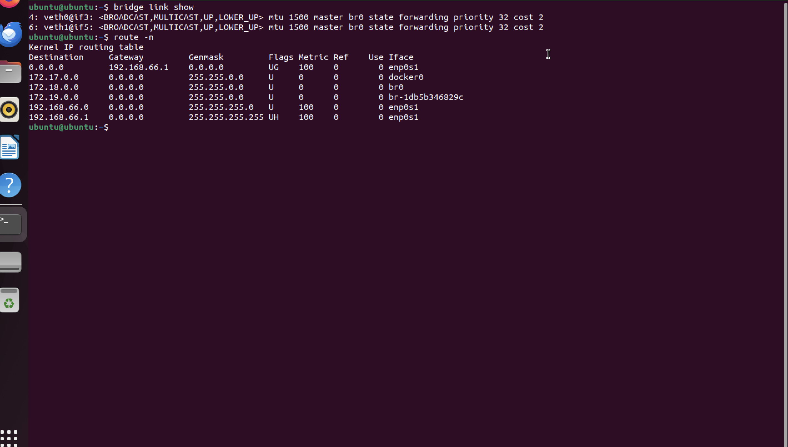

# Netfilter

The netfilter project enables packet filtering, network address [and port] translation (NA[P]T), packet logging, userspace packet queueing and other packet mangling.

The netfilter hooks are a framework inside the Linux kernel that allows kernel modules to register callback functions at different locations of the Linux network stack. The registered callback function is then called back for every packet that traverses the respective hook within the Linux network stack.

iptables is a generic firewalling software that allows you to define rulesets. Each rule within an IP table consists of a number of classifiers (iptables matches) and one connected action (iptables target).

nftables is the successor of iptables, it allows for much more flexible, scalable and performance packet classification. This is where all the fancy new features are developed.

## libnetfilter_conntrack

### What is libnetfilter_conntrack?
`libnetfilter_conntrack` is a userspace library providing a programming interface (API) to the in-kernel connection tracking state table

### Main Features
- listing/retrieving entries from the kernel connection tracking table
- inserting/modifying/deleting entries from the kernel connection tracking table
- listing/retrieving entries from the kernel expect table
i- nserting/modifying/deleting entries from the kernel expect table