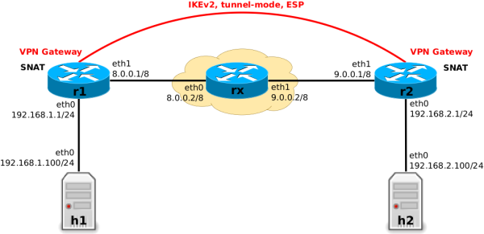
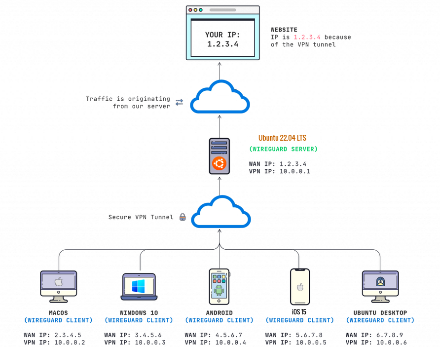

[ssh-tunnels](https://www.gabriel.urdhr.fr/2024/04/13/ssh-tunnels/)

[protocol-stacks](https://www.gabriel.urdhr.fr/2023/12/20/protocol-stacks/)

[impact-of-the-different-wifi-security-modes](https://www.gabriel.urdhr.fr/2022/06/07/impact-of-the-different-wifi-security-modes/)

[tls1.3-intro](https://www.gabriel.urdhr.fr/2022/02/26/tls1.3-intro/)

[tls1.2-intro](https://www.gabriel.urdhr.fr/2021/11/30/tls1.2-intro/)

[diffie-hellman-intro](https://www.gabriel.urdhr.fr/2021/10/19/diffie-hellman-intro/)

[foo-over-ssh](https://www.gabriel.urdhr.fr/2017/08/02/foo-over-ssh/)

[creating-tun-tap-interfaces-in-linux](https://john-millikin.com/creating-tun-tap-interfaces-in-linux)


[BBTunnelsVPNs](https://www.grotto-networking.com/BBTunnelsVPNs.html)


In general we use the term tunneling when the payload being encapsulated is a packet (or signal) from a layer equal to or lower than that the one we will be using to carry that packet or signal. examples
- Physical layer — DS0s — over IP
- Link Layer — Ethernet — over IP
- IP — say with private address — over IP — with public addresses

Popular Tunneling Protocols
There are many tunneling protocols in use today here is a short list of some we will consider in this course:

IP-in-IP
GRE
L2TP
VXLAN (Data center)


>>The idea of a "tunnel" comes from the fact that the encapsulated data travels inside another "layer," hidden from the outside view (just like a car traveling inside a physical tunnel).
The outer packet provides routing and addressing information that gets the encapsulated data from point A to point B, much like how a tunnel allows traffic to pass through otherwise inaccessible areas.




IPsec site-to-site example setup with VPN gateways r1 and r2

both r1 and r2 operate as SNAT edge routers when forwarding non-VPN traffic, but not for VPN traffic. This creates the necessity to distinguish between VPN and non-VPN packets in Nftables rules,


### Packet Flow
Let's say the VPN tunnel in the example described above is now up and running. To start simple, let's also assume that we have not yet configured any Nftables ruleset on the VPN gateways r1 and r2. Thus, those two hosts do not yet do SNAT (we will do this later). The VPN will already work normally, which means any IP packet which is sent from any host in subnet 192.168.1.0/24 to any host in subnet 192.168.2.0/24 or vice versa will travel through the VPN tunnel.

This means, packets which are traversing one of the VPN gateways r1 or r2 and are about to “enter the VPN tunnel” are being encrypted and then encapsulated in ESP and an outer IP packet. Packets which are “leaving the tunnel” are being decapsulated (the outer IP packet and ESP header are stripped away) and decrypted.

[ftables_ipsec_packet_flow](https://thermalcircle.de/doku.php?id=blog:linux:nftables_ipsec_packet_flow)

[port-forwarding-using-ssh-tunnelling-](https://medium.com/@dipakkrdas/port-forwarding-using-ssh-tunnelling-5b959a914d9b)

Low frequency, the further the waves can travel. High frequency the more information they can transmit

4G mobile has better reception in the country side than a 5G one(higher frequency, less reach)

WiFi signals in the 2.5GH band travel further than signals in the 5GH band


```sh
iptables -A FORWARD -s 10.240.0.0/16 -j ACCEPT # originates from ip range should be accepted
iptables -A FORWARD -d 10.240.0.0/16 -j ACCEPT # destination accept

iptables -t nat -A POSTROUTING -s 10.240.0.0/16 ! -o cnio -j MASQUERADE

# every packet that originates from 10.240.0.0/16  and is going out not to the cnio bridge ie internet, should be masqueraded(SNAT)
```
A Point-to-Point network type is, as its name implies, a connection between two specific points 
On a point-to-point link, a packet delivered from one of the routers will always have precisely one recipient.


[ssh-tunneling-explained](https://goteleport.com/blog/ssh-tunneling-explained/)


[openvpn-puts-packets-inside-your-packets/#tunneling](https://www.saminiir.com/openvpn-puts-packets-inside-your-packets/#tunneling)


### Tunneling
What is tunneling? According to the magnificent TCP/IP Illustrated1:

Tunneling, generally speaking, is the idea of carrying lower-layer traffic in higher-layer (or equal-layer) packets. For example, IPv4 can be carried in an IPv4 or IPv6 packet; Ethernet can be carried in a UDP or IPv4 or IPv6 packet, and so on.


```sh
Tunneling is the technique of encapsulating a packet of one protocol inside another. This lets a protocol that normally works on one layer of the network stack be transported over a different protocol — often through a medium it wasn’t originally designed for.
```


- Common Protocols That Use Tunneling
Tunnel Protocol	       What It Encapsulates	             Used In
GRE (Generic Routing Encapsulation)	IP, EthernetVPNs,    MPLS, cloud networking
IP-in-IP	          IP	                             Simple IP tunnels
VXLAN	              Ethernet	                         Cloud/virtual networking
OpenVPN	              IP over TLS	                     Secure VPN
WireGuard	          IP over UDP	                     Modern secure VPN


```
| Ethernet | IP | UDP | VXLAN | Ethernet | Payload |
+----------+----+-----+-------+----------+---------+
                    ↑              ↑
             VXLAN Header   Original L2 Frame
```


```c
struct vxlan_hdr {
    uint8_t  flags;       // Always 0x08: indicates valid VNI
    uint8_t  reserved1[3];
    uint8_t  vni[3];      // VXLAN Network Identifier (24 bits)
    uint8_t  reserved2;
} __attribute__((packed));


uint8_t udp_packet[MAX_LEN];

struct iphdr *ip   = (struct iphdr *)(udp_packet + ETH_HLEN);
struct udphdr *udp = (struct udphdr *)(ip + 1);
struct vxlan_hdr *vxh = (struct vxlan_hdr *)(udp + 1);
struct eth_hdr *inner_eth = (struct eth_hdr *)(vxh + 1);

// Fill IP header
ip->protocol = IPPROTO_UDP;
ip->saddr = local_ip;
ip->daddr = remote_ip;

// Fill UDP header
udp->source = htons(12345);
udp->dest   = htons(4789); // VXLAN default port

// Fill VXLAN header
vxh->flags = 0x08;           // Set "I" bit (valid VNI)
vxh->vni[0] = (vni >> 16) & 0xFF;
vxh->vni[1] = (vni >> 8) & 0xFF;
vxh->vni[2] = vni & 0xFF;

// Copy the original Ethernet frame into the tunnel
memcpy(inner_eth, original_ethernet_frame, frame_len);

```

The Ethertype field (2 bytes) in an Ethernet frame indicates the next protocol that comes after the Ethernet header.

That next protocol is:
- Usually a Layer 3 protocol (e.g., IPv4, IPv6)
- Occasionally a Layer 2.5 protocol (like VLAN tags or MPLS)


[an-introduction-to-wireguard-vpn/](https://jasoneckert.github.io/myblog/an-introduction-to-wireguard-vpn/)




Underlay Network: The physical or IP network that carries the actual packets.

Example: A data center's IP network with routers and switches running BGP.

- Overlay Network: A virtual network built on top of the underlay.
Components: Virtual tunnels (e.g., VXLAN, GRE), virtual switches, virtual routers.

Example: A VXLAN network that connects virtual machines across different hosts as if they were on the same Ethernet segment.

## What is a /31 Subnet Mask?
In the vast world of networking, understanding IP addresses and their management through subnetting is crucial for network efficiency and security. A subnet mask like /31 plays a pivotal role in this context. Typically represented as 255.255.255.254, a /31 subnet mask allows for two IP addresses per network. At first glance, this may seem impractical, as each subnet traditionally needs at least three addresses (one for network address, one for broadcast, and one or more for host communications). However, the /31 subnet mask is uniquely designed for a very specific scenario,

/31 subnets are commonly used for point-to-point links, such as between two routers or between an ISP and a customer's firewall, where only two IP addresses are needed

[/31](https://www.rfc-editor.org/rfc/rfc3021.html#:~:text=Retana%2C%20et%20al.,to%2Dpoint%20links%20are%20numbered.)