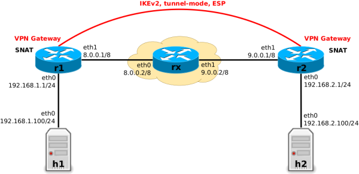

[ssh-tunnels](https://www.gabriel.urdhr.fr/2024/04/13/ssh-tunnels/)

[protocol-stacks](https://www.gabriel.urdhr.fr/2023/12/20/protocol-stacks/)

[impact-of-the-different-wifi-security-modes](https://www.gabriel.urdhr.fr/2022/06/07/impact-of-the-different-wifi-security-modes/)

[tls1.3-intro](https://www.gabriel.urdhr.fr/2022/02/26/tls1.3-intro/)

[tls1.2-intro](https://www.gabriel.urdhr.fr/2021/11/30/tls1.2-intro/)

[diffie-hellman-intro](https://www.gabriel.urdhr.fr/2021/10/19/diffie-hellman-intro/)

[foo-over-ssh](https://www.gabriel.urdhr.fr/2017/08/02/foo-over-ssh/)

[creating-tun-tap-interfaces-in-linux](https://john-millikin.com/creating-tun-tap-interfaces-in-linux)


[BBTunnelsVPNs](https://www.grotto-networking.com/BBTunnelsVPNs.html)


In general we use the term tunneling when the payload being encapsulated is a packet (or signal) from a layer equal to or lower than that the one we will be using to carry that packet or signal. examples
- Physical layer — DS0s — over IP
- Link Layer — Ethernet — over IP
- IP — say with private address — over IP — with public addresses

Popular Tunneling Protocols
There are many tunneling protocols in use today here is a short list of some we will consider in this course:

IP-in-IP
GRE
L2TP
VXLAN (Data center)


>>The idea of a "tunnel" comes from the fact that the encapsulated data travels inside another "layer," hidden from the outside view (just like a car traveling inside a physical tunnel).
The outer packet provides routing and addressing information that gets the encapsulated data from point A to point B, much like how a tunnel allows traffic to pass through otherwise inaccessible areas.




IPsec site-to-site example setup with VPN gateways r1 and r2

both r1 and r2 operate as SNAT edge routers when forwarding non-VPN traffic, but not for VPN traffic. This creates the necessity to distinguish between VPN and non-VPN packets in Nftables rules,


### Packet Flow
Let's say the VPN tunnel in the example described above is now up and running. To start simple, let's also assume that we have not yet configured any Nftables ruleset on the VPN gateways r1 and r2. Thus, those two hosts do not yet do SNAT (we will do this later). The VPN will already work normally, which means any IP packet which is sent from any host in subnet 192.168.1.0/24 to any host in subnet 192.168.2.0/24 or vice versa will travel through the VPN tunnel.

This means, packets which are traversing one of the VPN gateways r1 or r2 and are about to “enter the VPN tunnel” are being encrypted and then encapsulated in ESP and an outer IP packet. Packets which are “leaving the tunnel” are being decapsulated (the outer IP packet and ESP header are stripped away) and decrypted.

[ftables_ipsec_packet_flow](https://thermalcircle.de/doku.php?id=blog:linux:nftables_ipsec_packet_flow)

[port-forwarding-using-ssh-tunnelling-](https://medium.com/@dipakkrdas/port-forwarding-using-ssh-tunnelling-5b959a914d9b)

Low frequency, the further the waves can travel. High frequency the more information they can transmit

4G mobile has better reception in the country side than a 5G one(higher frequency, less reach)

WiFi signals in the 2.5GH band travel further than signals in the 5GH band


```sh
iptables -A FORWARD -s 10.240.0.0/16 -j ACCEPT # originates from ip range should be accepted
iptables -A FORWARD -d 10.240.0.0/16 -j ACCEPT # destination accept

iptables -t nat -A POSTROUTING -s 10.240.0.0/16 ! -o cnio -j MASQUERADE

# every packet that originates from 10.240.0.0/16  and is going out not to the cnio bridge ie internet, should be masqueraded(SNAT)
```
A Point-to-Point network type is, as its name implies, a connection between two specific points 
On a point-to-point link, a packet delivered from one of the routers will always have precisely one recipient.


[ssh-tunneling-explained](https://goteleport.com/blog/ssh-tunneling-explained/)


