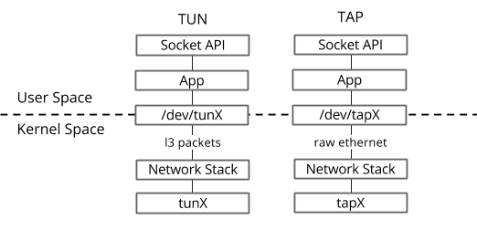
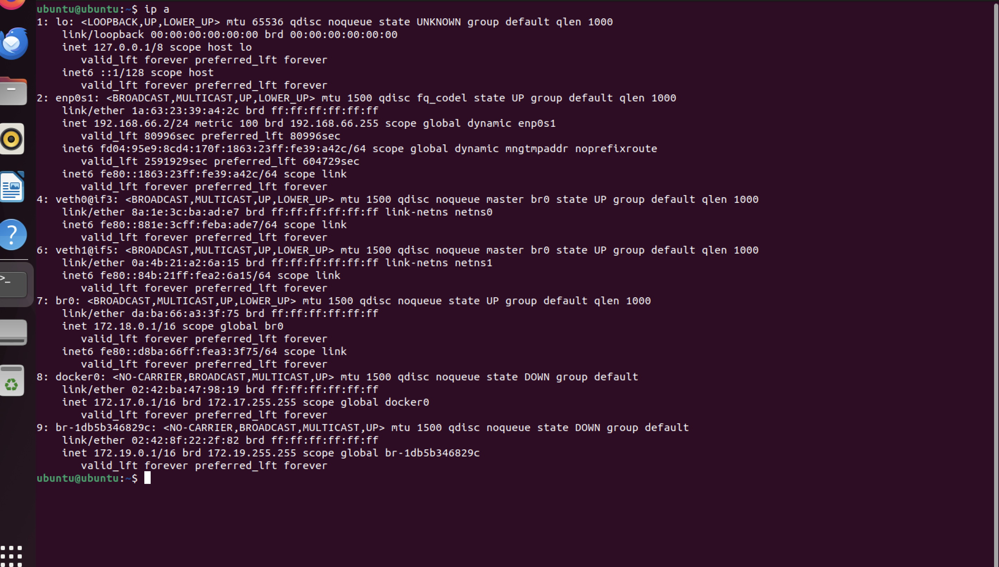
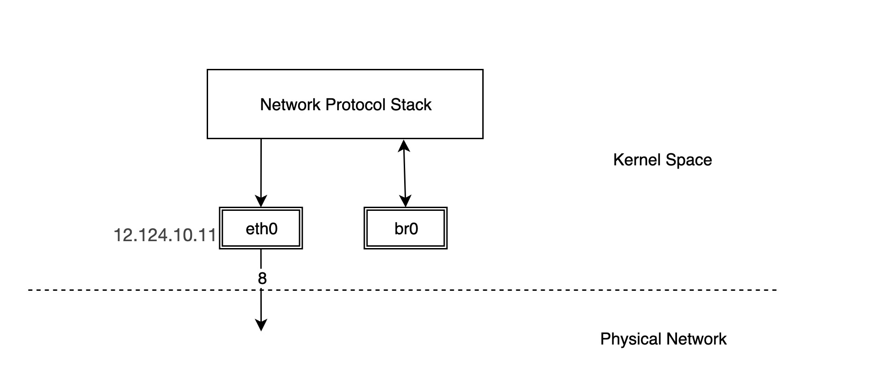
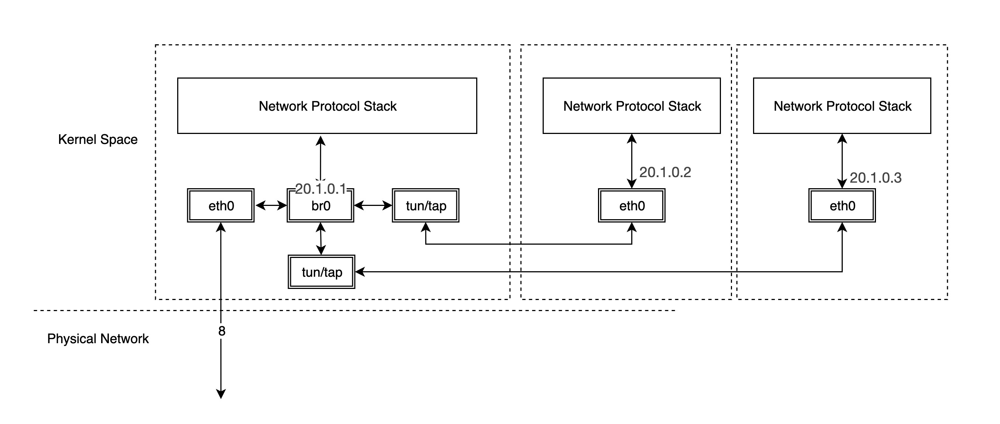

[tuntap](https://www.gabriel.urdhr.fr/2021/05/08/tuntap/)

There are two types of virtual network interfaces managed by `/dev/net/tun`:

TUN interfaces transport IP packets (layer 3);
TAP interfaces transport Ethernet frames (layer 2).

```sh
#It is possible to assign a persistent interface to a given user in order to give a non-root user access to a TUN/TAP interface:
sudo ip tuntap add dev tun0 mode tun user john
# Or to a whole groupe
sudo ip tuntap add dev tap0 mode tap group doe

sudo ip tuntap del dev tap0 mode tap 

```

```sh
#The interface is initially down and without a IPv4 address:
26: tun0: <POINTOPOINT,MULTICAST,NOARP> mtu 1500 qdisc noop state DOWN group default qlen 500
    link/none 

# Now we need to configure an IP address and bring the interface up before we can use it:

sudo ip addr add 192.168.66.3/24 dev tun0 &&
sudo ip link set up dev tun0
```
TUN interfaces (IFF_TUN) transport layer 3 (L3) Protocol Data Units (PDUs):
- in practice, it transports IPv4 and/or IPv6 packets;
- read() gets a L3 PDU (an IP packet);
- you must write() L3 PDUs (an IP packet);
- there is no layer 2 (Ethernet, etc.) involved in the interface;
- they are POINTOPOINT interfaces.

```sh

25: tap0: <BROADCAST,MULTICAST> mtu 1500 qdisc noop state DOWN group default qlen 1000
    link/ether fe:f8:da:69:30:a2 brd ff:ff:ff:ff:ff:ff

 #Let's bring the interface up:

sudo ip addr add 192.168.66.2/24 dev tap0
sudo ip link set up dev tap0   

```
We can notice several differences compared to the TUN example:
this interface has a BROADCAST flag instead of POINTOPOINT;
we don't have a NOARP interface anymore (we need to find L2 addresses when talking on interfaces on this network);
we now have link/ether line with an associated MAC address.

When using an Ethernet or Wifi interface, several different machines can possibly be reached directly through this interface: as a consequence, L2 addressing is needed which specify to which host on the LAN we are sending a given frame. In contrast, only a single machine is directly reachable through POINTOPOINT network interfaces and there is thus no L2 addressing. TUN interfaces only transport L3 (IP) packets: they do not have L2 addressing and are thus POINTOPOINT interfaces.


```sh
ubuntu@ubuntu:~$ ip tuntap help
Usage: ip tuntap { add | del | show | list | lst | help } [ dev PHYS_DEV ]
       [ mode { tun | tap } ] [ user USER ] [ group GROUP ]
       [ one_queue ] [ pi ] [ vnet_hdr ] [ multi_queue ] [ name NAME ]

Where: USER  := { STRING | NUMBER }
       GROUP := { STRING | NUMBER }


```

Tun/tap interfaces are a feature offered by Linux that can do userspace networking, that is, allow userspace programs to see raw network traffic (at the ethernet or IP level) and do whatever they like with it


Once a tun/tap interface is in place, it can be used just like any other interface, meaning that IP addresses can be assigned, its traffic can be analyzed, firewall rules can be created, routes pointing to it can be established, etc.


```sh

25: tap0: <NO-CARRIER,BROADCAST,MULTICAST,UP> mtu 1500 qdisc fq_codel state DOWN group default qlen 1000
    link/ether fe:f8:da:69:30:a2 brd ff:ff:ff:ff:ff:ff
    inet 192.168.66.4/24 scope global tap0
       valid_lft forever preferred_lft forever
26: tun0: <NO-CARRIER,POINTOPOINT,MULTICAST,NOARP,UP> mtu 1500 qdisc fq_codel state DOWN group default qlen 500
    link/none 
    inet 192.168.66.3/24 scope global tun0
       valid_lft forever preferred_lft forever


sudo ip route add 192.168.66.3
 dev tun0

 sudo ip route add 192.168.66.4
 dev tap0

```

tcpdump: listening on tun0, link-type RAW (Raw IP)

tcpdump: listening on tap0, link-type EN10MB (Ethernet)

a socket is a file descriptor


TAP devices are virtual devices that mimic physical Ethernet devices that send and receive Ethernet frames. Each TAP device has a random MAC address that is used as source address. In order to communicate via IPs, the ARP protocol (address resolution protocol) is used to find the MAC address for an IP. The IP packets are wrapped in Ethernet frames to send them via a TAP device.

TUN devices on the other hand, communicate directly via the IP protocol. This way, the overhead for wrapping IP packets in Ethernet frames is removed. For TUN devices, no ARP protocol is used since the IPs are already known.


TUN, short for network TUNnel, is a virtual interface that implements a software-based abstraction of a network by emulating the behavior of physical devices like Ethernet or Wi-Fi interface cards. It operates on layer 3 of the OSI model, handling the transmission and reception of IP packets. Therefore, TUN has no relation with Ethernet frames and MAC addresses unlike TAP, another interface operating on layer 2.

TUN lacks the capability of bridging different LANs as opposed to TAP. However, TUN can be used to route traffic through a tunnel, making it suitable for VPN services.

Since TUN devices are limited to the IP protocol, there are some protocols that can't be used on TUN devices and require TAP devices instead. Those protocols include DHCP, PXE boot, IPX, ZeroConf, Avahi, mDNS and DLNA.

So to summarize: TUN is slightly faster and TAP is more flexible concerning supported protocols and setups.


A tap device is a virtual network interface that looks like an ethernet network card. Instead of having real wires plugged into it, it exposes a nice handy file descriptor to an application willing to send/receive packets

The VMM (like Qemu, Firecracker, or gVisor) would open the application side of a tap and pass all the packets to the guest VM.


### Tap device setup
To open or create a new device, you first need to open /dev/net/tun which is called a "clone device

```c
 /* First, whatever you do, the device /dev/net/tun must be
     * opened read/write. That device is also called the clone
     * device, because it's used as a starting point for the
     * creation of any tun/tap virtual interface. */
    char *clone_dev_name = "/dev/net/tun";
    int tap_fd = open(clone_dev_name, O_RDWR | O_CLOEXEC);
    if (tap_fd < 0) {
   	 error(-1, errno, "open(%s)", clone_dev_name);
    }

//With the clone device file descriptor we can now instantiate a specific tap device by name

   struct ifreq ifr = {};
    strncpy(ifr.ifr_name, tap_name, IFNAMSIZ);
    ifr.ifr_flags = IFF_TAP | IFF_NO_PI | IFF_VNET_HDR;
    int r = ioctl(tap_fd, TUNSETIFF, &ifr);
    if (r != 0) {
   	 error(-1, errno, "ioctl(TUNSETIFF)");
    }
```


[virtual-networking-101-understanding-tap](https://blog.cloudflare.com/virtual-networking-101-understanding-tap)

TUN/TAP provides packet reception and transmission for user space programs. It can be seen as a simple Point-to-Point or Ethernet device, which, instead of receiving packets from physical media, receives them from user space program and instead of sending packets via physical media writes them to the user space program.


any packet which is transmitted by
   one end of a link is always received by the other


## Broadcast traffic and "chattiness" of the network
A layer 3 network does not allow broadcast traffic to be passed over it. This is both an advantage and a disadvantage. Some client/server applications rely on the use of broadcast traffic to communicate between the server and the clients. For such applications, a tap-style network is required.


[tun-tap-tunnels/](http://rrendec.mindbit.ro/post/tun-tap-tunnels/)

A point-to-point IP interface is defined by specifying a source address (or point of attachment) and a unique destination address. There is a single possible destination for the next hop, once the IP datagram has been passed to a given point-to-point interface


[ssh-tunnels](https://www.gabriel.urdhr.fr/2024/04/13/ssh-tunnels/)

This has to be done both on the client side and the server side.

You then need to configure IP addresses, routing tables and possibly enable IP forwarding, configure a NAT.

Example configuration script on the server-side:

```sh
#!/bin/sh
set -e

user=john
tun=tun0
local_ip=192.168.0.1
remote_ip=192.168.0.2
dev=eth0
gateway_ip=192.0.2.42

# Create and configure the TUN device:
ip tuntap add dev $tun mode tun user "$user"
ip address add "$local_ip" peer "$remote_ip" dev "$tun"

# NAT:
iptables -t nat -A POSTROUTING -s "$remote_ip" -o "$dev" -j SNAT --to "$gateway_ip"

# IP forwarding:
iptables -A FORWARD -i "$dev" -o "$tun" -j ACCEPT
iptables -A FORWARD -i "$tun" -o "$dev" -j ACCEPT
iptables -P FORWARD REJECT
sysctl -w net.ipv4.ip_forward=1

ip link set dev "$tun" up

```

```sh
/ # ip address show type tun
11: tun0: <POINTOPOINT,MULTICAST,NOARP> mtu 1500 qdisc noop state DOWN group default qlen 500
    link/none 
    inet 192.168.0.1 peer 192.168.0.2/32 scope global tun0
       valid_lft forever preferred_lft forever

```

Example configuration script on the client-side:

```sh
#!/bin/sh
set -e

user=john
tun=tun0
local_ip=192.168.0.2
remote_ip=192.168.0.1/32
dev=eth0
gateway_ip=192.0.2.42

ip tuntap add dev "$tun" user "$user" mode tun
ip address add "$local_ip" peer "$remote_ip" dev "$tun"

ip link set dev "$tun" up

# Keep the current routes for the:
# * SSH server;
# * for the private IP addresses.
for addr in "$gateway_ip" 172.16.0.0/12 10.0.0.0/8 ; do
    route="$(ip route get "$addr" | sed 's/^[^ ]*//' | head -n1)"
    ip route add "$addr" "$route"
done

# "Default route trick": this overrides the default route without touching it.
for addr in 0.0.0.0/1 128.0.0.0/1 ; do
    ip route add "$addr" dev "$tun"
done

```
Now that you are up and running, you will want a normal, non-root user to perform most daily tasks with. You can either use the built-in busybox utility `adduser`, or the utility available in the shadow package named `useradd`
`adduser -h /home/john -s /bin/ash john`

`useradd -m -U -s /bin/ash jane `

Granting Your User Administrative Access
`su -l joe`

```sh
13: tun0: <NO-CARRIER,POINTOPOINT,MULTICAST,NOARP,UP> mtu 1500 qdisc pfifo_fast state DOWN group default qlen 500
    link/none 
    inet 10.1.1.1 peer 10.1.1.2/32 scope global tun0
       valid_lft forever preferred_lft forever

```


[introduction-to-ocaml-part-5-exceptions-lists-and-structural-recursion](https://baturin.org/blog/introduction-to-ocaml-part-5-exceptions-lists-and-structural-recursion/)

[introduction-to-ocaml-part-4-higher-order-functions-parametric-polymorphism-and-algebraic-data-types/](https://baturin.org/blog/introduction-to-ocaml-part-4-higher-order-functions-parametric-polymorphism-and-algebraic-data-types/)


[introduction-to-ocaml-part-3](https://baturin.org/blog/introduction-to-ocaml-part-3/)

[introduction-to-ocaml-part-2](https://baturin.org/blog/introduction-to-ocaml-part-2/)

[introduction-to-ocaml](https://baturin.org/blog/introduction-to-ocaml/)

[ocaml-faq](https://baturin.org/docs/ocaml-faq/)

[tuntap](https://www.kernel.org/doc/Documentation/networking/tuntap.txt)


[linux-virtual-devices](https://www.sobyte.net/post/2022-10/linux-virtual-devices/)

The TUN/TAP virtual network device is connected to the protocol stack on one end, and not to the physical network on the other end, but to another application in user space. This means that packets sent from the stack to the TUN/TAP can be read by the application, and of course the application can send packets directly to the TUN/TAP.


```sh
ip link add veth0 type veth peer name veth1
ip addr add 20.1.0.10/24 dev veth0
ip addr add 20.1.0.11/24 dev veth1
ip link set veth0 up
ip link set veth1 up
```

```sh

# ping -c 2 20.1.0.11 -I veth0
PING 20.1.0.11 (20.1.0.11) from 20.1.0.11 veth0: 28(42) bytes of data.
64 bytes from 20.1.0.11: icmp_seq=1 ttl=64 time=0.034 ms
64 bytes from 20.1.0.11: icmp_seq=2 ttl=64 time=0.052 ms

--- 20.1.0.11 ping statistics ---
2 packets transmitted, 2 received, 0% packet loss, time 1500ms
```


```sh

# tcpdump -n -i veth1
tcpdump: verbose output suppressed, use -v or -vv for full protocol decode
listening on veth1, link-type EN10MB (Ethernet), capture size 458122 bytes
20:24:12.220002 ARP, Request who-has 20.1.0.11 tell 20.1.0.10, length 28
20:24:12.220198 ARP, Request who-has 20.1.0.11 tell 20.1.0.10, length 28
20:24:12.221372 IP 20.1.0.10 > 20.1.0.11: ICMP echo request, id 18174, seq 1, length 64
20:24:13.222089 IP 20.1.0.10 > 20.1.0.11: ICMP echo request, id 18174, seq 2, length 64

```

You can see that there are only ICMP echo request packets on veth1, but no answer packets. Think about it. veth1 receives the ICMP echo request packet and forwards it to the protocol stack at the other end, but the protocol stack checks the current device list and finds that there is 20.1.0.10 locally, so it constructs an ICMP echo reply packet and forwards it to the lo device.


bridge has a protocol stack attached to one end and multiple ports on the other end, and data is forwarded between the ports based on MAC addresses.

```sh
The bridge can work at either layer 2 (link layer) or layer 3 (IP network layer). By default, it works at layer 2 and can forward Ethernet messages between different hosts on the same subnet; when an IP address is assigned to the bridge, it enables the bridge to work at layer 3
```



```sh
# ip link add name br0 type bridge
# ip link set br0 up
```

But this creates a bridge with a protocol stack connected to one end and nothing connected to the other ports, so we need to connect other devices to the bridge to have any real functionality.




A typical virtual machine network implementation is to connect the NIC in the virtual machine to the br0 of the host through TUN/TAP, when br0 is similar to the physical switch, the packets sent out by the virtual machine first reach br0, and then br0 is handed over to eth0 to send out, so that the packets do not need to go through the host’s stack, which is very efficient.