How does Frame "tagging" work?
Who inserts VLAN tags onto packets?

Switches do!  Switches can be configured to assign VIDs based on port or protocol.

untagged port with pvid 10 will not accept tagged traffic wih vland id 10
It accepts untagged traffic and assigns the vland id 10


A LAN is a grouping of two or more devices on a network. A vlan is a virtual LAN, a subgroup within a local network. VLANS make it easy for network admins to seperate a single switched network into multiple groups to math the functional and security requirments of their system


### Types of VLANS: Port-based and Tagged VLANS

For multiple VLANS to communicate with each other, a router is required. Routers between VLANS filter broadcast traffic, enhance network security, perform address summarization and mitigate network congestion

For tagged vlans,a special tag is inserted into packets so that switches and routers will forward those packets correctly.IEEE 802.1Q standard adds 4 byte to an ethernet frame. This extra information identifies the frame as belonging to a vlan and contains the vlan id number( <= 4094). Multiple tagged vlans can use the same port on a switch called a trunk port

Untagged vlans are based on the physical ports on a switch( called access ports). There is no extra information added to the frame, instead each port on the switch is identified as belonging to a specific vlan. This approach divides a single physical switch into multiple logical switches. If a device is connected to a port in a single vlan only, then the port should be untagged


Traffic arriving on a switch port assigned to one VLAN will only ever be forwarded out another switch port that belongs to the same VLAN – a switch will never allow traffic to cross a VLAN boundary.

When a frame arrives on a switchport in VLAN #10, it can only leave a switchport in VLAN #1

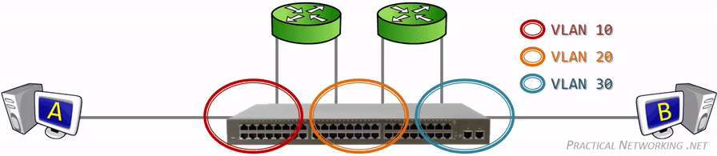

If Host A were to send a frame with a destination MAC address of Host B, that frame would still only be flooded solely to the switch ports in VLAN #10. Even if a MAC address table entry for Host B existed associated to VLAN #30.In a way, it’s almost as if each VLAN maintains their own independent MAC address table

With the introduction of VLANs, the source address table reflects the port to MAC address mapping on a per-VLAN basis resulting in more advanced forwarding decisions

Each connected switch port in the topology above is a member of only a single VLAN. This is referred to as an Access port. An Access port is a switch port that is a member of only one VLAN.

Typically, switch ports connected to end-host devices are configured as Access ports (e.g., workstations, printers, servers). Conversely, switch ports connected to other network devices are configured as Trunk ports (e.g., other switches, routers)

```sh
whenever a Switch is sending frames out a Trunk port, it adds to each frame a tag to indicate to the other end what VLAN that frame belongs to.

An Access port, by comparison, can only ever carry or receive traffic for a single VLAN. Therefore, there is no need to add a VLAN Tag to traffic leaving an Access port.
```


When an Ethernet frame is exiting a Trunk port, the switch will insert a VLAN Tag between the Source MAC address and the Type fields.

Access ports typically face end-host devices like workstations or printers or servers.Part of the reason for this is that switches do not add a VLAN tag when sending traffic out an Access Port.

This allows a host to operate without any knowledge of the VLAN they are connected to.


The use of switches at Layer 2 eliminates much of the scaling problem because they filter out problems such as collisions. Instead, transmissions are now governed by the behavior of the switches and the broadcast domain. A broadcast domain defines the area over which a broadcast frame will propagate.

Routers will not forward Layer 2 unicast, multicast and broadcast frames. VLANs provide a very similar logical topology in that nodes within a VLAN share a common addressing scheme and that nonlocal traffic (traffic destined for nodes on a different VLAN) must be sent to the router for forwarding. 

Layer 2 unicast, multicast and broadcast traffic will not cross VLAN boundaries, therefore traffic generated on VLAN 1 will not be seen by nodes on VLAN 2. Only the switch is aware of the VLAN

Since switch forwarding behavior is based on MAC addresses stored in the source address table, the following rules apply:

- For known unicast destinations, the switch will forward the frame to the destination port only.

- For unknown unicast destinations, the switch will forward the frame to all active ports except the originating port. This is called flooding.

- For multicast and broadcast destinations, the switch will forward the frame to all active ports except the originating port.

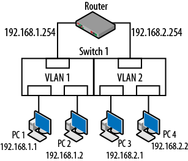

However, the switch now has the additional requirement of considering the VLAN of the destination node. if PC1 were to issue an ARP request, instead of simply forwarding this frame to every port, the switch determines that the frame originated on VLAN 1. The result is that only PC2 and the leftmost router interface (192.168.1.254) actually see the frame.

Aims and benefits from the 802.1Q standard:

- VLANs are supported over all IEEE 802 LAN MAC protocols, over shared media LANs as well as point-to-point LANs.

- VLANs facilitate easy administration of logical groups of stations that can communicate as if they were on the same LAN. They also facilitate easier administration of moves, adds, and changes in members of these groups.

- Traffic between VLANs is restricted. Switches forward unicast, multicast, and broadcast traffic only on LAN segments that serve the VLAN to which the traffic belongs.

- As far as possible, VLANs maintain compatibility with existing switches and end stations.

- If all switch ports are configured to transmit and receive untagged frames (frames to/from non-VLAN aware devices), switches will work in plug-and-play ISO/IEC 15802-3 mode. End stations will be able to communicate throughout the Bridged LAN.

Since the VLANs create Layer 3 boundaries around the ports connected to the hosts, they are not able to communicate.

```sh
81b443eaa1bc:/# bridge vlan show
port              vlan-id  
veth0             1 PVID Egress Untagged
                  2000
veth1             1 PVID Egress Untagged
br0               1 PVID Egress Untagged
81b443eaa1bc:/# 

```

Switch use the trunking protocol to modify the Ethernet frame by adding the VLAN id.

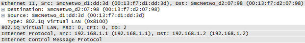

When using IEEE 802.1Q, a 4-byte header is inserted in between the Ethernet and IP headers. Per the 802.1D standard, it is inserted 12 bytes into the frame immediately following the source MAC address. Therefore, frame is actually changed. So, the Ethernet type, which indicates the kind of encapsulated data, must also change. As an example, IP packets have an Ethertype value of 0800 but when running over a trunk it is changed to 8100 


The 802.1Q header is straightforward and includes the following fields:

- The tag protocol identifier (2-byte TPID)
- The value of 8100 can be seen just before the highlighted hexadecimal.
- The tag control information (2-byte TCI)

[VLANs and Trunking](https://www.oreilly.com/library/view/packet-guide-to/9781449311315/ch04.html)


The VLAN header looks like:
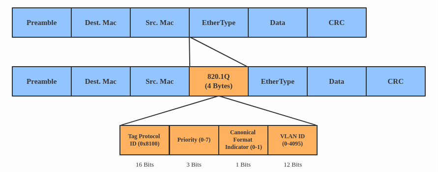

A VLAN, aka virtual LAN, separates broadcast domains by adding tags to network packets. VLANs allow network administrators to group hosts under the same switch or between different switches.

Use a VLAN when you want to separate subnet in VMs, namespaces, or hosts.

```sh
ip link add link eth0 name eth0.2 type vlan id 2
ip link add link eth0 name eth0.3 type vlan id 3

```

This adds VLAN 2 with name eth0.2 and VLAN 3 with name eth0.3. The topology looks like this:

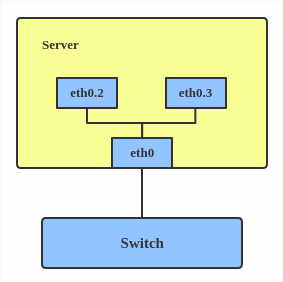


VXLAN is an extension of a VLAN that allows network engineers to encapsulate layer 2 frames into layer 4 UDP packets

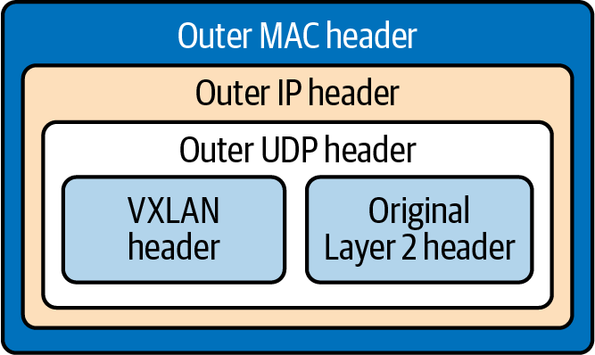


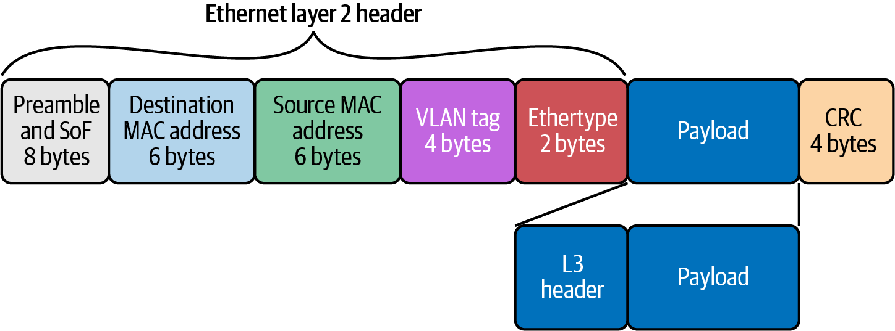

`Preamble (8 bytes)`
Alternating string of ones and zeros indicate to the receiving host that a frame is incoming.

`Destination MAC Address (6 bytes)`
MAC destination address; the Ethernet frame recipient.

`Source MAC Address (6 bytes)`
MAC source address; the Ethernet frame source.

`VLAN tag (4 bytes)`
Optional 802.1Q tag to differentiate traffic on the network segments.

`Ether-type (2 bytes)`
Indicates which protocol is encapsulated in the payload of the frame.

`Payload (variable length)`
The encapsulated IP packet.

`Frame Check Sequence (FCS) or Cycle` Redundancy Check (CRC) (4 bytes)
The frame check sequence (FCS) is a four-octet cyclic redundancy check (CRC) that allows the detection of corrupted data within the entire frame as received on the receiver side. The CRC is part of the Ethernet frame footer.


What Cisco calls a Trunk port (i.e., a switch port that carries traffic for more than one VLAN), other vendors refer to as a Tagged port – referring to the addition of a VLAN tag to all traffic leaving such a port.

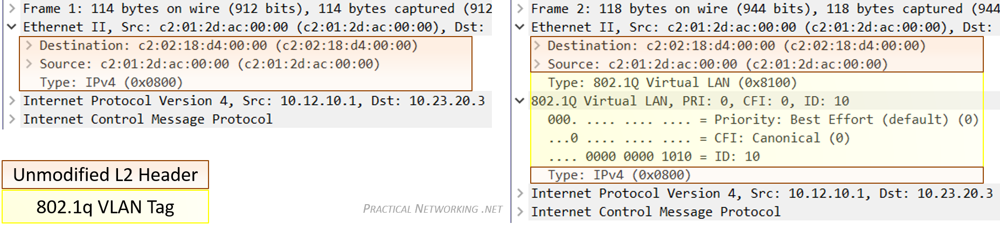

same frame before and after it exits a Trunk port.

Notice it is inserted between the Source MAC address and Type field of the original Ethernet header.

`The Native VLAN is the answer to how a switch processes traffic it receives on a Trunk port which does not contain a VLAN Tag.`

Without the tag, the switch will not know what VLAN the traffic belongs to, therefore the switch associates the untagged traffic with what is configured as the Native VLAN. Essentially, the Native VLAN is the VLAN that any received untagged traffic gets assigned to on a Trunk port.


A Broadcast frame is a frame which is addressed to everyone on the local network.

A broadcast frame, by definition, will always be flooded by a switch. But a switch will never broadcast a frame (since broadcasting is not a function of a switch).


A virtual LAN (VLAN) is a broadcast domain that is partitioned and isolated in the network at layer two. So it is possible to have multiple networks (4096) in a physical network, each independent of the other ones.

Each VLAN network is identified by a number often called tag. Network packages are then tagged to identify which virtual network they belong to.


VLAN filtering brings to Linux bridges the capabilities of a VLAN-aware network switch: each port on the bridge may be assigned to one or more VLANs, and traffic will only be allowed to flow between ports configured with the same VLANs. The VLANs may be tagged or untagged, and packets will have their VLAN id headers stripped or added as appropriate when they enter or leave the bridge.

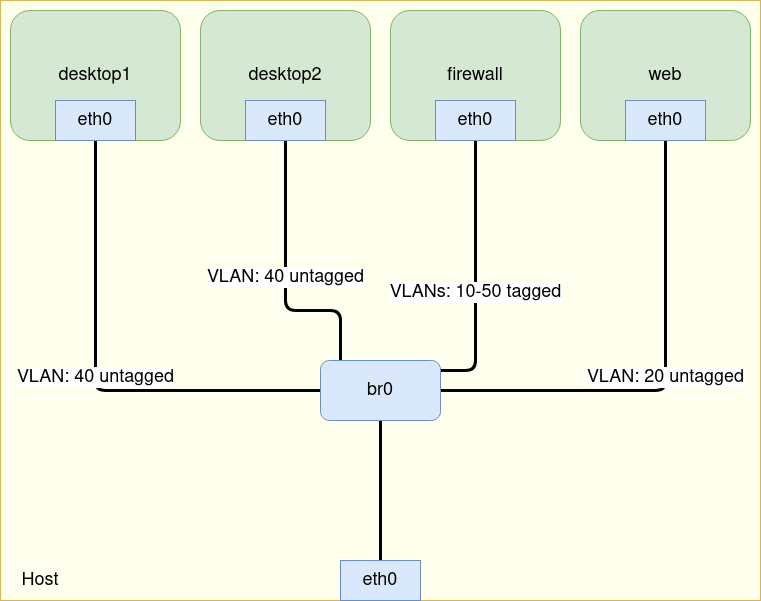

routing betweenn vlans is done by creating a vlan device ontop of the bridge


-`Tagged/Untagged`: By specifying a tagged port the bridge will always set a VLAN tag for packets that are being sent out through this port (egress). By specifying an untagged port the bridge will always remove the VLAN tag from egress packets.


-`VLAN ID` The VLAN ID is checked on egress ports. If the packet contains a VLAN ID that does not exist in the bridge VLAN table for the egress port, then the packet is dropped before it gets sent out.

- `PVID` - The Port VLAN ID is used for access ports to tag all ingress traffic with a specific VLAN ID. A dynamic entry is added in the bridge VLAN table for every PVID used, the port is automatically added as an untagged port.

- `Ingress filtering` - By default, VLANs that don't exist in the bridge VLAN table are dropped before they are sent out (egress), but this property allows you to drop the packets when they are received (ingress)

`EtherType` - By default, a VLAN aware bridge will filter VLANs by checking the C-TAG (0x8100), all other VLAN tags are considered as untagged packets (without a VLAN tag). The selected EtherType will be used for VLAN filtering and VLAN tagging/untagging.
`VLAN Tunnelling` - If the EtherType of the packet does not match with the EtherType configured for the bridge, then ingress packets are considered as untagged packets, this behavior gives a possibility to encapsulate VLANs into another, different VLAN. This also gives a possibility to divert specific traffic through different devices in your network.
`Tag stacking` - If a packet has a VLAN tag that matches the EtherType, then the packet is considered as a tagged packet, but you can force another VLAN tag regardless of the packet's content. By setting tag-stacking=yes on a bridge port, you will add another VLAN tag with the PVID value on top of any other tag for all ingress packets.

`Port-based VLANs`-packets get a VLAN tag with a VLAN ID based on the bridge port to which the device is connected

By using the PVID property you are adding a new VLAN tag with a VLAN ID that is specified in the PVID to all UNTAGGED packets that are received on that specific bridge port. The PVID does not have any effect on tagged packets, this means that,


[vlan-aware-bridge](https://linux-blog.anracom.com/tag/vlan-aware-bridge/)

```sh
VLANs are based on VLAN IDs (integer numbers) and a corresponding tagging of Ethernet packets – and on analyzing these tags at certain devices/interfaces or ports. In real and virtual Ethernet cards so called sub-interfaces associated with VLAN IDs typically send/receive tagged packets into/from VLANs. In (virtual) bridges ports can be associated with VLAN IDs and open only for packets with matching “tags”. A VLAN ID assigned to a port is called a “VID“. An Ethernet packet normally has one VLAN tag, identifying to which VLAN it belongs to. Such a tag can be set, changed or removed in certain VLAN aware devices.

A packet routed into a sub-interface gets a VLAN tag with the VLAN ID of the sub-interface. We shall see that such tagging sub-devices can be defined for virtual Ethernet NICs like the endpoints of veth-devices

```

An important property of VLANs is:

Ethernet broadcast packets (e.g. required for ARP) are not allowed to cross the borders of VLANs. Thus the overall traffic can be reduced significantly in some network setups.

The flag “untagged” ensures that packets leaving the ports to the bridge’s outside first get stripped of any tags

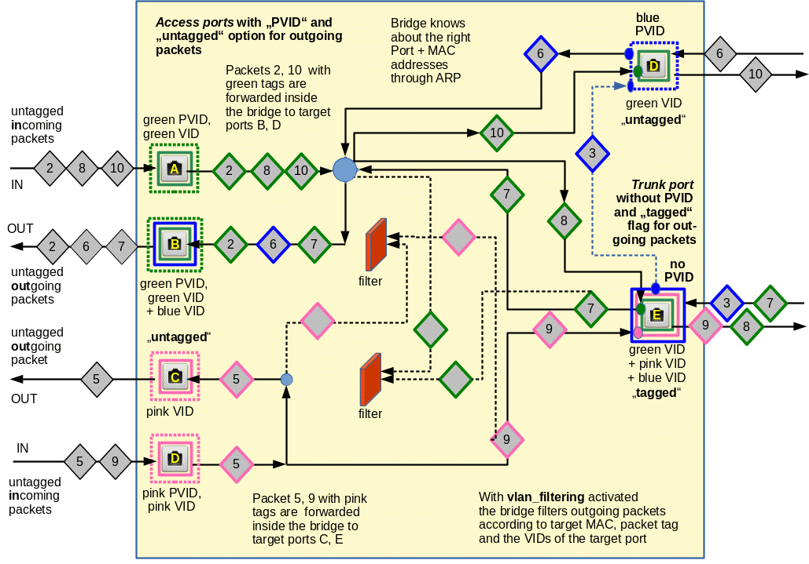
With `vlan_filtering` activated, the bridge filters outgoing packets according to target mac, packet tag and the vid of the target port


`“untagged”` option means that we want outgoing packets to leave the port untagged (on egress).

 VLAN regulations can be different for outgoing and incoming packets at a port!


### The importance of a working ARP communication
Broadcast packets are not allowed to leave a VLAN, if no router bridges the VLANs. The ARP protocol requires that broadcast messages from a sender, who wants to know the MAC address of an IP destination, reach their target. For this to work your VID and PVID settings must allow the returning answer to reach the original sender of the broadcast. Among other things this requires special settings at trunk ports which send untagged packets from different VLANs to a target and receive untagged packets from this target. Without a working ARP communication on higher network protocol layers to and from a member of a VLAN to other members will fail!

```sh
note that a veth endpoint device itself may get just one IP-address which it shares between all of its VLAN sub-interfaces and its trunk interface.

A veth endpoint has just one MAC – which is also shared amongst all sub-interfaces. So the MAC/IP-tuple is not a unique identifier for any of a veth’s VLAN-interfaces or its neutral trunk interface
```


[more-fun-with-veth-network-namespaces-vlans-i-open-questions](https://linux-blog.anracom.com/2024/02/14/more-fun-with-veth-network-namespaces-vlans-i-open-questions/)

[more-fun-with-veth-network-namespaces-vlans-ii-two-l2-segments-attached-to-a-common-network-namespace](https://linux-blog.anracom.com/2024/02/16/more-fun-with-veth-network-namespaces-vlans-ii-two-l2-segments-attached-to-a-common-network-namespace/)

`Side remark: Do not forget that a Linux bridge can in principle get an IP address itself and work as a special NIC connected to the bridge ports`


A packet transfer between L2-segments behind different NIC devices in one and the same network namespace must be allowed explicitly. By default the Linux kernel will not allow for such a transfer.

[more-fun-with-veth-network-namespaces-vlans-iii-l2-segments-of-the-same-ip-subnet-and-routes-in-coupling-network-namespaces](https://linux-blog.anracom.com/2024/02/20/more-fun-with-veth-network-namespaces-vlans-iii-l2-segments-of-the-same-ip-subnet-and-routes-in-coupling-network-namespaces/)

[more-fun-with-veth-network-namespaces-vlans-iv-l2-segments-same-ip-subnet-arp-and-routes](https://linux-blog.anracom.com/2024/02/29/more-fun-with-veth-network-namespaces-vlans-iv-l2-segments-same-ip-subnet-arp-and-routes/)

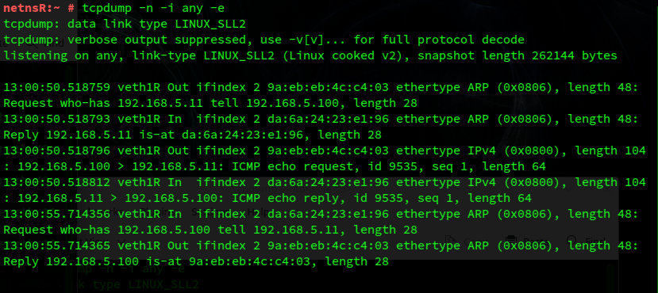

request out through `veth1R` and in through `veth1R`

[more-fun-with-veth-network-namespaces-vlans-v-link-two-l2-segments-of-the-same-ip-subnet-by-a-routing-network-namespace](https://linux-blog.anracom.com/2024/03/08/more-fun-with-veth-network-namespaces-vlans-v-link-two-l2-segments-of-the-same-ip-subnet-by-a-routing-network-namespace/)

[more-fun-with-veth-network-namespaces-vlans-vi-veth-subdevices-for-802-1q-vlans](https://linux-blog.anracom.com/2024/03/21/more-fun-with-veth-network-namespaces-vlans-vi-veth-subdevices-for-802-1q-vlans/)

[more-fun-with-veth-and-linux-network-namespaces-vii-two-namespaces-connected-by-a-veth-based-vlan](https://linux-blog.anracom.com/2024/04/26/more-fun-with-veth-and-linux-network-namespaces-vii-two-namespaces-connected-by-a-veth-based-vlan/)


switch ports are linux network interfaces


A network switch is basically a many-port bridge. A bridge is often a 2-port switch. Linux does however support multiple interfaces in a bridge, making it a true switch.

As of Linux 2.4.20, bridging and iptables do not 'see' each other without help. If you bridge packets from eth0 to eth1, they do not 'pass' by iptables. This means that you cannot do filtering, or NAT or mangling or whatever. In Linux 2.5.45 and higher, this is fixed.

a bridge passes packets unaltered from one interface to the other. It only looks at the hardware address of packets to determine what goes where. This in turn means that you can bridge traffic that Linux does not understand, as long as it has an hardware address it does.

When a host wants to talk to another host on the same physical network segment, it sends out an Address Resolution Protocol packet, which, somewhat simplified, reads like this 'who has 10.0.0.1, tell 10.0.0.7'. In response to this, 10.0.0.1 replies with a short 'here' packet.

10.0.0.7 then sends packets to the hardware address mentioned in the 'here' packet. It caches this hardware address for a relatively long time, and after the cache expires, it re-asks the question

Turn on proxy-ARP on both interfaces, `echo 1 > /proc/sys/net/ipv4/conf/ethL/proxy_arp`, `echo 1 > /proc/sys/net/ipv4/conf/ethR/proxy_arp`, where L and R stand for the numbers of your interfaces on the left and on the right side

[iproute2 docs](http://www.policyrouting.org/iproute2.doc.html)

Keeping ARP within virtual LAN- and VLAN-segments is a matter of networking security

[more-fun-with-veth-network-namespaces-vlans-vi-veth-subdevices-for-802-1q-vlans/](https://linux-blog.anracom.com/2024/03/21/more-fun-with-veth-network-namespaces-vlans-vi-veth-subdevices-for-802-1q-vlans/)


[more-fun-with-veth-and-linux-network-namespaces-vii-two-namespaces-connected-by-a-veth-based-vlan](https://linux-blog.anracom.com/2024/04/26/more-fun-with-veth-and-linux-network-namespaces-vii-two-namespaces-connected-by-a-veth-based-vlan/)

to create a VLAN interface of a veth endpoint: We take a veth peer device, create a subdevice of type “vlan” and add a VID to it.

```sh
ip link add link veth1 name veth1.10 type vlan id 10
ip link set veth1 up
ip link set veth1.10 up
```

Remember that the main device and its subdevices may become fully operational only if also the status of its peer device is set to up.

if the destination mac adddress is that of the bridge device, it forwards the upper layer


The core concept of network switches revolves around their ability to make intelligent forwarding decisions based on MAC addresses. When a data packet arrives at a switch, the switch reads the destination MAC address and checks its MAC address table to determine the appropriate outgoing port to forward the packet. This process ensures that data is only sent to the intended recipient, minimizing unnecessary network traffic and enhancing overall network performance

 `pvid`  the vlan specified is to be considered a PVID at ingress.Any untagged frames will be assigned to this VLAN.

`untagged` ->the vlan specified is to be treated as untagged on egress.

`port_list` is the list of ports a bridge has. Each bridge can have at most `BR_MAX_PORTS(1024)` ports. `dev` is a pointer to the `net_device` struct that represents the bridge device.

After the creation of a bridge, we can add interfaces (ports) to itThough Understanding Linux network internals states that the bridge must be bound to a “real device”, I think this sentence is only partially true. It is true that a bridge device must be bound to a network interface. However, it does not necessarily need to be a “real device”, which means it does not need to be the interface of the real physical NIC. Even a tap interface can be bound to the bridge for it to function.


The command used to bind an interface is `brctl addif br0 tap0`. This is also called “enslave”, which means we are making `tap0` a slave of `br0`.

## Forwarding Database
Forwarding database stores the MAC adress and port mapping. The implementation uses a hash table (an array actually) of size BR_HASH_SIZE(256) as the forwarding database. Each entry in the array stores the head of a singlely-linked list (a bucket) which stores the entries whose MAC address hash value falls into this bucket

## Lookup
Since the implementation is a hash table, lookup is same as any hash table lookup. The bridge looks up in the forwarding database when it wants to know which port to forward a frame with a particular MAC address. Thus the key of the hash table is the MAC address. First it gets the hash value of the MAC address by `br_mac_hash` and then gets the linked-list from that table entry. Next it iterates through the list and compare the MAC address with each element until it finds the right one.

[linux-bridge-part2](https://hechao.li/2018/01/31/linux-bridge-part2/)

subnet mask indicates which part of an ip address is network(1) and which part is host(0). This also  allows the host to determine if an ip address it needs to communicate with is local or remote which influences if it needs to use a gateway or can communicate locally

default route 0.0.0.0/0 sends all packets to isp

The larger the prefix, the more specific the route../31 more specific than /30

/32 --most specific, represents single ip address
/0-- least specific.. Represents all ip addresses


Under IEEE 802.1Q, the maximum number of VLANs on a given Ethernet network is 4,094.


The transport protocol over a physical data center network is IP plus UDP. VXLAN defines a MAC-in-UDP encapsulation scheme where the original layer 2 frame has a VXLAN header added wrapped in a UDP IP packet

A VXLAN packet is a MAC-in-UDP encapsulated packet. The layer 2 frame has a VXLAN header added to it and is placed in a UDP-IP packet. The VXLAN identifier is 24 bits. That is how a VXLAN can support 16 million segments.

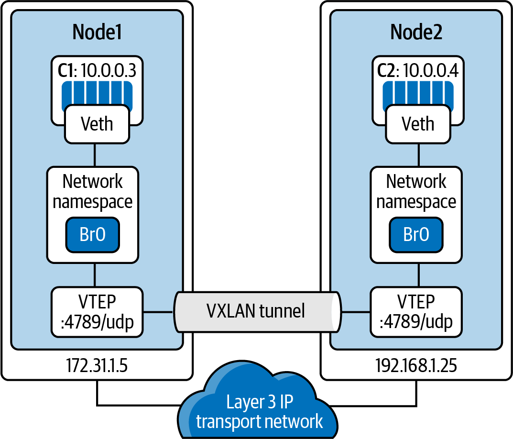

We have the VXLAN tunnel endpoints, VTEPs, on both hosts, and they are attached to the host’s bridge interfaces with the containers attached to the bridge. The VTEP performs data frame encapsulation and decapsulation. The VTEP peer interaction ensures that the data gets forwarded to the relevant destination container addresses. The data leaving the containers is encapsulated with VXLAN information and transferred over the VXLAN tunnels to be de-encapsulated by the peer VTEP.

### CNI
A CNI plugin is responsible for associating a network interface to the container network namespace and making any necessary changes to the host. It then assigns the IP to the interface and sets up the routes for it

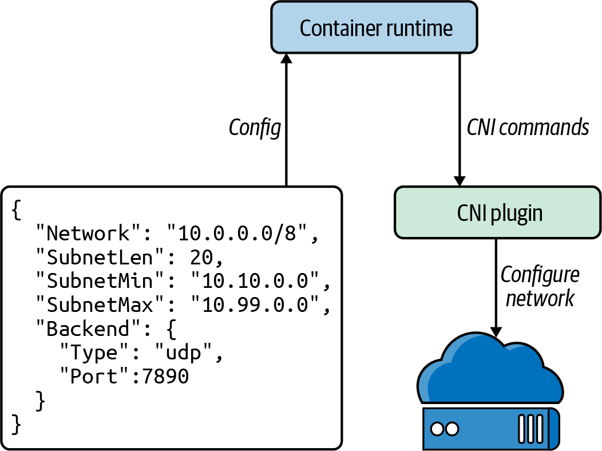

There are several open source projects that implement CNI plugins with various features and functionality.
- Cilium
- Flannel
- Calico
- AWS
each line in a Dockerfile creates a new layer if it changes the image’s state. 


`WORKDIR` sets the working directory for all the subsequent commands to run from


- Use one `ENTRYPOINT` per Dockerfile. The `ENTRYPOINT` or `CMD` tells Docker what process starts inside the running container, so there should be only one running process; containers are all about process isolation

- To cut down on the container layers, developers should combine similar commands into one using & & and \. Each new command in the Dockerfile adds a layer to the Docker container image, thus increasing its storage.
- Use the caching system to improve the containers’ build times. If there is no change to a layer, it should be at the top of the Dockerfile. Caching is part of the reason that the order of statements is essential. Add files that are least likely to change first and the ones most likely to change last.
- Use multistage builds to reduce the size of the final image drastically.

`docker ps` shows us the running containers on the host

`docker logs` will print out any logs that the container is producing from standard out

`docker logs 1f3f62ad5e02`


[introduction-linux-bridging-commands-and-features#vlan_filter](https://developers.redhat.com/articles/2022/04/06/introduction-linux-bridging-commands-and-features#vlan_filter)

```sh
#Then the following command enables a VLAN filter on the br0 bridge:
ip link set br0 type bridge vlan_filtering 1

ip link set eth1 master br0

ip link set eth1 up

ip link set br0 up


# This next command makes the veth1 bridge port transmit only VLAN 2 data:
bridge vlan add dev veth1 vid 2
```
The following command, similar to the previous one, makes the veth2 bridge port transmit VLAN 2 data. The `pvid` parameter causes untagged frames to be assigned to this VLAN at `ingress (veth2 to bridge)`, and the untagged parameter causes the packet to be untagged on egress (bridge to veth2):
```sh
bridge vlan add dev veth2 vid 2 pvid untagged
```
The next command carries out the same operation as the previous one, this time on `veth3`. The `master` parameter indicates that the link setting is configured on the software bridge. However, because master is a default option, this command has the same effect as the previous one:

```sh
bridge vlan add dev veth3 vid 3 pvid untagged master
```

The following command enables VLAN 2 and VLAN 3 traffic on eth1:
```sh
bridge vlan add dev eth1 vid 2-3
```

To show the VLAN traffic state, enable VLAN statistics (added in kernel 4.7) as follows:
`ip link set br0 type bridge vlan_stats_enabled 1`

The previous command enables just global VLAN statistics on the bridge, and is not fine grained enough to show each VLAN's state. To enable per-VLAN statistics when there are `no` port VLANs in the bridge, you also need to enable `vlan_stats_per_port` (added in kernel 4.20). You can run:


`ip link set br0 type bridge vlan_stats_per_port 1`

Then you can show per-VLAN statistics like so:

`bridge -s vlan show`

```sh
bridge vlan show
port              vlan-id

eth1              1 PVID Egress Untagged

                  2

                  3

br0               1 PVID Egress Untagged

veth1             1 Egress Untagged

                  2

veth2             1 Egress Untagged

                  2 PVID Egress Untagged

veth3             1 Egress Untagged

                  3 PVID Egress Untagged

```

### Bridging with Netfilter
By default, the traffic forwarded by the bridge does not go through an iptables firewall. To let the iptables forward rules filter Layer 2 traffic, enter:

`ip link set br0 type bridge nf_call_iptables 1`

`ip link` can add and remove bridges and set their options. `bridge` displays and manipulates bridges on final distribution boards (FDBs), main distribution boards (MDBs), and virtual local area networks (VLANs).

`ip addr add 192.168.5.1/24 brd 192.168.5.255 dev veth11`

brd-> broadcast address


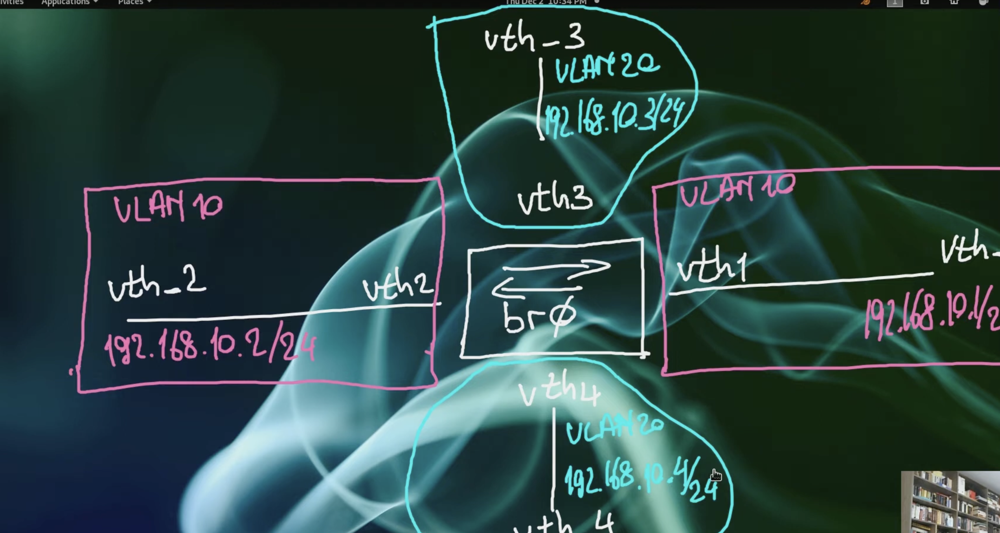


```sh
ubuntu@ubuntu:~$ bridge vlan show 
port              vlan-id  
vth1              1 PVID Egress Untagged
vth2              1 PVID Egress Untagged
vth3              1 PVID Egress Untagged
vth4              1 PVID Egress Untagged
br0               1 PVID Egress Untagged

```

 `pvid`  the vlan specified is to be considered a PVID at ingress.Any untagged frames will be assigned to this VLAN.

`untagged` ->the vlan specified is to be treated as untagged on egress.

if I am adding a vlan for `br0` , I need to use `self`
`master` for interfaces other than `br0`..Any interface aside the bridge..This is also the default
```sh
 bridge vlan add vid 10 dev vth1 pvid untagged
 # same 
 bridge vlan add vid 10 dev vth1 pvid untagged master

```

```sh
ubuntu@ubuntu:~$ bridge vlan show 
port              vlan-id  
vth1              1 Egress Untagged
                  10 PVID Egress Untagged
vth2              1 Egress Untagged
                  10 PVID Egress Untagged
vth3              1 PVID Egress Untagged
vth4              1 PVID Egress Untagged
br0               1 PVID Egress Untagged

```

we can only have one pvid per port(interface), so adding a new pvid, removes the old
if we ping `netns2` from `netn1`, on ingress, the untagged frame gets a vlan id of `10` and as the bridge forwards it to `netns2`, the tag gets removed(frame untagged)


`bridge vlan del vid 1 dev veth1`
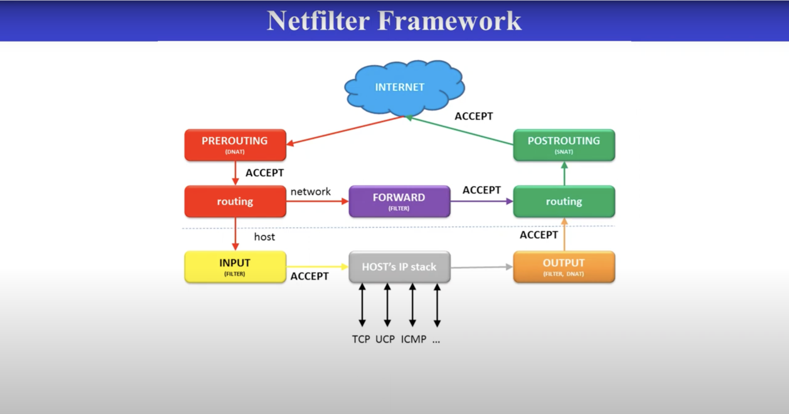

Each switch port represents a single collision domain
If two switches are connected together, it becomes a larger broadcast domain called vlan. A broadcast on this segment, every device that is connected to the switch will also receive the broadcast, this includes also any other switch that is attached and every device that is attached to those switches

Switch functions
- Address learning
- Forwarding and Filtering
when a frame arrives at a switch interface, the destination mac is compared to the forward/filter mac database
 if the destination mac is known and listed in the database, the framr is sent out that interface only
 if the destination mac is unknown, the frame is flooded out all active interfaces, except the interface that recieved it
 - loop avoidance
  STP


  ARP
  - Network hosts use ARP to discover and map the hardware address of a local peer ,to a specific destination IP address
  - In other words, ARP enables  hosts to insert the correct Destination mac address in the layer-s frame, in order to reach the more universally recognized destination IP address in the layer-3 packet

  a broadcast within a vlan is contained within that vlan
  by default, devices in separae vlans cannot communicate with each other, but devices that are in the same vlan can. different vlans require a router to send traffic to each other

  ppp(point to point) provides a standard for transporting multi-protocol data over point to point link. it is actually a data link layer protocol..it runs at layer 2, below ip and tcp
  ppp encapsulates IP across serial link between two devices
