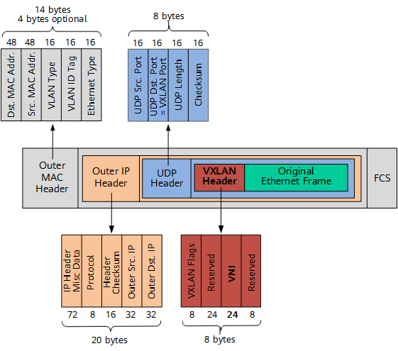
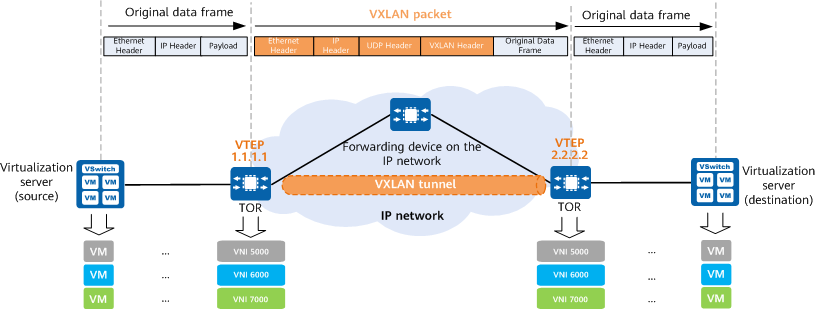
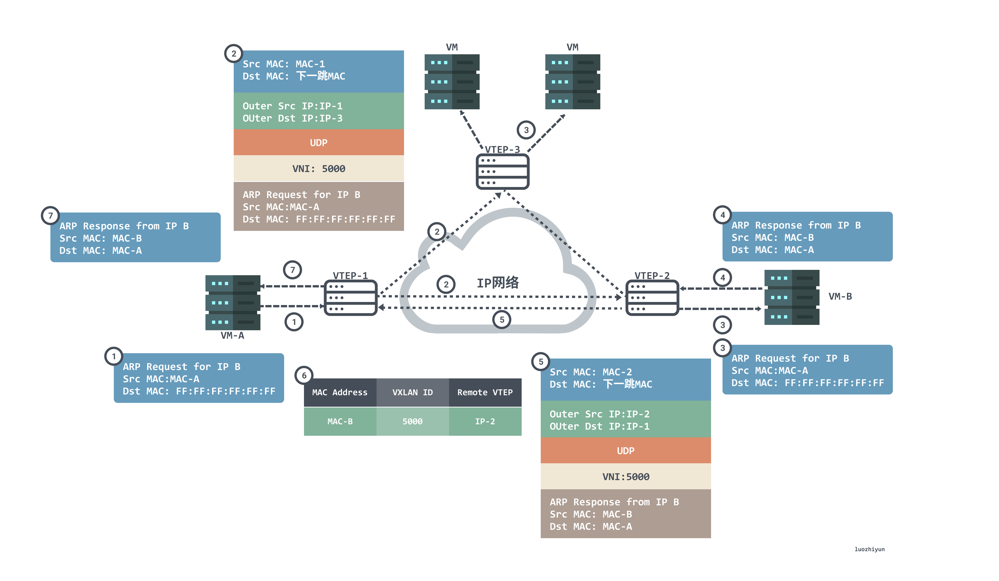

# VXLAN

[vxlan-cloud-scale-datacenter](https://www.arista.com/en/solutions/vxlan-cloud-scale-datacenter#:~:text=Fundamentally%2C%20VXLAN%20provides%20mechanisms%20to,the%20same%20layer%2D2%20subnet.)

VXLAN is a powerful tool for extending layer 2 subnets across layer 3 network boundaries. It solves VM portability limitations by encapsulating traffic and extending it across L3 gateways, allowing VMs to be hosted by servers residing on foreign IP subnets.


VXLAN’s layer 2 tunneling feature overcomes IP subnetting limitations, allowing administrators to move VMS to any server in the data center, regardless of the data center’s sub-netting scheme. This allows administrators to implement a reliable L3 architecture in the data center while also supporting VM mobility across all the servers in the data center.


### Problem with 802.1Q VLANs:
- VLAN ID limit: 802.1Q supports only 4096 VLANs (12-bit VLAN ID field).

- This is insufficient for large-scale multi-tenant environments, where each tenant may require several isolated networks (e.g., prod, dev, staging).


### How VXLAN Helps:
1. Massive Scalability
- VXLAN uses a 24-bit VNID (VXLAN Network Identifier).
- Supports ~16 million (2²⁴) isolated networks — a 4000x increase over VLANs.
- Enables large-scale multi-tenancy, where each tenant can have multiple isolated virtual networks.


2. Overlay Network over IP
- VXLAN creates Layer 2-over-Layer 3 tunnels.
- Encapsulates Ethernet frames in UDP/IP packets.
- This allows L2 connectivity over L3 infrastructure — useful in distributed data centers or virtualized environments.


Each VXLAN network (VNI) is a completely separate broadcast domain.

Tenants’ networks don’t bleed into each other — even if two tenants use the same IP ranges.

For example:
Tenant A's prod-net (VNI 10001) and
Tenant B's prod-net (VNI 20001) can both use 192.168.1.0/24 — no conflict, because they are in separate VXLAN overlays.


Fundamentally, VXLAN provides mechanisms to aggregate and tunnel multiple layer 2 (sub) networks across a Layer 3 infrastructure. The VXLAN base case is to connect two or more layer three network domains and make them look like a common layer two domain. This allows virtual machines on different networks to communicate as if they were in the same layer-2 subnet.


What is VXLAN?

A logical VXLAN tunnel is established between the source and destination network devices using MAC in UDP (User Datagram Protocol) encapsulation. In other words, the original Ethernet packet sent by a virtual machine is encapsulated within a UDP packet, and then the outer layer is encapsulated with the IP packet header and Ethernet packet header of the physical network. This way, the encapsulated packet behaves like a normal IP packet and can be forwarded through the routing network. It's like giving virtual machines in the Layer 2 network the wings of routing, allowing them to break free from the structural limitations of Layer 2 and Layer 3 networks. 

[what-is-vxlan](https://www.ruijie.com/en-global/support/faq/what-is-vxlan)


 use VXLAN to create isolated virtual networks (overlays) across compute nodes.

Each tenant or namespace can get isolated Layer 2 segments over a shared Layer 3 underlay — perfect for multi-tenancy.

Each pod in Kubernetes gets its own IP address.

Kubernetes expects all pods across all nodes to be able to talk to each other directly (flat network).

This is not trivial on a real network, especially across multiple hosts — so Kubernetes uses CNI (Container Network Interface) plugins to make this work.

Certain CNI plugins — such as Flannel (VXLAN mode) and Calico (VXLAN mode) — use VXLAN overlays to meet the networking requirement.

Let’s say you have two Kubernetes nodes:
```sh
Node A                               Node B
--------                             --------
Pod A1 (10.244.1.2)                  Pod B1 (10.244.2.2)
```
These pods are in different IP subnets and live on different hosts.

Problem:They need to talk to each other as if they were on the same LAN — but they’re not.

Solution: VXLAN Overlay
- Flannel or Calico sets up a VXLAN interface (flannel.1, vxlan.calico, etc.) on each node.

When Pod A1 sends a packet to Pod B1:
- It goes to Node A’s VXLAN interface.

- Gets encapsulated with a VXLAN header (including a VNI).
- Then sent as a UDP packet over the regular IP network (L3) to Node B.

Node B’s VXLAN interface:
- Decapsulates the packet.
- Forwards it to Pod B1 using its veth pair.

Result: Pods communicate as if they’re on the same Ethernet network, even though they are on different physical hosts.


If Customer A has a VXLAN segment with VNI 5000 in:

Data Center 1, and

Data Center 2

…then all of Customer A’s virtual machines, containers, or bare metal servers in both data centers can communicate as if they’re on the same Layer 2 network, even though they are physically separated and connected through Layer 3 (IP) networks.


A region is a geographic area where a cloud provider has deployed infrastructure.
Each region contains multiple Availability Zones (AZs), and each AZ consists of one or more data centers.

Each Kubernetes cluster typically uses a single VXLAN VNI (VXLAN Network Identifier) for the entire pod network overlay.

This means all nodes in the cluster share the same VXLAN VNI — they’re part of the same virtual Layer 2 network segment that spans the entire cluster.

VXLAN encapsulation allows pods on different nodes to appear on the same Layer 2 subnet, so they can communicate directly


 VXLAN gateways, also called Virtual Tunnel End Points (VTEP), provide the encapsulating/de-encapsulating services central to VXLAN. VTEPS can be virtual bridges in the hypervisor, VXLAN aware VM applications or VXLAN capable switching hardware. VTEPs are key to virtualizing networks across the existing data center infrastructure.


Each VXLAN network segment is associated with a unique 24bit VXLAN Network Identifier, or VNI. The 24-bit address space allows scaling virtual networks beyond the 4096 available with 802.1Q to 16.7 million possible virtual networks. However, multicast and network hardware limitations will reduce the useable number of virtual networks in most deployments. VMs in a logical L2 domain use the same subnet and are mapped to a common VNI. It’s the L2 to VNI mapping that lets VMs communicate with one another. Note that VXLAN doesn’t change layer 3 addressing schemes. IP addressing rules employed in a physical L2 still apply to the virtual networks.

VXLANs maintain VM identity uniqueness by combining the VM’s MAC address and its VNI. This is interesting because it allows for duplicate MAC addresses to exist in a datacenter domain. The only restriction is that duplicate MACs cannot exist on the same VNI.

## VLANs and VLAN ID
VLAN is an extension to the Ethernet protocol, which adds the 802.1Q header to the Ethernet frame. This extra header gives networking devices the ability to tag traffic with a number from 1 to 4094 (called VLAN ID), where each possible number signifies a different virtual network.


## VXLANs and VXLAN Network Identifier
VXLAN is a tunneling protocol that encapsulates Ethernet frames inside UDP packets. This means that VXLAN does not care what the underlay physical network topology is - as long as it can carry UDP packets, it can be used to provide Ethernet (Layer 2) connectivity between remote network segments.  

Similarly to VLANs, the VXLAN header makes it possible to tag the traffic with a specific number that determines to which virtual network the packet belongs. This number is called VNI (VXLAN network identifier), and it can have over 16 million unique values. 


When an application component initiates communication with another component, it operates just as it would in a non-VXLAN environment. If the destination is on the same subnet, it uses an Address Resolution Protocol (ARP) broadcast message to locate the other component. If the destination is on a different subnet, the application sends ARP messages for the first hop router, which may also serve as a VTEP. If the router isn't on, the application will send ARP messages to a VTEP.

The VTEP encapsulates the ARP request in UDP and VXLAN headers, sending the packet to the IP multicast group associated with the VXLAN segment to which the communicating components belong.


The VTEP that supports the destination application component removes the UDP and VXLAN headers, leaving the VLAN data just as the transmitting component sent it. The VTEP then locates the destination using an ARP packet, just as it would if the network was limited to a single system. Data packets and response messages transmit using the same methods as the original transmission.


Communicate outside the VXLAN
In some cases, applications need to communicate outside the VXLAN environment. If so, a VXLAN gateway removes the VXLAN and UDP headers and forwards the packet to the destinations. Responses travel to the gateway. VXLAN and UDP headers are attached, and the message travels back using the same way it came. Neither the source VM nor the destination equipment needs to be modified to take part in the interchange.


Multicast IP addresses are those in the 224.0.0.0 to 239.255.255.255 range. An address is assigned to a VTEP for each application it supports.

[vxlan-vs-vlan-whats-difference-hector-cardenas)](https://www.linkedin.com/pulse/vxlan-vs-vlan-whats-difference-hector-cardenas)

VTEP: Maps local VLANs to VNIs and vice versa.


## What Is VXLAN?
VXLAN, or Virtual Extensible LAN, is a network virtualization technology widely used on large Layer 2 networks. VXLAN establishes a logical tunnel between the source and destination network devices, through which it uses MAC-in-UDP encapsulation for packets. Specifically, it encapsulates original Ethernet frames sent by a VM into UDP packets. It then encapsulates the UDP packets with the IP header and Ethernet header of the physical network as outer headers, enabling these packets to be routed across the network like common IP packets. This frees VMs on the Layer 2 network from the structural limitations of the Layer 2 and Layer 3 networks.




As shown in the preceding figure, a VXLAN tunnel endpoint (VTEP) encapsulates the following headers into the original Ethernet frame (original L2 frame) sent by a VM:

- VXLAN header
A VXLAN header (8 bytes) contains a 24-bit VNI field, which is used to define different tenants on the VXLAN network. It also contains a VXLAN Flags field (8 bits, set to 00001000) and two reserved fields (24 bits and 8 bits, respectively).

- UDP header
The VXLAN header and the original Ethernet frame are used as UDP data. In the UDP header, the destination port number (VXLAN Port) is fixed at 4789, and the source port number (UDP Src. Port) is calculated using a hash algorithm based on the original Ethernet frame.

- Outer IP header
In the outer IP header, the source IP address (Outer Src. IP) is the IP address of the VTEP connected to the source VM, and the destination IP address (Outer Dst. IP) is the IP address of the VTEP connected to the destination VM.

- Outer MAC header
The outer MAC header is also called the outer Ethernet header. In this header, the source MAC address (Src. MAC Addr.) is the MAC address of the VTEP connected to the source VM, and the destination MAC address (Dst. MAC Addr.) is the MAC address of the next hop along the path to the destination VTEP.


What Is a VTEP?

A VTEP is an edge device on a VXLAN network and the start or end point of a VXLAN tunnel. The source VTEP encapsulates the original data frames sent by the source server into VXLAN packets and transmits them to the destination VTEP on the IP network. The destination VTEP then decapsulates the VXLAN packets into the original data frames and forwards the frames to the destination server.



What Is a VNI?

A VNI is a user identifier similar to a VLAN ID. A VNI identifies a tenant. VMs with different VNIs cannot communicate at Layer 2.

VNIs can be classified into Layer 2 VNIs and Layer 3 VNIs, which have different functions. A Layer 2 VNI is a common VNI used for intra-subnet VXLAN packet forwarding, whereas a Layer 3 VNI is bound to a VPN instance for inter-subnet VXLAN packet forwarding


[VXLAN](https://info.support.huawei.com/info-finder/encyclopedia/en/VXLAN.html)

[vxlan](https://support.huawei.com/enterprise/en/doc/EDOC1100335685/efe1c84?idPath=24030814|9856750|22715517|9858933|15837)


it meas overlay network is only possible with tunneling

[Understanding Overlay Network Diagrams: A Key Concept in Modern Networking](https://www.commandlink.com/understanding-overlay-network-diagrams-a-key-concept-in-modern-networking/#:~:text=Overlay%20networks%20provide%20a%20virtual%20network%20layer,allows%20for%20greater%20flexibility%2C%20scalability%2C%20and%20control.&text=An%20overlay%20network%20is%20a%20virtual%20network,of%20another%20network%2C%20called%20the%20underlay%20network.)

[a-closer-look-at-overlay-and-underlay-network](https://www.fs.com/blog/a-closer-look-at-overlay-and-underlay-network-3583.html)

Overlay networks use tunneling technologies to flexibly select different underlying links and use multiple methods to ensure stable traffic transmission.
Different virtual topologies can be established for overlay networks as required without the need to modify the underlying network.


What are VTEPs?
VTEPs, which stands for VXLAN tunnel endpoints, are the devices used to encapsulate and decapsulation of VXLAN Network Packets. They could be physical switches and can also be virtual. 

Through encapsulation and decapsulation of VXLAN segments, VTEPs ensure communication of virtual machines or devices of different VXLAN segments.

[why-vxlan-is-necessary-for-cloud-data-centers-](https://medium.com/@lixian_58397/why-vxlan-is-necessary-for-cloud-data-centers-d9b10f5fdc04)


tunnel endpoints need a mapping of vm mac address to vtep ips


 VXLAN is also an overlay technology, allowing layer 2 adjacency for VM connectivity and VM migration over layer 3 network boundaries. Suddenly data centers had a great deal more flexibility in where they could place workloads, how they connected to virtual network services, and how easily they could migrate multi-tier applications to the cloud (and even set up hybrid cloud deployments).

[vxlan](https://www.sobyte.net/post/2022-07/vxlan/)

 each VLAN is a broadcast domain, and the communication between hosts within a VLAN is the same as within a LAN, while inter-VLANs cannot interoperate directly, and broadcast messages are restricted to a VLAN.

 

 VLANs have two obvious flaws, the first one is the design of VLAN Tag, the 802.1Q specification that defines VLANs was proposed in 1998, and only 32 Bits of storage space is reserved for VLAN Tag, of which only 12 Bits can be used to store VLAN IDs. When the cloud computing data center emerges, even without considering the demand of virtualization, the physical devices that need to assign IPs alone may be tens of thousands or even hundreds of thousands, so 4096 VLANs are definitely not enough.


 
 - VTEP (VXLAN Tunnel Endpoints): An edge device of a VXLAN network that is the starting and ending point of a VXLAN tunnel and is responsible for the encapsulation and unencapsulation of VXLAN protocol messages, i.e., encapsulating the message headers of VTEP traffic on virtual messages. VTEP can be a network device (e.g., a switch) or a machine (e.g., a host in a virtualized cluster)

 - VNI (VXLAN Network Identifier): As mentioned earlier, VLANs only take up 12 bits of space in Ethernet data frames, which makes the isolation capability of VLANs overwhelming in data center networks. The emergence of VNI is specifically to solve this problem. Generally each VNI corresponds to one tenant and it is a 24-bit integer, meaning that a public cloud built using VXLAN can theoretically support up to 16.77 million levels of tenants.


 

 [designing-your-sdwan-and-firewall-into-azure-hub-and-spoke](https://blog.cloudtrooper.net/2023/11/24/designing-your-sdwan-and-firewall-into-azure-hub-and-spoke/)

 [what-language-does-the-azure-gateway-load-balancer-speak](https://blog.cloudtrooper.net/2021/11/11/what-language-does-the-azure-gateway-load-balancer-speak/)

 [vxlan-static-ingress-replication](https://networklessons.com/vxlan/vxlan-static-ingress-replication)

 [vxlan-flood-and-learn-multicast-data-plane](https://networklessons.com/vxlan/vxlan-flood-and-learn-multicast-data-plane)

 [vxlan-multicast-anycast-rp](https://networklessons.com/vxlan/vxlan-multicast-anycast-rp)

 [mp-bgp-evpn-vxlan-arp-suppression](https://networklessons.com/vxlan/mp-bgp-evpn-vxlan-arp-suppression)


 


```sh
## VM1
[root@localhost ~]#  ip link add vxlan_docker type vxlan id 200 remote 192.168.13.132 dstport 4789 dev ens33
[root@localhost ~]#  ip link set vxlan_docker up
[root@localhost ~]#  brctl addif br-87133e370c6c vxlan_docker

## VM2
[root@localhost ~]#  ip link add vxlan_docker type vxlan id 200 remote 192.168.13.131 dstport 4789 dev ens33
[root@localhost ~]#  ip link set vxlan_docker up
[root@localhost ~]#  brctl addif br-26d918129b18 vxlan_docker
```

Above we used ip link add to create a VXLAN network interface with VNI 200 for VM1 and VM2 respectively, with the name `vxlan_docker`; then we used brctl addif to connect the newly created VXLAN interface `vxlan_docker` to the docker bridge.


[whys-the-design-overlay-network](https://www.sobyte.net/post/2021-12/whys-the-design-overlay-network/)
Overlay Network, which is not a new technology, but a computer network built on top of another network, a form of network virtualization technology

Because the Overlay network is a virtual network built on top of another computer network, it cannot stand alone, and the network on which the Overlay layer depends is the Underlay network, and the two concepts often appear in pairs.


The three problems that Overlay networks solve are.

- Migration of VMs and instances within clusters, across clusters, or between data centers is more common in cloud computing.
- The size of VMs in a single cluster can be very large, and the large number of MAC addresses and ARP requests can put tremendous pressure on network devices.
- Traditional network isolation technology VLANs can only create 4096 virtual networks, and public clouds and large-scale virtualized clusters require more virtual networks to meet the demand for network isolation.


## Motivations Behind Virtual Machine Migration
There are several motivations for migrating VMs. Cost reduction is a primary factor, as consolidating workloads onto fewer servers allows organizations to shut down underutilized hardware, saving power and reducing hardware expenses.

Another vital motivation is improved performance, as migration enables the movement of workloads to hosts with more resources or newer hardware, ensuring efficient application performance. Resource optimization is also a critical advantage; by balancing workloads across servers, IT teams can avoid bottlenecks and enhance overall system efficiency.

VM migration is integral to disaster recovery and high availability strategies. It allows organizations to quickly move VMs to safe environments during hardware failure or maintenance, minimizing downtime and protecting data.

Migration supports scalability and flexibility, enabling organizations to adjust their operations by adding or reconfiguring servers with minimal disruption, thereby meeting evolving organizational needs.